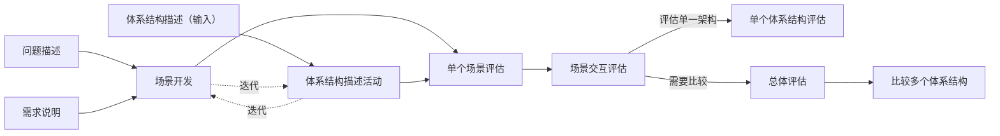
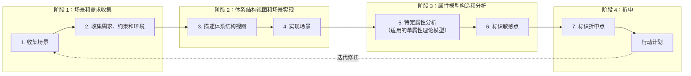
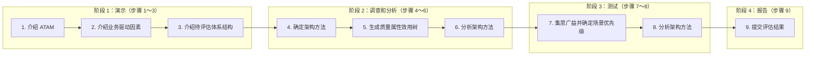

# 第8章 系统质量属性与架构评估

软件系统属性包括功能属性和质量属性，软件架构重点关注的是质量属性。架构的基本要求是在满足功能属性前提下，关注软件系统质量属性。为了精确、定量地表达系统质量属性，通常会采用质量属性场景的方式进行描述。

在确定软件系统架构、精确描述质量属性场景后，就需要对系统架构进行评估。软件系统架构评估是在对架构分析、评估的基础上，对架构策略的选取进行决策。它也可以灵活地运用于软件架构评审等工作。

## 8.1 软件系统质量属性

### 8.1.1 质量属性概念

软件系统的质量，就是“软件系统与明确地和隐含地定义的需求相一致的程度”。更具体地说，软件系统质量是软件与明确叙述的功能和性能需求、文档中明确描述的开发标准以及任何专业开发的软件产品都应具有的隐含特征相一致的程度。

根据 `GB/T 16260.1` 定义，从管理角度对软件系统质量进行度量，可将影响软件质量的主要因素划分为 6 种维度特性：功能性、可靠性、易用性、效率、维护性与可移植性。其中：

- 功能性包括适合性、准确性、互操作性、依从性、安全性。
- 可靠性包括容错性、易恢复性、成熟性。
- 易用性包括易学性、易理解性、易操作性。
- 效率包括资源特性和时间特性。
- 维护性包括可测试性、可修改性、稳定性和易分析性。
- 可移植性包括适应性、易安装性、一致性和可替换性。

软件系统质量属性(`Quality Attribute`)是一个系统的可测量或者可测试的属性，用来描述系统满足利益相关者(`Stakeholders`)需求的程度。基于软件系统生命周期，可以将软件系统质量属性分为开发期质量属性和运行期质量属性两部分。

#### 1. 开发期质量属性

开发期质量属性主要指在软件开发阶段所关注的质量属性，主要包含 6 个方面。

1. 易理解性：指设计被开发人员理解的难易程度。
2. 可扩展性：软件因适应新需求或需求变化而增加新功能的能力，也称灵活性。
3. 可重用性：指重用软件系统或某一部分的难易程度。
4. 可测试性：对软件测试以证明其满足需求规范的难易程度。
5. 可维护性：当需要修改缺陷、增加功能、提高质量属性时，识别修改点并实施修改的难易程度。
6. 可移植性：将软件系统从一个运行环境转移到另一个不同运行环境的难易程度。

#### 2. 运行期质量属性

运行期质量属性主要指在软件运行阶段所关注的质量属性，主要包含 7 个方面。

1. 性能：软件系统及时提供相应服务的能力，如速度、吞吐量和容量等要求。
2. 安全性：软件系统同时兼顾向合法用户提供服务，以及阻止非授权使用的能力。
3. 可伸缩性：当用户数和数据量增加时，软件系统维持高服务质量的能力。例如通过增加服务器来提高能力。
4. 互操作性：本软件系统与其他系统交换数据和相互调用服务的难易程度。
5. 可靠性：软件系统在一定时间内持续无故障运行的能力。
6. 可用性：系统在一定时间内正常工作的时间所占比例。可用性会受到系统错误、恶意攻击、高负载等问题影响。
7. 鲁棒性：软件系统在非正常情况(如用户进行了非法操作、相关软硬件系统发生故障等)下仍能够正常运行的能力，也称健壮性或容错性。

### 8.1.2 面向架构评估的质量属性

为了评价一个软件系统，特别是软件系统的架构，需要进行架构评估。在架构评估过程中，评估人员所关注的是系统质量属性。评估方法所普遍关注的质量属性有以下几种。

#### 1. 性能

性能(`Performance`)是指系统的响应能力，即要经过多长时间才能对某个事件作出响应，或者在某段时间内系统所能处理事件的个数。经常用单位时间内所处理事务的数量，或系统完成某个事务处理所需的时间来对性能进行定量表示。性能测试经常要使用基准测试程序。

#### 2. 可靠性

可靠性(`Reliability`)是软件系统在应用或系统错误面前、在意外或错误使用情况下维持软件系统功能特性的基本能力。可靠性是最重要的软件特性，通常用来衡量在规定条件和时间内，软件完成规定功能的能力。可靠性通常用平均失效等待时间(`Mean Time To Failure`，`MTTF`)和平均失效间隔时间(`Mean Time Between Failure`，`MTBF`)来衡量。在失效率为常数和修复时间很短的情况下，`MTTF` 和 `MTBF` 几乎相等。可靠性可以分为两个方面。

1. 容错。容错的目的是在错误发生时确保系统正确行为，并进行内部“修复”。例如在一个分布式软件系统中失去了一个与远程构件的连接，接下来恢复了连接。在修复这样的错误之后，软件系统可以重新或重复执行进程间操作，直到错误再次发生。
2. 健壮性。这里说的是保护应用程序不受错误使用和错误输入影响，在发生意外错误事件时确保应用系统处于预先定义好的状态。值得注意的是，和容错相比，健壮性并不是说在错误发生时软件可以继续运行，它只能保证软件按照某种已经定义好的方式终止执行。软件架构对软件系统可靠性有巨大影响。例如，软件架构设计上通过在应用程序内部采用冗余机制，或集成监控构件和异常处理，以提升系统可靠性。

#### 3. 可用性

可用性(`Availability`)是系统能够正常运行的时间比例。经常用两次故障之间的时间长度，或在出现故障时系统能够恢复正常的速度来表示。

#### 4. 安全性

安全性(`Security`)是指系统在向合法用户提供服务的同时，能够阻止非授权用户使用企图或拒绝服务的能力。安全性可根据系统可能受到的安全威胁类型来分类。安全性又可划分为机密性、完整性、不可否认性及可控性等特性。其中，机密性保证信息不泄露给未授权的用户、实体或过程；完整性保证信息完整和准确，防止信息被非法修改；不可否认性是指信息交换双方不能否认其在交换过程中发送信息或接收信息的行为；可控性保证对信息的传播及内容具有控制能力，防止为非法者所用。

#### 5. 可修改性

可修改性(`Modifiability`)是指能够快速地以较高性价比对系统进行变更的能力。通常以某些具体变更为基准，通过考查这些变更的代价来衡量可修改性。可修改性包含以下 4 个方面。

1. 可维护性(`Maintainability`)。这主要体现在问题修复上，在错误发生后“修复”软件系统。可维护性好的软件架构往往能做局部性修改，并能使对其他构件的负面影响最小化。
2. 可扩展性(`Extendibility`)。这一点关注的是使用新特性来扩展软件系统，以及使用改进版本方式替换构件并删除不需要或不必要的特性和构件。为了实现可扩展性，软件系统需要松散耦合的构件。其目标是实现一种架构，使开发人员在不影响构件客户的情况下替换构件。支持把新构件集成到现有架构中也是必要的。
3. 结构重组(`Reassemble`)。这一点处理的是重新组织软件系统的构件及构件间关系，例如通过将构件移动到一个不同子系统而改变它的位置。为了支持结构重组，软件系统需要精心设计构件之间的关系。理想情况下，它们允许开发人员在不影响实现主体部分的情况下灵活配置构件。
4. 可移植性(`Portability`)。可移植性使软件系统适用于多种硬件平台、用户界面、操作系统、编程语言或编译器。为了实现可移植，需要按硬件、软件无关的方式组织软件系统。可移植性是系统能够在不同计算环境下运行的能力，这些环境可能是硬件、软件，也可能是两者结合。如果移植到新系统需要做适当更改，则该可移植性就是一种特殊的可修改性。

#### 6. 功能性

功能性(`Functionality`)是系统能完成所期望工作的能力。一项任务的完成需要系统中许多或大多数构件的相互协作。

#### 7. 可变性

可变性(`Changeability`)是指架构经扩充或变更而成为新架构的能力。这种新架构应符合预先定义的规则，并在某些具体方面不同于原有架构。当要将某个架构作为一系列相关产品(例如软件产品线)的基础时，可变性是很重要的。

#### 8. 互操作性

作为系统组成部分的软件不是独立存在的，通常与其他系统或自身环境相互作用。为了支持互操作性，软件架构必须为外部可视的功能特性和数据结构提供精心设计的软件入口。程序和用其他编程语言编写的软件系统的交互作用，就是互操作性问题，这种互操作性也影响应用的软件架构。

### 8.1.3 质量属性场景描述

为了精确描述软件系统的质量属性，通常采用质量属性场景(`Quality Attribute Scenario`)作为描述质量属性的手段。质量属性场景是一个具体的质量属性需求，是利益相关者与系统交互的简短陈述。

质量属性场景是一种面向特定质量属性的需求。它由 6 部分组成：

- 刺激源(`Source`)：某个生成该刺激的实体(人、计算机系统或者任何其他刺激器)。
- 刺激(`Stimulus`)：当刺激到达系统时需要考虑的条件。
- 环境(`Environment`)：该刺激在某些条件内发生。当激励发生时，系统可能处于过载、运行或者其他情况。
- 制品(`Artifact`)：某个制品被激励。这可能是整个系统，也可能是系统的一部分。
- 响应(`Response`)：激励到达后所采取的行动。
- 响应度量(`Measurement`)：当响应发生时，应当能够以某种方式对其进行度量，以对需求进行测试。

质量属性场景主要关注可用性、可修改性、性能、可测试性、易用性和安全性等 6 类质量属性，下面分别列表介绍。

#### 1. 可用性质量属性场景

可用性质量属性场景所关注的方面，包括系统故障发生的频率、出现故障时会发生什么情况、允许系统有多长时间处于非正常运行状态、什么时候可以安全地出现故障、如何防止故障发生，以及发生故障时要求进行哪种通知。

| 场景要素 | 可能的情况 |
| --- | --- |
| 刺激源 | 系统内部、系统外部 |
| 刺激 | 疏忽、错误、崩溃、时间 |
| 环境 | 正常操作、降级模式 |
| 制品 | 系统处理器、通信信道、持久存储器、进程 |
| 响应 | 系统应检测事件，并进行如下一个或多个活动：将其记录下来；通知适当各方，包括用户和其他系统；根据已定义规则禁止导致错误或故障的事件源；在一段预先指定时间间隔内不可用；在正常或降级模式下运行 |
| 响应度量 | 系统必须可用的时间间隔、可用时间、系统可以在降级模式下运行的时间间隔、故障修复时间 |

#### 2. 可修改性质量属性场景

可修改性质量属性场景主要关注系统在改变功能、质量属性时需要付出的成本和难度。可修改性质量属性场景可能发生在系统设计、编译、构建、运行等多种情况和环境下。

| 场景要素 | 可能的情况 |
| --- | --- |
| 刺激源 | 最终用户、开发人员、系统管理员 |
| 刺激 | 希望增加、删除、修改、改变功能、质量属性、容量等 |
| 环境 | 系统设计时、编译时、构建时、运行时 |
| 制品 | 系统用户界面、平台、环境或与目标系统交互的系统 |
| 响应 | 查找架构中需要修改的位置，进行修改且不会影响其他功能，对所做修改进行测试，并部署修改 |
| 响应度量 | 根据所影响元素数量度量的成本、努力、资金；该修改对其他功能或质量属性所造成影响的程度 |

#### 3. 性能质量属性场景

性能质量属性场景主要关注系统响应速度，可以通过效率、响应时间、吞吐量、负载来客观评价性能好坏。

| 场景要素 | 可能的情况 |
| --- | --- |
| 刺激源 | 用户请求，其他系统触发等 |
| 刺激 | 定期事件到达、随机事件到达、偶然事件到达 |
| 环境 | 正常模式、超载(`Overload`)模式 |
| 制品 | 系统 |
| 响应 | 处理刺激、改变服务级别 |
| 响应度量 | 等待时间、期限、吞吐量、抖动、缺失率、数据丢失率 |

#### 4. 可测试性质量属性场景

可测试性质量属性场景主要关注系统测试过程中的效率，以及发现系统缺陷或故障的难易程度等。

| 场景要素 | 可能的情况 |
| --- | --- |
| 刺激源 | 开发人员、增量开发人员、系统验证人员、客户验收测试人员、系统用户 |
| 刺激 | 已完成的分析、架构、设计、类和子系统集成；所交付的系统 |
| 环境 | 设计时、开发时、编译时、部署时 |
| 制品 | 设计、代码段、完整的应用 |
| 响应 | 提供对状态值的访问，提供所计算的值，准备测试环境 |
| 响应度量 | 已执行可执行语句的百分比；如果存在缺陷出现故障的概率；执行测试的时间；测试中最长依赖的长度；准备测试环境的时间 |

#### 5. 易用性质量属性场景

易用性质量属性场景主要关注用户在使用系统时的容易程度，包括系统学习曲线、完成操作的效率、对系统使用过程的满意程度等。

| 场景要素 | 可能的情况 |
| --- | --- |
| 刺激源 | 最终用户 |
| 刺激 | 想要学习系统特性、有效使用系统、使错误影响最低、适配系统、对系统满意 |
| 环境 | 系统运行时或配置时 |
| 制品 | 系统 |
| 响应 | 系统提供以下一个或多个响应来支持“学习系统特性”：帮助系统与环境联系紧密；界面为用户所熟悉；在不熟悉的环境中，界面是可以使用的。系统提供以下一个或多个响应来支持“有效使用系统”：数据和(或)命令的聚合；已输入的数据和(或)命令的重用；支持在界面中的有效导航；具有一致操作的不同视图；全面搜索；多个同时进行的活动。系统提供以下一个或多个响应来“使错误影响最低”：撤销；取消；从系统故障中恢复；识别并纠正用户错误；检索忘记的密码；验证系统资源。系统提供以下一个或多个响应来“适配系统”：定制能力；国际化。系统提供以下一个或多个响应来使客户“对系统满意”：显示系统状态；与客户节奏合拍。 |
| 响应度量 | 任务时间、错误数量、解决问题的数量、用户满意度、用户知识获得情况、成功操作在总操作中所占比例、损失时间或丢失的数据量 |

#### 6. 安全性质量属性场景

安全性质量属性场景主要关注系统在安全性方面的要素，衡量系统在向合法用户提供服务的同时阻止非授权用户使用的能力。

| 场景要素 | 可能的情况 |
| --- | --- |
| 刺激源 | 正确识别、非正确识别身份未知的来自内部或外部的个人或系统；经过授权或未授权地访问了有限资源或大量资源 |
| 刺激 | 试图显示数据，改变或删除数据，访问系统服务，降低系统服务可用性 |
| 环境 | 在线或离线、联网或断网、连接有防火墙或者直接连到了网络 |
| 制品 | 系统服务、系统中的数据 |
| 响应 | 对用户身份进行认证；隐藏用户身份；阻止对数据或服务的访问；允许访问数据或服务；授予或收回对访问数据或服务的许可；根据身份记录访问、修改或试图访问、修改数据或服务；以一种不可读格式存储数据；识别无法解释的对服务的高需求；通知用户或另外一个系统，并限制服务可用性 |
| 响应度量 | 用成功概率表示避开安全防范措施所需要的时间、努力、资源；检测到攻击的可能性；确定攻击者或访问、修改数据或服务的个人的可能性；在拒绝服务攻击情况下仍然获得服务的百分比；恢复数据、服务；被破坏的数据、服务和(或)被拒绝合法访问的范围 |

## 8.2 系统架构评估

系统架构评估是在对架构分析、评估的基础上，对架构策略的选取进行决策。它利用数学或逻辑分析技术，针对系统的一致性、正确性、质量属性、规划结果等不同方面，提供描述性、预测性和指令性的分析结果。

系统架构评估的方法通常可以分为 3 类：基于调查问卷或检查表的方式、基于场景的方式和基于度量的方式。

1. 基于调查问卷或检查表的方法。该方法的关键是要设计好问卷或检查表，充分利用系统相关人员的经验和知识，获得对架构的评估。该方法的缺点是在很大程度上依赖于评估人员的主观推断。
2. 基于场景的评估方法。基于场景的方式由卡耐基梅隆大学软件工程研究所首先提出，并应用在架构权衡分析法(`Architecture Tradeoff Analysis Method`，`ATAM`)和软件架构分析方法(`Software Architecture Analysis Method`，`SAAM`)中。它通过分析软件架构对场景(也就是对系统的使用或修改活动)的支持程度，从而判断该架构对这一场景所代表质量需求的满足程度。
3. 基于度量的评估方法。它建立在软件架构度量的基础上，涉及 3 个基本活动：首先需要建立质量属性和度量之间的映射原则，然后从软件架构文档中获取度量信息，最后根据映射原则分析推导出系统的质量属性。

本节首先介绍系统架构评估中的重要概念，然后对 `SAAM`、`ATAM` 和 `CBAM` 等 3 种重要架构评估方法进行详细论述，并简要说明其他评估方法。

### 8.2.1 系统架构评估中的重要概念

#### 1. 敏感点和权衡点

敏感点(`Sensitivity Point`)和权衡点(`Tradeoff Point`)是关键的架构决策。敏感点是一个或多个构件(和/或构件之间关系)的特性。研究敏感点，可使设计人员或分析员明确在搞清楚如何实现质量目标时应注意什么。权衡点是影响多个质量属性的特性，是多个质量属性的敏感点。例如，改变加密级别可能会对安全性和性能产生非常重要的影响。提高加密级别可以提高安全性，但可能要耗费更多处理时间，影响系统性能。如果某个机密消息的处理有严格时间延迟要求，则加密级别可能就会成为一个权衡点。

#### 2. 风险承担者（利益相关人）

系统架构涉及很多人的利益，这些人都对架构施加各种影响，以保证自己的目标能够实现。架构评估中常见的风险承担者及其关切如下。

- 软件系统架构师：负责软件架构质量需求间的折中与调停，关注架构描述的清晰与完整。
- 开发人员：设计人员或程序员，关注各部分内聚性、受限耦合和清楚的交互机制。
- 维护人员：系统初次部署完成后对系统进行更改的人，关注可维护性以及确定更改影响范围的能力。
- 集成人员：负责构件集成和组装，关注与维护者类似的问题。
- 测试人员：负责系统测试，关注集成、一致的错误处理协议、受限耦合、高内聚和概念完整性。
- 标准专家：负责软件必须满足的标准细节，关注关注点分离、可修改性和互操作性。
- 性能工程师：分析系统是否满足性能及吞吐量需求，关注易理解性、概念完整性、性能和可靠性。
- 安全专家：负责系统满足安全性需求，关注安全性。
- 项目经理：负责资源配置、开发进度、预算和客户沟通，关注架构层次清晰、任务划分结构、进度标志和最后期限等。
- 产品线经理：关注架构及其资产如何在组织其他开发中得以重用，关心可重用性和灵活性。
- 客户：系统购买者，关注开发进度、总体预算、系统有用性和满足需求的情况。
- 最终用户：系统使用者，关注功能性和可用性。
- 应用开发者(对产品架构而言)：利用该架构及其他可重用构件实例化构建产品，关注架构的清晰性、完整性、简单交互机制和简单裁减机制。
- 任务专家、任务规划者：知道系统将怎样使用以实现战略目标，关注功能性、可用性和灵活性。
- 系统管理员：负责系统运行，关注容易找到可能出现问题的地方。
- 网络管理员：关注网络性能和可预测性。
- 技术支持人员：为系统在该领域中的使用和维护提供支持，关注可用性、可服务性和可裁减性。
- 领域代表：类似系统或所考察系统将运行于其中的领域构建者或拥有者，关注互操作性。
- 系统设计师：负责在软件和硬件之间进行权衡并选择硬件环境，关注可移植性、灵活性、性能和效率。
- 设备专家：熟悉必须交互的硬件，能够预测硬件技术发展趋势，关注可维护性和性能。

#### 3. 场景

在进行架构评估时，一般首先要精确地得出具体质量目标，并以之作为判定架构优劣的标准。为得出这些目标而采用的机制称之为场景。场景是从风险承担者角度对与系统交互的简短描述。在架构评估中，一般采用刺激(`Stimulus`)、环境(`Environment`)和响应(`Response`)三方面来对场景进行描述。

### 8.2.2 系统架构评估方法

#### 1. SAAM 方法

`SAAM`(`Scenarios-based Architecture Analysis Method`)是卡耐基梅隆大学软件工程研究所(`SEI at CMU`)的 Kazman 等人于 1983 年提出的一种非功能质量属性架构分析方法，是最早形成文档并得到广泛使用的软件架构分析方法。最初它用于比较不同软件系统架构，以分析系统架构的可修改性；后来实践证明，它也可用于其他质量属性，如可移植性、可扩充性等，最终发展成了评估一个系统架构的通用方法。

- 特定目标：对描述应用程序属性的文档，验证基本架构假设和原则；有利于评估架构固有风险；不仅能够评估架构对特定系统需求的支持能力，也能用于比较不同架构。
- 评估技术：使用场景技术。场景代表描述架构属性的基础，描述了系统必须支持的活动和可能存在的状态变化。
- 质量属性：任何形式的质量属性都可具体化为场景，但可修改性是 `SAAM` 分析的主要质量属性。
- 风险承担者：协调不同参与者之间感兴趣的共同方面，作为后续决策的基础，达成对架构的共识。
- 架构描述：用于架构的最终版本，但早于详细设计。架构描述形式应当被所有参与者理解。功能、结构和分配被定义为描述架构的 3 个主要方面。

`SAAM` 的主要输入是问题描述、需求声明和架构描述。分析评估架构的过程包括 5 个步骤：场景开发、架构描述、单个场景评估、场景交互和总体评估。

> 图 8-1 SAAM 输入与评估过程
> **图表状态：** 已按可靠来源完成结构化转录；下图是学习用重绘，不是教材原图，原教材图像资产仍未入库。

> **重绘依据：** 原始提取稿可辨识的输入、活动和两个评估出口，与 Liliana Dobrica、Eila Niemelä 的 *A Survey on Software Architecture Analysis Methods* 图 2 一致；参见[作者公开的 “SAAM inputs and activities” 图页](https://www.researchgate.net/figure/SAAM-inputs-and-activities_fig1_3188246)，访问日期：2026-07-11。重绘只表达活动关系，不复刻原图版式。

通过各类风险承担者协商讨论，开发一些任务场景，体现系统所支持的各种活动；再用一种易于理解、合乎语法规则的方式描述架构；最后通过对场景交互的分析，得出系统中所有场景对系统构件所产生影响的列表，并对场景及其交互作总体权衡和评价。

已有知识库的可重用性方面，`SAAM` 不考虑这一问题。方法验证方面，`SAAM` 是一种成熟方法，已被应用到众多系统中，这些系统包括空中交通管制、嵌入式音频系统、`WRCS`(修正控制系统)、`KWIC`(根据上下文查找关键词系统)等。

#### 2. ATAM 方法

架构权衡分析方法(`Architecture Tradeoff Analysis Method`，`ATAM`)是在 `SAAM` 基础上发展起来的，主要针对性能、可用性、安全性和可修改性，在系统开发之前，对这些质量属性进行评价和折中。

- 特定目标：在考虑多个相互影响质量属性的情况下，从原则上提供一种理解软件架构的方法。对于特定软件架构，在系统开发之前，可以使用 `ATAM` 方法确定在多个质量属性之间折中的必要性。
- 质量属性：分析多个相互竞争的质量属性。开始时考虑的是系统的可修改性、安全性、性能和可用性。
- 风险承担者：在场景、需求收集相关活动中，需要所有系统相关人员参与。
- 架构描述：架构空间受到历史遗留系统、互操作性和以前失败项目的约束。架构描述基于 5 种基本结构来进行，这 5 种结构由 Kruchten 的 `4+1` 视图派生而来。其中逻辑视图被分为功能结构和代码结构。再加上它们之间的适当映射，可以完整描述一个架构。
- 评估技术：可以把 `ATAM` 视为一个框架，该框架依赖于质量属性，可以使用不同分析技术。它集成了多种优秀的单一理论模型，并使用场景技术。从不同架构角度，有 3 种不同类型的场景：用例、增长场景和探测场景。`ATAM` 还使用定性的启发式分析方法(`Qualitative Analysis Heuristics`)。

`ATAM` 被分为 4 个主要活动领域(或阶段)：场景和需求收集、架构视图和场景实现、属性模型构造和分析、折中。

> 图 8-2 ATAM 分析评估过程
> **图表状态：** 已按可靠来源完成结构化转录；下图是学习用重绘，不是教材原图，原教材图像资产仍未入库。

> **重绘依据：** Dobrica、Niemelä，*A Strategy for Analysing Product Line Software Architectures*，VTT Publications 427（2000），图 14、原报告第 43 页，[VTT 公开报告](https://publications.vtt.fi/pdf/publications/2000/P427.pdf)，访问日期：2026-07-11。步骤编号、四阶段归属及“行动计划”均与报告原图和教材原始提取稿相互吻合；环形版式被简化为顺序与反馈关系。

属性专家独立地创建和分析他们的模型，然后交换信息。属性分析是相互依赖的，因为每个属性都会涉及其他属性。获得属性关联的方法有两种：使用敏感度分析来发现折中点，以及通过检查假设。

在架构设计中，`ATAM` 提供迭代改进。由于属性之间存在折中，每一个假设都要被检查、验证和询问。完成这些操作后，把分析结果和需求进行比较；如果系统预期行为大多接近于需求，设计者就可以继续进行下一步更为详细的设计或实现。

领域知识库的可重用性方面，领域知识库通过基于属性的架构风格(`Attribute Based Architecture Style`，`ABAS`)维护。`ABAS` 有助于从架构风格概念转向基于特定质量属性模型的推理能力。获取一组基于属性的架构风格，其目标在于把架构设计变得更为惯例化和更可预测，并得到一个基于属性的架构分析标准问题集合，使设计与分析之间联系更为紧密。

方法验证方面，`ATAM` 已应用到多个软件系统，但仍处在研究之中。虽然软件架构分析与评价已经取得很大进步，但在架构描述、质量特征分析、场景不确定性处理、度量应用及支持工具等方面仍存在问题。

`ATAM` 方法采用效用树(`Utility Tree`)这一工具来对质量属性进行分类和优先级排序。效用树的结构包括：树根、质量属性、属性分类、质量属性场景(叶子节点)。需要注意的是，`ATAM` 主要关注 4 类质量属性：性能、安全性、可修改性和可用性，这是因为这 4 个质量属性是利益相关者最为关心的。

得到初始效用树后，需要修剪这棵树，保留重要场景(通常不超过 50 个)，再对场景按重要性给定优先级(用 `H/M/L` 的形式)，再按场景实现的难易度来确定优先级(也用 `H/M/L` 的形式)，这样对所选定的每个场景就有一个优先级对。例如 `(H, L)` 表示该场景重要且易实现。

#### 3. CBAM 方法

在大型复杂系统构建过程中，经济性通常是需要考虑的首要因素。因此，需要从经济角度建立成本、收益、风险和进度等方面的软件“经济”模型。成本效益分析法(`Cost Benefit Analysis Method`，`CBAM`)是在 `ATAM` 上构建的，用来对架构设计决策的成本和收益进行建模，是优化此类决策的一种手段。`CBAM` 的思想是：架构策略影响系统质量属性，反过来这些质量属性又会为系统项目干系人带来一些收益(称为“效用”)，`CBAM` 协助项目干系人根据其投资回报(`Return On Investment`，`ROI`)选择架构策略。`CBAM` 在 `ATAM` 结束时开始，它实际上使用了 `ATAM` 评估结果。

`CBAM` 方法分为以下 8 个步骤。

1. 整理场景。整理 `ATAM` 中获取的场景，根据商业目标确定这些场景优先级，并选取优先级最高的三分之一场景进行分析。
2. 对场景进行求精。为每个场景获取最坏情况、当前情况、期望情况和最好情况的质量属性响应级别。
3. 确定场景优先级。项目关系人对场景进行投票，其投票是基于每个场景“所期望的”响应值，根据投票结果和票的权值生成一个分值(场景权值)。
4. 分配效用。对场景的响应级别(最坏情况、当前情况、期望情况和最好情况)确定效用表。
5. 形成“策略-场景-响应级别”的对应关系。
6. 使用内插法确定“期望的”质量属性响应级别的效用。
7. 计算各架构策略的总收益。根据场景权值及架构策略效用表，计算出架构策略总收益得分。
8. 根据受成本限制影响的 `ROI` 选择架构策略。根据开发经验估算架构策略成本，结合收益计算出 `ROI`，按 `ROI` 排序，从而确定选取策略的优先级。

#### 4. 其他评估方法

上面介绍的 `SAAM`、`ATAM` 和 `CBAM` 是架构评估中被公认的 3 种方法。当然，针对架构评估的研究刚刚起步，方法众多，下面再简要介绍一些其他评估方法。

##### 1. SAEM 方法

`SAEM` 方法将软件架构看作一个最终产品以及设计过程中的一个中间产品，从外部质量属性和内部质量属性两个角度来阐述评估模型，旨在为软件架构质量评估创建一个基础框架。外部属性指用户定义的质量属性，内部属性指开发者决定的质量属性。该模型包含以下几个流程。

1. 对待评估的质量属性进行规约建模。参考 `ISO/IEC 9126-1` 标准中的质量模型，先从用户角度描述架构外部质量属性，再基于外部质量属性规约从开发者角度描述架构内部质量属性。
2. 为外部和内部质量属性创建度量准则。先从评估目的、评估角度和评估环境出发定义评估目标，再根据目标相关属性提出问题，然后回答每个问题并提出相应度量准则。
3. 评估质量属性，包括数据收集、度量和结果分析 3 个活动。

##### 2. SAABNet 方法

软件架构定性评估技术依赖于专家知识，但这类定性知识比较含糊且难以文档化。`SAABNet` 是一种用来表达和使用定性知识以辅助架构定性评估的方法。

该方法来源于人工智能(`AI`)，允许不确定、不完整知识的推理。该方法使用 `BBN`(`Bayesian Belief Networks`)来表示和使用开发过程中的知识，包含定性和定量描述。为了将软件架构开发中的定性知识放到 `BBN` 中，需要经过以下几个步骤。

1. 识别架构中的相关变量。
2. 定义变量之间的概率依赖，这就是 `BBN` 的定性描述。
3. 评估条件概率，这就是 `BBN` 的定量描述。
4. 测试 `BBN` 以验证其输出是否正确。

`SAABNet` 度量对象包括架构属性、质量准则和质量因素 3 部分。例如：

- 架构属性变量：架构风格、类继承深度、组件粒度、组件互依赖性、组合方式、文档质量、动态绑定、异常处理、执行语言、接口粒度、多重继承、线程应用等。
- 质量准则变量：容错、水平复杂度、内存使用、响应、安全性、可测试性、数据吞吐量、易理解性、垂直复杂度等。
- 质量因素变量：复杂度、配置、性能、可信度等。

`SAABNet` 的目的，是辅助架构定性评估，帮助诊断软件架构问题的可能原因，以及分析架构中的修改给质量属性带来的影响、预测架构质量属性，并帮助架构设计做决策。

##### 3. SACMM 方法

当一个软件发生修改时，一个重要问题是，在修改流程中其软件架构是否也发生了修改。伴随着架构修改的软件修改通常比较困难，因为软件架构修改涉及多个组件之间连接件的修改。度量架构修改，可以为描述软件修改和预测修改消耗提供有用信息。

`SACMM` 方法是一种软件架构修改度量方法。它首先基于图内核定义差异度量准则来计算两个软件架构之间的距离。图内核的基本思想是将结构化对象描述为它的子结构集合，通过子结构的配对比较来分析对象之间的相似性。该方法考虑了软件架构中组件之间连接件的修改，适用于任何图描述的软件架构，解决了传统软件结构比较方法中重命名组件的匹配问题以及比较结果的稳定性问题。

原始提取稿中仍可辨识的核心度量关系如下。设软件架构 $A$ 的属性向量为 $\varphi(A)=\{\varphi_1(A),\varphi_2(A),\ldots\}$，两个架构的图内核（相似度）及其距离为：

$$K(A_1,A_2)=\langle\varphi(A_1),\varphi(A_2)\rangle=\sum_i\varphi_i(A_1)\varphi_i(A_2)$$

$$d(A_1,A_2)=\sqrt{K(A_1,A_1)-2K(A_1,A_2)+K(A_2,A_2)}$$

为避免显式枚举指数数量的子结构，可将图内核写成子结构内核的卷积：

$$K(A_1,A_2)=\sum_{s\in S(A_1)}\sum_{s'\in S(A_2)}f(s\mid A_1)f(s'\mid A_2)K_s(s,s')$$

若以演化端点 $A_0$ 和 $A_n$ 为参考，且 $L(P_0)\le L(P_i)\le L(P_n)$，中间版本的修改准则可按其到两端的距离插值得到：

$$L(P_i)=\frac{d(A_i,A_n)L(P_0)+d(A_0,A_i)L(P_n)}{d(A_0,A_i)+d(A_i,A_n)}$$

当架构被表示为带标签的结点和边组成的图时，可把子结构定义为图上的随机游走路径。设 $h_1$、$h'_1$ 分别为两个架构中的起始结点，$l_*$ 表示结点或边的标签，$\gamma$ 为每一步终止随机游走的概率，则随机游走图内核可写为：

$$
K(A_x,A_y)=
\sum_{\substack{h_1\in A_x,\ h'_1\in A_y\\l_{h_1}=l_{h'_1}}}
\frac{1}{|A_x||A_y|}R_\infty(h_1,h'_1)
$$

其中，匹配起始结点对的递推量为：

$$
R_\infty(h_1,h'_1)=\gamma^2+
\sum_{\substack{i,j\\l_i=l_j,\ l_{ih_1}=l_{jh'_1}}}
R_\infty(i,j)
\frac{1-\gamma}{\deg(h_1)}
\frac{1-\gamma}{\deg(h'_1)}
$$

式中的 $\deg(h)$ 表示结点 $h$ 的邻接结点数。该递推避免显式枚举指数数量的路径；对所有匹配结点对求解线性方程组，即可得到图内核及架构距离。

> **公式校对来源：** Taiga Nakamura、Victor R. Basili，*Metrics of Software Architecture Changes Based on Structural Distance*，11th IEEE International Software Metrics Symposium（METRICS 2005），公式（4）、（5），[作者所在大学公开稿](https://www.cs.umd.edu/~basili/publications/proceedings/P114.pdf)，访问日期：2026-07-11。该来源用于恢复原始提取稿错位的数学符号，不代表教材其他内容已完成逐页校对。

Nakamura 等人应用 `SACMM` 方法对 `Azureus` 等 4 个开源工具进行了度量，获取了 `Azureus` 从 2004 年 3 月 1 日至 2005 年 3 月 1 日这一年的架构信息，并度量计算其架构变化差距。

> 图 8-3 架构变化曲线
> **图表状态：** 已按论文原图完成结构化转录；以下说明不是教材原图，原教材曲线图图像资产仍未入库。

- 对象：`Azureus` 从 2004 年 3 月至 2005 年 3 月的 13 个时间点。
- 横轴：从 2004 年 3 月开始计算的月份，范围为 `0～12`。
- 纵轴：架构距离，论文原图范围为 `0～0.008`。
- 两条曲线：当前架构 $A_i$ 到 2004 年 3 月架构 $A_0$ 的距离 $d(A_i,A_0)$，以及到 2005 年 3 月架构 $A_n$ 的距离 $d(A_i,A_n)$。
- 可核验结论：两条曲线均非单调变化，未表现出持续朝某一端点迁移的趋势。这里不根据曲线像素臆造逐月精确数值。

> 图 8-4 架构转移矩阵与 LOC 变化趋势
> **图表状态：** 已按论文原图完成结构化转录；以下说明不是教材原图，原教材曲线图图像资产仍未入库。

- 横轴：同一 `0～12` 个月序列。
- 左纵轴：架构转移度量 $L(P_i)$，范围为 `-1～1`；两个端点分别归一化为 $-1$ 和 $1$。
- 右纵轴：代码行数 `LOC`，论文图中范围为 `100000～300000`。
- 两条曲线：架构转移度量与 `LOC` 变化。`LOC` 持续增长至约为初始规模的 `2.2` 倍，而中间版本的架构转移曲线没有显示剧烈跃迁。

> **曲线校对来源：** Taiga Nakamura、Victor R. Basili，*Metrics of Software Architecture Changes Based on Structural Distance*，METRICS 2005，图 6、图 7及其相邻说明，[马里兰大学作者公开稿](https://www.cs.umd.edu/~basili/publications/proceedings/P114.pdf)，访问日期：2026-07-11。教材图 8-3、图 8-4 的标题虽作了中文概括，但坐标、图例和相邻结论与论文中的 `Azureus2` 两图一致。

从图中可以看出，当 `LOC` 持续增加至相比初始 2.2 倍时，并没有任何迹象表明架构有剧烈变化。这可能意味着工程被较好地控制以保持当前架构，或者人们的计划未能捕获到架构变化。

##### 4. SASAM 方法

`SASAM` 方法通过对预期架构(架构设计阶段的相关描述材料)和实际架构(源代码中执行的架构)进行映射和比较来静态评估软件架构，并将静态评估与架构开发方法 `PuLSE-DSSA` 结合，识别出 10 种不同目的和需求来指导静态架构评估。10 个评估目的包括：

1. 产品线可能性。
2. 产品对准性。
3. 重用可能性。
4. 组件充分性。
5. 对软件架构的理解。
6. 一致性。
7. 完备性。
8. 软件系统或产品线的文档。
9. 控制演化。
10. 支持架构结构的分解。

##### 5. ALRRA 方法

可靠性风险主要包含两个因素：故障发生的可能性以及故障所致后果的严重性。`ALRRA` 是一种软件架构可靠性风险评估方法。该方法使用动态复杂度准则和动态耦合度准则来定义组件和连接件的复杂性因素，并利用 `FMEA` 来定义故障引起后果的严重性因素，然后将复杂度和严重性因素组合起来定义组件和连接件的启发式风险因素，再基于组件依赖图定义风险分析模型和风险分析算法。

使用 `ALRRA` 方法进行软件架构可靠性风险评估的步骤如下。

1. 使用架构描述语言(`ADL`)建模软件架构。
2. 使用仿真进行复杂性分析。
3. 使用 `FMEA` 和失效严重性分析。
4. 为组件和连接件启发式定义可靠性风险因素。
5. 构造架构的 `CDG`，并赋予组件和连接件相应风险因素。
6. 用图遍历算法执行架构风险评估和分析。

##### 6. AHP 方法

在软件架构评估量化方式中，层次分析法(`Analytical Hierarchy Process`，`AHP`)是多种架构评估度量方法的基础理论。`AHP` 在 20 世纪 70 年代由美国运筹学家 T. L. Saaty 提出，是对定性问题进行定量分析的一种简便、灵活而又实用的多准则决策方法。

层次分析法对 `AHP` 问题域的分析、度量一般分为 5 步。

1. 通过对系统深入认识，确定总目标，得出规划决策所涉及范围、所要采取的措施方案和政策、实现目标的准则以及各种约束条件等。
2. 建立一个多层次的递阶结构。
3. 确定相邻层次元素间的相关程度，通过构造比较判断矩阵及矩阵运算，确定相对权值。
4. 计算各层元素对系统目标的合成权重，进行总排序。
5. 根据分析计算结果，考虑相应决策。

##### 7. COSMIC+UML 方法

基于面向对象系统源代码的可维护性度量准则(包括复杂度、耦合度和内聚度的度量准则)，Anjos 等人提出了基于度量模型来评估软件架构可维护性的方法。针对不同表达方式的软件架构，采用统一的软件度量 `COSMIC` 方法来进行度量和评估。例如，针对 `UML` 组件图描述的软件架构，其可维护性度量包括以下 3 个步骤。

1. 将面向对象的度量准则与 `COSMIC` 方法相关联。
2. 对 `COSMIC` 标记进行完善以适用于描述 `UML` 组件图。
3. 提出 `UML` 组件图的度量准则：复杂度、耦合度和内聚度等。

该方法主要是为了辅助分析软件架构演化方案是否可行，并在开源软件 `DCMMS` 的软件架构 `UML` 组件图上得以验证。

## 8.3 ATAM 方法架构评估实践

用 `ATAM` 方法评估软件体系结构，其工作分为 4 个基本阶段，即演示、调查和分析、测试和报告 `ATAM`。

> 图 8-5 ATAM 方法的评估实践
> **图表状态：** 已按案例报告完成结构化转录；下图是学习用重绘，不是教材原图，原教材图像资产仍未入库。

> **重绘依据：** Mildred N. Ambe、Frederick Vizeacoumar，*Evaluation of Two Architectures Using the Architecture Tradeoff Analysis Method (ATAM)*（2002-04-29），图 1及第 5 页步骤说明，[作者上传的公开报告](https://www.researchgate.net/publication/239552659_Evaluation_of_two_architectures_Using_the_Architecture_Tradeoff_Analysis_Method_ATAM)，访问日期：2026-07-11。重绘恢复四阶段与九个步骤的对应关系，不复刻原图排版。

> **表格恢复说明：** 表 8-10 至表 8-14 已依据原始提取稿中的中英文字段、相邻分析结论以及投票总数约束恢复为结构化表格。表 8-12 中每类利益相关者均恰好投出 5 票，与正文给出的投票规则一致；恢复稿不保留与中文重复的英文列。

下面就每个阶段的实践进行详细介绍。

### 8.3.1 阶段 1：演示（Presentation）

这是使用 `ATAM` 评估软件体系结构的初始阶段。此阶段有 3 个主要步骤：介绍 `ATAM`、介绍业务驱动因素、介绍要评估的体系结构。

#### 第 1 步：介绍 ATAM

这一步涉及 `ATAM` 评估过程的描述。在此步骤中，评估负责人向所有相关参与者提供有关 `ATAM` 过程的一般信息。领导者说明评估中使用的分析技术以及评估的预期结果，并解决小组成员的疑虑、期望或问题。

#### 第 2 步：介绍业务驱动因素

在这一步中，提出系统体系结构驱动程序的业务目标。它着重于系统业务视角，提供有关系统功能、主要利益相关方、业务目标和系统其他限制的更多信息。

在对体系结构评估工作中，应用程序使用 `Event` 框架。`Event` 框架的主要功能是处理事件。该任务通过框架中现有不同组件之间的交互来完成。应用程序组件是利用框架的系统的另一部分。

评估这两种架构时考虑的主要利益相关者包括最终用户、架构师和应用程序开发人员。最终用户通过命令行界面向系统提供输入来使用“成品”；架构师是事件框架创建者；应用程序开发人员负责构建使用事件框架的事件驱动应用程序。所有利益相关者在系统中都有不同期望和关切。

#### 第 3 步：介绍要评估的体系结构

在这一步中，架构团队描述要评估的架构。它侧重于体系结构、时间可用性以及体系结构质量要求。此步骤中的体系结构演示非常重要，因为它会影响分析质量。这里涉及的关键问题包括技术约束、与正在评估系统交互的其他系统，以及为满足质量属性而实施的架构方法。

下面详细介绍胡佛(`Hoover`)事件架构和“银行”(`Banking`)事件架构。

##### 1. 胡佛（Hoover）事件架构

胡佛事件架构由组成事件框架的组件和利用框架服务的应用程序组成。

> 图 8-6 Hoover 体系结构的简单类图
> **图表状态：** 已按案例报告完成组件级结构化转录；下表不是教材原图。原图的空间布局、灰色框架区域和 UML 多重性没有足够文本证据，故不作推断。

| 类或构件 | 可核验的职责与关系 |
| --- | --- |
| `Event(Type, Args)` | 事件由类型和处理所需参数组成。 |
| `Queue` | 保存事件并按 `FIFO` 方式分派；供后续处理检索。 |
| `Event Manager` | 核心构件；与事件队列及 `Event` 构件绑定，维护 `Event Type Registry`，把事件类型注册并动态绑定到相应处理程序；系统中只有一个事件管理器。 |
| `Handler` | 所有处理程序的基类；框架内至少包含 `Handler_IDLE` 和 `Handler_STOP` 两个标准处理程序。 |
| `main` | 从队列取出事件并交给事件管理器处理；同时控制事件类型、应用程序状态和事件管理器。 |
| `Application Handler` | 应用程序通过预定义挂钩接入框架；可有多个应用处理程序，它们执行已匹配的事件并可能修改应用程序状态。 |

结构化事件流为：`IDLE` 处理程序接收输入 → 事件管理器把事件存入 `Queue` → `main` 取出并重新分派给事件管理器 → 事件管理器按注册表匹配处理程序 → 处理程序执行事件并可能改变状态。未注册事件由事件管理器丢弃。

该框架基于事件框架，根据事件不同类型进行相应处理。一个事件由两个主要部分组成：事件类型(`Event Type`)和事件需要处理的参数(`Args`)。为了处理多个事件，系统中存在一个事件队列(`Queue`)组件。

事件队列保存系统中的事件，并以先来先服务(`FIFO`)模式进行分派。事件队列能够存储任意时间内产生的事件，并支持检索以供将来处理。

该框架的核心组件是事件管理器(`Event Manager`)。该组件绑定事件队列和事件类型(`Type Bindings`)。事件管理器还维护事件类型注册表(`Event Type Registry`)数据结构，并将事件类型注册到相关联的处理程序中。一个事件可能关联多个处理程序。当事件正在执行时，由于事件管理器维护着事件类型注册表，它能将事件动态绑定到相应处理程序中，这大大增加了框架的灵活性。

该框架还有一个 `Handler` 组件，它是所有处理程序的基类。基本处理程序组件包含两个主要处理程序：

- `STOP handler`：负责系统终止。
- `IDLE handler`：执行“空闲等待”，直到用户输入一个输入事件。它将系统维持在空闲状态，直到有任意输入被提交给系统处理。

应用程序在某些定义的“挂钩”处挂接到上述框架。图中灰色背景阴影区域代表胡佛架构的框架。主进程控制事件类型和应用程序状态，也控制着事件管理器。所有应用程序处理程序都会修改系统状态，但只有一个事件管理器控制整个系统。

##### 2. “银行”（Banking）事件架构

“银行”体系结构同样由组成事件框架的组件和利用框架服务的应用程序组成。

> 图 8-7 一个简单的“银行”体系结构类图
> **图表状态：** 已按案例报告完成组件级结构化转录；下表不是教材原图。原图的空间布局、框架阴影和 UML 多重性没有足够文本证据，故不作推断。

| 类或构件 | 可核验的职责与关系 |
| --- | --- |
| `Event(Type, Args)` | 事件概念在该架构中是隐式的，仍由类型和参数组成。 |
| `Queue` | 对事件排队并按 `FIFO` 方式返回；无事件可返回时生成空闲事件。系统中只有一个队列。 |
| `Main` | 属于框架，与事件队列和事件管理器绑定；从队列取出事件并分派给事件管理器，不含应用程序特定信息。 |
| `Event Manager` | 将事件与处理程序绑定；应用程序和应用处理程序直接挂接到该构件。系统中只有一个事件管理器，且该架构不在其中维护独立的事件注册表存储。 |
| `Handler` | 基类；由 `Handler_START`、`Handler_IDLE`、`Handler_STOP` 三个标准处理程序及应用处理程序扩展。 |
| `Application` / `Application Handler` | 可定义多个系统事件和多个应用处理程序；应用程序和应用处理程序直接挂接事件管理器。报告正文指出应用程序特定信息分布于多个构件，组件相互依赖程度高于 Hoover 架构。 |

结构化事件流为：`START` 事件初始化系统；`IDLE` 处理程序校验输入并把有效事件送入队列；`Main` 从队列取出事件并分派给事件管理器；事件管理器匹配应用处理程序并执行事件；队列为空时发送空闲事件。

> **两张类图的校对来源：** Ambe、Vizeacoumar，*Evaluation of Two Architectures Using the Architecture Tradeoff Analysis Method (ATAM)*，图 2、图 3及第 6～10 页组件与控制流说明，[作者上传的公开报告](https://www.researchgate.net/publication/239552659_Evaluation_of_two_architectures_Using_the_Architecture_Tradeoff_Analysis_Method_ATAM)，访问日期：2026-07-11。来源中的英文类名与教材原始提取稿逐项相符；本稿只转录能由图旁正文交叉证明的关系。

这个框架与上面描述的架构类似，但有一些区别。在这种架构中，即使没有特有的事件组件，底层主题也可看作是一种事件(框架默认)。在这种架构中，事件有两个主要部分：类型(`Type`)及其参数(`Args`)。

事件队列(`Queue`)组件对事件进行排队，并以先进先出 `FIFO` 模式进行处理。如果没有要返回的事件，则会生成“空闲”事件。

框架中有一个基本的处理程序(`Handler`)组件，该组件由三个标准指定处理程序和相应扩展接口组成：

- `START handler`：在启动时初始化系统。
- `STOP handler`：终止系统。
- `IDLE handler`：执行“空闲等待”，直到用户输入一个事件。当用户输入事件后，该处理程序验证输入事件是否有效。如果有效，则事件排队；否则会产生另一个空闲事件。该处理程序将系统保持在空闲状态，直到系统处理任何输入事件。

在这个架构中，主模块(`Main`)是框架的一部分。该组件将事件管理器和事件队列绑定在一起。它的基本功能是从事件队列中取出一个事件，并将其分派给事件管理器进行处理。该组件中没有应用程序的特定信息。

在此框架中，应用程序挂接在事件管理器，应用程序处理器(`Application Handler`)也链接到事件处理器中。框架支持定义多个系统事件和多个应用程序处理程序，但只有一个事件队列和一个事件管理器。

### 8.3.2 阶段 2：调查和分析

这是使用 `ATAM` 技术评估架构的第 2 阶段。在这个阶段，人们对评估期间需要重点关注的一些关键问题进行彻底调查。这个阶段被细分为确定架构方法、生成质量属性效用树和分析体系结构方法三个步骤。

#### 第 4 步：确定架构方法

这一步涉及能够理解系统关键需求的关键架构方法。架构团队解释架构流程控制，并提供关于如何达成关键目标以及是否达到关键目标的适当解释。

##### 1. 胡佛的架构

在此体系结构中，系统从空闲处理程序生成的命令提示符处接受输入。输入事件被传递给事件管理器，事件管理器将事件存储在事件队列中。主进程从事件队列中取出事件，并将其分派给事件管理器进行处理。事件管理器将事件绑定到相应处理程序。如果事件未被注册，则事件管理器丢弃该事件并将控制传递给主进程。下一个要处理的事件再从事件队列中取出并发送给事件管理器。如果没有要处理的事件，则会生成空闲事件，执行空闲等待，直到从系统用户接收到输入为止。

从质量属性角度看，该架构中框架之外的应用十分清楚；每个组件都可以独立出来并重新使用，因此具有较高可修改性。另外，这些组件能够适当交互并完成预期工作，实现功能性这一质量属性。由于应用程序构建器提供了明确挂钩接口，使得架构也可以扩展。

##### 2. “银行”活动架构

在此体系结构中，系统由“开始”事件初始化，该事件在内部生成并处理。从空闲处理程序生成的命令提示符处接收输入。当输入事件被输入时，`IDLE_Handler` 检查其有效性，并将有效输入传递并存储到事件队列的主模块中。处理事件时，首先从队列中提取事件并分派给事件管理器进一步处理。由于初始阶段已消除了有缺陷输入，并且事件管理器知道应用程序处理程序会将相应处理程序与事件匹配并执行该事件。如果事件队列中没有可处理事件，则事件队列发送空闲事件。

关于这个架构中的质量属性，需要注意以下几点：

1. 一个明显缺陷是事件管理器组件暴露给了应用程序，没有在框架中封装，因此可修改性较差。
2. 这些组件高度相互依赖，互相协同以完成特定功能。由于组件的相互依赖性，该架构可重用性较差。
3. 空闲事件的输入需要额外处理空间，因为要解析并消除任何有缺陷输入，才能保证架构可靠性。

#### 第 5 步：生成质量属性效用树

在评估阶段，系统最重要的质量属性目标被确定、排定优先级并被细化。这一步至关重要，因为它将所有利益相关者和评估人员的注意力集中到关系到体系成功至关重要的体系结构不同方面。这是通过建立效用树来实现的。

效用树提供了一种使系统目标更加具体的方法，也提供了质量属性目标重要性的比较方式。最重要的是，效用树包含了与系统有关的质量属性，以及对利益相关者重要的质量属性要求(称为场景)。经过仔细思考，利益相关者会提出可能的场景。

##### 1. 场景生成

表 8-9 显示了与每个利益相关者有关的场景以及它所代表的质量属性。

| 利益相关者 | 场景 | 质量属性 |
| --- | --- | --- |
| 用户 | 针对系统的未授权访问 | 安全性 |
| 用户 | 所有操作以尽可能快的速度处理 | 性能 |
| 用户 | 失效发生后应该立即恢复 | 可用性 |
| 用户 | 处理使用系统过程中的用户错误 | 可靠性 |
| 架构师 | 处理针对系统功能的新需求 | 可修改性 |
| 架构师 | 框架的主要部分应该支持重用 | 可变性 |
| 架构师 | 框架修改的开销小、速度快、时间短 | 可修改性 |
| 架构师 | 框架中的组件能够协同交互 | 功能性 |
| 架构师 | 框架能够扩展以支持更复杂的选项 | 可变性 |
| 架构师 | 可以在不同环境中执行 | 可移植性 |
| 架构师 | 合适的数据封装和安全的数据结构 | 安全性 |
| 架构师 | 可以用其他编程语言灵活实现 | 可移植性 |
| 应用开发人员 | 架构层面上期望有全局一致的行为 | 概念一致性 |
| 应用开发人员 | 框架应该完整、清晰并与需求一致 | 功能性 |

##### 2. 质量属性效用树生成

效用树以“效用”作为根结点，质量属性构成效用树的辅助级别。每个质量属性中都包含特定的质量属性说明，以提供对方案更精确的描述，这些说明形成效用树中的叶节点。效用树沿着两个维度进行优先排序：每个场景对系统成功的重要性，以及对该场景实现难易度的估计。效用树中的优先级排名为高(`H`)、中(`M`)和低(`L`)。

#### 第 6 步：分析体系结构方法

这是“调查和分析”阶段的最后一步。人们分析前一步生成的效用树输出，并进行彻底调查和分析，找出处理相应质量属性的架构方法。这里还确定了每种架构方法的风险、非风险、敏感点和权衡点。

从步骤 5 的效用树中，提取高优先级场景。例如：

- `(L, M)`：所有操作都以最快速度处理(性能)。
- `(H, M)`：应该处理系统中的用户错误(可靠性)。

在这个例子中，选择第二种方案，是因为它对系统成功具有高度重要性，而实现难度为中等。高优先级属性包括可变性、可靠性、概念完整性(`Conceptual Integrity`)、功能性和可修改性。

这一步可分为 4 个主要阶段：调查架构方法、创建分析问题、分析问题的答案、找出风险、非风险、敏感点和权衡点。

##### 1. 调查架构方法

1. 可变性。胡佛架构非常灵活，框架维护一个独立于应用程序处理程序和事件组件的队列，组件之间边界清晰，因此高度支持可变性。银行架构的组件高度相互依赖，且很多组件包含特定于应用程序的信息，因此只在一定程度上支持可变性。
2. 可靠性。胡佛架构中，有缺陷输入在事件管理器阶段以适当方式被处理；银行架构则在空闲事件输入活动中识别有缺陷输入，在事件进入队列前先验证类型和参数有效性。
3. 概念完整性。胡佛架构中，事件在整个系统中以类似方式处理，使用较少控制机制，因此概念完整性较好；银行架构虽然处理方式类似，但控制机制数量较多，因此该属性处理得不够理想。
4. 功能性。两种架构都能通过组件之间的协调交互完成预期任务，但胡佛架构的交互更清晰，银行架构则在实现中嵌入了更多应用特定细节。
5. 可修改性。胡佛架构中，框架组件与应用分离，增加新组件或修改应用较为经济高效；银行架构中，应用嵌入到多个组件中，因此重用或添加新组件都较困难。

##### 2. 创建分析问题

分析问题与上述高优先级质量属性相关，例如：

1. 架构组件是否可以在未来项目中重用？(可变性)
2. 将来能否扩展框架以适应新应用程序或新组件？(可变性)
3. 系统会处理用户提供的任何输入并处理无效输入吗？(可靠性)
4. 架构的行为是否一致？(概念完整性)
5. 是否可以将任何新的应用特定功能添加到架构中？(可修改性)
6. 系统能否以短时间和成本效益方式进行修改？(可修改性)
7. 组件是否正确交互？(功能性)
8. 体系结构是否正确执行其事件处理任务？(功能性)

##### 3. 分析问题的答案

对于胡佛架构：

1. 组件彼此独立，并以适当方式协调，因此更容易重用。
2. 框架容易扩展以容纳更多组件和新的应用程序。
3. 系统会处理用户给出的所有输入，并在后续阶段处理无效输入。
4. 胡佛架构在处理所有事件时行为一致，且控制机制较少。
5. 由于应用程序完全独立于框架组件，可以在不影响其他组件的情况下添加新功能。
6. 由于应用程序没有嵌入到很多组件中，因此修改更快且更经济。
7. 组件以协调方式进行交互。
8. 架构能够提供所需结果，因为事件处理任务通过系统中各组件适当交互得以完成。

对于银行架构：

1. 某些组件可以重用，但会涉及重大更改，因为应用嵌入在多个组件中。
2. 扩展框架并不容易，因为必须对框架主要部分进行较大修改。
3. 系统能处理用户所有输入，并丢弃无效输入事件。
4. 一致性没有得到充分体现，因为控制权被转移到一系列组件中以执行任务。
5. 可以添加新功能，但会涉及许多组件。
6. 修改需要更多时间，并且可能不具备成本效益。
7. 组件能够适当交互。
8. 架构仍能完成事件处理主要任务，但存在其他设计缺陷。

##### 4. 找出风险、非风险、敏感点和权衡点

风险是架构中的问题点，即不支持给定优先级质量属性的部分；非风险是体系结构的优势；敏感点是一个或多个组件属性，对于实现给定质量属性至关重要；如果架构对多个属性敏感，则该点称为权衡点。

**表 8-10 两种体系结构的风险和非风险对比**

| 架构 | 风险 | 非风险 |
|---|---|---|
| 胡佛架构 | 无 | 可变性、可靠性、概念一致性、功能性、可修改性 |
| 银行体系结构 | 可变性、概念一致性、可修改性 | 可靠性、功能性 |

从这两种架构中可归纳出如下敏感点：

- 更改体系结构的范围，对应用程序嵌入到系统中的位置数量敏感。
- 错误输入的处理，对应用程序中事件类型数量敏感。
- 系统一致性水平，对用于处理流程的控制机制数量敏感。
- 从系统获取所需输出的过程，对组件协调方式以及彼此交互方式敏感。
- 向应用程序添加新功能的能力，对应用程序嵌入系统中的位置数量敏感。

据此可以得到一个明显的权衡点：应用程序嵌入系统的位置数量会同时影响可变性和可修改性。在这一观察下，银行架构存在该类权衡点，而胡佛架构较少受其影响。

### 8.3.3 阶段 3：测试

这一阶段的目标，是让更大范围的利益相关者参与进来，通过头脑风暴和投票，进一步确定高优先级场景。

#### 第 7 步：头脑风暴和优先场景

将头脑风暴得到的场景优先列表，与在步骤 5 中从效用树得到的优先场景进行比较。利益相关者需要考虑 3 种场景：

- 用例场景：最终用户视角。
- 增长场景：代表架构发展的方式。
- 探索性场景：代表架构中极端的增长形式。

表 8-11 汇总了该步骤中的典型场景。

**表 8-11 场景编号、类型及其代表的质量属性**

| 编号 | 场景类型 | 场景 | 质量属性 |
|---:|---|---|---|
| 1 | 用例场景 | 禁止非法访问系统 | 安全性 |
| 2 | 用例场景 | 所有操作都以最快速度处理 | 性能 |
| 3 | 用例场景 | 在任何故障发生后立即恢复 | 可用性 |
| 4 | 用例场景 | 处理用户在使用系统时出现的错误 | 可靠性 |
| 5 | 用例场景 | 适应系统新的功能需求 | 可修改性 |
| 6 | 增长场景 | 未来体系结构可重用框架主体部分 | 可变性 |
| 7 | 增长场景 | 框架修改应高效、快速，并在最短时间内完成 | 可修改性 |
| 8 | 增长场景 | 框架中的组件通过交互协议交互 | 功能性 |
| 9 | 增长场景 | 框架可以向更复杂方向扩展 | 可变性 |
| 10 | 增长场景 | 系统可以在不同环境中运行 | 可移植性 |
| 11 | 增长场景 | 适当的数据封装和安全的数据结构 | 安全性 |
| 12 | 增长场景 | 系统实现方式可灵活使用其他编程语言 | 可移植性 |
| 13 | 探索性场景 | 架构预期的整体行为一致 | 功能性（概念完整性） |
| 14 | 探索性场景 | 框架应该完整、清晰并且完全按需求执行 | 功能性 |
| 15 | 探索性场景 | 同时将多个应用程序连接到框架 | 功能性 |
| 16 | 探索性场景 | 将交互方式从基于命令行修改为基于窗口方式 | 可变性 |

每个利益相关者都被分配 5 张选票。表 8-12 只列出获得至少 1 票的场景。

**表 8-12 示例投票活动的结果**

| 场景编号 | 场景 | 质量属性 | 用户票 | 架构师票 | 应用开发人员票 | 总票数 |
|---:|---|---|---:|---:|---:|---:|
| 14 | 框架应该完整、清晰并且完全按需求执行 | 功能性 | 0 | 0 | 3 | 3 |
| 4 | 处理用户在使用系统时出现的错误 | 可靠性 | 2 | 0 | 1 | 3 |
| 5 | 适应系统新的功能需求 | 可修改性 | 1 | 1 | 0 | 2 |
| 8 | 框架中的组件通过交互协议交互 | 功能性 | 0 | 2 | 0 | 2 |
| 1 | 禁止非法访问系统 | 安全性 | 1 | 0 | 1 | 2 |
| 2 | 所有操作都以最快速度处理 | 性能 | 1 | 0 | 0 | 1 |
| 13 | 架构预期的整体行为一致 | 功能性（概念完整性） | 0 | 1 | 0 | 1 |
| 6 | 未来体系结构可重用框架主体部分 | 可变性 | 0 | 1 | 0 | 1 |
| **合计** |  |  | **5** | **5** | **5** | **15** |

表 8-13 按质量属性整理进入后续分析的场景。

**表 8-13 示例统计结果**

| 质量属性 | 场景编号 | 场景 |
|---|---:|---|
| 功能性 | 8 | 框架中的组件通过交互协议交互 |
| 功能性（概念完整性） | 13 | 架构预期的整体行为一致 |
| 功能性 | 14 | 框架应该完整、清晰并且完全按需求执行 |
| 可靠性 | 4 | 处理用户在使用系统时出现的错误 |
| 可修改性 | 5 | 适应系统新的功能需求 |
| 安全性 | 1 | 禁止非法访问系统 |
| 性能 | 2 | 所有操作都以最快速度处理 |
| 可变性 | 6 | 未来体系结构可重用框架主体部分 |

从示例投票活动中，高票质量属性主要集中在功能性、可靠性、可修改性、安全性、性能和可变性。

#### 第 8 步：分析架构方法

这是“测试”阶段最后一步。这里要根据上一步高优先级质量属性，再次检查两种架构能否有效支持相应属性。由于在步骤 6 中已经讨论过可变性、可靠性、概念完整性、功能性和可修改性，这里重点关注新进入高优先级集合的安全性和性能。

##### 1. 调查架构方法

1. 安全性。胡佛架构中，一些组件以适当方式使用数据封装。例如，只有事件管理器执行事件注册表活动，因此未经授权组件不能执行此任务或操作事件注册表数据结构。由于框架完全独立于特定应用信息，因此组件协调可确保正确数据封装。银行架构中，特定于应用的信息嵌入到了许多组件中，因此数据机密性处理不当，虽然某些受限组件仍具备局部安全性。
2. 性能。两种架构都以命令驱动方式运行。如果按完成任何任务所涉及组件数量来衡量性能，胡佛架构由于控制链路更短、参与组件更少，因此性能更好；银行架构由于事件处理涉及组件更多，性能较弱。

##### 2. 创建分析问题

与安全和性能相关的典型分析问题包括：

1. 系统是否允许未经授权的访问？(安全)
2. 架构是否体现了数据机密性？(安全)
3. 架构是否以最快速度处理任何任务？(性能)

##### 3. 分析问题的答案

胡佛架构的结论是：

1. 在组件层面，未经授权的访问受到限制。
2. 特定应用信息没有嵌入到组件的不同部分，因此数据得到较好保护。
3. 由于执行任何任务所涉及组件数量较少，且每个组件中的处理量较小，因此操作执行更快。

银行架构的结论是：

1. 在组件级别，某些组件受到限制，但大多数组件对未经授权访问的防护较弱。
2. 考虑到应用特定信息散布于多个组件，因此整体数据机密性不足。
3. 由于涉及事件处理的组件数量较多，因此不能以最快速度执行操作。

##### 4. 找出风险、非风险、敏感点和权衡点

**表 8-14 两种体系结构涉及的风险和非风险**

| 架构 | 风险 | 非风险 |
|---|---|---|
| 胡佛架构 | 无 | 安全性、性能 |
| 银行架构 | 安全性、性能 | 无 |

围绕安全性和性能，可以抽象出两个新的敏感点：

- 数据保密级别，对嵌入应用程序的位置数量敏感。
- 执行任务的平均速度，对处理任务所涉及组件数量敏感。

进一步结合步骤 6 的敏感点，可以得到两个更清晰的权衡点：

- 应用程序嵌入的位置数量。
- 处理任务所涉及的组件数量。

据此可推断，胡佛架构中框架内没有嵌入应用程序特定信息，且执行任务所涉及的组件较少；而银行架构在这两个方面都处理得不够理想。

### 8.3.4 阶段 4：报告 ATAM

这是 `ATAM` 评估的最后阶段，其中提供评估期间收集的所有信息。`ATAM` 团队将他们的发现呈现给利益相关者。

`ATAM` 团队的主要发现通常包括：

- 一棵效用树。
- 一组生成的场景。
- 一组分析问题。
- 一套确定的风险和非风险。
- 确定的架构方法。

报告中包含的所有内容，实际上都在前述 8 个步骤中逐步生成和整理完成。
