# 第10章 软件架构的演化和维护

软件架构一般会经历初始设计、实际使用、修改完善和退化弃用的过程，其中修改完善的过程实际上就是软件架构的演化和维护过程。演化和维护的目的，就是为了使软件能够适应环境变化而进行纠错性修改和完善性修改。软件架构的演化和维护过程是一个不断迭代的过程，通过演化和维护，软件架构逐步得到完善，以满足用户需求。

本章详细讨论软件架构的演化和维护问题，包括基本概念、演化类型、动态与静态演化方式、评估方法以及维护手段，还介绍了一些实际可用的软件架构演化原则。

> **逐页终校依据：** 本章已对照用户本地官方教程第 2 版 PDF 物理页 340～378(印刷页 330～368)及原始提取稿逐页核对；本地 PDF 的 SHA-256 为 `ee45900f4622d71539980cfe1bddbcd898fba97ca13ada6df1cbdc215135c2f8`。
>
> **图表边界：** 图 10-1～图 10-23 的题号和图题均已逐图核对。Mermaid、文字关系表和柱值清单是结构化重绘或转录，不是教材原图；不确定的自动机细线、UML 图符和原版几何布局不以推测补齐。表 10-1～表 10-4 均保留独立表题，其中表 10-3、表 10-4 已逐格复核。

## 10.1 软件架构演化和定义的关系

### 10.1.1 演化的重要性

为了适应用户新需求、业务环境和运行环境的变化等，软件架构需要不断进行自身演化。也就是说，软件架构演化的目的，是为了维持软件架构自身的有用性。

本质上讲，软件架构演化就是软件整体结构的演化。演化过程涵盖软件架构全生命周期，包括软件架构需求获取、软件架构建模、软件架构文档、软件架构实现以及软件架构维护等阶段。所以，人们通常说软件架构是“演化来的”，而不只是“设计来的”。

为什么软件架构演化如此重要？首先，软件架构作为软件系统的骨架支撑着整个软件系统，是软件系统具备诸多良好特性的重要保障。最终软件系统的性能、可靠性、安全性和易维护性等，是决定软件系统是否被用户接受、是否具有市场竞争力、是否具有进一步改造升级可能性、是否具有较长生命周期的重要因素；而软件架构的好坏直接影响这些属性是否满足用户需求，软件架构演化正是为了保障这些方面朝着预期方向发展的重要措施。

其次，软件架构作为软件蓝图，为人们从宏观上管控软件系统整体复杂性和变化性提供了一条有效途径，而且基于软件架构进行的软件检测和修改成本相对较低。所以要刻画复杂的软件演化，并对演化中的影响效应进行观察和控制，从软件架构演化出发更加合理。

软件架构演化可以更好地保证软件演化的一致性和正确性，而且明显降低软件演化成本，并且使软件系统演化更加便捷，主要有以下 3 个原因。

1. 对系统软件架构进行形式化、可视化表示，提高了软件的可构造性，便于软件演化。
2. 软件架构设计方案所涵盖的整体结构信息、配置信息、约束信息等，有助于开发人员充分考虑未来可能出现的演化问题、演化情况和演化环境。
3. 架构设计时对系统组件之间耦合关系的描述，有助于软件系统的动态调整。

### 10.1.2 演化和定义的关系

由于软件架构定义很多，根据不完全统计已有近百种不同定义。不同定义确定了不同的软件架构组成方式和组成规则。同时在这些定义中，一些定义给出的架构又有很多共性描述。所以，软件架构演化既体现这些定义的相同面，也体现不同面。因而在理解软件架构演化时，需要考虑具体的软件架构定义。

例如，如果软件架构定义为：

```text
SA = {components, connectors, constraints}
```

也就是说，软件架构包括组件(`Components`)、连接件(`Connectors`)和约束(`Constraints`)三大要素，那么这类软件架构演化主要关注的就是组件、连接件和约束的添加、修改与删除。

组件是软件架构的基本要素和结构单元，表示系统中主要的计算元素、数据存储以及一些重要模块。当需要消除软件架构存在的缺陷、增加新功能、适应新环境时，几乎都涉及组件演化。组件演化体现在组件中模块的增加、删除或修改。通常模块的增加、删除和修改会产生波及效应，其中增加模块会导致增加新的交互消息，删除模块会导致删除已有交互消息，改变模块会导致改变已有交互消息。

连接件是组件之间的交互关系，大多数情况下组件演化牵涉到连接件演化。连接件的演化体现在组件交互消息的增加、删除或改变。它除了伴随模块改变而改变外，还有一种情况是由于系统内部结构调整导致的人与系统交互流程改变，即组件之间交互消息的增加、删除或改变。

约束是组件和连接件之间的拓扑关系和配置，它为组件和连接件提供额外数据支撑，可以是架构的约束数据，也可以是架构参数。约束演化体现在知识库中仿真数据的增加、删除或改变。无论是组件、连接件还是约束的演化，都可能导致一系列波及效应，从而分为受变更直接影响的组件、连接件、约束，以及受到变更波及的组件、连接件、约束两类变更元素。最终，这两类变更元素和不受影响的元素共同组成了演化后的软件架构。

## 10.2 面向对象软件架构演化过程

假设软件架构对应到具体的架构风格或模式，我们就可以讨论演化的各种具体操作。下面以面向对象软件架构为例，结合 `UML` 顺序图进一步讨论各种演化操作。

### 10.2.1 对象演化

在顺序图中，组件的实体为对象。组件本身包含众多属性，如接口、类型、语义等，这些属性的演化属于对象自身演化，对于描述对象之间交互过程并无影响。因此，会对架构设计的动态行为产生影响的演化，只包括 `AddObject(AO)` 和 `DeleteObject(DO)` 两种。

> 图 10-1 对象演化的自动机表示
>
> **结构化重绘示意（不是教材原图）：** 根据 PDF 物理页 342 转录 `AO` 前后新增 `s_new/A_new`、`DO` 前后删除 `s_del/A_del` 的两组自动机结构。原图的圆/矩形状态图符号、节点精确位置和交叉连线未复制。

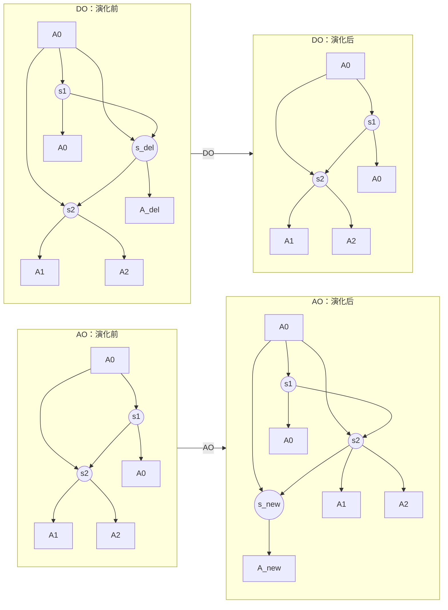

`AO` 表示在顺序图中添加一个新对象。这种演化一般发生在系统需要添加新对象以实现某种新功能，或需要将现有对象某个功能独立出来以增加架构灵活性时。

`DO` 表示删除顺序图中现有的一个对象。这种演化一般发生在系统需要移除某个现有功能，或需要合并某些对象及其功能以降低架构复杂度时。

对于发生演化的对象，如果它没有与现有任何对象产生交互关系，则可以认为它对于系统没有意义，因为这种演化不会对当前架构正确性或时态属性产生影响。因此，在发生对象演化时，一般会伴随着相应消息演化，新增相应消息以完成交互，从而对架构正确性或时态属性产生影响。

### 10.2.2 消息演化

消息是顺序图中的核心元素，包含名称、源对象、目标对象、时序等信息。这些信息与其他对象或消息相关联，产生变化会直接影响对象之间交互，从而对架构正确性或时态属性产生影响。另外，消息自身的属性，如接口、类型等，产生变化不会影响对象之间交互过程，因此通常不把它们列为这里讨论的主要演化类型。

消息演化分为 5 种：

1. `AddMessage(AM)`：增添一条新消息，发生在对象之间需要增加新的交互行为时。
2. `DeleteMessage(DM)`：删除当前一条消息，发生在需要移除某个交互行为时，是 `AM` 的逆向演化。
3. `SwapMessageOrder(SMO)`：交换两条消息的时间顺序，发生在需要改变两个交互行为之间关系时。
4. `OverturnMessage(OM)`：反转消息的发送对象与接收对象，发生在需要修改某个交互行为本身时。
5. `ChangeMessageModule(CMM)`：改变消息的发送或接收对象，发生在需要修改某个交互行为本身时。

在教材原图中，自动机状态内记录的是行为信息，即对象发出的消息；边上记录的是转移信息，即对象接收到的消息。由于一条消息由一个对象发送给另一个对象，每次消息演化都会同时涉及两个对象自动机的变化，原图用 `obj1`、`obj2` 表示这两个对象，并用成对的消息标记表示发送与接收的一一对应关系。

> 图 10-2 消息演化的自动机表示
>
> **结构化转录（不是教材原图）：** 以下逐项保留原图 a～h 八个子图中的对象、状态内发送消息、边上接收消息及演化前后关系。记号 `[m1]` 表示状态内记录发送消息 `m1`，`--m2→` 表示边上记录接收消息 `m2`，`[空]` 表示原图无消息文字的状态，`→` 表示原图未标消息名的连接，`…` 表示子图边界外仍有前驱或后继。

| 子图 | 操作 | 演化前的成对自动机 | 演化后的成对自动机 |
| --- | --- | --- | --- |
| a | `AM` / `DM` | `obj1: [m1] --m2→ …`<br>`obj2: … --m1→ [m2]` | `obj1: [m1] → [m_new] --m2→ …`<br>`obj2: … --m1→ [空] --m_new→ [m2]` |
| b | `AM` / `DM` | `obj1: … --m1→ [m1] --m2→ …`<br>`obj2: [m1] → [m2]` | `obj1: … --m1→ [m_new] --m2→ …`<br>`obj2: [m1] --m_new→ [m2]` |
| c | `AM` / `DM` | `obj1: [m1] → [m2]`<br>`obj2: … --m1→ [空] --m2→ …` | `obj1: [m1] → [m_new] → [m2]`<br>`obj2: … --m1→ [空] --m_new→ [空] --m2→ …` |
| d | `SMO` | `obj1: … --m4→ [m1] --m2→ [m3]`<br>`obj2: [m4] --m1→ [m2] --m3→ …` | `obj1: … --m4→ [空] --m2→ [m1] → [m3]`<br>`obj2: [m4] → [m2] --m1→ [空] --m3→ …` |
| e | `SMO` | `obj1: … → [m1] --m2→ [m3]`<br>`obj2: [空] --m1→ [m2] --m3→ …` | `obj1: … --m2→ [m1] → [m3]`<br>`obj2: [m2] --m1→ [空] --m3→ …` |
| f | `SMO` | `obj1: … --m1→ [空] --m2→ …`<br>`obj2: [m1] → [m2]` | `obj1: … --m2→ [空] --m1→ …`<br>`obj2: [m2] → [m1]` |
| g | `OM` | `obj1: [m1] --m2→ …`<br>`obj2: … --m1→ [m2]` | `obj1: … --m1→ [空] --m2→ …`<br>`obj2: [m1] → [m2]` |
| h | `CMM` | `obj1: [m1] --m2→ …`<br>`obj2: … --m1→ [m2]`<br>`obj3: … --m3→ [m4]` | `obj1: [m1] --m2→ …`<br>`obj2: … → [m2]`<br>`obj3: … --m3→ [空] --m1→ [m4]` |

> **来源核对：** 本表依据本地官方教程 PDF 物理页 343（印刷页 333）逐子图转录，源文件 SHA-256 为 `EE45900F4622D71539980CFE1BDDBCD898FBA97CA13ADA6DF1CBDC215135C2F8`，核对日期 `2026-07-12`。a～c 是在不同位置插入/删除 `m_new`，d～f 是三种位置关系下交换 `m1/m2`，g 反转消息方向，h 把 `m1` 的关联对象从 `obj2` 改到 `obj3`；表格省略的只有圆形坐标和虚线分隔版式。

五类操作的存在性摘要如下；它不能替代上表的八个原图子图转录：

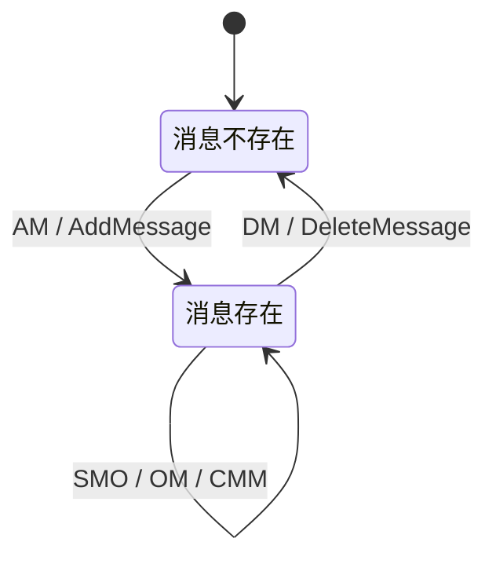

消息与约束直接相关。消息演化会直接影响对象之间交互行为，但不一定会违背约束。我们可以将这种演化分为 3 类。

1. 与当前约束无关的演化，例如大多数情况下的 `AddMessage`，这类演化不会对架构设计的正确性或时态属性产生影响。
2. 与约束直接关联但不会违背约束的演化，例如改变消息模块后，消息仍不违背“在某处产生”的约束，这类演化通常也不会对架构设计正确性或时态属性产生影响。
3. 与约束直接关联并会违背约束的演化，例如 `DeleteMessage` 删除的消息恰好是某条约束的一部分，这种演化后的架构就违背了约束，因此是不正确的演化。

消息是顺序图的核心内容，消息演化也是顺序图演化的核心。对象演化会伴随着消息演化，否则没有意义；复合片段和约束均基于消息存在，二者的演化也直接受到消息演化影响。因此，对其他演化进行分析研究时，也必须考虑相关联的消息演化。

### 10.2.3 复合片段演化

复合片段是对象交互关系的控制流描述，表示可能发生在不同场合的交互，与消息同属于连接件范畴。复合片段本身的信息包括类型、成立条件和内部执行序列，其中内部执行序列的演化等价于消息序列演化。

通常会产生分支的复合片段包括 `ref`、`loop`、`break`、`alt`、`opt`、`par`；其余复合片段类型并不会产生分支，因此主要考虑这些会产生分支的复合片段所引起的演化。复合片段演化分为：

1. `AddFragment(AF)`：在某几条消息上新增复合片段，发生在需要增添新的控制流时。
2. `DeleteFragment(DF)`：删除某个现有复合片段，发生在需要移除当前某段控制流时，是 `AF` 的逆向演化。
3. `FragmentTypeChange(FTC)`：改变复合片段的类型，发生在需要改变某段控制流时。
4. `FragmentConditionChange(FCC)`：改变复合片段内部执行条件，发生在改变当前控制流执行条件时。

> 图 10-3 复合片段的演化说明
>
> **结构化转录（不是教材原图）：** 原图 a～f 六个子图分别给出条件改变以及 `ref`、`par`、`loop`、`break`、`alt` 片段的添加/删除。以下保留每个子图可见的对象、消息、条件、片段和演化方向；自动机记号与图 10-2 相同。

| 子图 | 操作 | 演化前 | 演化后 |
| --- | --- | --- | --- |
| a | `FCC` | `obj1`、`obj2` 各有两状态条件分支：满足 `cond1` 时回到上状态，不满足时沿 `!(cond1)` 退出 | 两个对象的分支同步改为 `cond2` / `!(cond2)`，状态数和回边方向不变 |
| b | `AF(ref)` / `DF(ref)` | `obj1 [m1]` 与 `obj2 [m2]` 之间保留原图两条标为 `m2` 的交互边 | 中间插入发送侧片段 `A1` 和接收侧片段 `A2`；`A1` 关联“初态→两个中间状态→终态”的被引用自动机，片段之间的可见边依次标为 `m2`、`m1`；`DF(ref)` 为逆向删除 |
| c | `AF(par)` / `DF(par)` | `obj1: [m1] --m3→ [m4] --m5→ [空] --m2→ …`<br>`obj2: … --m1→ [m3] --m4→ [m5] → [m2]` | 主链化为 `obj1: [m1] → [空] --m2→ …` 与 `obj2: … --m1→ [空] → [m1]`；在 `ρ(s_par)` 处分叉为 `A1: 初态→[m3]→[m4]→终态` 和 `A2: 初态 --m5→ 终态`。原图下行箭头印作 `AF(ref)`，但分叉结构、`ρ(s_par)` 及逆向箭头 `DF(par)` 均表明这里是 `par` 片段，故按语义记为 `AF(par)` 并保留此勘误 |
| d | `AF(loop)` / `DF(loop)` | `obj1: [m1] --m2→ …`；`obj2: … --m1→ [m2]` | `obj1` 在 `s_b1`、`s_b2` 之间加入包含 `[m1]` 与接收边 `m2` 的循环，`obj2` 加入对应的接收边 `m1` 与状态 `[m2]`；两边均以 `cond` 回到循环入口、以 `!(cond)` 退出 |
| e | `AF(break)` / `DF(break)` | `obj1`、`obj2` 各有原 `cond` 回边和 `!(cond)` 退出；配对消息为 `obj1 [m1] --m2→ …`、`obj2 … --m1→ [m2]` | 在两个对象上同步加入 `cond_b` / `!(cond_b)` 的 break 分支；原 `cond` 回边、`!(cond)` 退出以及 `m1/m2` 的发送—接收配对均保留，满足 break 条件时转入新增的片段出口 |
| f | `AF(alt)` / `DF(alt)` | `obj1: [m1] --m2→ …`；`obj2: … --m1→ [m2]` | 两对象均增加 `cond` 与 `!(cond)` 两条互斥路径：`!(cond)` 路径经过原 `m1/m2` 交互，`cond` 路径绕过该交互后在片段出口汇合；`DF(alt)` 为逆向删除 |

> **来源核对：** 本表依据本地官方教程 PDF 物理页 345（印刷页 335）逐子图转录，源文件 SHA-256 为 `EE45900F4622D71539980CFE1BDDBCD898FBA97CA13ADA6DF1CBDC215135C2F8`，核对日期 `2026-07-12`。保留了源图中的 `A1/A2`、`ρ(s_par)`、`s_b1/s_b2`、`cond/cond_b`、`m1～m5` 和全部正向/逆向操作；省略的只有圆形、方框坐标和虚线分区版式。

四类操作的存在性摘要如下；它不能替代上表的六个原图子图转录：

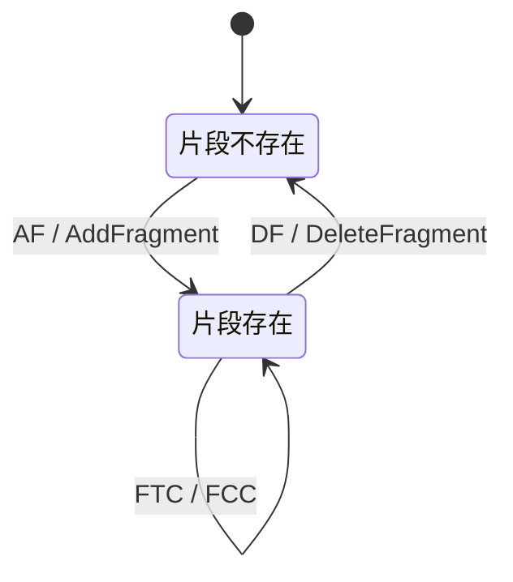

`FCC` 改变复合片段内部执行条件。自动机中与控制流执行条件相对应的转移包括两个：一个是符合条件时的转移，另一个是不符合条件时的转移，因此每次发生 `FCC` 演化时，会同时修改这两个转移的触发事件。

`AF` 在若干条消息上新增复合片段，发生在需要增加新控制流时。不同片段类型产生的分支不同：`ref` 会关联到另一个顺序图，`par` 会产生并行消息，其余类型形成相应的分支过程。`DF` 是删除现有复合片段，与 `AF` 互为逆向演化，因此不再单独展开同样的状态变换。

`FTC` 改变复合片段类型，意味着交互流程改变，一般伴随着条件、内部执行序列的同时演化，可以视为复合片段删除与添加的组合。

复合片段演化对应着对象之间交互流程的变化，因此会对架构设计正确性及其他时态属性产生影响。新的复合片段增加、条件改变，都可能直接改变消息执行流程，从而使违背约束的情况出现。因此需要对复合片段演化进行验证，以保证演化后不会产生预料之外的错误。

### 10.2.4 约束演化

顺序图中的约束信息以文字描述方式存储于对象或消息中，如通常可以用 `LTL` 来描述时态属性约束。约束演化对应着架构配置的演化，一般来源于系统属性改变，而更多情况下约束会伴随着消息改变而发生改变。由于其不存在可视化描述，因此约束演化的信息并未存储于定义的层次自动机中，也就不存在自动机描述方式。约束演化就是直接对约束信息进行添加和删除。

- `AC(Add Constraint)`：直接添加新的约束信息，会对架构设计产生直接影响，需要判断当前设计是否满足新添加约束要求。
- `DC(Delete Constraint)`：直接移除某条约束信息，发生在去除某些不必要条件的时候，一般而言架构设计都会满足演化后的约束。

由于约束缺乏可视化描述，因此如果对约束信息进行修改，可以视同为删除原有约束并添加新的约束，这里不再另外列出。

## 10.3 软件架构演化方式的分类

目前，软件架构演化方式没有一种公认分类法，分类方法很多，下面举 3 种较典型的分类方法。

1. 按照软件架构的实现方式和实施粒度分类：基于过程和函数的演化、面向对象的演化、基于组件的演化和基于架构的演化。
2. 按照研究方法分类(Jeffrey M. Barnes 等人的分类方法)：第 1 类是对演化的支持，如代码模块化准则、可维护性指示(如内聚和耦合)、代码重构等；第 2 类是版本和工程管理工具，如 `CVS` 和 `COCOMO`；第 3 类是架构变换的形式方法，包括系统结构和行为变换模型，以及架构演化的重现风格等；第 4 类是架构演化的成本收益分析，决定如何增加系统弹性。
3. 针对软件架构演化过程是否处于系统运行时期，可将软件架构演化分为静态演化(`Static Evolution`)和动态演化(`Dynamic Evolution`)。前者发生在软件架构的设计、实现和维护过程中，软件系统还未运行或者处于停止状态；后者发生在软件系统运行过程中。

本章重点介绍软件架构的静态演化和动态演化。

### 10.3.1 软件架构演化时期

#### 1. 设计时演化

设计时演化(`Design-Time Evolution`)是指发生在体系结构模型和与之相关代码编译之前的软件架构演化。

#### 2. 运行前演化

运行前演化(`Pre-Execution Evolution`)是指发生在执行之前、编译之后的软件架构演化。这时由于应用程序并未执行，修改时可以不考虑应用程序状态，但需要考虑系统体系结构，而且系统需要具有添加和删除组件的机制。

#### 3. 有限制运行时演化

有限制运行时演化(`Constrained Runtime Evolution`)是指系统在设计时就规定了演化的具体条件，将系统置于“安全”模式下，演化只发生在某些特定约束满足时，可以进行一些规定好的演化操作。

#### 4. 运行时演化

运行时演化(`Runtime Evolution`)是指系统体系结构在运行时不能满足要求时发生的软件架构演化，包括添加组件、删除组件、升级替换组件、改变体系结构拓扑结构等。此时的演化最难实现。

### 10.3.2 软件架构静态演化

#### 1. 静态演化需求

软件架构静态演化需求广泛存在，可以归结为两个方面。

1. 设计时演化需求。在架构开发和实现过程中对原有架构进行调整，保证软件实现与架构的一致性以及软件开发过程的顺利进行。
2. 运行前演化需求。软件发布之后由于运行环境变化，需要对软件进行修改升级，在此期间软件架构同样要进行演化。

下面分别介绍软件演化中的架构静态演化和适应该静态演化的应用实例，即正交软件架构，以及软件开发过程中的架构静态演化。

#### 2. 静态演化的一般过程

软件静态演化是系统停止运行期间的修改和更新，即一般意义上的软件修复和升级。与此相对应的维护方法有 3 类：更正性维护、适应性维护和完善性维护。

软件静态演化一般包括如下 5 个步骤。

1. 软件理解：查阅软件文档，分析软件架构，识别系统组成元素及其相互关系，提取系统抽象表示形式。
2. 需求变更分析：静态演化往往由于用户需求变化、系统运行出错和运行环境发生改变等原因引起，需要找出新的软件需求与原有需求之间的差异。
3. 演化计划：分析原系统，确定演化范围和成本，选择合适的演化计划。
4. 系统重构：根据演化计划对系统进行重构，使之适应当前需求。
5. 系统测试：对演化后的系统进行测试，查找其中的错误和不足。

> 图 10-4 静态演化过程模型
>
> **结构化重绘示意（不是教材原图）：** 根据 PDF 物理页 348 转录“原系统—五个步骤—更新后系统”的闭环；“循环迭代”反馈边由更新后系统回到原系统。

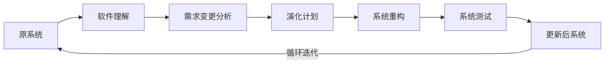

在系统未运行情况下，软件功能变更或环境变化可能会带来架构中组件元素的增加、替换、删除、组合和拆分操作。架构静态演化需要对这些操作给其他组件和系统本身带来的影响进行分析。通过对组件间影响关系建模，按照可达矩阵方式即可计算出每种组件变更操作所影响的范围。

#### 3. 静态演化的原子演化操作

一次完整软件架构演化过程，可以看作经过一系列原子演化操作组合而成。所谓原子演化操作，是指基于 `UML` 模型表示的软件架构，在逻辑语义上粒度最小的架构修改操作。

这些操作并不是指物理结构上不可分割。例如，增加一个新模块时，该模块必须与架构其他部分关联，必然导致模块间依赖关系增加；同时还涉及模块内部的类、接口以及与模块相关的规约条件，这些都会影响架构相关质量属性的度量。因此，虽然一次“增加模块”会牵连多项物理变化，本节仍把它视为在逻辑语义上不可再拆分的原子架构修改操作。

每经过一次原子演化操作，架构都会形成一个演化中间版本 `Ai`。对于不同质量属性的度量和评估，能够引起该质量属性变化的原子演化操作类型不同，形成的中间版本序列 `A0,A1,A2,…,An` 也不同。例如，要同时度量可维护性和可靠性，就应分别讨论会影响两类度量结果的各种原子演化操作。

##### 1. 与可维护性相关的架构演化操作

架构演化的可维护性度量基于组件图表示的软件架构，在较高层次上评估某个原子修改操作对整个架构的影响。这些原子修改操作如表 10-1 所示。

**表 10-1 可维护性相关架构演化操作**

| 名称 | 说明 |
| --- | --- |
| `AMD(Add Module Dependence)` | 增加模块间依赖关系 |
| `RMD(Remove Module Dependence)` | 删除模块间依赖关系 |
| `AMI(Add Module Interface)` | 增加模块间接口 |
| `RMI(Remove Module Interface)` | 删除模块间接口 |
| `AM(Add Module)` | 增加一个模块 |
| `RM(Remove Module)` | 删除一个模块 |
| `SM(Split Module)` | 拆分模块 |
| `AGM(Aggregate Modules)` | 聚合模块 |

这些操作中：

- `AMD/RMD` 改变模块控制关系和逻辑响应，从整体上影响架构组织结构，可能导致架构外部质量属性变化。
- `AMI/RMI` 改变模块间调用关系和调用方式，并可能导致具体执行事件顺序和方式变化。
- `AM/RM` 中，模块封装了一系列逻辑耦合度高或部署紧密的子模块，用于表达完整功能。增加或删除模块不仅表示软件功能变化，还可能因该模块与其他模块的耦合方式改变整体组织结构，从而引入 `AMD` 或 `RMD` 操作。过多耦合会扩大修改影响范围，不利于软件维护和持续演化；模块内部设计是否正确、合理，也会影响软件潜在风险。
- `SM/AGM` 通常发生在软件调整过程中，直接影响软件内聚度和耦合度，从而影响整体复杂性。

##### 2. 与可靠性相关的架构演化操作

架构演化的可靠性评估基于用例图、部署图和顺序图，分析在架构模块交互过程中某个原子演化操作对交互场景可靠程度的影响。这些原子修改操作如表 10-2 所示。

**表 10-2 可靠性相关架构修改操作**

| 名称 | 说明 |
| --- | --- |
| `AMS(Add Message)` | 在顺序图中增加模块交互消息 |
| `RMS(Remove Message)` | 在顺序图中删除模块交互消息 |
| `AO(Add Object)` | 在顺序图中增加交互对象 |
| `RO(Remove Object)` | 在顺序图中删除交互对象 |
| `AF(Add Fragment)` | 在顺序图中增加消息片段 |
| `RF(Remove Fragment)` | 在顺序图中删除消息片段 |
| `CF(Change Fragment)` | 在顺序图中修改消息片段 |
| `AU(Add Use Case)` | 在用例图中为参与者增加一个可执行用例 |
| `RU(Remove Use Case)` | 在用例图中为参与者删除某个可执行用例 |
| `AA(Add Actor)` | 在用例图中增加参与者 |
| `RA(Remove Actor)` | 在用例图中删除参与者 |

这些操作对可靠性及交互复杂度的具体影响如下。

- `AMS/RMS`：模块间消息交互体现在 UML 顺序图中。消息变化包括增加、删除和修改；消息修改可能涉及顺序或交互对象改变，可以由删除原消息和增加新消息等操作组合完成，因此原子粒度只单列增加消息和删除消息。消息增删会改变交互过程的时序复杂度，可能引入运行时风险。
- `AO/RO`：在顺序图中增加或删除交互对象会引入与该对象有关的消息增加或删除，同时还需要在部署图中把该模块加入相关站点或从站点删除。执行场景的可靠性取决于组件和连接件的可靠性，对象增减会直接影响一个或多个包含该模块的场景的交互复杂度。
- `AF/RF/CF`：消息片段是顺序图中一组交互消息的循环调用；增加、删除消息片段或修改调用次数会改变交互过程复杂度，从而影响该场景的执行风险。
- `AU/RU`：为参与者增加或删除可执行用例，表示参与者执行权限发生变化。通常可执行用例越多，参与者权限越高；用户以某一参与者身份执行用例时，参与执行事件的增加或执行方式的多样化会使系统运行更复杂，增加运行时风险。
- `AA/RA`：增加或删除参与者意味着执行权限增减，并会引入 `AU/RU`。参与者增减虽然不一定改变软件静态结构，但不同参与者的执行方式不同，会改变系统动态交互并影响程序运行风险。

#### 4. 静态演化实例：正交软件架构

在静态演化中，为了高效分析和管理修改，一种应用广泛的方式就是使用正交软件架构(`Orthogonal Software Architecture`)。

对于复杂应用系统，通过对功能进行分层和线索化，可以形成正交体系结构，同一层次中的组件不允许相互调用，因此每个变动仅影响一条线索。

> 图 10-5 正交软件体系结构的演化
>
> **结构化重绘示意（不是教材原图）：** 根据 PDF 物理页 350 转录五层正交线索：更新前包含 `A-B-D-F-H` 与 `A-C-E-G-H`，更新后由 `C'、G'` 形成替换线索；虚线表示演化关系，不复原原图椭圆圈选版式。

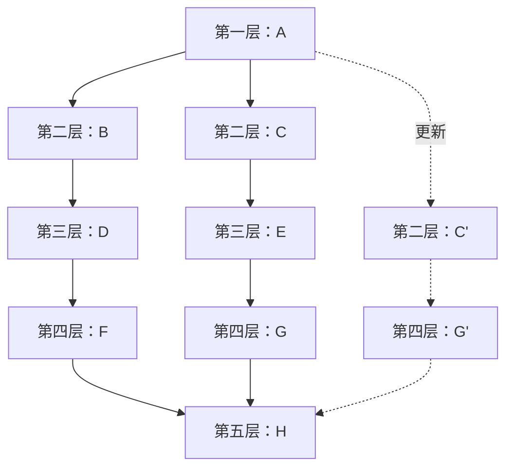

这样，正交体系的演化过程可以概括如下：

1. 需求变动归类，使需求变化和现有组件及线索相对应，判断重用情况。
2. 制订架构演化计划。
3. 修改、增加或删除组件。
4. 更新组件之间相互作用。
5. 产生演化后的软件架构，作为系统更新的详细设计方案和实现基础。

### 10.3.3 软件架构动态演化

动态演化是在系统运行期间进行的演化，需要在不停止系统功能的情况下完成，较之静态演化更加困难，具体发生在有限制的运行时演化和运行时演化阶段。

#### 1. 动态演化的需求

架构动态演化主要来自以下两类需求。

1. 软件内部执行所导致的体系结构改变。例如，许多服务器端软件会在客户请求到达时创建新的组件来响应用户需求。
2. 软件系统外部的请求对软件进行重配置。例如，操作系统在升级时无须重新启动，在运行过程中就可以完成对体系结构的修改。

对于一些需要长期运行且具有特殊使命的系统(如航空航天、生命维持、金融、交通等)，如果系统需求或环境发生变化，此时停止系统运行进行更新或维护将会产生高额费用和巨大风险，对系统安全性也会产生很大影响。静态体系结构缺乏表示动态更新的机制，很难用来分析和描述这样的系统，更不能用来指导系统进行动态演化。因此，对架构动态演化的研究应运而生。

随着网络和许多新兴软件技术(如 `Agent`、网格计算、普适计算、移动计算、网构软件等)的发展，人们对架构提出了许多更高要求，如扩展性、复用性和适应性等，而传统静态体系结构已经难以满足这些要求。

#### 2. 动态演化的类型

##### 1. 软件动态性的等级

Carlos E. Cuesta 等人将软件动态性分为 3 个级别。

1. 交互动态性(`Interactive Dynamism`)：要求数据在固定结构下动态交互。
2. 结构动态性(`Structural Dynamism`)：允许对结构进行修改，通常的形式是组件和连接件实例的添加与删除，这种动态性是研究和应用的主流。
3. 架构动态性(`Architectural Dynamism`)：允许软件架构的基本构造发生变动，即结构可以被重定义，例如定义新的组件类型。

> 图 10-6 软件的三级动态性
>
> **结构化重绘示意（不是教材原图）：** 三级按允许变化的范围递进；箭头表示变化能力扩大，并非原图的几何包含关系。


以 Cuesta 的划分标准衡量，目前软件架构动态演化研究大多仅支持发生在级别 1 和级别 2 上的动态性，而对级别 3 上的动态性支持甚少。但是 Cuesta 坚持认为，只有级别 3 的架构才是真正的动态架构。

##### 2. 动态演化的内容

根据所修改的内容不同，软件动态演化主要包括以下 4 个方面。

1. 属性改名：目前所有 `ADL` 都支持对非功能属性的分析和规约，而在运行过程中，用户可能会对这些指标进行重新定义，如服务响应时间。
2. 行为变化：在运行过程中，用户需求变化或系统自身服务质量的调节都将引发软件行为变化，例如，为了提高安全级别而更换加密算法，将 `HTTP` 协议改为 `HTTPS` 协议，以及替换和重新配置组件、连接件。
3. 拓扑结构改变：如增删组件、增删连接件、改变组件与连接件之间关联关系等。
4. 风格变化：一般软件演化后其架构风格应当保持不变。如果确有必要改变，也只能将架构风格变为其衍生风格，如将两层 `C/S` 结构调整为三层 `C/S` 结构或 `C/S` 与 `B/S` 的混合结构，将“1 对 1”的请求响应结构改为“1 对 N”的请求响应结构，以实现负载平衡。

目前，实现软件架构动态演化的技术主要有两种：采用动态软件架构(`Dynamic Software Architecture`，`DSA`)和进行动态重配置(`Dynamic Reconfiguration`，`DR`)。`DSA` 是指在运行时刻会发生变化的系统框架结构，允许在运行过程中通过框架结构的动态演化修改架构；`DR` 从组件和连接件的配置入手，允许在运行过程中增删组件、增删连接件、修改连接关系等。二者从不同侧面对软件和架构的动态演化进行研究，尚无明确的分类。本节将 `DSA` 归为架构动态性，将 `DR` 归为结构动态性，下面分别讨论。

#### 3. 动态软件架构

Perry 在 2000 年第十六届世界计算机大会中提出，软件架构最重要的 3 个研究方向是软件架构风格、软件架构连接件和 `DSA`。`DSA` 指那些会在软件运行时刻发生变化的体系结构。与静态软件架构相比，`DSA` 的特殊之处在于它的动态性。软件架构的动态性，是指由于系统需求、技术、环境、分布等因素变化而导致软件架构在软件运行时刻发生变化，主要通过软件架构的动态演化来体现。

Bradbury 等人为 `DSA` 所作的定义是：动态软件架构可以修改自身的架构，并在系统执行期间进行修改。

`DSA` 的意义主要在于减少系统开发的费用和风险。采用 `DSA` 后，一些具有特殊使命的系统能够在运行时根据需求进行更新，并降低更新费用和风险。此外，`DSA` 能增强用户自定义性和可扩展性，并可为用户提供更新系统属性的服务。

##### 1. 基于 DSA 实现动态演化的基本原理

实现软件架构动态演化的基本原理，是使 `DSA` 在可运行应用系统中以一类有状态、有行为、可操作的实体显式表示出来，并且被整个运行环境共享，作为整个系统运行的依据。也就是说，运行时刻体系结构相关信息的改变，可以用来触发、驱动系统自身的动态调整；此外，对系统自身所做的动态调整结果，也可以反映在体系结构这一抽象层面上。

在系统结构上，引入运行时体系结构对象后，相关协同逻辑能够从计算组件中分离出来，显式、集中地表达，符合关注分离原则；同时又解除了系统组件之间的直接耦合，这些都有助于系统动态调整。由于动态演化实现起来比静态演化复杂得多，系统必须提供软件架构动态演化的相关功能。

1. 系统必须提供保存当前软件架构信息的功能，包括拓扑结构、组件状态和数目等。
2. 实施动态演化时须设置监控管理机制，监视系统是否出现需求变化。
3. 发现需求变化后，应分析并判断能否实施演化、何时演化和演化范围，并最终分析或生成演化策略。
4. 应保证演化操作的原子性。在动态变化过程中，如果其中一个操作失败，整个操作集都要撤销，避免系统处于不稳定状态。

`DSA` 实施动态演化大体遵循以下 4 个步骤。

1. 捕捉并分析需求变化。
2. 获取或生成体系结构演化策略。
3. 根据上一步得到的演化策略，选择适当的演化方式并实施演化。
4. 对演化后的系统进行评估与检测。

完成这 4 个步骤，还需要 `DSA` 描述语言和演化工具的支持。

##### 2. DSA 描述语言

按照描述视角，可将软件动态性建模语言分为 3 类。

1. 基于行为视角的 `π-ADL`：使用进程代数描述具有动态性的行为。
2. 基于反射视角的 `Pilar`：利用反射理论显式地为元信息建立模型。
3. 基于协调视角的 `LIME`：注重计算部分和协调部分分离，利用协调理论解决动态性交互。

**(1) `π-ADL`**

一般来说，软件架构的描述分为结构相关描述和行为相关描述两个部分。`DSA` 的重点是运行时对结构进行改变的行为，因此需要对这些行为进行描述和验证。进程代数是处理这一问题的形式化方法，其中以序列化方式执行的一系列行为被抽象为进程，行为交互被简化为进程的合成。

`π` 演算是目前主流的进程代数语言之一，`π-ADL` 就是以此为基础设计的架构描述语言。它采用运行时观点对系统建模，模型包括组件、连接件和行为，所有元素都会随时间演化。`π-ADL` 是为移动系统建模而设计的；移动通信领域的动态性特别明显，例如手机移动时会动态改变与服务器的连接关系，因此移动系统本身就需要使用 `DSA`。

**(2) `Pilar`**

动态架构的一种直观解决方案是实现架构反射，将模型与系统关联起来：模型的修改会反映为系统修改，系统的变化也会表现为模型变化。

形式化的反射模型是一个基于层的模型，其中每一层都作为其基层的元系统(`Meta-System`)，基层则称为基系统(`Base-System`)。对于每一个“元系统—基系统”对，元系统描述系统如何感知或修改自身，基系统则提供常规的应用操作和结构。反射模型没有限定层数，但实际应用中一般采用少于 3 层的反射模型。

`MARMOL`(`Meta Architecture Model`)是第一个尝试将反射和架构结合起来的形式化模型，其主要思想是在架构描述中引入多个层次，并用反射概念表示这些层次。`MARMOL` 既不是针对特定问题或项目的模型，也不是一种架构风格或模式，而是一种描述风格。它可以与其他 `ADL` 结合应用，例如使用 `MARMOL` 描述层模型，而单个层则使用其他 `ADL` 描述。

基于 `MARMOL` 的动态架构描述语言 `Pilar` 已经出现。在 `Pilar` 中只有一种顶级元素——组件；每个组件由接口、配置、具化(`Reification`)和约束 4 个部分组成。

**(3) `LIME`**

在分布式和并行系统的演化中，协调模型(`Coordination Model`)应用广泛，它提供了增强模块性、组件复用性、移植性和语言互操作性的框架。协调模型与 `DSA` 的关系在于：大规模并行系统分布在许多逻辑节点上，这些节点的交互行为本质上就是动态的，对 `DSA` 的需求正来自于此。

`Linda` 首次将协调模型应用于计算机科学，`LIME`(`Linda In a Mobile Environment`)则是 `Linda` 的扩展，支持移动应用开发。它既能描述物理移动性，也能描述逻辑移动性，通过分离计算部分和协调部分，使时间、空间因素分离，从而简化分布式系统开发。

##### 3. DSA 演化工具

动态演化工具需要支持系统在演化过程中与其软件架构的一致性检查，并能够对架构演化过程进行管理，主要有以下几种方法。

1. 使用反射机制。Dowling 等人设计了 `K-Component` 框架元模型，用有类型的有向配置图表示架构，能够支持系统动态调整；北京大学的 `PKUAS` 引入运行时软件架构(`RSA`)作为全局视图，支持单个 `EJB` 容器内的组件演化；基于体系结构空间支持动态演化的软件模型 `SASM` 使用运行时体系结构(`RSAS`)作为架构模型，该模型是在运行期间有状态、有行为、可访问的对象，支持面向服务架构的动态演化；`Artemis-ARC` 以 `ACME` 为语义设计运行时可编程架构模型，支持架构和服务架构演化，并可对 `DSA` 进行追溯、验证和框架代码检查。
2. 基于组件操作。代表性工作包括一种基于组件的动态体系结构模型，以及面向应用、开放、由软件架构驱动的分布式运行环境 `SACDRE`，用于支持基于组件的系统架构进行动态演化。
3. 基于 `π` 演算。`π` 演算是在 `CCS`(`Calculus of Communicating Systems`)基础上提出的、基于名称概念的进程代数并发通信行为演算方法，可以描述结构不断变化的并发系统。软件体系结构抽象模型 `SAAM`(`Software Architecture Abstract Model`)通过一系列 `π` 演算进程对软件架构实施演化，并利用相关分析方法检查软件架构的一致性。
4. 利用外部体系结构演化管理器。加州大学欧文分校提出的 `ArchStudio` 包含 3 种体系结构变更源工具：`Argo`、`ArchShell` 和扩展向导。`Argo` 提供图形化架构描述和操作手段；`ArchShell` 提供文本化、命令式的体系结构变更语言；扩展向导提供可执行的脚本更改语言，用于对体系结构进行连续演化。它是把体系结构层面表达的动态调整落实到具体系统中的典型代表。

#### 4. 动态软件架构应用实例：PKUAS

`PKUAS` 是一个符合 `Java EE` 规范的组件运行支撑平台，支持 3 种标准 `EJB` 容器，包括无态会话容器、有态会话容器和实体容器；支持远程接口和本地接口；提供 `IIOP`、`JRMP`、`SOAP` 以及 `EJBLocal` 互操作机制；内置命名服务、安全服务、事务服务、日志服务和数据库连接服务；并通过了 `Java EE` 蓝图程序 `JPS v1.1` 的测试。

为了能够明确标识、访问和操纵系统中的计算实体，反射式中间件必须具备组件化的基础设施体系。基于 `Java` 虚拟机，`PKUAS` 将平台自身实体划分为如下 4 种类型。

1. 容器系统：容器是组件运行时所处的空间，负责组件生命周期管理(如类装载、实例化、缓存、释放等)，以及组件运行所需的上下文管理(如命名服务上下文、数据库连接等)。`PKUAS` 内置的 3 种 `EJB` 容器中，一个容器实例管理一个 `EJB` 组件的所有实例，一个应用中所有 `EJB` 组件的容器实例组成一个容器系统。这种组织模式有利于实现特定于单个应用的配置和管理，例如不同应用可使用不同通信端口、认证机制与安全域。
2. 公共服务：实现系统的非功能性约束，如通信、安全、事务等。由于这些服务可以通过微内核动态增加、替换和删除，为保证容器或组件正确调用服务并避免服务卸载的副作用，必须提供服务功能的动态调用机制。供容器使用的服务要开发相应截取器作为容器调用服务的执行点；供组件使用的服务则要在命名服务中注册。
3. 工具：辅助用户使用和管理 `PKUAS` 的工具集合，主要包括部署工具、配置工具与实时监控工具。部署工具既可热部署整个应用，也可热部署单个组件，从而实现应用在线演化；配置工具允许用户配置整个服务器或单个应用；实时监控工具允许用户实时观察系统运行状态并作出相应调整。
4. 微内核：上述 3 类实体统称为系统组件。微内核负责这些系统组件的装载、配置、卸载，以及启动、停止、挂起等状态管理。`PKUAS` 微内核符合 Java 平台管理标准 `JMX`(`Java Management Extensions`)，具有可移植、伸缩性强、易于集成其他管理方案、可有效利用现有 Java 技术和可扩展等特点。

其中，容器系统、服务、工具等被管理的系统组件组成资源层，通过 `MBean` 接口对外提供与管理相关的属性和操作。负责注册资源的 `MBean Server` 和管理资源的插件组成管理层。`MBean Server` 对外提供所有资源的管理接口，允许资源动态增加或删除；管理插件则是执行其他管理功能的 `MBean`，例如 `PKUAS` 实时监控管理工具的核心功能就是通过管理插件实现的。

#### 5. 动态重配置

基于软件动态重配置的软件架构动态演化，主要指在软件部署之后对配置信息进行修改，常用于系统动态升级时的配置更新。一般来说，动态重配置可能涉及以下修改。

1. 简单任务的相关实现修改。
2. 工作流实例任务的添加和删除。
3. 组合任务流程中的个体修改。
4. 任务输入来源的添加和删除。
5. 任务输入来源优先级的修改。
6. 组合任务输出目标的添加和删除。
7. 组合任务输出目标优先级的修改。

##### 1. 动态重配置模式

每种重配置模式说明软件模式中的组件如何协作，以及如何通过协作完成整个产品线的动态重配置过程，即从一种配置转换为另一种配置。常见的动态重配置模式有以下 4 种。

1. 主从(`Master-Slave`)模式：主组件接收客户端服务请求，把工作划分给从组件，然后合并、解释、总结或整理从组件的响应。主组件没有分配工作时，从组件处于空闲(`Idle`)状态，并在新的任务分配时被重新激活。主从模式由主操作重配置状态图描述，其中包含两个正交的图：主操作状态图定义主组件的操作状态，主重配置状态图描述主组件如何安排重配置过程。
2. 中央控制(`Centralized Control`)模式：广泛用于实时系统，由一个中央控制器控制多个组件；其状态图维持两个状态，分别标识中央控制器是否处于空闲状态。
3. 客户端/服务器(`Client/Server`)模式：客户端组件需要服务器组件所提供的服务，二者通过同步消息交互。在客户端发起的事务完成后，可以添加或删除客户端组件；当顺序服务器(`Sequential Server`)完成当前事务，或者并发服务器(`Concurrent Server`)完成当前事务集合并把新事务在服务器消息缓冲中排队完毕后，可以添加或删除服务器组件。
4. 分布式控制(`Decentralized Control`)模式：系统功能整合在多个分布式控制组件中，广泛用于分布式应用。典型形式包括环形(`Ring`)模式和顺序(`Serial`)模式。环形模式中的各组件功能相同，左右各有一个与之交互的组件，分别称为前驱和后继；顺序模式中的各组件使用相同连接与自己的前驱和后继交互，每个组件向自己的前驱发送请求并获得响应。

##### 2. 例子：可重用、可配置的产品线架构

软件产品线是一种软件开发和配置的方法论，促进了软件的有效开发，但也存在配置复杂性高、用户可定制弹性不足，以及关注点从产品偏移到领域等问题。为此，Bayer 等人给出了 `PuLSE`(`Product Line Software Engineering`)方法论，它能够在各种企业环境中进行软件产品线构想和部署。其实现要素包括：在 `PuLSE` 各步骤中以产品为核心关注点，支持组件可定制、增量导入组件、结构演化的成熟度，以及主要产品开发过程的适应性调整等。

> 图 10-7 PuLSE 概览
>
> **结构化重绘示意（不是教材原图）：** 下图按官方 PDF 物理页 356 保留部署步骤的先后关系、三个步骤与 `PL 基础设施演化和管理` 的双向关系，以及部署组同技术组、支持组之间的双向关系。Mermaid 只调整几何布局，不把组间双向箭头解释成逐项一一对应。

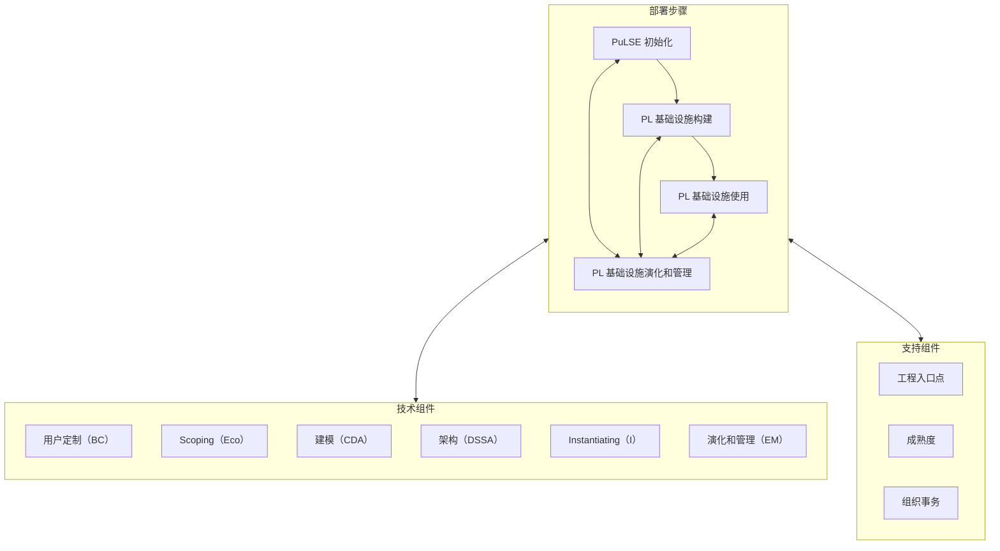

拓扑核对为：`PuLSE 初始化 → PL 基础设施构建 → PL 基础设施使用`；三个步骤分别与 `PL 基础设施演化和管理` 双向相连；部署步骤组分别与技术组件组、支持组件组双向相连；技术组件组与支持组件组之间没有直接箭头。

> **图形校对来源与版本边界：** 图形拓扑以用户本地官方教程 PDF 物理页 356（印刷页 346）为准，源文件 SHA-256 为 `ee45900f4622d71539980cfe1bddbcd898fba97ca13ada6df1cbdc215135c2f8`，核对日期 `2026-07-12`。Joachim Bayer 等，*PuLSE: A Methodology to Develop Software Product Lines*，Figure 1 “PuLSE Overview”，DOI [10.1145/303008.303063](https://doi.org/10.1145/303008.303063)及 [Fraunhofer IESE 出版记录](https://publica.fraunhofer.de/entities/publication/4ffdc432-88c3-4ec6-a069-5a55fc31073c)仅用于核对 `BC/Eco/CDA/DSSA/I/EM` 命名；教材页中的中文节点和连线是本稿的图形依据。

Gomaa 等人提出了一种使用 `UML` 对软件产品线建立多视角元模型的方法。这是一种面向对象的领域模型，能够从多个方面描述软件产品线，包括用例模型、静态模型、交互模型、状态机模型和特性模型，并使用对象约束语言(`OCL`)检查各模型的一致性。他们开发了原型系统 `PLUSEE`(`Product Line UML Based Software Engineering Environment`)来实施该方法。

##### 3. 动态重配置的难点

Tamura 等人提出了在带有服务质量(`Quality of Service`，`QoS`)约束的情况下，基于扩展图进行架构重配置的方法，并说明了动态重配置的 4 个难点。

1. 约束定义困难。
2. 性能约束难以静态衡量，需要在软件运行时评估。
3. 某些重配置方案能够解决性能约束的某一方面，但是难以管理所有方面。
4. 重配置需要同时保证两个方面：维持组件系统完整性，以及重配置策略的正确性和安全性。

## 10.4 软件架构演化原则

本节列举 18 种软件架构可持续演化原则，并针对每个原则设计相应的度量方案。这些度量方案看似简单，但每个方案都能紧抓相应原则的本质，可以从架构(系统整体结构)层面提供有价值的信息，帮助对架构进行有效观察。

### 1. 演化成本控制原则

- **原则名称：** 演化成本控制(`Evolution Cost Control`，`ECC`)原则。
- **原则解释：** 演化成本要控制在预期范围内，也就是演化成本要明显小于重新开发成本。
- **原则用途：** 用于判断架构演化成本是否在可控范围内，以及用户是否可接受。
- **度量方案：** `CoE << CoRD`。
- **方案说明：** `CoE` 为演化成本，`CoRD` 为重新开发成本，`CoE` 远小于 `CoRD` 最佳。

### 2. 进度可控原则

- **原则名称：** 进度可控(`Schedule Control`)原则。
- **原则解释：** 架构演化要在预期时间内完成，也就是时间成本可控。
- **原则用途：** 根据该原则可以规划每个演化过程的任务量，体现一种迭代、递增(持续演化)的演化思想。
- **度量方案：** `ttask = |Ttask - T'task|`。
- **方案说明：** `Ttask` 是某个演化任务的实际完成时间，`T'task` 是预期完成时间，二者的时间差 `ttask` 越小越好。

### 3. 风险可控原则

- **原则名称：** 风险可控(`Risk Control`)原则。
- **原则解释：** 架构演化过程中的经济风险、时间风险、人力风险、技术风险和环境风险等必须在可控范围内。
- **原则用途：** 用于判断架构演化过程中各种风险是否易于控制。
- **度量方案：** 分别检验各类风险。
- **方案说明：** 理想状态是时间风险、经济风险、人力风险和技术风险都不存在；实际评估时还应把环境风险纳入检查。

### 4. 主体维持原则

- **原则名称：** 主体维持原则。
- **原则解释：** 对称稳定增长(`the Average Incremental Growth`，`AIG`)原则要求其他因素都与软件演化协调，开发人员、销售人员和用户必须熟悉软件演化的内容，从而达到令人满意的演化。软件演化的平均增量增长须保持平稳，以保证软件系统主体行为稳定。
- **原则用途：** 用于判断架构演化是否导致系统主体行为不稳定。
- **度量方案：** `AIG = 主体规模的变更量 / 主体的规模`。
- **方案说明：** 根据度量得到的动态变更信息(类型、总量、范围)计算。

### 5. 系统总体结构优化原则

- **原则名称：** 系统总体结构优化(`Optimization of Whole Structure`)原则。
- **原则解释：** 架构演化要遵循系统总体结构优化原则，使演化后的软件系统整体结构(布局)更加合理。
- **原则用途：** 用于判断系统整体结构是否合理、是否最优。
- **度量方案：** 检查系统的整体可靠性和性能指标。
- **方案说明：** 判断整体结构优劣的主要指标是系统可靠性和性能。

### 6. 平滑演化原则

- **原则名称：** 平滑演化(`Invariant Work Rate`，`IWR`)原则。
- **原则解释：** 在软件系统生命周期里，软件的演化速率趋于稳定，如相邻版本的更新率相对固定。
- **原则用途：** 用于判断是否存在剧烈的架构演化。
- **度量方案：** `IWR = 变更总量 / 项目规模`。
- **方案说明：** 根据度量得到的动态变更信息(类型、总量、范围等)计算。

### 7. 目标一致原则

- **原则名称：** 目标一致(`Objective Conformance`)原则。
- **原则解释：** 架构演化的阶段目标和最终目标要一致。
- **原则用途：** 用于判断每个演化过程是否达到阶段目标，以及所有演化过程结束后是否能达到最终目标。
- **度量方案：** `otask = |Otask - O'task|`。
- **方案说明：** `Otask` 是阶段目标的实际达成情况，`O'task` 是预期目标，二者的差 `otask` 越小越好。

### 8. 模块独立演化原则

- **原则名称：** 模块独立演化原则，也称修改局部化(`Local Change`)原则。
- **原则解释：** 软件中各模块(同一制品的模块，如 Java 的某个类或包)自身的演化最好相互独立，或者至少保证对其他模块的影响较小、影响范围较小。
- **原则用途：** 用于判断每个模块自身的演化是否相互独立。
- **度量方案：** 检查模块修改是否是局部修改。
- **方案说明：** 可以通过计算修改的影响范围进行度量。

### 9. 影响可控原则

- **原则名称：** 影响可控(`Impact Limitation`)原则。
- **原则解释：** 软件中一个模块如果发生变更，给其他模块带来的影响要在可控范围内，也就是影响范围可预测。
- **原则用途：** 用于判断是否存在对某个模块的修改导致大量其他修改的情况。
- **度量方案：** 检查影响范围是否可控。
- **方案说明：** 可以通过计算修改的影响范围进行度量。

### 10. 复杂性可控原则

- **原则名称：** 复杂性可控(`Complexity Controllability`)原则。
- **原则解释：** 架构演化必须控制架构复杂性，从而进一步保障软件复杂性处于可控范围。
- **原则用途：** 用于判断演化后的架构是否易维护、易扩展、易分析、易测试等。
- **度量方案：** `CC < 某个阈值`。
- **方案说明：** 复杂性 `CC` 的增长应当可控。

### 11. 有利于重构原则

- **原则名称：** 有利于重构(`Useful for Refactoring`)原则。
- **原则解释：** 架构演化要遵循有利于重构原则，使演化后的软件架构更便于重构。
- **原则用途：** 用于判断架构易重构性是否得到提高。
- **度量方案：** 检查系统复杂度指标。
- **方案说明：** 系统越复杂，越不容易重构。

### 12. 有利于重用原则

- **原则名称：** 有利于重用(`Useful for Reuse`)原则。
- **原则解释：** 架构演化最好能维持，甚至提高整体架构的可重用性。
- **原则用途：** 用于判断整体架构可重用性是否遭到破坏。
- **度量方案：** 检查模块自身的内聚度和模块之间的耦合度。
- **方案说明：** 模块内聚度越高、与其他模块之间的耦合度越低，就越容易重用。

### 13. 设计原则遵从性原则

- **原则名称：** 设计原则遵从性(`Design Principles Conformance`)原则。
- **原则解释：** 架构演化最好不能与架构设计原则冲突。
- **原则用途：** 用于判断架构设计原则是否遭到破坏；架构设计原则是良好设计经验的总结，应保障其得到充分使用。
- **度量方案：** `RCP = |CDP| / |DP|`。
- **方案说明：** `CDP` 是冲突的设计原则集合，`DP` 是总设计原则集合，`RCP` 越小越好。

### 14. 适应新技术原则

- **原则名称：** 适应新技术(`Technology Independence`，`TI`)原则。
- **原则解释：** 软件要独立于特定技术手段，这样才能让软件运行于不同平台。
- **原则用途：** 用于判断架构演化是否存在对某种技术依赖过强的情况。
- **度量方案：** `TI = 1 - DDT`，其中 `DDT` 表示对关键技术的依赖程度。
- **方案说明：** 根据演化系统对关键技术的依赖程度进行度量。

### 15. 环境适应性原则

- **原则名称：** 环境适应性(`Platform Adaptability`)原则。
- **原则解释：** 架构演化后的软件版本能够比较容易地适应新的硬件环境与软件环境。
- **原则用途：** 用于判断架构在不同环境下是否仍然可使用，或者是否容易进行环境配置。
- **度量方案：** 检查硬件/软件兼容性。
- **方案说明：** 结合软件质量中的兼容性指标进行度量。

### 16. 标准依从性原则

- **原则名称：** 标准依从性(`Standard Conformance`)原则。
- **原则解释：** 架构演化不会违背相关质量标准，包括国际标准、国家标准、行业标准和企业标准等。
- **原则用途：** 用于判断架构演化是否具有规范性、是否有章可循，而不是胡乱或随意地演化。
- **度量方案：** 需要人工判定。

### 17. 质量向好原则

- **原则名称：** 质量向好(`Quality Improvement`，`QI`)原则。
- **原则解释：** 通过演化，使所关注的某个质量指标或某些质量指标的综合效果变得更好或更令人满意，例如可靠性得到提高。
- **原则用途：** 用于判断架构演化是否导致某些质量指标变差。
- **度量方案：** `EQI > SQ`。
- **方案说明：** 演化之后的质量 `EQI` 应优于原来的质量 `SQ`。

### 18. 适应新需求原则

- **原则名称：** 适应新需求(`New Requirement Adaptability`)原则。
- **原则解释：** 架构演化要很容易适应新的需求变更；不能降低原有架构适应新需求的能力；最好还能提高适应新需求的能力。
- **原则用途：** 用于判断演化后的架构是否降低了架构适应新需求的能力。
- **度量方案：** `RNR = |ANR| / |NR|`。
- **方案说明：** `ANR` 是适应的新需求集合，`NR` 是实际新需求集合。教材文字将该比值作为适应性度量；使用时应结合指标方向和集合含义解释，避免仅凭比值机械判断。

## 10.5 软件架构演化评估方法

本节主要介绍软件架构演化的评估方法。根据演化过程是否已知，可将评估过程分为：演化过程已知的评估和演化过程未知的评估。

### 10.5.1 演化过程已知的评估

演化过程已知的评估，其目的在于通过对架构演化过程进行度量，比较架构内部结构上的差异以及由此导致的外部质量属性变化，对该演化过程中相关质量属性进行评估。

本节围绕演化过程已知的架构演化评估展开，既给出评估流程，也给出相关指标的具体计算方法。

#### 1. 评估流程

架构演化评估的基本思路，是将架构度量应用到演化过程中，通过对演化前后不同版本架构分别进行度量，得到度量结果的差值及其变化趋势，并计算架构间质量属性距离，进而对相关质量属性进行评估。

> 图 10-8 演化过程已知的架构演化评估执行过程
>
> **结构化重绘示意（不是教材原图）：** 仅转录正文明确给出的版本序列、逐版本度量和综合评估关系。

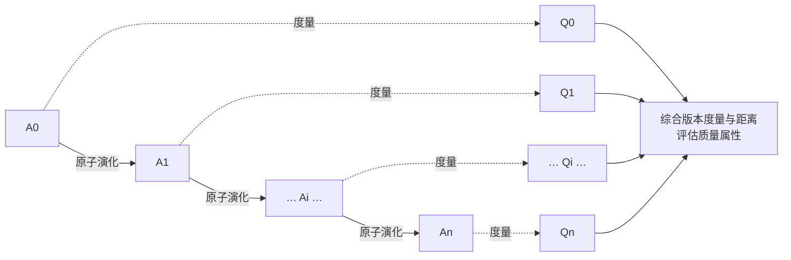

图中 `A0` 和 `An` 表示一次完整演化前后的相邻版本软件架构。可以将 `A0` 演化到 `An` 的过程拆分为一系列原子演化操作，一次完整的架构演化可以视为不同类型原子演化操作形成的序列。每经过一次原子演化，即可得到一个架构中间版本 `Ai(i=1,2,…,n-1)`，从而形成架构中间版本序列 `A0, A1, A2, …, An`。对每个中间版本架构进行度量，得到质量属性度量值 `Qi`，进而形成 `Q0, Q1, Q2, …, Qn` 序列。对于相邻版本 `Ai-1` 和 `Ai`，可以根据 `Qi-1` 和 `Qi` 计算架构质量属性距离 `D(i-1,i)`；完整演化前后 `A0` 和 `An` 的距离 `D(0,n)` 则由 `Q0` 和 `Qn` 计算。最后综合各版本架构的度量结果，对架构演化相关质量属性进行评估。

#### 2. 架构演化中间版本度量

对于不同类型质量属性，其度量方法不同，度量结果类型也不同。本章主要度量架构的可维护性和可靠性。其中：

- 对于可靠性，架构质量属性度量结果 `Qi` 是一个实数值。
- 对于可维护性，它包含圈复杂度、扇入扇出度、模块间耦合度、模块响应、紧内聚度、松内聚度等 6 个子度量指标，度量结果 `Qi` 是这 6 个指标形成的六元组 `(q1,q2,…,q6)`。

对于每一次原子粒度演化，我们可以明确该原子演化对架构内部逻辑结构或交互过程的影响；通过比较原子演化前后架构质量属性 `Qi-1` 和 `Qi` 的变化，可以分析该类演化对系统外部质量属性的影响，进而找出架构内部结构变化和外部质量属性变化之间的关联。

#### 3. 架构质量属性距离

架构质量属性距离 `D(i-1, i)` 用来评估相邻版本架构间质量属性差异。由于它直接依赖于架构质量属性度量值，所以对于不同质量属性，计算方式不同。

##### 1. 可维护性距离计算方法

可以将一次完整演化操作拆分成一系列原子演化操作。对于每次原子演化操作，度量演化前后架构 `A` 和 `B` 的可维护性指标向量 `(a1, a2, …, an)` 和 `(b1, b2, …, bn)`，求取两个向量归一化的笛卡儿距离：

```text
Dm(A, B) = √(((a1-b1)/(a1+b1))² + ((a2-b2)/(a2+b2))² + … + ((an-bn)/(an+bn))²)
```

计算值越大，表明两个架构在可维护性上的差距越大。

软件可能经过许多轮演化，其架构与原始架构会逐渐产生较大差距；某些实现也可能偏离原设计，从而出现不易察觉的质量问题。即使是相邻版本，也可能在某些质量属性上产生很大差距。因此，需要持续追踪和控制软件质量属性，把它们保持在适当区间，维持当前软件的正确性和可用性，并为后续演化提供良好的扩展性和适应性，使软件能够持续演化和重用。

##### 2. 可靠性距离计算方法

对于每次原子演化操作，度量演化前后架构 `A` 和 `B` 的可靠性度量值 `a` 和 `b`，则可靠性距离可表示为：

```text
Dr(A, B) = |(a-b)/(a+b)|
```

计算值越大，表明两个架构的可靠性差距越大。

需要注意，可靠性度量值是一个实数，表示软件的潜在风险率，它与架构物理组织结构(模块间逻辑依赖和调用等)没有必然因果关系。两个完全不同的软件架构相似度可能很低，但可靠性度量值可能相等；同一个软件演化后的相邻版本，也可能因不适当修改而导致可靠性大幅降低。因此，不能根据可靠性度量值反推出两个架构结构上的变化或差异。可靠性与软件运行过程中的逻辑交互复杂度相关，可靠性升高或降低体现的是交互场景的复杂化或简化。

##### 3. 非相邻版本的架构质量属性距离

当 `A` 和 `B` 为任意两个演化版本时，质量属性距离表示这两个版本在相关质量属性上的差异。对于可维护性和可靠性，质量属性差异与架构内部结构差异并没有正相关关系：两个完全不同的软件架构，其质量属性度量结果可能相近，导致距离很小，此时比较并没有实际意义。因此，质量属性距离应针对同一架构的不同演化版本进行度量，以监控架构演化过程，保障架构持续健康演化。

还要注意，在架构中间版本序列 `A0,A1,A2,…,An` 中，`D(0,n)` 并不等于 `D(0,1)、D(1,2)、D(2,3)…` 的简单叠加。原子演化操作所产生的架构质量属性影响不具有严格累加性，但相邻距离仍能帮助观察该次演化中每一步物理结构变化对整体的影响范围，并对关键模块风险控制和故障定位等产生积极作用。

#### 4. 架构演化评估

基于度量的架构演化评估方法，可以帮助我们完成以下工作：

1. 架构修改影响分析。为了归纳和说明架构演化规律，可以对演化进行分类，比较不同类型演化操作对相关质量属性的影响。把演化过程拆成粒度很细的原子演化操作序列后，可以具体分析架构内部逻辑结构和交互过程的修改会影响哪些外部质量属性，分析修改影响范围，并进一步研究架构版本距离与质量属性距离的关联。
2. 监控演化过程。通过度量架构演化过程中的中间版本，可以得到架构相关质量属性随时间推移的变化曲线。持续监控这些质量属性，有利于保持架构健康、持续地演化。
3. 分析关键演化过程。架构质量属性距离用于评估不同版本在质量属性上的差异。从距离曲线可以观察到架构质量发生较大改变的时刻；该时刻架构逻辑依赖或交互过程可能发生重大改变，在开发和维护过程中应予以重视，这有利于架构维护和故障定位。

### 10.5.2 演化过程未知的评估

当演化过程未知时，我们无法像演化过程已知时那样追踪架构在演化过程中的每一步变化，只能根据演化前后的度量结果逆向推测架构发生了哪些改变，并分析这些改变与架构相关质量属性的关联关系。

> 图 10-9 演化过程未知时的架构演化评估
>
> **结构化重绘示意（不是教材原图）：** 仅转录正文明确描述的逆向评估步骤。

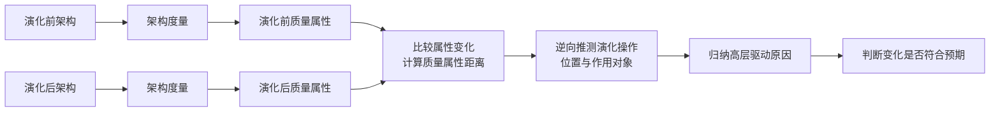

对于演化前后的相邻版本架构，可以利用基于度量的架构评估方法分别对它们进行度量，得到不同版本的度量结果，并根据结果差异计算它们之间的质量属性距离。通过分析架构演化前后质量属性变化以及质量属性距离，可以逆向推测出架构可能发生了哪些演化操作，以及这些演化操作发生的位置和作用对象。

进一步地，对于每一个演化操作，还可以找出其对架构相关质量属性的影响，并分析发生该演化操作的高层驱动原因，如修复代码错误、提高性能、平台移植等。最终，针对某个演化驱动原因得到一组演化操作，再分析这些操作产生的架构质量属性变化是否符合预期。例如，希望通过代码重构使架构更清晰、易维护和易扩展，而分析结果表明可维护性确有提高(圈复杂度减少、模块间耦合度降低等)，就说明这次演化完成了演化需求；否则说明演化没有解决架构原有问题，或者引入了新错误或质量问题，该次演化并不恰当，需要继续完善。

## 10.6 大型网站系统架构演化实例

大型网站的技术挑战主要来自庞大用户、高并发访问和海量数据。任何简单业务一旦需要处理海量数据并面对数以亿计用户，问题都会变得棘手。通常大型网站架构主要解决这类问题。

> **本节图形校对范围：** 图 10-10～图 10-19 均依据用户本地官方教程第 2 版 PDF 物理页 365～372(印刷页 355～362)逐图核对。以下 Mermaid 保留各阶段截至当时的累计组件、部署分组和主要连接关系，不只展示新增部分；节点位置、框体叠放、UML 图符和原版线条样式未复制，因此仍是结构化重绘而不是教材原图。

### 10.6.1 第一阶段：单体架构

大型网站都是从小型网站发展而来，网站架构也是一样，是从小型网站架构逐步演化而来。小型网站最开始没有太多人访问，只需要一台服务器就绰绰有余，这时应用程序、数据库、文件等所有资源都在同一台服务器上。

> 图 10-10 第一阶段网站架构
>
> **结构化重绘示意（不是教材原图）：** 根据 PDF 物理页 365 转录单台应用服务器内部的应用程序、文件和数据库三类资源及其访问关系。

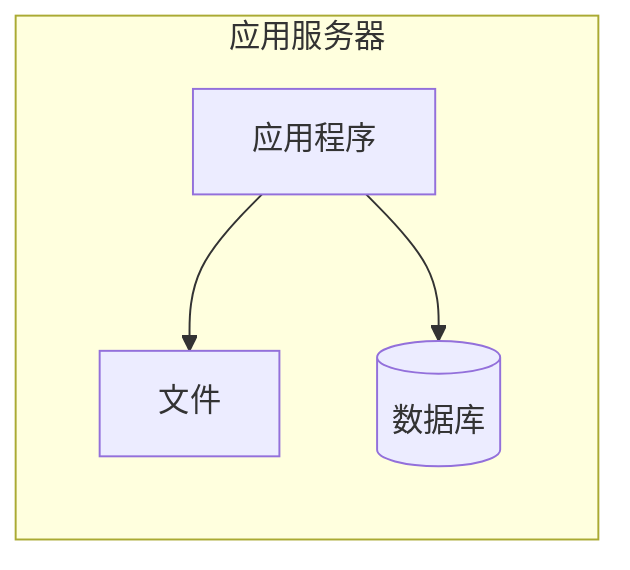

### 10.6.2 第二阶段：垂直架构

随着网站业务发展，一台服务器逐渐不能满足需求，越来越多的用户访问导致性能越来越差，越来越多的数据导致存储空间不足，这时就需要将应用和数据分离。应用和数据分离后，整个网站通常使用 3 台服务器：应用服务器、文件服务器和数据库服务器。

三类服务器对硬件资源要求不同：

- 应用服务器需要处理大量业务逻辑，因此需要更快更强大的处理器。
- 数据库服务器需要快速磁盘检索和数据缓存，因此需要更快磁盘和更大内存。
- 文件服务器需要存储大量用户上传文件，因此需要更大容量硬盘。

应用与数据分离后，不同特性的服务器承担不同服务角色，网站的并发处理能力和数据存储空间得到很大改善，能够支持网站进一步发展。但随着用户继续增多，数据库压力会因访问延迟而影响整个网站性能，用户体验随之下降，网站架构还需要进一步优化。

> 图 10-11 第二阶段网站架构
>
> **结构化重绘示意（不是教材原图）：** 根据 PDF 物理页 365 转录应用服务器、文件服务器和数据库服务器分离后的完整部署关系。

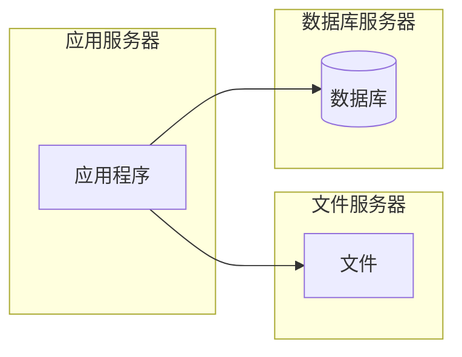

### 10.6.3 第三阶段：使用缓存改善网站性能

网站访问的特点和现实世界财富分配一样遵循二八定律：80% 的业务访问集中在 20% 的数据上。因此，如果把这一小部分热点数据缓存在内存中，就可以减少数据库访问压力，提高整个网站的数据访问速度，并改善数据库写入性能。

网站缓存可以分为两种：

- 缓存在应用服务器上的本地缓存。
- 缓存在专门分布式缓存服务器上的远程缓存。

本地缓存访问速度更快，但受应用服务器内存限制，缓存数据量有限，而且会与应用程序竞争内存。远程分布式缓存可以采用集群方式，部署大内存服务器作为专门缓存服务器，理论上能够提供不受单机容量限制的缓存服务。

使用缓存后，数据库访问压力得到有效缓解，但单一应用服务器能够处理的请求连接有限；在网站访问高峰期，应用服务器会成为整个网站的新瓶颈。

> 图 10-12 第三阶段网站架构
>
> **结构化重绘示意（不是教材原图）：** 根据 PDF 物理页 366 转录应用服务器内的应用程序和本地缓存、分布式缓存服务器集群、文件服务器及数据库服务器的累计关系。

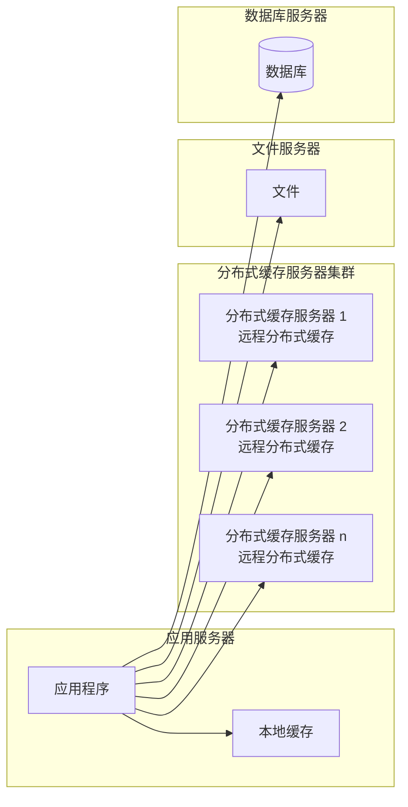

### 10.6.4 第四阶段：使用服务集群改善并发处理能力

使用集群是网站解决高并发、海量数据问题的常用手段。当一台服务器处理能力不足时，更恰当的做法不是一味更换更强大服务器，而是增加服务器来分担访问及存储压力。只要能通过增加一台服务器来改善负载压力，就可以用相同方式持续扩展，从而实现系统可伸缩性。

通过负载均衡调度服务器，可以把来自用户浏览器的访问请求分发到应用服务器集群中的任意一台服务器上。应用服务器数量增加后，单台应用服务器的负载不再成为整个网站的瓶颈，应用服务器集群也成为网站可伸缩架构设计中较为简单、成熟的一种实现。

> 图 10-13 第四阶段网站架构
>
> **结构化重绘示意（不是教材原图）：** 根据 PDF 物理页 366 完整转录负载均衡调度服务器、应用服务器集群(每台均含应用程序和本地缓存)、分布式缓存集群、文件服务器和数据库服务器；这是截至第四阶段的累计架构，不是单纯的“增加服务器”增量图。

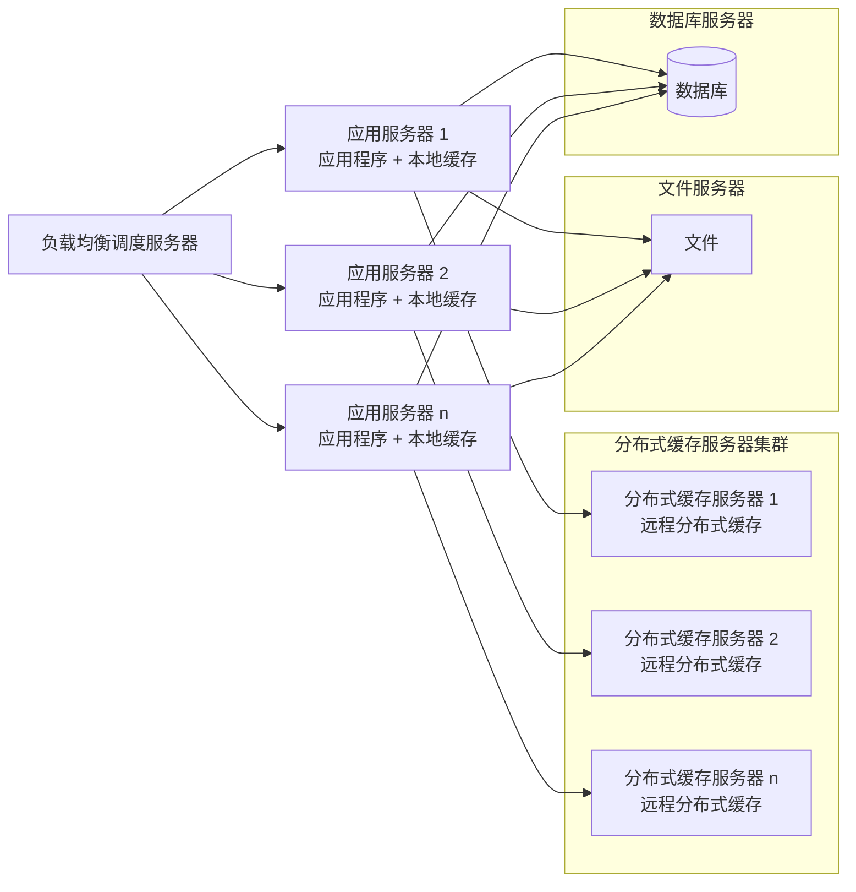

### 10.6.5 第五阶段：数据库读写分离

网站在使用缓存后，大部分读操作可不经过数据库完成，但仍有一部分读操作和全部写操作需要访问数据库。当用户达到一定规模后，数据库会因负载压力过高而成为瓶颈。于是利用数据库主从热备功能，实现数据库读写分离。

应用服务器在写数据时访问主数据库；主数据库通过主从复制机制将数据同步到从数据库；而应用服务器读数据时则访问从数据库。为了便于应用程序访问读写分离后的数据库，通常在应用服务器端使用专门的数据访问模块，使读写分离对应用透明。

> 图 10-14 第五阶段网站架构
>
> **结构化重绘示意（不是教材原图）：** 根据 PDF 物理页 367 转录截至第五阶段的完整架构：负载均衡、带本地缓存和数据访问模块的应用服务器集群、分布式缓存、文件服务器，以及主库写入、从库读取和主从复制关系。

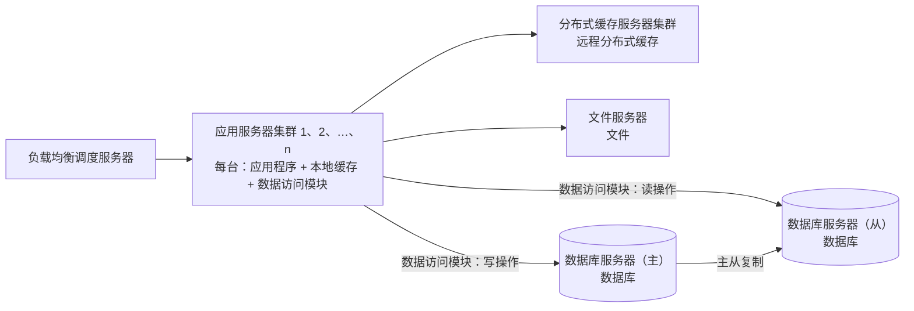

### 10.6.6 第六阶段：使用反向代理和 CDN 加速网站响应

随着用户规模增大，不同地区用户的网络环境差异使访问速度差别明显。为了提升用户体验，需要加速网站访问速度。主要手段有使用 `CDN` 和反向代理。

- `CDN` 部署在网络提供商机房，使用户从距离自己最近的节点获取数据。
- 反向代理部署在网站中心机房，请求先访问反向代理服务器，如果缓存中已有资源，则直接返回给用户。

二者本质上都是“尽早返回数据给用户”，既加快访问速度，也减轻后端服务器压力。

> 图 10-15 第六阶段网站架构
>
> **结构化重绘示意（不是教材原图）：** 根据 PDF 物理页 368 转录 CDN、反向代理、负载均衡、应用集群、缓存、文件和主从数据库组成的累计架构；CDN 与反向代理位于负载均衡之前。

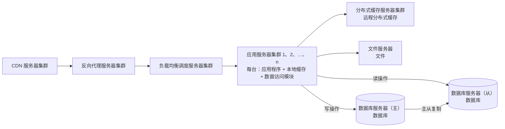

### 10.6.7 第七阶段：使用分布式文件系统和分布式数据库系统

任何单一强大服务器都无法满足大型网站持续增长的业务需求。数据库经过读写分离后，从一台服务器拆成两台服务器，但随着业务发展仍然不够，这时就需要使用分布式数据库。文件系统也一样，需要使用分布式文件系统。

分布式数据库是网站数据库拆分的最后手段，通常只在单表数据规模非常庞大时使用。不到万不得已时，网站更常用的数据库拆分方式是业务分库，把不同业务的数据部署在不同物理服务器上。

> 图 10-16 第七阶段网站架构
>
> **结构化重绘示意（不是教材原图）：** 根据 PDF 物理页 369 转录 CDN、反向代理、负载均衡、应用集群及其统一数据访问模块，并把后端完整展开为分布式缓存、分布式文件和分布式数据库集群。

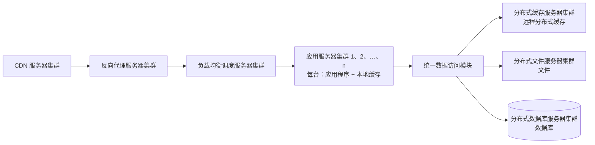

### 10.6.8 第八阶段：使用 NoSQL 和搜索引擎

随着网站业务越来越复杂，对数据存储和检索的需求也越来越复杂，网站需要采用一些非关系数据库技术如 `NoSQL`，以及非数据库查询技术如搜索引擎。`NoSQL` 和搜索引擎都源自互联网技术栈，对可伸缩的分布式特性具有更好支持。应用服务器则通过统一数据访问模块访问各种数据，减轻应用程序管理诸多数据源的负担。

> 图 10-17 第八阶段网站架构
>
> **结构化重绘示意（不是教材原图）：** 根据 PDF 物理页 370 在第七阶段累计架构上补入搜索引擎与 NoSQL，并保留统一数据访问模块对全部后端数据源的屏蔽关系。

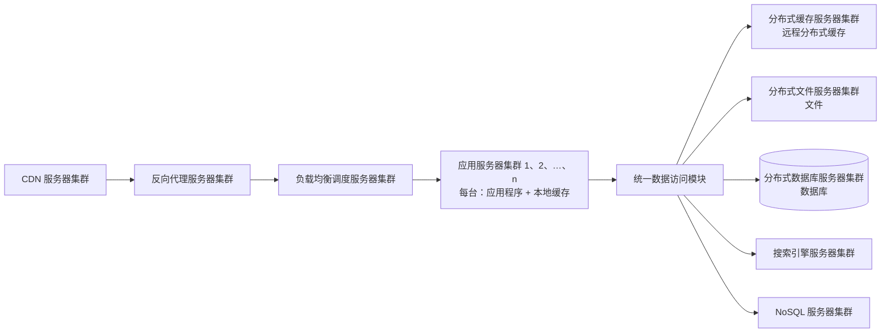

### 10.6.9 第九阶段：业务拆分

大型网站为了应对日益复杂的业务场景，通过分而治之手段将整个网站业务拆分为不同产品线。例如大型购物网站会将首页、商铺、订单、买家、卖家等拆分成不同产品线，分归不同业务团队负责。

在技术上，也会根据产品线划分，将一个网站拆成多个不同应用，每个应用独立部署。应用之间可以通过超链接建立关系，也可以通过消息队列进行数据分发，还可以通过访问同一数据存储系统构成一个关联的完整系统。

> 图 10-18 第九阶段网站架构
>
> **结构化重绘示意（不是教材原图）：** 根据 PDF 物理页 371 转录产品线拆分后的 A、B 两组应用、消息队列和既有完整技术底座。超链接属于正文说明但未在原图中单列节点，故保留在正文，不额外伪造图内连线。

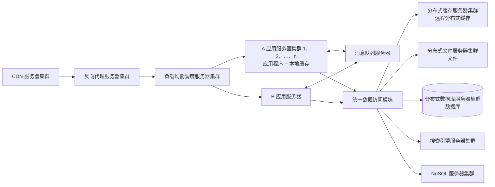

### 10.6.10 第十阶段：分布式服务

随着业务拆分越来越细，存储系统越来越庞大，应用系统整体复杂度呈指数级增加，部署维护越来越困难。既然每一个应用系统都需要执行许多相同业务操作，比如用户管理、商品管理等，那么可以将这些共用业务提取出来，独立部署。由这些可复用业务连接数据库，提供共用业务服务，而应用系统只负责用户界面，通过分布式服务调用共用业务服务完成具体业务操作。

> 图 10-19 第十阶段网站架构
>
> **结构化重绘示意（不是教材原图）：** 根据 PDF 物理页 372 转录 A、B 应用、消息队列、分布式服务集群及既有缓存、文件、数据库、搜索和 NoSQL 底座。应用侧保留用户界面，复用业务进入分布式服务层，并由服务层统一访问数据资源。

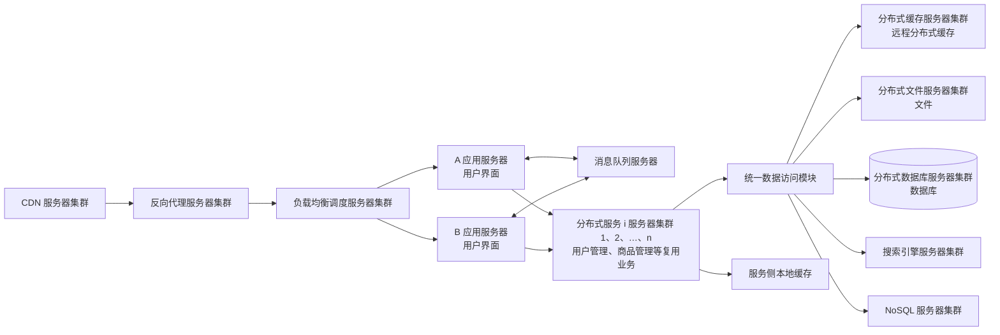

大型网站的架构演化到这里，基本上大多数技术问题都得以解决。跨数据中心的数据同步和具体业务相关的问题，则可以通过在现有技术架构上进行组合和改进来解决。

## 10.7 软件架构维护

软件架构是软件开发和维护过程中的一个重点制品，是软件需求和设计、实现之间的桥梁。软件架构开发和维护是基于架构的软件生命周期中的关键环节，与之相关的步骤包括导出架构需求、架构开发、架构文档化、架构分析、架构实现和架构维护。软件架构维护与演化密不可分，维护需要对软件架构演化过程进行追踪和控制，以保障软件架构演化过程能够满足需求；也有观点把架构维护视为架构演化的一部分。

由于软件架构维护过程一般涉及架构知识管理、架构修改管理和架构版本管理等内容，下面分别对它们进行简要介绍。

### 10.7.1 软件架构知识管理

软件架构知识管理，是对架构设计中隐含的决策来源进行文档化表示，进而在架构维护过程中帮助维护人员对架构修改进行更完善考虑，并能够为其他软件架构相关活动提供参考。

#### 1. 架构知识的定义

Lago 等人给出的定义是：

```text
架构知识 = 架构设计 + 架构设计决策
```

也就是说，不仅要说明采用了什么架构，还要说明为什么采用这种架构。

#### 2. 架构知识管理的含义

架构知识管理侧重于软件开发和实现过程所涉及的架构静态演化，从架构文档等信息来源中捕捉架构知识，进而提供架构质量属性及其设计依据以进行记录和评价。它不仅要涵盖架构解决方案，也要涵盖产生该方案的架构设计决策、设计依据与其他信息，以有助于架构进一步演化。

#### 3. 架构知识管理的需求

许多人认为，架构知识的可获得性能够极大提升软件开发流程。如果对架构知识不进行管理，那么关键设计知识就会“沉没”在软件架构之中；如果开发组人员发生变动，那么“沉没”的架构知识就会“腐蚀”。

#### 4. 架构知识管理的现状

当前对软件架构知识的讨论，侧重于对架构信息的整理、存储和恢复。尽管如此，尚无实用的架构知识整理策略。构建架构的利益相关者通常不会主动使用文档记录架构知识，原因包括：

- 文档化和维护的动机不足，收益看起来不够显著而成本较高。
- 利益相关者对工程短期收益的兴趣，往往大于对长远架构知识重用的兴趣。
- 开发者更容易被设计中的创造性工作吸引，而较少反思设计决策的长期影响。
- 缺乏相应培训。

更为严重的是，即使实现了文档化，架构知识通常也不能在整个组织中得到充分共享。例如，架构知识没有传播给合适的利益相关者；接收者没有将之应用到任务中；知识本身笨重，难以快速搜索与定位。

### 10.7.2 软件架构修改管理

在软件架构修改管理中，一个主要做法是建立一个隔离区域(`Region of Quiescence`)，保障该区域中任何修改对其他部分影响比较小，甚至没有影响。为此，需要明确修改规则、修改类型，以及可能的影响范围和副作用等。

### 10.7.3 软件架构版本管理

软件架构版本管理为软件架构演化中的版本控制、使用和评价等提供可靠依据，并为架构演化量化度量奠定基础。

例如，王映辉等人在描述软件架构组件-连接件模型的基础上，针对软件架构静态演化建立了邻接矩阵和可达矩阵，凭借矩阵变换与运算对静态演化中的波及效应进行了深入分析和量化界定，同时给出了组件在架构中贡献大小相对量的计算方法。针对动态演化，又给出了动态语义网络模型，分析动态语义网络中基于不动点的浸润过程收敛的判定依据，提出邻接矩阵原子过滤概念，指出架构动态演化过程可以用一系列邻接矩阵来描述，并给出了在两个层面上分析架构演化波及效应的框架。

### 10.7.4 软件架构可维护性度量实践

架构可维护性评估针对架构组件图进行度量，评估高层次上的架构复杂程度。待评估的 `Web` 读写系统组件图如下。将该图导出为 `XML` 文件并输入架构评估系统 `MSAES`，解析可维护性度量所需数据，再根据可维护性的 6 个子度量指标公式进行计算。

> 图 10-20 Web 读写程序组件图
>
> **结构化重绘示意（不是教材原图）：** 下图按官方 PDF 物理页 374 转录组件边界、两个端口、`provided/required` 接口、两条 `delegate` 委托和全部虚线依赖。为避免 Mermaid 图符歧义，实线统一按“使用方 `required`（R）→ 提供方 `provided`（W）”绘制，虚线按“依赖出边 E → 依赖入边 X”绘制；三处组件名均忠实保留原图字样 `User`，只用位置后缀区分。

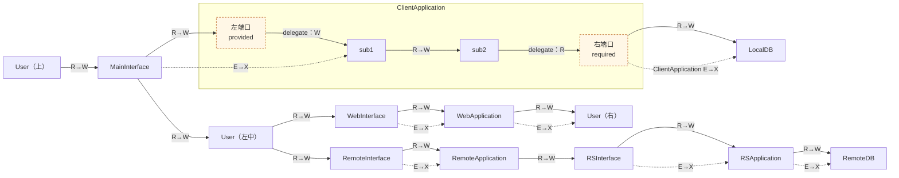

接口装配与端口委托逐项核对如下。箭头仅是上述 `R→W` 记法，不表示 UML 依赖。

| 使用方（required） | 提供方（provided） | 端口或委托 |
| --- | --- | --- |
| `User（上）` | `MainInterface` | 无 |
| `MainInterface` | `User（左中）` | 无 |
| `MainInterface` | `ClientApplication` / `sub1` | 复合组件左端口提供接口；左端口 `delegate` 到 `sub1` 的提供接口 |
| `sub1` | `sub2` | `ClientApplication` 内部装配；只有接口关系，没有依赖关系 |
| `sub2` / `ClientApplication` | `LocalDB` | `sub2` 的使用接口 `delegate` 到复合组件右端口，再同 `LocalDB` 的提供接口装配 |
| `User（左中）` | `WebInterface` | 无 |
| `WebInterface` | `WebApplication` | 无 |
| `WebApplication` | `User（右）` | 无 |
| `User（左中）` | `RemoteInterface` | 无 |
| `RemoteInterface` | `RemoteApplication` | 无 |
| `RemoteApplication` | `RSInterface` | 无 |
| `RSInterface` | `RSApplication` | 无 |
| `RSApplication` | `RemoteDB` | 无 |

虚线依赖同表 10-3 的 `E/X` 对照如下。

| 依赖出端（E） | 依赖入端（X） | 表 10-3 对照 |
| --- | --- | --- |
| `MainInterface` | `sub1` | `MainInterface.E=1`，`sub1.X=1` |
| `ClientApplication` | `LocalDB` | `ClientApplication.E=1`，`LocalDB.X=1` |
| `WebInterface` | `WebApplication` | `WebInterface.E=1`，`WebApplication.X=1` |
| `WebApplication` | `User（右）` | 图中箭头明确；教材表 10-3 的单一 `User` 行为 `X=0`，属于下述版本差异 |
| `RemoteInterface` | `RemoteApplication` | `RemoteInterface.E=1`，`RemoteApplication.X=1` |
| `RSInterface` | `RSApplication` | `RSInterface.E=1`，`RSApplication.X=1` |
| `RSApplication` | `RemoteDB` | `RSApplication.E=1`，`RemoteDB.X=1` |

除三处同名字样 `User` 外，图中接口方向与表 10-3 的 `R/W` 完全相合：`sub1`、`sub2`、`RemoteApplication`、`RSInterface`、`RSApplication`、`WebInterface`、`WebApplication` 均为 `R=1,W=1`，`RemoteDB`、`LocalDB` 为 `R=0,W=1`，`ClientApplication` 为 `R=1,W=1`，`MainInterface` 为 `R=2,W=1`。`sub1` 与 `sub2` 之间没有虚线依赖，亦与正文所述 $2\times2$ 零邻接矩阵一致。

> **图形校对来源与版本边界：** 图形以用户本地官方教程 PDF 物理页 374（印刷页 364）为准，源文件 SHA-256 为 `ee45900f4622d71539980cfe1bddbcd898fba97ca13ada6df1cbdc215135c2f8`，核对日期 `2026-07-12`。该页把上方、左中、右侧三个外部组件都印作 `User`；物理页 374～375 的表 10-3 只列一个 `User(R=1,W=0)`，而物理页 376 的表 10-4 及同源公开专利 [CN105893257A](https://patents.google.com/patent/CN105893257A/zh)使用 `User`、`Browser`、`DB` 三个名称。按图符签名把左中、右侧节点分别对应到 `Browser`、`DB` 可以消除计数矛盾，但这属于跨版本对齐推断，故本图不据此改写教材页上的 `User` 字样。

将该图导出为 `XML` 文件并输入架构评估系统 `MSAES`，解析出可维护性度量所需数据，根据可维护性的 6 个子度量指标计算。总体元数据如下。

| 组件图 | `L` | `totalE` | `totalN` |
|---|---:|---:|---:|
| Web 读写程序组件图 | 1 | 19 | 13 |

其中，`L` 为组件图数目，`totalN` 为外部组件数，`totalE` 为外部组件相连边数；二者均不包括组件内部的子组件和子组件之间的连接边。表 10-3 中，`S` 为内部组件数，`E` 为依赖出边数，`X` 为依赖入边数，`R` 为使用接口数，`W` 为提供接口数。

**表 10-3 Web 读写程序组件图解析数据**

| 组件 | `S` | `E` | `X` | `R` | `W` |
|---|---:|---:|---:|---:|---:|
| `sub2` | 0 | 0 | 0 | 1 | 1 |
| `sub1` | 0 | 0 | 1 | 1 | 1 |
| `RemoteDB` | 0 | 0 | 1 | 0 | 1 |
| `RSApplication` | 0 | 1 | 1 | 1 | 1 |
| `RSInterface` | 0 | 1 | 0 | 1 | 1 |
| `RemoteApplication` | 0 | 0 | 1 | 1 | 1 |
| `RemoteInterface` | 0 | 1 | 0 | 1 | 1 |
| `WebApplication` | 0 | 1 | 1 | 1 | 1 |
| `WebInterface` | 0 | 1 | 0 | 1 | 1 |
| `LocalDB` | 0 | 0 | 1 | 0 | 1 |
| `ClientApplication` | 2 | 1 | 0 | 1 | 1 |
| `MainInterface` | 0 | 1 | 0 | 2 | 1 |
| `User` | 0 | 0 | 0 | 1 | 0 |

> **页内边界（表 10-3）：** 上表严格转录官方 PDF 物理页 374～375，因此不从后续表 10-4 或公开专利倒填 `Browser`、`DB` 两行。`totalN=13` 与图中 13 个外部组件图符一致，其中三处图符同名为 `User`；表 10-3 只给出一个 `User` 行，是教材源内保留的命名/聚合不一致。

其中，组件 `ClientApplication` 具有 `sub1`、`sub2` 两个子组件，因此需要获取其内部组件依赖关系形成的邻接矩阵来度量该模块内聚度。二者之间只有接口关系，没有依赖关系，邻接矩阵是一个 $2\times2$ 的零矩阵。

根据可维护性 6 个子度量指标的公式，可以利用解析得到的架构评估数据分别度量。其中，圈复杂度(`CCN`)度量整个架构独立执行路径的条数，该值就是待评估架构的最终度量结果；扇入扇出度(`FFC`)、模块间耦合度(`CBO`)、模块响应(`RFC`)、紧内聚度(`TCC`)和松内聚度(`LCC`)则针对每个组件度量，待评估架构的最终结果取所有外部组件结果的平均值。

以 `ClientApplication` 为例，相关计算如下：

$$CCN=(totalE-totalN)+2L=(19-13)+2\times1=8$$

$$FFC=CCN\times((E+W)\times(X+R))^2=8\times((1+1)\times(0+1))^2=32$$

$$CBO=\frac{E+X+W+R}{totalN}=\frac{1+0+1+1}{13}=0.231$$

$$RFC=S+E+R=2+1+1=4$$

$$TCC=\frac{E+X+W+R}{P(S)}=\frac{1+0+1+1}{2\times(2-1)/2}=3$$

$$LCC=\frac{E+X+W+R+NIC(S)}{P(S)}=\frac{1+0+1+1+0}{P(S)}=TCC=3$$

除 `ClientApplication` 外，其余外部组件都没有子组件，$P(S)=0$，因而 `TCC` 和 `LCC` 的分母为 0，无法计算该组件的模块内聚度，记为“不适用(`not applied`)”。教材在此把没有子组件的组件视为内聚度最小。各外部组件及最终平均值见表 10-4。

**表 10-4 Web 读写系统可维护性度量结果**

| 组件 | `FFC` | `RFC` | `CBO` | `LCC` | `TCC` |
|---|---:|---:|---:|---:|---:|
| `RSInterface` | 32 | 2 | 0.231 | 不适用 | 不适用 |
| `RemoteApplication` | 32 | 1 | 0.231 | 不适用 | 不适用 |
| `RemoteInterface` | 32 | 2 | 0.231 | 不适用 | 不适用 |
| `RemoteDB` | 8 | 0 | 0.154 | 不适用 | 不适用 |
| `LocalDB` | 8 | 0 | 0.154 | 不适用 | 不适用 |
| `RSApplication` | 128 | 2 | 0.308 | 不适用 | 不适用 |
| `ClientApplication` | 32 | 4 | 0.231 | 3 | 3 |
| `WebApplication` | 128 | 2 | 0.308 | 不适用 | 不适用 |
| `WebInterface` | 32 | 2 | 0.231 | 不适用 | 不适用 |
| `MainInterface` | 128 | 3 | 0.308 | 不适用 | 不适用 |
| `User` | 0 | 1 | 0.077 | 不适用 | 不适用 |
| `DB` | 8 | 0 | 0.154 | 不适用 | 不适用 |
| `Browser` | 32 | 2 | 0.231 | 不适用 | 不适用 |
| **最终结果** | **46.154** | **1.615** | **0.219** | **3** | **3** |

整个架构的 `CCN` 最终结果为 8。

> **表格校对来源与版本边界：** 表 10-3 以用户本地官方教程 PDF 物理页 374～375 为直接转录依据；表 10-4 以物理页 376 为直接依据，并用同源公开专利 [CN105893257A《一种基于演化的软件架构评估方法》](https://patents.google.com/patent/CN105893257A/zh)说明书第 4～6 页校核跨页错栏和算术。教材自身在表 10-3 与表 10-4 之间存在 `User` 对 `User/Browser/DB` 的命名版本差异，两表按各自页面保留，不合并为一个“修正版”。
>
> **卷内算术校核：** 用户本地官方教程 PDF 物理页 376 的表 10-4 把 `RemoteInterface` 的 `RFC` 印为 `1`，但表 10-3 对应数据为 `S=0、E=1、R=1`，按同页公式 `RFC=S+E+R` 应得 `2`；表中最终平均值 `1.615=21/13` 也只有取 `2` 才能成立。故本表保留经公式、最终平均值和同源专利三重校核的 `2`，并把教材表内这一处不一致显式隔离，不静默冒充逐字转录。

根据表 10-4 的度量结果，可以分别分析架构可维护性的 6 个度量指标。图 10-21～图 10-23 给出各组件的 `FFC`、`CBO`、`RFC` 结果，并按照数值从高到低排列。

1. 圈复杂度(`CCN`)。组件图中的组件是独立的，每个组件代表一个系统或子系统中的封装单位，封装完整的事务处理行为；组件图通过组件间控制依赖关系体现系统组成结构。对组件图进行圈复杂度度量，可以初步评估整个系统的复杂程度，在设计早期发现问题并作出调整，还可以预测待评估系统的测试复杂度，及早规避风险、提高软件质量。圈复杂度高的程序往往更容易出现错误，实践中通常以 `CCN ≤ 10` 为宜。
2. 扇入扇出度(`FFC`)。扇入是直接调用该模块的上级模块个数，扇出是该模块直接调用的下级模块个数。本例用扇入扇出度综合评估组件主动调用以及被调用的频率。数值越大，说明组件与其他组件之间的接口关联或依赖关联越多。`RSApplication`、`WebApplication` 和 `MainInterface` 的关联关系最多，`FFC` 最大；`User`、`DB` 等组件关联较少，`FFC` 也较小，这验证了度量模型与结果的一致性。

> 图 10-21 Web 读写系统各模块 `FFC` 度量结果
>
> **结构化转录（不是教材原图）：** 原图为表 10-4 中 `FFC` 列的柱状呈现。各柱“模块：数值”依次为：`RSInterface: 32`、`RemoteApplication: 32`、`RemoteInterface: 32`、`RemoteDB: 8`、`LocalDB: 8`、`RSApplication: 128`、`ClientApplication: 32`、`WebApplication: 128`、`WebInterface: 32`、`MainInterface: 128`、`User: 0`、`DB: 8`、`Browser: 32`；系统平均值为 `46.154`。

3. 模块间耦合度(`CBO`)度量模块与其他模块交互的频繁程度。`CBO` 越大的模块，越容易受到其他模块中修改和错误的影响，因而可维护性越差、风险越高。一般来说，组件与其他组件的依赖关系及接口越多，耦合度越大。`RSApplication`、`WebApplication` 等关联关系较多的组件，其 `CBO` 较大；反之，`User`、`DB` 等关联较少的组件，其 `CBO` 也较小。

> 图 10-22 Web 读写系统各模块 `CBO` 度量结果
>
> **结构化转录（不是教材原图）：** 原图为表 10-4 中 `CBO` 列的柱状呈现。各柱“模块：数值”依次为：`RSInterface: 0.231`、`RemoteApplication: 0.231`、`RemoteInterface: 0.231`、`RemoteDB: 0.154`、`LocalDB: 0.154`、`RSApplication: 0.308`、`ClientApplication: 0.231`、`WebApplication: 0.308`、`WebInterface: 0.231`、`MainInterface: 0.308`、`User: 0.077`、`DB: 0.154`、`Browser: 0.231`；系统平均值为 `0.219`。

4. 模块响应(`RFC`)度量组件执行所需功能的数量，包括接口提供的功能、依赖的其他模块提供的功能，以及子模块提供的功能。从图 10-20 和图 10-23 可以看到，`ClientApplication` 包含子模块，`MainInterface` 对其他组件的依赖较多，因此二者的 `RFC` 较大；`DB`、`RemoteDB`、`LocalDB` 等组件没有对其他模块的依赖和调用，也不包含子模块，因此 `RFC` 为 0。

> 图 10-23 Web 读写系统各模块 `RFC` 度量结果
>
> **结构化转录（不是教材原图）：** 原图为表 10-4 中 `RFC` 列的柱状呈现。各柱“模块：数值”依次为：`RSInterface: 2`、`RemoteApplication: 1`、`RemoteInterface: 2`、`RemoteDB: 0`、`LocalDB: 0`、`RSApplication: 2`、`ClientApplication: 4`、`WebApplication: 2`、`WebInterface: 2`、`MainInterface: 3`、`User: 1`、`DB: 0`、`Browser: 2`；系统平均值为 `1.615`。

5. 模块间内聚度 `TCC` 和 `LCC`。由于只有 `ClientApplication` 具有子模块，因此只对该组件进行度量，并将其度量值作为待评估系统的最终结果。好的架构设计应遵循“高内聚、低耦合”原则，提高模块独立性，降低模块间接口调用复杂度。
