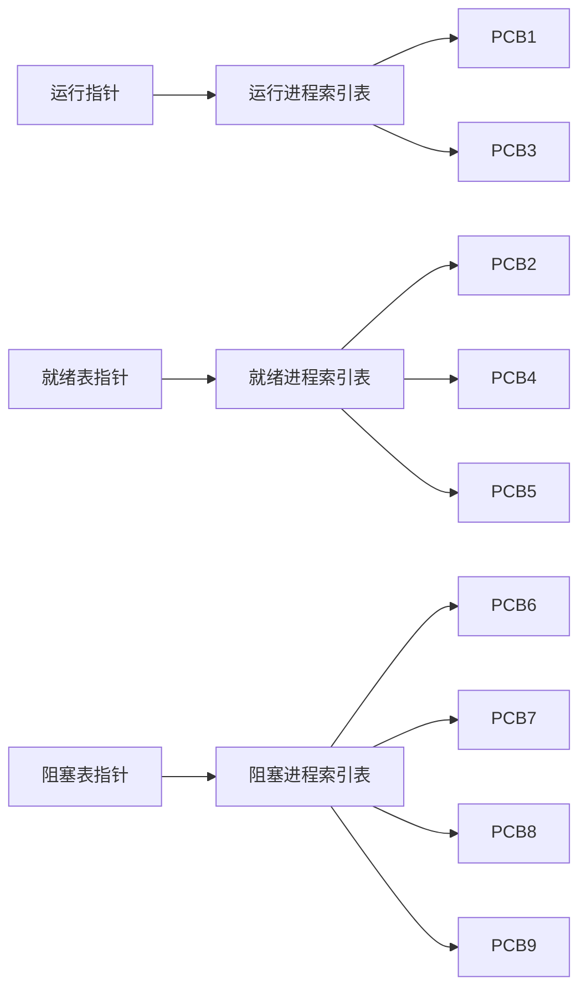

# 2018年下半年-系统架构设计师-综合知识

> **来源层级：** 主体来自本地原始整理版（`02.历年真题/2018年下半年-系统架构设计师-综合知识.md`），按待复核的非官方第三方整理资料处理。
>
> **图表恢复来源（非官方）：** [Altria1979/System_Architect 固定提交中的 2018 综合知识 PDF](<https://github.com/Altria1979/System_Architect/blob/472e0e3fc3860aa1dffcac9f1d278a943ea5eb59/%E7%9C%9F%E9%A2%98%20%28%E9%87%8D%E7%82%B9%29/%E5%8E%86%E5%B9%B4%E7%9C%9F%E9%A2%98%E5%8F%8A%E8%A7%A3%E6%9E%90/2018%E5%B9%B4/2018%E5%B9%B4%E7%B3%BB%E7%BB%9F%E6%9E%B6%E6%9E%84%E5%B8%88%E8%80%83%E8%AF%95%E7%A7%91%E7%9B%AE%E4%B8%80%EF%BC%9A%E7%BB%BC%E5%90%88%E7%9F%A5%E8%AF%86.pdf>)共 17 页，固定 Git blob 为 `1101b781005b878294577ae9a2fee6a060dfabba`，访问日期：2026-07-11；本地核对文件 SHA-256 为 `2987751ab5bde8d9e3645c0aa2c35807b747fddc585c389793321be48da40108`。该资料不是考试主管机构发布的官方原卷，且其中第三方试题内容的再分发许可未单独确认；本稿只结构化转录表格单元格、公式、节点和连线，不复制扫描页或原图版式。
>
> **答案性质：** 文中的“正确答案”和解析均为非官方整理，未获考试主管机构确认。
>
> **清洗状态：** 已完成结构清洗、题号与答案数量核验；第 2、3、5、6、7、69 题的缺失图表或公式已按固定 PDF 结构化转录，第 70 题缺失的解题图信息也已补为结构化文字。所有重绘或转录均不是原卷图。
>
> 题目数量：75（题号 1—75 连续；每题保留 A—D 四个选项和一个现有答案）。
>
> **已知限制：** 未与官方纸质试卷逐题核验。第 1 题本地版本的原表仍未收录；固定 PDF 所载版本的起始柱面、选项及解析序列均与本地版本冲突，故仅隔离转录、未合并或自动裁决。全文现有答案与解析仍应按“待复核”处理。

---

## 第1题

在磁盘调度管理中，应先进行移臂调度，再进行旋转调度。假设磁盘移动臂位于20号柱面上，进程的请求序列如下表所示。如果采用最短移臂调度算法，那么系统的响应序列应为（ ）。

> **图表状态：** 本地整理版所对应的原表仍未收录。固定 PDF 第 1 页是另一版本（移动臂位于 21 号柱面，而非本题的 20 号柱面），不能用来补写本题缺表。

> **固定 PDF 对照版本（结构化转录，不是原图；来源非官方）：** 下表与其后选项只用于记录版本冲突，不替换上方本地题面。

| 请求序列 | 柱面号 | 磁头号 | 扇区号 |
| --- | ---: | ---: | ---: |
| ① | 17 | 8 | 9 |
| ② | 23 | 6 | 3 |
| ③ | 23 | 9 | 6 |
| ④ | 32 | 10 | 5 |
| ⑤ | 17 | 8 | 4 |
| ⑥ | 32 | 3 | 10 |
| ⑦ | 17 | 7 | 9 |
| ⑧ | 23 | 10 | 4 |
| ⑨ | 38 | 10 | 8 |

- **固定 PDF A.** ②⑧③④⑤①⑦⑥⑨
- **固定 PDF B.** ②③⑧④⑥⑨①⑤⑦
- **固定 PDF C.** ①②③④⑤⑥⑦⑧⑨
- **固定 PDF D.** ②⑧③⑤⑦①④⑥⑨

> **冲突处置：** 固定 PDF 的现有解析给出柱面次序 23→17→32→38，最终序列对应其选项 D；本地版本给出 20→21→22→18→16，并将答案整理为 C。两版题面与选项并不相同，此处保留两组记录，不据此判定哪一组为官方版本。

- **A.** ②⑧③④⑤①⑦⑥⑨
- **B.** ②③⑧④⑥⑨①⑤⑦
- **C.** ④⑥⑨⑤⑦①②⑧③
- **D.** ④⑥⑨⑤⑦①②③⑧

**正确答案：C**

**解析：**

当进程请求读磁盘时，操作系统先进行移臂调度，再进行旋转调度。由于移动臂位于20号柱面上，按照最短寻道时间优先的响应柱面序列为20->21->22->18->16。进程在21号柱面上的请求序列有④⑥。进程在22号柱面上的请求序列有⑨。进程在18号柱面上的请求序列有⑤⑦①。进程在16号柱面上的请求序列有②③⑧。然后再根据扇区号从小到大，在21号柱面上的请求序列应该先读④（5号扇区），再是⑥（10号扇区），在18号柱面上的请求序列应该先读⑤（4号扇区），再是⑦和①（6号扇区），进程在16号柱面上的请求序列先读②（3号扇区），再是⑧（4号扇区），最后是③（6号扇区），所以系统的响应序列应为④⑥⑨⑤⑦①②⑧③，答案选择C选项。

---

## 第2题

某计算机系统中的进程管理采用三态模型，那么下图所示的PCB（进程控制块）的组织方式采用（ ），图中（ ）。

> **结构化重绘示意（不是原图；来源非官方）：** 根据固定 PDF 第 1 页逐线转录 PCB 的状态归属；节点布局和索引槽样式未复制。

- **A.** 顺序方式
- **B.** 链接方式
- **C.** 索引方式
- **D.** Hash

**正确答案：C**

**解析：**

1、进程控制块PCB的组织方式有：1）线性表方式，2）索引表方式，3）链接表方式。
1）线性表方式：不论进程的状态如何，将所有的PCB连续地存放在内存的系统区。这种方式适用于系统中进程数目不多的情况。
2）索引表方式：该方式是线性表方式的改进，系统按照进程的状态分别建立就绪索引表、阻塞索引表等。题中就是采用了索引表方式，由图中的索引表可以看出。
3）链接表方式：系统按照进程的状态将进程的PCB组成队列，从而形成就绪队列、阻塞队列、运行队列等。

---

## 第3题

某计算机系统中的进程管理采用三态模型，那么下图所示的PCB（进程控制块）的组织方式采用（ ），图中（ ）。

> **结构化转录（不是原图；来源非官方）：** 本题与第 2 题共用固定 PDF 第 1 页的 PCB 图。索引关系如下。

| 进程状态 | 图中对应 PCB | 数量 |
| --- | --- | ---: |
| 运行 | PCB1、PCB3 | 2 |
| 就绪 | PCB2、PCB4、PCB5 | 3 |
| 阻塞 | PCB6、PCB7、PCB8、PCB9 | 4 |

- **A.** 有1个运行进程，2个就绪进程，4个阻塞进程
- **B.** 有2个运行进程，3个就绪进程，3个阻塞进程
- **C.** 有2个运行进程，3个就绪进程，4个阻塞进程
- **D.** 有3个运行进程，2个就绪进程，4个阻塞进程

**正确答案：C**

**解析：**

2、根据索引表的结构，可以看到这里运行进程索引表有2个索引指向、就绪进程索引表有3个索引指向、阻塞进程索引表有4个索引指向，因此有2个运行进程，3个就绪进程，4个阻塞进程。运行进程PCB1、PCB3， 就绪进程：PCB2、PCB4、PCB5， 阻塞进程：PCB6、PCB7、PCB8、PCB9。

---

## 第4题

某文件系统采用多级索引结构， 若磁盘块的大小为4KB，每个块号需占4B，那么采用二级索引结构时的文件最大长度可占用（ ）个物理块。

- **A.** 1024
- **B.** 1024×1024
- **C.** 2048×2048
- **D.** 4096×4096

**正确答案：B**

**解析：**

本题考查索引文件结构。在索引文件结构中，二级间接索引是指：索引节点对应的盘块存索引表，在索引表指向的盘块中依然存索引表，由于每个索引表可以存4K/4=1024个块号，所以二级索引可对应1024*1024个物理块。

---

## 第5题

给定关系R(A,B,C,D,E)与S(A,B,C,F,G)，那么与表达式

> **公式转录（不是原始图片；来源非官方）：** 固定 PDF 第 2 页所示表达式为
>
> $$\Pi_{1,2,4,6,7}\left(\sigma_{1<6}(R \bowtie S)\right)$$

等价的SQL语句如下：

SELECT（ ）FROM R,S WHERE（ ）；

- **A.** R.A，R.B，R.E，S.C，G
- **B.** R.A，R.B，D，F，G
- **C.** R.A，R.B，R.D，S.C，F
- **D.** R.A，R.B，R.D，S.C，G

**正确答案：B**

**解析：**

本题考查关系代数运算与SQL查询方面的基础知识。

在运算

中，自然连接R⋈S运算后再去掉右边重复的属性列名S.A，S.B，S.C，结果为：R.A，R.B，R.C，R.D，R.E,S.F,S.G，表达式

的含义是从R⋈S结果集中选取第1列小于第6列的元组，即选取R.A

---

## 第6题

给定关系R(A,B,C,D,E)与S(A,B,C,F,G)，那么与表达式

> **公式转录（不是原始图片；来源非官方）：** 固定 PDF 第 2 页所示表达式为
>
> $$\Pi_{1,2,4,6,7}\left(\sigma_{1<6}(R \bowtie S)\right)$$

等价的SQL语句如下：

SELECT（ ）FROM R,S WHERE（ ）；

- **A.** R.A=S.A OR R.B=S.B OR R.C=S.C OR R.A<S.F
- **B.** R.A=S.A OR R.B=S.B OR R.C=S.C OR R.A<S.B
- **C.** R.A=S.A AND R.B=S.B AND R.C=S.C AND R.A<S.F
- **D.** R.A=S.A AND R.B=S.B AND R.C=S.C AND R.A<S.B

**正确答案：C**

**解析：**

关系代数表达式R⋈S含义为关系R和S中相同属性列进行等值连接，故需要用“WHERE R.A=S.A AND R.B=S.B AND R.C=S.C”来限定，选取运算σ1<6需要用“WHERE R.A<S.F”来限定，所以空（6）的正确答案为R.A=S.A AND R.B=S.B AND R.C=S.C AND R.A<S.F。

---

## 第7题

在关系 R(A1, A2, A3) 和 S(A2, A3, A4) 上进行关系运算的 4 个等价表达式 E1、E2、E3 和 E4 如下所示：

> **公式转录（不是原始图片；来源非官方）：** 以下四式逐项转录自固定 PDF 第 3 页。

$$E_1=\pi_{A_1,A_4}\left(\sigma_{A_2<'2018'\land A_4='95'}(R\bowtie S)\right)$$

$$E_2=\pi_{A_1,A_4}\left(\sigma_{A_2<'2018'}(R)\bowtie\sigma_{A_4='95'}(S)\right)$$

$$E_3=\pi_{A_1,A_4}\left(\sigma_{A_2<'2018'\land R.A_3=S.A_3\land A_4='95'}(R\times S)\right)$$

$$E_4=\pi_{A_1,A_4}\left(\sigma_{R.A_3=S.A_3}\left(\sigma_{A_2<'2018'}(R)\times\sigma_{A_4='95'}(S)\right)\right)$$

如果严格按照表达式运算顺序执行，则查询效率最高的是表达式（ ）。

- **A.** E 1
- **B.** E 2
- **C.** E 3
- **D.** E 4

**正确答案：B**

**解析：**

本题考查关系代数表达式查询问题，相同结果下，自然连接的效率优于笛卡尔积。
备选答案中，E1和E2为自然连接，故优先选择A、B选项。
A选项和B选项相比，B选项将可以对子表做的操作先做了，再做连接，最后投影，这是效率最高的一种方法。

> **现有解析意见（非官方，未自动裁决）：** 本地整理版认为“题目本身存在瑕疵，C、D 两式均少了一个等值连接”。固定 PDF 的题干称四式等价，但其图中 E3、E4 确实只显式写出 `R.A3=S.A3`。此处只隔离记录冲突，不据此改动现有答案 B。

---

## 第8题

数据仓库中数据（ ）是指数据一旦进入数据仓库后，将被长期保留并定期加载和刷新，可以进行各种查询操作，但很少对数据进行修改和删除操作。

- **A.** 面向主题
- **B.** 集成性
- **C.** 相对稳定性
- **D.** 反映历史变化

**正确答案：C**

**解析：**

数据仓库4大特点：
面向主题：数据按主题组织。
集成性：消除了源数据中的不一致性，提供整个企业的一致性全局信息。
相对稳定性（非易失的）：主要进行查询操作，只有少量的修改和删除操作（或是不删除）。
反映历史变化（随着时间变化）：记录了企业从过去某一时刻到当前各个阶段的信息，可对发展历程和未来趋势做定量分析和预测。

---

## 第9题

目前处理器市场中存在CPU和DSP两种类型处理器，分别用于不同场景，这两种处理器具有不同的体系结构，DSP采用（ ）。

- **A.** 冯•诺依曼结构
- **B.** 哈佛结构
- **C.** FPGA结构
- **D.** 与GPU相同结构

**正确答案：B**

**解析：**

编程DSP芯片是一种具有特殊结构的微处理器，为了达到快速进行数字信号处理的目的，DSP芯片一般都采用特殊的软硬件结构：
（1） 哈佛结构。
DSP采用了哈佛结构，将存储器空间划分成两个，分别存储程序和数据。它们有两组总线连接到处理器核，允许同时对它们进行访问，每个存储器独立编址，独立访问。这种安排将处理器的数据吞吐率加倍，更重要的是同时为处理器核提供数据与指令。在这种布局下，DSP得以实现单周期的MAC指令。
在哈佛结构中，由于程序和数据存储器在两个分开的空间中，因此取指和执行能完全重叠运行。
（2） 流水线。
与哈佛结构相关，DSP芯片广泛采用2-6级流水线以减少指令执行时间，从而增强了处理器的处理能力。这可使指令执行能完全重叠，在每个指令周期内，不同的指令都处于激活状态。
（3） 独立的硬件乘法器。
在实现多媒体功能及数字信号处理的系统中，算法的实现和数字滤波都是计算密集型的应用。在这些场合，乘法运算是数字处理的重要组成部分，是各种算法实现的基本元素之一。乘法的执行速度越快，DSP处理器的性能越高。相比于一般的处理器需要30-40个指令周期，DSP芯片的特征就是有一个专用的硬件乘法器，乘法可以在一个周期内完成。
（4） 特殊的DSP指令。
DSP的另一特征是采用特殊的指令，专为数字信号处理中的一些常用算法优化。这些特殊指令为一些典型的数字处理提供加速，可以大幅度提高处理器的执行效率。使一些高速系统的实时数据处理成为可能。
（5） 独立的DMA总线和控制器。
有一组或多组独立的DMA总线，与CPU的程序、数据总线并行工作。在不影响CPU工作的条件下，DMA的速度已经达到800MB/S以上。这在需要大数据量进行交换的场合可以减小CPU的开销，提高数据的吞吐率。提高系统的并行执行能力。
（6） 多处理器接口。
使多个处理器可以很方便地并行或串行工作以提高处理速度。
（7） JTAG（Joint Test Action Group）标准测试接口（IEEE 1149标准接口）。
便于对DSP进行片上的在线仿真和多DSP条件下的调试。
（8） 快速的指令周期。
哈佛结构，流水线操作，专用的硬件乘法器，特殊的DSP指令再加上集成电路的优化设计，可使DSP芯片的指令周期在10ns以下。快速的指令周期可以使得DSP芯片能够实时实现许多DSP应用。

---

## 第10题

以下关于串行总线的说法中，正确的是（ ）。

- **A.** 串行总线一般都是全双工总线，适宜于长距离传输数据
- **B.** 串行总线传输的波特率是总线初始化时预先定义好的，使用中不可改变
- **C.** 串行总线是按位（bit）传输数据的，其数据的正确性依赖于校验码纠正
- **D.** 串行总线的数据发送和接收是以软件查询方式工作

**正确答案：C**

**解析：**

关于串行总线的特点，总结如下：
1、 串行总线适宜长距离传输数据。 但串行总线有半双工、全双工之分，全双工是一条线发一条线收。所以A选项错误
2、串行总线传输的波特率在使用中可以改变，所以B选项错误。

3、串行总线的数据发送和接收可以使用多种方式，程序查询方式和中断方式都可以。所以D选项错误。

C选项说法是正确的。本题选择C选项。

---

## 第11题

嵌入式系统设计一般要考虑低功耗， 软件设计也要考虑低功耗设计，软件低功耗设计一般采用（ ）。

- **A.** 结构优化、编译优化和代码优化
- **B.** 软硬件协同设计、开发过程优化和环境设计优化
- **C.** 轻量级操作系统、算法优化和仿真实验
- **D.** 编译优化技术、软硬件协同设计和算法优化

**正确答案：D**

**解析：**

软件设计层面的功耗控制主要可以从以下方面展开：
1、软硬件协同设计，即软件的设计要与硬件匹配，考虑硬件因素。
2、编译优化，采用低功耗优化的编译技术。
3、减少系统的持续运行时间，可从算法角度进行优化。
4、用“中断”代替“查询”。
5、进行电源的有效管理。

---

## 第12题

CPU的频率有主频、倍频和外频。某处理器外频是200MHz，倍频是13，该款处理器的主频是（ ）。

- **A.** 2.6GHz
- **B.** 1300MHz
- **C.** 15.38Mhz
- **D.** 200MHz

**正确答案：A**

**解析：**

CPU的工作频率（主频）包括两个部分：外频与倍频，两者的乘积就是主频。
所谓外频，就是外部频率，指的是系统总线频率。
倍频的全称是倍频系数，倍频系数是指CPU主频与外频之间的相对比例关系。最初CPU主频和系统总线速度是一样的，但CPU的速度越来越快，倍频系数也就相应产生。它的作用是使系统总线工作在相对较低的频率上，而CPU速度可以通过倍频来提升。
本题中外频是200MHz，倍频是13，所以主频=200MHz×13=2.6GHz。

---

## 第13题

若信息码字为111000110，生成多项式G(x)=x5+x3+x+1，则计算出的CRC校验码为（ ）。

- **A.** 01101
- **B.** 11001
- **C.** 001101
- **D.** 011001

**正确答案：B**

**解析：**

循环冗余校验(Cyclic Redundancy Check，CRC)是一种根据网络数据包或电脑文件等数据产生简短固定位数校验码的一种散列函数，主要用来检测或校验数据传输或者保存后可能出现的错误。它是利用除法及余数的原理来作错误侦测的。
1、 将生成多项式的系数作为除数（101011）；
2、生成多项式的最高幂次数（5）作为检验码的位数。
3、将信息码左移生成多项式的最高幂次数（5）位，作为被除数。
4、执行模2除法，即异或操作。
5、等到（5位）余数即为校验码。

---

## 第14题

在客户机上运行nslookup查询某服务器名称时能解析出IP地址，查询IP地址时却不能解析出服务器名称，解决这一问题的方法是（ ）。

- **A.** 清除DNS缓存
- **B.** 刷新DNS缓存
- **C.** 为该服务器创建PTR记录
- **D.** 重启DNS服务

**正确答案：C**

**解析：**

当nslookup能够通过服务器名称解析出IP地址，但不能通过IP地址反向解析出服务器名称时，这通常意味着DNS中缺少对应的PTR记录（也称为指针记录）。PTR记录用于将IP地址反向解析为域名，确保这一记录的存在可以解决上述问题。因此，正确答案是C，为该服务器创建PTR记录。

---

## 第15题

如果发送给DHCP客户端的地址已经被其他DHCP客户端使用，客户端会向服务器发送（ ）信息包拒绝接受已经分配的地址信息。

- **A.** DhcpAck
- **B.** DhcpOffer
- **C.** DhcpDecline
- **D.** DhcpNack

**正确答案：C**

**解析：**

DhcpDecline：DHCP客户端收到DHCP服务器回应的DhcpAck报文后，通过地址冲突检测发现服务器分配的地址冲突或者由于其他原因导致不能使用，则发送DhcpDecline报文，通知服务器所分配的IP地址不可用。

---

## 第16题

为了优化系统的性能，有时需要对系统进行调整。对于不同的系统，其调整参数也不尽相同。例如，对于数据库系统，主要包括CPU/内存使用状况、（ ）、进程/线程状态、日志文件大小等。对于应用系统，主要包括应用系统的可用性、响应时间、（ ）、特定应用的系统资源占用等。

- **A.** 数据丢包率
- **B.** 端口吞吐量
- **C.** 数据处理速率
- **D.** 查询语句性能

**正确答案：D**

**解析：**

第一问讨论的是数据库系统的调整参数。在给出的选项中，“数据丢包率”和“端口吞吐量”通常与网络传输性能相关，“端口吞吐量”可能间接影响数据库如果通过网络访问，但更直接关联的是网络设备配置而不是数据库本身的调优。“数据处理速率”虽然与数据库性能有关，但不如“查询语句性能”具体和直接。数据库系统优化中，查询语句的性能是非常关键的一环，因为它直接影响到数据的提取速度和整体系统效率，因此正确答案是 D。

---

## 第17题

为了优化系统的性能，有时需要对系统进行调整。对于不同的系统，其调整参数也不尽相同。例如，对于数据库系统，主要包括CPU/内存使用状况、（ ）、进程/线程状态、日志文件大小等。对于应用系统，主要包括应用系统的可用性、响应时间、（ ）、特定应用的系统资源占用等。

- **A.** 并发用户数
- **B.** 支持协议和标准
- **C.** 最大连接数
- **D.** 时延抖动

**正确答案：A**

**解析：**

第二问针对应用系统的性能调整，提到的参数应该与用户体验和服务能力紧密相关。“并发用户数”是一个直接反映应用系统承载能力和响应压力的重要指标，特别是在Web应用或高访问量的服务中，能够同时服务的用户数量直接影响了系统的可用性和响应时间。相比之下，“支持协议和标准”更多关乎兼容性和技术实现层面；“最大连接数”虽与性能有关，但不如“并发用户数”全面体现应用系统的实际运行状态；“时延抖动”主要涉及网络通信质量。因此，正确答案是 A。

---

## 第18题

系统工程利用计算机作为工具，对系统的结构、元素、（ ）和反馈等进行分析，以达到最优（ ）、最优设计、最优管理和最优控制的目的。霍尔（A.D. Hall）于1969年提出了系统方法的三维结构体系，通常称为霍尔三维结构，这是系统工程方法论的基础。霍尔三维结构以时间维、（ ）维、知识维组成的立体结构概括性地表示出系统工程的各阶段、各步骤以及所涉及的知识范围。其中时间维是系统的工作进程，对于一个具体的工程项目，可以分为7个阶段，在（ ）阶段会做出研制方案及生产计划。

- **A.** 知识
- **B.** 需求
- **C.** 文档
- **D.** 信息

**正确答案：D**

**解析：**

本题考查系统工程的相关概念。

系统工程是在上个世纪中后期发展起来的一门新兴学科。它最早约产生于20世纪40年代的美国，时至今日，系统工程已经成为现代社会高速发展不可或缺的一部分。系统工程的诞生让自然科学和社会科学中有关的思想、理论和方法根据总体协调的需要联系起来，综合应用，并利用现代电子计算机，对系统的结构、要素、信息和反馈等进行分析，以达到最优规划、最优设计、最优管理和最优控制等目的。
霍尔三维结构是由逻辑维、时间维和知识维组成的立体空间结构。
1、逻辑维
运用系统工程方法解决某一大型工程项目时，一般可分为七个步骤：
（1）明确问题。
（2）建立价值体系或评价体系。
（3）系统 综合 。
（4）系统 分析 。
（5）系统方案的优化选择。
（6）决策。“决策就是管理”“决策就是决定”，人类的决策管理活动面临着决策系统的日益庞大和日益复杂。
（7）制订计划，有了决策就要付诸实施，实施就要依靠严格的、有效的计划。
2、时间维（工作进程）
对于一个具体的工作项目，从制订规划起一直到更新为止，全部过程可分为七个阶段：
（1）规划阶段。即调研、程序设计阶段，目的在于谋求活动的规划与战略；
（2）拟定方案。提出具体的计划方案。
（3）研制阶段。作出研制方案及生产计划。
（4）生产阶段。生产出系统的零部件及整个系统，并提出安装计划。
（5）安装阶段。将系统安装完毕，并完成系统的运行计划。
（6）运行阶段。系统按照预期的用途开展服务。
（7）更新阶段。即为了提高系统功能，取消旧系统而代之以新系统，或改进原有系统，使之更加有效地工作。
3、知识维（专业科学知识）
系统工程除了要求为完成上述各步骤、各阶段所需的某些共性知识外，还需要其他学科的知识和各种专业技术，霍尔把这些知识分为工程、医药、建筑、商业、法律、管理、社会科学和艺术等。各类系统工程，如军事系统工程、经济系统工程、信息系统工程等，都需要使用其他相应的专业基础知识。

---

## 第19题

系统工程利用计算机作为工具，对系统的结构、元素、（ ）和反馈等进行分析，以达到最优（ ）、最优设计、最优管理和最优控制的目的。霍尔（A.D. Hall）于1969年提出了系统方法的三维结构体系，通常称为霍尔三维结构，这是系统工程方法论的基础。霍尔三维结构以时间维、（ ）维、知识维组成的立体结构概括性地表示出系统工程的各阶段、各步骤以及所涉及的知识范围。其中时间维是系统的工作进程，对于一个具体的工程项目，可以分为7个阶段，在（ ）阶段会做出研制方案及生产计划。

- **A.** 战略
- **B.** 规划
- **C.** 实现
- **D.** 处理

**正确答案：B**

**解析：**

本题考查系统工程的相关概念。

系统工程是在上个世纪中后期发展起来的一门新兴学科。它最早约产生于20世纪40年代的美国，时至今日，系统工程已经成为现代社会高速发展不可或缺的一部分。系统工程的诞生让自然科学和社会科学中有关的思想、理论和方法根据总体协调的需要联系起来，综合应用，并利用现代电子计算机，对系统的结构、要素、信息和反馈等进行分析，以达到最优规划、最优设计、最优管理和最优控制等目的。
霍尔三维结构是由逻辑维、时间维和知识维组成的立体空间结构。
1、逻辑维
运用系统工程方法解决某一大型工程项目时，一般可分为七个步骤：
（1）明确问题。
（2）建立价值体系或评价体系。
（3）系统 综合 。
（4）系统 分析 。
（5）系统方案的优化选择。
（6）决策。“决策就是管理”“决策就是决定”，人类的决策管理活动面临着决策系统的日益庞大和日益复杂。
（7）制订计划，有了决策就要付诸实施，实施就要依靠严格的、有效的计划。
2、时间维（工作进程）
对于一个具体的工作项目，从制订规划起一直到更新为止，全部过程可分为七个阶段：
（1）规划阶段。即调研、程序设计阶段，目的在于谋求活动的规划与战略；
（2）拟定方案。提出具体的计划方案。
（3）研制阶段。作出研制方案及生产计划。
（4）生产阶段。生产出系统的零部件及整个系统，并提出安装计划。
（5）安装阶段。将系统安装完毕，并完成系统的运行计划。
（6）运行阶段。系统按照预期的用途开展服务。
（7）更新阶段。即为了提高系统功能，取消旧系统而代之以新系统，或改进原有系统，使之更加有效地工作。
3、知识维（专业科学知识）
系统工程除了要求为完成上述各步骤、各阶段所需的某些共性知识外，还需要其他学科的知识和各种专业技术，霍尔把这些知识分为工程、医药、建筑、商业、法律、管理、社会科学和艺术等。各类系统工程，如军事系统工程、经济系统工程、信息系统工程等，都需要使用其他相应的专业基础知识。

---

## 第20题

系统工程利用计算机作为工具，对系统的结构、元素、（ ）和反馈等进行分析，以达到最优（ ）、最优设计、最优管理和最优控制的目的。霍尔（A.D. Hall）于1969年提出了系统方法的三维结构体系，通常称为霍尔三维结构，这是系统工程方法论的基础。霍尔三维结构以时间维、（ ）维、知识维组成的立体结构概括性地表示出系统工程的各阶段、各步骤以及所涉及的知识范围。其中时间维是系统的工作进程，对于一个具体的工程项目，可以分为7个阶段，在（ ）阶段会做出研制方案及生产计划。

- **A.** 空间
- **B.** 结构
- **C.** 组织
- **D.** 逻辑

**正确答案：D**

**解析：**

本题考查系统工程的相关概念。

系统工程是在上个世纪中后期发展起来的一门新兴学科。它最早约产生于20世纪40年代的美国，时至今日，系统工程已经成为现代社会高速发展不可或缺的一部分。系统工程的诞生让自然科学和社会科学中有关的思想、理论和方法根据总体协调的需要联系起来，综合应用，并利用现代电子计算机，对系统的结构、要素、信息和反馈等进行分析，以达到最优规划、最优设计、最优管理和最优控制等目的。
霍尔三维结构是由逻辑维、时间维和知识维组成的立体空间结构。
1、逻辑维
运用系统工程方法解决某一大型工程项目时，一般可分为七个步骤：
（1）明确问题。
（2）建立价值体系或评价体系。
（3）系统 综合 。
（4）系统 分析 。
（5）系统方案的优化选择。
（6）决策。“决策就是管理”“决策就是决定”，人类的决策管理活动面临着决策系统的日益庞大和日益复杂。
（7）制订计划，有了决策就要付诸实施，实施就要依靠严格的、有效的计划。
2、时间维（工作进程）
对于一个具体的工作项目，从制订规划起一直到更新为止，全部过程可分为七个阶段：
（1）规划阶段。即调研、程序设计阶段，目的在于谋求活动的规划与战略；
（2）拟定方案。提出具体的计划方案。
（3）研制阶段。作出研制方案及生产计划。
（4）生产阶段。生产出系统的零部件及整个系统，并提出安装计划。
（5）安装阶段。将系统安装完毕，并完成系统的运行计划。
（6）运行阶段。系统按照预期的用途开展服务。
（7）更新阶段。即为了提高系统功能，取消旧系统而代之以新系统，或改进原有系统，使之更加有效地工作。
3、知识维（专业科学知识）
系统工程除了要求为完成上述各步骤、各阶段所需的某些共性知识外，还需要其他学科的知识和各种专业技术，霍尔把这些知识分为工程、医药、建筑、商业、法律、管理、社会科学和艺术等。各类系统工程，如军事系统工程、经济系统工程、信息系统工程等，都需要使用其他相应的专业基础知识。

---

## 第21题

系统工程利用计算机作为工具，对系统的结构、元素、（ ）和反馈等进行分析，以达到最优（ ）、最优设计、最优管理和最优控制的目的。霍尔（A.D. Hall）于1969年提出了系统方法的三维结构体系，通常称为霍尔三维结构，这是系统工程方法论的基础。霍尔三维结构以时间维、（ ）维、知识维组成的立体结构概括性地表示出系统工程的各阶段、各步骤以及所涉及的知识范围。其中时间维是系统的工作进程，对于一个具体的工程项目，可以分为7个阶段，在（ ）阶段会做出研制方案及生产计划。

- **A.** 规划
- **B.** 拟定
- **C.** 研制
- **D.** 生产

**正确答案：C**

**解析：**

本题考查系统工程的相关概念。

系统工程是在上个世纪中后期发展起来的一门新兴学科。它最早约产生于20世纪40年代的美国，时至今日，系统工程已经成为现代社会高速发展不可或缺的一部分。系统工程的诞生让自然科学和社会科学中有关的思想、理论和方法根据总体协调的需要联系起来，综合应用，并利用现代电子计算机，对系统的结构、要素、信息和反馈等进行分析，以达到最优规划、最优设计、最优管理和最优控制等目的。
霍尔三维结构是由逻辑维、时间维和知识维组成的立体空间结构。
1、逻辑维
运用系统工程方法解决某一大型工程项目时，一般可分为七个步骤：
（1）明确问题。
（2）建立价值体系或评价体系。
（3）系统 综合 。
（4）系统 分析 。
（5）系统方案的优化选择。
（6）决策。“决策就是管理”“决策就是决定”，人类的决策管理活动面临着决策系统的日益庞大和日益复杂。
（7）制订计划，有了决策就要付诸实施，实施就要依靠严格的、有效的计划。
2、时间维（工作进程）
对于一个具体的工作项目，从制订规划起一直到更新为止，全部过程可分为七个阶段：
（1）规划阶段。即调研、程序设计阶段，目的在于谋求活动的规划与战略；
（2）拟定方案。提出具体的计划方案。
（3）研制阶段。作出研制方案及生产计划。
（4）生产阶段。生产出系统的零部件及整个系统，并提出安装计划。
（5）安装阶段。将系统安装完毕，并完成系统的运行计划。
（6）运行阶段。系统按照预期的用途开展服务。
（7）更新阶段。即为了提高系统功能，取消旧系统而代之以新系统，或改进原有系统，使之更加有效地工作。
3、知识维（专业科学知识）
系统工程除了要求为完成上述各步骤、各阶段所需的某些共性知识外，还需要其他学科的知识和各种专业技术，霍尔把这些知识分为工程、医药、建筑、商业、法律、管理、社会科学和艺术等。各类系统工程，如军事系统工程、经济系统工程、信息系统工程等，都需要使用其他相应的专业基础知识。

---

## 第22题

项目时间管理中的过程包括（ ）。

- **A.** 活动定义、活动排序、活动的资源估算和工作进度分解
- **B.** 活动定义、活动排序、活动的资源估算、活动历时估算、制定计划和进度控制
- **C.** 项目章程、项目范围管理计划、组织过程资产和批准的变更申请
- **D.** 生产项目计划、项目可交付物说明、信息系统要求说明和项目度量标准

**正确答案：B**

**解析：**

时间管理的过程包括：
1、活动定义
2、活动排序
3、活动的资源估算
4、活动历时估算
5、制定计划
6、进度控制

---

## 第23题

文档是影响软件可维护性的决定因素。软件系统的文档可以分为用户文档和系统文档两类。其中，（ ）不属于用户文档包括的内容。

- **A.** 系统设计
- **B.** 版本说明
- **C.** 安装手册
- **D.** 参考手册

**正确答案：A**

**解析：**

用户文档主要描述所交付系统的功能和使用方法，并不关心这些功能是怎样实现的。用户文档是了解系统的第一步，它可以让用户获得对系统准确的初步印象。
用户文档至少应该包括下述5方面的内容。
① 功能描述：说明系统能做什么。
② 安装文档：说明怎样安装这个系统以及怎样使系统适应特定的硬件配置。
③ 使用手册：简要说明如何着手使用这个系统（通过丰富的例子说明怎样使用常用的系统功能，并说明用户操作错误是怎样恢复和重新启动的）。
④ 参考手册：详尽描述用户可以使用的所有系统设施以及它们的使用方法，并解释系统可能产生的各种出错信息的含义（对参考手册最主要的要求是完整，因此通常使用形式化的描述技术）。
⑤ 操作员指南（如果需要有系统操作员的话）：说明操作员应如何处理使用中出现的各种情况。
系统文档是从问题定义、需求说明到验收测试计划这样一系列和系统实现有关的文档。描述系统设计、实现和测试的文档对于理解程序和维护程序来说是非常重要的。

---

## 第24题

需求管理是一个对系统需求变更、了解和控制的过程。以下活动中，（ ）不属于需求管理的主要活动。

- **A.** 文档管理
- **B.** 需求跟踪
- **C.** 版本控制
- **D.** 变更控制

**正确答案：A**

**解析：**

需求管理的活动包括：
1、变更控制
2、版本控制
3、需求跟踪
4、需求状态跟踪

---

## 第25题

下面关于变更控制的描述中，（ ）是不正确的。

- **A.** 变更控制委员会只可以由一个小组担任
- **B.** 控制需求变更与项目的其他配置管理决策有着密切的联系
- **C.** 变更控制过程中可以使用相应的自动辅助工具
- **D.** 变更的过程中，允许拒绝变更

**正确答案：A**

**解析：**

变更控制委员会可以由一个小组担任，也可以由多个不同的组担任。变更控制委员会的成员应能代表变更涉及的团体。变更控制委员会可能包括如下方面的代表：
（1）产品或计划管理部门；
（2）项目管理部门；
（3）开发部门；
（4）测试或质量保证部门；
（5）市场部或客户代表；
（6）制作用户文档的部门；
（7）技术支持部门；
（8）帮助桌面或用户支持热线部门；
（9）配置管理部门。

---

## 第26题

软件开发过程模型中，（ ）主要由原型开发阶段和目标软件开发阶段构成。

- **A.** 原型模型
- **B.** 瀑布模型
- **C.** 螺旋模型
- **D.** 基于构件的模型

**正确答案：A**

**解析：**

本题考查的是开发模型的特点，题目所述“由原型开发阶段和目标软件开发阶段构成”符合原型模型的特点。因为原型模型先是使用原型获取需求，需求获取到之后有可能抛弃掉原型，然后根据原型获得的需求进行目标软件的开发。

---

## 第27题

系统模块化程度较高时，更适合于采用（ ）方法，该方法通过使用基于构件的开发方法获得快速开发。（ ）把整个软件开发流程分成多个阶段，每一个阶段都由目标设定、风险分析、开发和有效性验证以及评审构成。

- **A.** 快速应用开发
- **B.** 瀑布模型
- **C.** 螺旋模型
- **D.** 原型模型

**正确答案：A**

**解析：**

快速应用开发利用了基本构件开发方法的思想，大量采用现成的构件进行系统的开发，所以速度很快。但这种开发，要求系统模块化程度高，因为只有这样，才能更好利用现有的构件。

螺旋模型的图示如下：

---

## 第28题

系统模块化程度较高时，更适合于采用（ ）方法，该方法通过使用基于构件的开发方法获得快速开发。（ ）把整个软件开发流程分成多个阶段，每一个阶段都由目标设定、风险分析、开发和有效性验证以及评审构成。

- **A.** 原型模型
- **B.** 瀑布模型
- **C.** 螺旋模型
- **D.** V模型

**正确答案：C**

**解析：**

快速应用开发利用了基本构件开发方法的思想，大量采用现成的构件进行系统的开发，所以速度很快。但这种开发，要求系统模块化程度高，因为只有这样，才能更好利用现有的构件。

螺旋模型的图示如下：

---

## 第29题

软件开发环境应支持多种集成机制。其中，（ ）用于存储与系统开发有关的信息，并支持信息的交流与共享； （ ）是实现过程集成和控制集成的基础。

- **A.** 算法模型库
- **B.** 环境信息库
- **C.** 信息模型库
- **D.** 用户界面库

**正确答案：B**

**解析：**

本题考查软件开发环境的相关概念。

软件开发环境（Software Development Environment，SDE）是指支持软件的工程化开发和维护而使用的一组软件，由软件工具集和环境集成机制构成。

软件开发环境应支持多种集成机制，例如，平台集成、数据集成、界面集成、控制集成和过程集成等。软件开发环境应支持小组工作方式，并为其提供配置管理，环境的服务可用于支持各种软件开发活动，包括分析、设计、编程、调试和文档等。

较完善的软件开发环境通常具有多种功能，例如，软件开发的一致性与完整性维护，配置管理及版本控制，数据的多种表示形式及其在不同形式之间的自动转换，信息的自动检索与更新，项目控制和管理，以及对开发方法学的支持。软件开发环境具有集成性、开放性、可裁减性、数据格式一致性、风格统一的用户界面等特性，因而能大幅度提高软件生产率。

集成机制根据功能的不同，可划分为环境信息库、过程控制与消息服务器、环境用户界面三个部分。

（1）环境信息库。环境信息库是软件开发环境的核心，用以存储与系统开发有关的信息，并支持信息的交流与共享。环境信息库中主要存储两类信息，一类是开发过程中产生的有关被开发系统的信息，例如，分析文档、设计文档和测试报告等；另一类是环境提供的支持信息，例如，文档模板、系统配置、过程模型和可复用构件等。

（2）过程控制与消息服务器。过程控制与消息服务器是实现过程集成和控制集成的基础。过程集成是按照具体软件开发过程的要求进行工具的选择与组合，控制集成使各工具之间进行并行通信和协同工作。

（3）环境用户界面。环境用户界面包括环境总界面和由它实行统一控制的各环境部件及工具的界面。统一的、具有一致性的用户界面是软件开发环境的重要特征，是充分发挥环境的优越性、高效地使用工具并减轻用户的学习负担的保证。

---

## 第30题

软件开发环境应支持多种集成机制。其中，（ ）用于存储与系统开发有关的信息，并支持信息的交流与共享； （ ）是实现过程集成和控制集成的基础。

- **A.** 工作流与日志服务器
- **B.** 进程通信与数据共享服务器
- **C.** 过程控制与消息服务器
- **D.** 同步控制与恢复服务器

**正确答案：C**

**解析：**

本题考查软件开发环境的相关概念。

软件开发环境（Software Development Environment，SDE）是指支持软件的工程化开发和维护而使用的一组软件，由软件工具集和环境集成机制构成。

软件开发环境应支持多种集成机制，例如，平台集成、数据集成、界面集成、控制集成和过程集成等。软件开发环境应支持小组工作方式，并为其提供配置管理，环境的服务可用于支持各种软件开发活动，包括分析、设计、编程、调试和文档等。

较完善的软件开发环境通常具有多种功能，例如，软件开发的一致性与完整性维护，配置管理及版本控制，数据的多种表示形式及其在不同形式之间的自动转换，信息的自动检索与更新，项目控制和管理，以及对开发方法学的支持。软件开发环境具有集成性、开放性、可裁减性、数据格式一致性、风格统一的用户界面等特性，因而能大幅度提高软件生产率。

集成机制根据功能的不同，可划分为环境信息库、过程控制与消息服务器、环境用户界面三个部分。

（1）环境信息库。环境信息库是软件开发环境的核心，用以存储与系统开发有关的信息，并支持信息的交流与共享。环境信息库中主要存储两类信息，一类是开发过程中产生的有关被开发系统的信息，例如，分析文档、设计文档和测试报告等；另一类是环境提供的支持信息，例如，文档模板、系统配置、过程模型和可复用构件等。

（2）过程控制与消息服务器。过程控制与消息服务器是实现过程集成和控制集成的基础。过程集成是按照具体软件开发过程的要求进行工具的选择与组合，控制集成使各工具之间进行并行通信和协同工作。

（3）环境用户界面。环境用户界面包括环境总界面和由它实行统一控制的各环境部件及工具的界面。统一的、具有一致性的用户界面是软件开发环境的重要特征，是充分发挥环境的优越性、高效地使用工具并减轻用户的学习负担的保证。

---

## 第31题

软件概要设计包括设计软件的结构、确定系统功能模块及其相互关系，主要采用（ ）描述程序的结构。

- **A.** 程序流程图、PAD图和伪代码
- **B.** 模块结构图、数据流图和盒图
- **C.** 模块结构图、层次图和HIPO图
- **D.** 程序流程图、 数据流图和层次图

**正确答案：C**

**解析：**

本题考查软件设计的相关概念。
题目选项所列举的图与开发阶段的对应关系为：
1、需求分析阶段：数据流图。
2、概要设计阶段：模块结构图、层次图和HIPO图。故选C。
3、详细设计阶段：程序流程图、伪代码、盒图。

---

## 第32题

软件设计包括了四个既独立又相互联系的活动：高质量的（ ）将改善程序结构和模块划分，降低过程复杂性；（ ）的主要目标是开发一个模块化的程序结构，并表示出模块间的控制关系；（ ）描述了软件与用户之间的交互关系。

- **A.** 程序设计
- **B.** 数据设计
- **C.** 算法设计
- **D.** 过程设计

**正确答案：B**

**解析：**

本题考查软件设计的相关概念。

软件设计包括体系结构设计、接口设计、数据设计和过程设计。

结构设计：定义软件系统各主要部件之间的关系。

数据设计：将模型转换成数据结构的定义。好的数据设计将改善程序结构和模块划分，降低过程复杂性。

接口设计（人机界面设计）：软件内部，软件和操作系统间以及软件和人之间如何通信。

过程设计：系统结构部件转换成软件的过程描述。

---

## 第33题

软件设计包括了四个既独立又相互联系的活动：高质量的（ ）将改善程序结构和模块划分，降低过程复杂性；（ ）的主要目标是开发一个模块化的程序结构，并表示出模块间的控制关系；（ ）描述了软件与用户之间的交互关系。

- **A.** 软件结构设计
- **B.** 数据结构设计
- **C.** 数据流设计
- **D.** 分布式设计

**正确答案：A**

**解析：**

本题考查软件设计的相关概念。

软件设计包括体系结构设计、接口设计、数据设计和过程设计。

结构设计：定义软件系统各主要部件之间的关系。

数据设计：将模型转换成数据结构的定义。好的数据设计将改善程序结构和模块划分，降低过程复杂性。

接口设计（人机界面设计）：软件内部，软件和操作系统间以及软件和人之间如何通信。

过程设计：系统结构部件转换成软件的过程描述。

---

## 第34题

软件设计包括了四个既独立又相互联系的活动：高质量的（ ）将改善程序结构和模块划分，降低过程复杂性；（ ）的主要目标是开发一个模块化的程序结构，并表示出模块间的控制关系；（ ）描述了软件与用户之间的交互关系。

- **A.** 数据架构设计
- **B.** 模块化设计
- **C.** 性能设计
- **D.** 人机界面设计

**正确答案：D**

**解析：**

本题考查软件设计的相关概念。

软件设计包括体系结构设计、接口设计、数据设计和过程设计。

结构设计：定义软件系统各主要部件之间的关系。

数据设计：将模型转换成数据结构的定义。好的数据设计将改善程序结构和模块划分，降低过程复杂性。

接口设计（人机界面设计）：软件内部，软件和操作系统间以及软件和人之间如何通信。

过程设计：系统结构部件转换成软件的过程描述。

---

## 第35题

软件重用可以分为垂直式重用和水平式重用，（ ）是一种典型的水平式重用。

- **A.** 医学词汇表
- **B.** 标准函数库
- **C.** 电子商务标准
- **D.** 网银支付接口

**正确答案：B**

**解析：**

软件重用分垂直式重用与水平式重用，垂直式重用是指局限于某一垂直领域的重用，如只在电力系统中用到的构件；而水平式重用是指通用领域的重用，如标准函数库，任何软件都能用，所以是水平式重用。

---

## 第36题

EJB是企业级Java构件，用于开发和部署多层结构的、分布式的、面向对象的Java应用系统。其中，（ ）负责完成服务端与客户端的交互；（ ）用于数据持久化来简化数据库开发工作；（ ）主要用来处理并发和异步访问操作。

- **A.** 会话型构件
- **B.** 实体型构件
- **C.** COM构件
- **D.** 消息驱动构件

**正确答案：A**

**解析：**

EJB分为会话Bean、实体Bean和消息驱动Bean。
1、会话Bean：用于实现业务逻辑，它可以是有状态的，也可以是无状态的。每当客户端请求时，容器就会选择一个会话Bean来为客户端服务。会话Bean可以直接访问数据库，但更多时候，它会通过实体Bean实现数据访问。
2、实体Bean：用于实现O/R映射，负责将数据库中的表记录映射为内存中的实体对象，事实上，创建一个实体Bean对象相当于新建一条记录，删除一个实体Bean会同时从数据库中删除对应记录，修改一个实体Bean时，容器会自动将实体Bean的状态和数据库同步。
3、消息驱动Bean：是EJB3.0中引入的新的企业Bean，它基于JMS消息，只能接收客户端发送的JMS消息然后处理。MDB实际上是一个异步的无状态会话Bean，客户端调用MDB后无需等待，立刻返回，MDB将异步处理客户请求。这适合于需要异步处理请求的场合，比如订单处理，这样就能避免客户端长时间的等待一个方法调用直到返回结果。

---

## 第37题

EJB是企业级Java构件，用于开发和部署多层结构的、分布式的、面向对象的Java应用系统。其中，（ ）负责完成服务端与客户端的交互；（ ）用于数据持久化来简化数据库开发工作；（ ）主要用来处理并发和异步访问操作。

- **A.** 会话型构件
- **B.** 实体型构件
- **C.** COM构件
- **D.** 消息驱动构件

**正确答案：B**

**解析：**

EJB分为会话Bean、实体Bean和消息驱动Bean。
1、会话Bean：用于实现业务逻辑，它可以是有状态的，也可以是无状态的。每当客户端请求时，容器就会选择一个会话Bean来为客户端服务。会话Bean可以直接访问数据库，但更多时候，它会通过实体Bean实现数据访问。
2、实体Bean：用于实现O/R映射，负责将数据库中的表记录映射为内存中的实体对象，事实上，创建一个实体Bean对象相当于新建一条记录，删除一个实体Bean会同时从数据库中删除对应记录，修改一个实体Bean时，容器会自动将实体Bean的状态和数据库同步。
3、消息驱动Bean：是EJB3.0中引入的新的企业Bean，它基于JMS消息，只能接收客户端发送的JMS消息然后处理。MDB实际上是一个异步的无状态会话Bean，客户端调用MDB后无需等待，立刻返回，MDB将异步处理客户请求。这适合于需要异步处理请求的场合，比如订单处理，这样就能避免客户端长时间的等待一个方法调用直到返回结果。

---

## 第38题

EJB是企业级Java构件，用于开发和部署多层结构的、分布式的、面向对象的Java应用系统。其中，（ ）负责完成服务端与客户端的交互；（ ）用于数据持久化来简化数据库开发工作；（ ）主要用来处理并发和异步访问操作。

- **A.** 会话型构件
- **B.** 实体型构件
- **C.** COM构件
- **D.** 消息驱动构件

**正确答案：D**

**解析：**

EJB分为会话Bean、实体Bean和消息驱动Bean。
1、会话Bean：用于实现业务逻辑，它可以是有状态的，也可以是无状态的。每当客户端请求时，容器就会选择一个会话Bean来为客户端服务。会话Bean可以直接访问数据库，但更多时候，它会通过实体Bean实现数据访问。
2、实体Bean：用于实现O/R映射，负责将数据库中的表记录映射为内存中的实体对象，事实上，创建一个实体Bean对象相当于新建一条记录，删除一个实体Bean会同时从数据库中删除对应记录，修改一个实体Bean时，容器会自动将实体Bean的状态和数据库同步。
3、消息驱动Bean：是EJB3.0中引入的新的企业Bean，它基于JMS消息，只能接收客户端发送的JMS消息然后处理。MDB实际上是一个异步的无状态会话Bean，客户端调用MDB后无需等待，立刻返回，MDB将异步处理客户请求。这适合于需要异步处理请求的场合，比如订单处理，这样就能避免客户端长时间的等待一个方法调用直到返回结果。

---

## 第39题

构件组装成软件系统的过程可以分为三个不同的层次：（ ）。

- **A.** 初始化、互连和集成
- **B.** 连接、集成和演化
- **C.** 定制、集成和扩展
- **D.** 集成、扩展和演化

**正确答案：C**

**解析：**

系统构件组装分为三个不同的层次：定制（Customization）、集成（Integration）、扩展（Extension）。这三个层次对应于构件组装过程中的不同任务。

定制阶段是构件组装过程的第一个层次，它主要关注于根据特定需求对构件进行个性化的调整或修改。

集成阶段是构件组装过程的第二个层次，它主要关注于将多个定制好的构件组合成一个完整的软件系统。

扩展阶段是构件组装过程的第三个层次，它主要关注于在现有软件系统的基础上增加新的功能或构件。

---

## 第40题

CORBA服务端构件模型中，（ ）是CORBA对象的真正实现，负责完成客户端请求。

- **A.** 伺服对象（Servant）
- **B.** 对象适配器（Object Adapter）
- **C.** 对象请求代理（Object Request Broker）
- **D.** 适配器激活器（Adapter Activator）

**正确答案：A**

**解析：**

伺服对象（Servant）：CORBA对象的真正实现，负责完成客户端请求。
对象适配器（Object Adapter）：用于屏蔽ORB内核的实现细节，为服务器对象的实现者提供抽象接口，以便他们使用ORB内部的某些功能。
对象请求代理（Object Request Broker）：解释调用并负责查找实现该请求的对象，将参数传给找到的对象，并调用方法返回结果。客户方不需要了解服务对象的位置、通信方式、实现、激活或存储机制。

---

## 第41题

J2EE应用系统支持五种不同类型的构件模型，包括（ ）。

- **A.** Applet、JFC、JSP、Servlet、EJB
- **B.** JNDI、IIOP、RMI、EJB、JSP/Servlet
- **C.** JDBC、EJB、JSP、Servlet、JCA
- **D.** Applet、Servlet、JSP、EJB、Application Client

**正确答案：D**

**解析：**

J2EE 核心组成：
容器：Applet Container、Application Container、Web Container、EJB Container。
组件：Applet、Application、JSP/Servlet、EJB。
服务：
HTTP（Hyper Text Transfer Protocol）：超文本传输协议。
RMI-IIOP（Remote Method Invocation over the Internet Inter-ORB Protocol）：远程方法调用，融合了Java RMI 和CORBA（Common Object Request Broker Architecture 公共对象请求代理体系结构）在使用Application 或Web端访问EJB端组件时使用。
Java IDL（Java Interface Definition Language）：Java接口定义语言，主要用于访问外部的CORBA服务。
JTA（Java Transaction API）：用于进行事务处理操作的API。
JDBC（Java Database Connectivity）：为数据库操作提供的一组API。
JMS（Java Message Service）：用于发送点对点消息的服务。
JavaMail：用于发送邮件。
JAF（Java Activation Framework）：用于封装传递的邮件数据。
JNDI（Java Naming and Directory Interface ）： 是一个应用程序设计的API，为开发人员提供了查找和访问各种命名和目录服务的通用、统一的接口。
JAXP（Java API for XML Processing ）：专门用于XML解析操作的API。
JCA（J2EE Connector Architecture ）：Java 连接器构架。
JAAS（Java Authentication and Authorization Service）： Java认证和授权服务。
JSF（Java Server Faces）： 是一种用于构建Web应用程序的新标准Java框架。
JSTL（JSP Standarded Tag Library）：JSP标准标签库，是一个不断完善的开放源代码的JSP标签库。
SAAJ（SOAP with Attachments API for JAVA）：是在松散耦合软件系统中利用SOAP协议实现的基于XML消息传递的API规范。
JAXR（Java ApI for XML Registries）：是一种Java客户机API，用于访问 UDDI（仅限V2）和ebXML注册中心。

---

## 第42题

软件测试一般分为两个大类：动态测试和静态测试。前者通过运行程序发现错误，包括（ ）等方法；后者采用人工和计算机辅助静态分析的手段对程序进行检测，包括（ ）等方法。

- **A.** 边界值分析、逻辑覆盖、基本路径
- **B.** 桌面检查、逻辑覆盖、错误推测
- **C.** 桌面检查、代码审查、代码走查
- **D.** 错误推测、代码审查、基本路径

**正确答案：A**

**解析：**

本题考查测试的分类，测试可以分为动态测试与静态测试。

动态测试是通过运行程序发现错误，包括黑盒测试（等价类划分、边界值分析法、错误推测法）与白盒测试（各种类型的覆盖测试）。

静态测试是人工测试方式，包括桌前检查（桌面检查）、代码走查、代码审查。

---

## 第43题

软件测试一般分为两个大类：动态测试和静态测试。前者通过运行程序发现错误，包括（ ）等方法；后者采用人工和计算机辅助静态分析的手段对程序进行检测，包括（ ）等方法。

- **A.** 边界值分析、逻辑覆盖、基本路径
- **B.** 桌面检查、逻辑覆盖、错误推测
- **C.** 桌面检查、代码审查、代码走查
- **D.** 错误推测、代码审查、基本路径

**正确答案：C**

**解析：**

本题考查测试的分类，测试可以分为动态测试与静态测试。

动态测试是通过运行程序发现错误，包括黑盒测试（等价类划分、边界值分析法、错误推测法）与白盒测试（各种类型的覆盖测试）。

静态测试是人工测试方式，包括桌前检查（桌面检查）、代码走查、代码审查。

---

## 第44题

体系结构模型的多视图表示是从不同的视角描述特定系统的体系结构。著名的4+1模型支持从（ ）描述系统体系结构。

- **A.** 逻辑视图、开发视图、物理视图、进程视图、统一的场景
- **B.** 逻辑视图、开发视图、物理视图、模块视图、统一的场景
- **C.** 逻辑视图、开发视图、构件视图、进程视图、统一的场景
- **D.** 领域视图、开发视图、构件视图、进程视图、统一的场景

**正确答案：A**

**解析：**

架构4+1视图即：逻辑视图、开发视图、物理视图、进程视图、场景视图。

---

## 第45题

特定领域软件架构（Domain Specific Software Architecture, DSSA）的基本活动包括领域分析、领域设计和领域实现。其中，领域分析的主要目的是获得领域模型。领域设计的主要目标是获得（ ）。领域实现是为了（ ）。

- **A.** 特定领域软件需求
- **B.** 特定领域软件架构
- **C.** 特定领域软件设计模型
- **D.** 特定领域软件重用模型

**正确答案：B**

**解析：**

特定领域软件架构（Domain Specific Software Architecture，DSSA）以一个特定问题领域为对象，形成由领域参考模型、参考需求、参考架构等组成的开发基础架构，其目标是支持一个特定领域中多个应用的生成。DSSA的基本活动包括领域分析、领域设计和领域实现。其中领域分析的主要目的是获得领域模型，领域模型描述领域中系统之间共同的需求，即领域需求；领域设计的主要目标是获得DSSA，DSSA描述领域模型中表示需求的解决方案；领域实现的主要目标是依据领域模型和DSSA开发和组织可重用信息，并对基础软件架构进行实现。

---

## 第46题

特定领域软件架构（Domain Specific Software Architecture, DSSA）的基本活动包括领域分析、领域设计和领域实现。其中，领域分析的主要目的是获得领域模型。领域设计的主要目标是获得（ ）。领域实现是为了（ ）。

- **A.** 评估多种软件架构
- **B.** 验证领域模型
- **C.** 开发和组织可重用信息，对基础软件架构进行实现
- **D.** 特定领域软件重用模型

**正确答案：C**

**解析：**

特定领域软件架构（Domain Specific Software Architecture，DSSA）以一个特定问题领域为对象，形成由领域参考模型、参考需求、参考架构等组成的开发基础架构，其目标是支持一个特定领域中多个应用的生成。DSSA的基本活动包括领域分析、领域设计和领域实现。其中领域分析的主要目的是获得领域模型，领域模型描述领域中系统之间共同的需求，即领域需求；领域设计的主要目标是获得DSSA，DSSA描述领域模型中表示需求的解决方案；领域实现的主要目标是依据领域模型和DSSA开发和组织可重用信息，并对基础软件架构进行实现。

---

## 第47题

体系结构权衡分析方法（Architecture Tradeoff Analysis Method，ATAM）包含4个主要的活动领域，分别是场景和需求收集、体系结构视图和场景实现、（ ）、折中。基于场景的架构分析方法（Scenarios-based Architecture Analysis Method，SAAM）的主要输入是问题描述、需求声明和（ ）。

- **A.** 架构设计
- **B.** 问题分析与建模
- **C.** 属性模型构造和分析
- **D.** 质量建模

**正确答案：C**

**解析：**

ATAM被分为四个主要的活动领域（或阶段），分别是场景和需求收集、体系结构视图和场景实现、属性模型构造和分析、折中。

SAAM分析评估体系结构的过程包括五个步骤，即场景开发、体系结构描述、单个场景评估、场景交互和总体评估。SAAM的主要输入是问题描述、需求声明和体系结构描述。

---

## 第48题

体系结构权衡分析方法（Architecture Tradeoff Analysis Method，ATAM）包含4个主要的活动领域，分别是场景和需求收集、体系结构视图和场景实现、（ ）、折中。基于场景的架构分析方法（Scenarios-based Architecture Analysis Method，SAAM）的主要输入是问题描述、需求声明和（ ）。

- **A.** 问题说明
- **B.** 问题建模
- **C.** 体系结构描述
- **D.** 需求建模

**正确答案：C**

**解析：**

ATAM被分为四个主要的活动领域（或阶段），分别是场景和需求收集、体系结构视图和场景实现、属性模型构造和分析、折中。

SAAM分析评估体系结构的过程包括五个步骤，即场景开发、体系结构描述、单个场景评估、场景交互和总体评估。SAAM的主要输入是问题描述、需求声明和体系结构描述。

---

## 第49题

在仓库风格中，有两种不同的构件，其中，（ ）说明当前状态，（ ）在中央数据存储上执行。

- **A.** 注册表
- **B.** 中央数据结构
- **C.** 事件
- **D.** 数据库

**正确答案：B**

**解析：**

本题考查的是架构风格的概念，原文考查：“在仓库风格中，有两种不同的构件：中央数据结构说明当前状态，独立构件在中央数据存储上执行”。
仓库风格通过中央数据结构和独立构件的结合，实现了数据的共享和操作的独立性，为系统设计和实现提供了灵活性和可扩展性。

---

## 第50题

在仓库风格中，有两种不同的构件，其中，（ ）说明当前状态，（ ）在中央数据存储上执行。

- **A.** 独立构件
- **B.** 数据结构
- **C.** 知识源
- **D.** 共享数据

**正确答案：A**

**解析：**

本题考查的是架构风格的概念，原文考查：“在仓库风格中，有两种不同的构件：中央数据结构说明当前状态，独立构件在中央数据存储上执行”。
仓库风格通过中央数据结构和独立构件的结合，实现了数据的共享和操作的独立性，为系统设计和实现提供了灵活性和可扩展性。

---

## 第51题

某公司欲开发一个大型多人即时战略游戏，游戏设计的目标之一是能够支持玩家自行创建战役地图，定义游戏对象的行为和对象之间的关系。针对该需求，公司应该采用（ ）架构风格最为合适。在架构设计阶段，公司的架构师识别出两个核心质量属性场景。其中，“在并发用户数量为10000人时，用户的请求需要在1秒内得到响应”主要与（ ）质量属性相关；“对游戏系统进行二次开发的时间不超过3个月”主要与（ ）质量属性相关。

- **A.** 层次系统
- **B.** 解释器
- **C.** 黑板
- **D.** 事件驱动系统

**正确答案：B**

**解析：**

本题是极为经典的考题。题目中提及“支持玩家自行创建战役地图”说明系统要能应对“自定义”内容的解析，这需要用到解释器架构风格。“并发用户数量为10000人时用户请求要在1秒内得到响应”属于典型的性能质量属性，性能是指系统的响应能力，即要经过多长时间才能对某个事件做出响应，或者在某段时间内系统所能处理的事件的个数。“对游戏系统进行二次开发的时间不超过3个月”属于可修改性质量属性，可修改性是指能够快速地以较高的性能价格比对系统进行变更的能力。通常以某些具体的变更为基准，通过考察这些变更的代价衡量可修改性。

---

## 第52题

某公司欲开发一个大型多人即时战略游戏，游戏设计的目标之一是能够支持玩家自行创建战役地图，定义游戏对象的行为和对象之间的关系。针对该需求，公司应该采用（ ）架构风格最为合适。在架构设计阶段，公司的架构师识别出两个核心质量属性场景。其中，“在并发用户数量为10000人时，用户的请求需要在1秒内得到响应”主要与（ ）质量属性相关；“对游戏系统进行二次开发的时间不超过3个月”主要与（ ）质量属性相关。

- **A.** 性能
- **B.** 吞吐量
- **C.** 可靠性
- **D.** 可修改性

**正确答案：A**

**解析：**

本题是极为经典的考题。题目中提及“支持玩家自行创建战役地图”说明系统要能应对“自定义”内容的解析，这需要用到解释器架构风格。“并发用户数量为10000人时用户请求要在1秒内得到响应”属于典型的性能质量属性，性能是指系统的响应能力，即要经过多长时间才能对某个事件做出响应，或者在某段时间内系统所能处理的事件的个数。“对游戏系统进行二次开发的时间不超过3个月”属于可修改性质量属性，可修改性是指能够快速地以较高的性能价格比对系统进行变更的能力。通常以某些具体的变更为基准，通过考察这些变更的代价衡量可修改性。

---

## 第53题

某公司欲开发一个大型多人即时战略游戏，游戏设计的目标之一是能够支持玩家自行创建战役地图，定义游戏对象的行为和对象之间的关系。针对该需求，公司应该采用（ ）架构风格最为合适。在架构设计阶段，公司的架构师识别出两个核心质量属性场景。其中，“在并发用户数量为10000人时，用户的请求需要在1秒内得到响应”主要与（ ）质量属性相关；“对游戏系统进行二次开发的时间不超过3个月”主要与（ ）质量属性相关。

- **A.** 可测试性
- **B.** 可移植性
- **C.** 互操作性
- **D.** 可修改性

**正确答案：D**

**解析：**

本题是极为经典的考题。题目中提及“支持玩家自行创建战役地图”说明系统要能应对“自定义”内容的解析，这需要用到解释器架构风格。“并发用户数量为10000人时用户请求要在1秒内得到响应”属于典型的性能质量属性，性能是指系统的响应能力，即要经过多长时间才能对某个事件做出响应，或者在某段时间内系统所能处理的事件的个数。“对游戏系统进行二次开发的时间不超过3个月”属于可修改性质量属性，可修改性是指能够快速地以较高的性能价格比对系统进行变更的能力。通常以某些具体的变更为基准，通过考察这些变更的代价衡量可修改性。

---

## 第54题

设计模式描述了一个出现在特定设计语境中的设计再现问题，并为它的解决方案提供了一个经过充分验证的通用方案，不同的设计模式关注解决不同的问题。例如，抽象工厂模式提供一个接口，可以创建一系列相关或相互依赖的对象， 而无需指定它们具体的类，它是一种（ ）模式；（ ）模式将类的抽象部分和它的实现部分分离出来，使它们可以独立变化，它属于（ ）模式；（ ）模式将一个请求封装为一个对象，从而可用不同的请求对客户进行参数化，将请求排队或记录请求日志，支持可撤销的操作。

- **A.** 组合型
- **B.** 结构型
- **C.** 行为型
- **D.** 创建型

**正确答案：D**

**解析：**

设计模式包括：创建型、结构型、行为型三大类别。

抽象工厂模式属于创建型设计模式。

桥接模式属于结构型设计模式。

---

## 第55题

设计模式描述了一个出现在特定设计语境中的设计再现问题，并为它的解决方案提供了一个经过充分验证的通用方案，不同的设计模式关注解决不同的问题。例如，抽象工厂模式提供一个接口，可以创建一系列相关或相互依赖的对象， 而无需指定它们具体的类，它是一种（ ）模式；（ ）模式将类的抽象部分和它的实现部分分离出来，使它们可以独立变化，它属于（ ）模式；（ ）模式将一个请求封装为一个对象，从而可用不同的请求对客户进行参数化，将请求排队或记录请求日志，支持可撤销的操作。

- **A.** Bridge
- **B.** Proxy
- **C.** Prototype
- **D.** Adapter

**正确答案：A**

**解析：**

设计模式包括：创建型、结构型、行为型三大类别。

抽象工厂模式属于创建型设计模式。

桥接模式属于结构型设计模式。

---

## 第56题

设计模式描述了一个出现在特定设计语境中的设计再现问题，并为它的解决方案提供了一个经过充分验证的通用方案，不同的设计模式关注解决不同的问题。例如，抽象工厂模式提供一个接口，可以创建一系列相关或相互依赖的对象， 而无需指定它们具体的类，它是一种（ ）模式；（ ）模式将类的抽象部分和它的实现部分分离出来，使它们可以独立变化，它属于（ ）模式；（ ）模式将一个请求封装为一个对象，从而可用不同的请求对客户进行参数化，将请求排队或记录请求日志，支持可撤销的操作。

- **A.** 组合型
- **B.** 结构型
- **C.** 行为型
- **D.** 创建型

**正确答案：B**

**解析：**

设计模式包括：创建型、结构型、行为型三大类别。

抽象工厂模式属于创建型设计模式。

桥接模式属于结构型设计模式。

---

## 第57题

设计模式描述了一个出现在特定设计语境中的设计再现问题，并为它的解决方案提供了一个经过充分验证的通用方案，不同的设计模式关注解决不同的问题。例如，抽象工厂模式提供一个接口，可以创建一系列相关或相互依赖的对象， 而无需指定它们具体的类，它是一种（ ）模式；（ ）模式将类的抽象部分和它的实现部分分离出来，使它们可以独立变化，它属于（ ）模式；（ ）模式将一个请求封装为一个对象，从而可用不同的请求对客户进行参数化，将请求排队或记录请求日志，支持可撤销的操作。

- **A.** Command
- **B.** Facade
- **C.** Memento
- **D.** Visitor

**正确答案：A**

**解析：**

设计模式包括：创建型、结构型、行为型三大类别。

抽象工厂模式属于创建型设计模式。

桥接模式属于结构型设计模式。

---

## 第58题

某公司欲开发一个人员管理系统，在架构设计阶段，公司的架构师识别出3个核心质量属性场景。其中“管理系统遭遇断电后，能够在15秒内自动切换至备用系统并恢复正常运行”主要与（ ）质量属性相关，通常可采用（ ）架构策略实现该属性；“系统正常运行时，人员信息查询请求应该在2秒内返回结果”主要与（ ）质量属性相关，通常可采用（ ）架构策略实现该属性；“系统需要对用户的操作情况进行记录，并对所有针对系统的恶意操作行为进行报警和记录”主要与（ ）质量属性相关，通常可采用（ ）架构策略实现该属性。

- **A.** 可用性
- **B.** 性能
- **C.** 易用性
- **D.** 可修改性

**正确答案：A**

**解析：**

常考质量属性及相应设计策略如下：
1、性能
性能（performance）是指系统的响应能力，即要经过多长时间才能对某个事件做出响应，或者在某段时间内系统所能处理的事件的个数。
代表参数：响应时间、吞吐量
设计策略：优先级队列、资源调度
2、可用性
可用性（availability）是系统能够正常运行的时间比例。经常用两次故障之间的时间长度或在出现故障时系统能够恢复正常的速度来表示。
代表参数：故障间隔时间
设计策略：冗余、心跳线
3、安全性
安全性（security）是指系统在向合法用户提供服务的同时能够阻止非授权用户使用的企图或拒绝服务的能力。安全性又可划分为机密性、完整性、不可否认性及可控性等特性。
设计策略：追踪审计
4、可修改性
可修改性（modifiability）是指能够快速地以较高的性能价格比对系统进行变更的能力。通常以某些具体的变更为基准，通过考察这些变更的代价衡量可修改性。
主要策略：信息隐藏
5、可靠性
可靠性（reliability）是软件系统在应用或系统错误面前，在意外或错误使用的情况下维持软件系统的功能特性的基本能力。主要考虑两个方面：容错、健壮性。
代表参数： MTTF、MTBF
设计策略：冗余、心跳线
题目中描述的人员管理系统在架构设计阶段，公司的架构师识别出3个核心质量属性场景。其中“管理系统遭遇断电后，能够在15秒内自动切换至备用系统并恢复正常运行”主要与可用性质量属性相关，通常可采用Ping/Echo、心跳、异常检测、主动冗余等架构策略实现该属性；“系统正常运行时，人员信息查询请求应该在2秒内返回结果”主要与性能质量属性相关，通常可采用资源调度、优先级队列等架构策略实现该属性；“系统需要对用户的操作情况进行记录，并对所有针对系统的恶意操作行为进行报警和记录”主要与安全质量属性相关，通常可采用身份验证、用户授权、数据加密、入侵检测、审计追踪等架构策略实现该属性。

---

## 第59题

某公司欲开发一个人员管理系统，在架构设计阶段，公司的架构师识别出3个核心质量属性场景。其中“管理系统遭遇断电后，能够在15秒内自动切换至备用系统并恢复正常运行”主要与（ ）质量属性相关，通常可采用（ ）架构策略实现该属性；“系统正常运行时，人员信息查询请求应该在2秒内返回结果”主要与（ ）质量属性相关，通常可采用（ ）架构策略实现该属性；“系统需要对用户的操作情况进行记录，并对所有针对系统的恶意操作行为进行报警和记录”主要与（ ）质量属性相关，通常可采用（ ）架构策略实现该属性。

- **A.** 抽象接口
- **B.** 信息隐藏
- **C.** 主动冗余
- **D.** 影子操作

**正确答案：C**

**解析：**

常考质量属性及相应设计策略如下：
1、性能
性能（performance）是指系统的响应能力，即要经过多长时间才能对某个事件做出响应，或者在某段时间内系统所能处理的事件的个数。
代表参数：响应时间、吞吐量
设计策略：优先级队列、资源调度
2、可用性
可用性（availability）是系统能够正常运行的时间比例。经常用两次故障之间的时间长度或在出现故障时系统能够恢复正常的速度来表示。
代表参数：故障间隔时间
设计策略：冗余、心跳线
3、安全性
安全性（security）是指系统在向合法用户提供服务的同时能够阻止非授权用户使用的企图或拒绝服务的能力。安全性又可划分为机密性、完整性、不可否认性及可控性等特性。
设计策略：追踪审计
4、可修改性
可修改性（modifiability）是指能够快速地以较高的性能价格比对系统进行变更的能力。通常以某些具体的变更为基准，通过考察这些变更的代价衡量可修改性。
主要策略：信息隐藏
5、可靠性
可靠性（reliability）是软件系统在应用或系统错误面前，在意外或错误使用的情况下维持软件系统的功能特性的基本能力。主要考虑两个方面：容错、健壮性。
代表参数： MTTF、MTBF
设计策略：冗余、心跳线
题目中描述的人员管理系统在架构设计阶段，公司的架构师识别出3个核心质量属性场景。其中“管理系统遭遇断电后，能够在15秒内自动切换至备用系统并恢复正常运行”主要与可用性质量属性相关，通常可采用Ping/Echo、心跳、异常检测、主动冗余等架构策略实现该属性；“系统正常运行时，人员信息查询请求应该在2秒内返回结果”主要与性能质量属性相关，通常可采用资源调度、优先级队列等架构策略实现该属性；“系统需要对用户的操作情况进行记录，并对所有针对系统的恶意操作行为进行报警和记录”主要与安全质量属性相关，通常可采用身份验证、用户授权、数据加密、入侵检测、审计追踪等架构策略实现该属性。

---

## 第60题

某公司欲开发一个人员管理系统，在架构设计阶段，公司的架构师识别出3个核心质量属性场景。其中“管理系统遭遇断电后，能够在15秒内自动切换至备用系统并恢复正常运行”主要与（ ）质量属性相关，通常可采用（ ）架构策略实现该属性；“系统正常运行时，人员信息查询请求应该在2秒内返回结果”主要与（ ）质量属性相关，通常可采用（ ）架构策略实现该属性；“系统需要对用户的操作情况进行记录，并对所有针对系统的恶意操作行为进行报警和记录”主要与（ ）质量属性相关，通常可采用（ ）架构策略实现该属性。

- **A.** 可测试性
- **B.** 易用性
- **C.** 可用性
- **D.** 性能

**正确答案：D**

**解析：**

常考质量属性及相应设计策略如下：
1、性能
性能（performance）是指系统的响应能力，即要经过多长时间才能对某个事件做出响应，或者在某段时间内系统所能处理的事件的个数。
代表参数：响应时间、吞吐量
设计策略：优先级队列、资源调度
2、可用性
可用性（availability）是系统能够正常运行的时间比例。经常用两次故障之间的时间长度或在出现故障时系统能够恢复正常的速度来表示。
代表参数：故障间隔时间
设计策略：冗余、心跳线
3、安全性
安全性（security）是指系统在向合法用户提供服务的同时能够阻止非授权用户使用的企图或拒绝服务的能力。安全性又可划分为机密性、完整性、不可否认性及可控性等特性。
设计策略：追踪审计
4、可修改性
可修改性（modifiability）是指能够快速地以较高的性能价格比对系统进行变更的能力。通常以某些具体的变更为基准，通过考察这些变更的代价衡量可修改性。
主要策略：信息隐藏
5、可靠性
可靠性（reliability）是软件系统在应用或系统错误面前，在意外或错误使用的情况下维持软件系统的功能特性的基本能力。主要考虑两个方面：容错、健壮性。
代表参数： MTTF、MTBF
设计策略：冗余、心跳线
题目中描述的人员管理系统在架构设计阶段，公司的架构师识别出3个核心质量属性场景。其中“管理系统遭遇断电后，能够在15秒内自动切换至备用系统并恢复正常运行”主要与可用性质量属性相关，通常可采用Ping/Echo、心跳、异常检测、主动冗余等架构策略实现该属性；“系统正常运行时，人员信息查询请求应该在2秒内返回结果”主要与性能质量属性相关，通常可采用资源调度、优先级队列等架构策略实现该属性；“系统需要对用户的操作情况进行记录，并对所有针对系统的恶意操作行为进行报警和记录”主要与安全质量属性相关，通常可采用身份验证、用户授权、数据加密、入侵检测、审计追踪等架构策略实现该属性。

---

## 第61题

某公司欲开发一个人员管理系统，在架构设计阶段，公司的架构师识别出3个核心质量属性场景。其中“管理系统遭遇断电后，能够在15秒内自动切换至备用系统并恢复正常运行”主要与（ ）质量属性相关，通常可采用（ ）架构策略实现该属性；“系统正常运行时，人员信息查询请求应该在2秒内返回结果”主要与（ ）质量属性相关，通常可采用（ ）架构策略实现该属性；“系统需要对用户的操作情况进行记录，并对所有针对系统的恶意操作行为进行报警和记录”主要与（ ）质量属性相关，通常可采用（ ）架构策略实现该属性。

- **A.** 记录/回放
- **B.** 操作串行化
- **C.** 心跳
- **D.** 资源调度

**正确答案：D**

**解析：**

常考质量属性及相应设计策略如下：
1、性能
性能（performance）是指系统的响应能力，即要经过多长时间才能对某个事件做出响应，或者在某段时间内系统所能处理的事件的个数。
代表参数：响应时间、吞吐量
设计策略：优先级队列、资源调度
2、可用性
可用性（availability）是系统能够正常运行的时间比例。经常用两次故障之间的时间长度或在出现故障时系统能够恢复正常的速度来表示。
代表参数：故障间隔时间
设计策略：冗余、心跳线
3、安全性
安全性（security）是指系统在向合法用户提供服务的同时能够阻止非授权用户使用的企图或拒绝服务的能力。安全性又可划分为机密性、完整性、不可否认性及可控性等特性。
设计策略：追踪审计
4、可修改性
可修改性（modifiability）是指能够快速地以较高的性能价格比对系统进行变更的能力。通常以某些具体的变更为基准，通过考察这些变更的代价衡量可修改性。
主要策略：信息隐藏
5、可靠性
可靠性（reliability）是软件系统在应用或系统错误面前，在意外或错误使用的情况下维持软件系统的功能特性的基本能力。主要考虑两个方面：容错、健壮性。
代表参数： MTTF、MTBF
设计策略：冗余、心跳线
题目中描述的人员管理系统在架构设计阶段，公司的架构师识别出3个核心质量属性场景。其中“管理系统遭遇断电后，能够在15秒内自动切换至备用系统并恢复正常运行”主要与可用性质量属性相关，通常可采用Ping/Echo、心跳、异常检测、主动冗余等架构策略实现该属性；“系统正常运行时，人员信息查询请求应该在2秒内返回结果”主要与性能质量属性相关，通常可采用资源调度、优先级队列等架构策略实现该属性；“系统需要对用户的操作情况进行记录，并对所有针对系统的恶意操作行为进行报警和记录”主要与安全质量属性相关，通常可采用身份验证、用户授权、数据加密、入侵检测、审计追踪等架构策略实现该属性。

---

## 第62题

某公司欲开发一个人员管理系统，在架构设计阶段，公司的架构师识别出3个核心质量属性场景。其中“管理系统遭遇断电后，能够在15秒内自动切换至备用系统并恢复正常运行”主要与（ ）质量属性相关，通常可采用（ ）架构策略实现该属性；“系统正常运行时，人员信息查询请求应该在2秒内返回结果”主要与（ ）质量属性相关，通常可采用（ ）架构策略实现该属性；“系统需要对用户的操作情况进行记录，并对所有针对系统的恶意操作行为进行报警和记录”主要与（ ）质量属性相关，通常可采用（ ）架构策略实现该属性。

- **A.** 可用性
- **B.** 安全性
- **C.** 可测试性
- **D.** 可修改性

**正确答案：B**

**解析：**

常考质量属性及相应设计策略如下：
1、性能
性能（performance）是指系统的响应能力，即要经过多长时间才能对某个事件做出响应，或者在某段时间内系统所能处理的事件的个数。
代表参数：响应时间、吞吐量
设计策略：优先级队列、资源调度
2、可用性
可用性（availability）是系统能够正常运行的时间比例。经常用两次故障之间的时间长度或在出现故障时系统能够恢复正常的速度来表示。
代表参数：故障间隔时间
设计策略：冗余、心跳线
3、安全性
安全性（security）是指系统在向合法用户提供服务的同时能够阻止非授权用户使用的企图或拒绝服务的能力。安全性又可划分为机密性、完整性、不可否认性及可控性等特性。
设计策略：追踪审计
4、可修改性
可修改性（modifiability）是指能够快速地以较高的性能价格比对系统进行变更的能力。通常以某些具体的变更为基准，通过考察这些变更的代价衡量可修改性。
主要策略：信息隐藏
5、可靠性
可靠性（reliability）是软件系统在应用或系统错误面前，在意外或错误使用的情况下维持软件系统的功能特性的基本能力。主要考虑两个方面：容错、健壮性。
代表参数： MTTF、MTBF
设计策略：冗余、心跳线
题目中描述的人员管理系统在架构设计阶段，公司的架构师识别出3个核心质量属性场景。其中“管理系统遭遇断电后，能够在15秒内自动切换至备用系统并恢复正常运行”主要与可用性质量属性相关，通常可采用Ping/Echo、心跳、异常检测、主动冗余等架构策略实现该属性；“系统正常运行时，人员信息查询请求应该在2秒内返回结果”主要与性能质量属性相关，通常可采用资源调度、优先级队列等架构策略实现该属性；“系统需要对用户的操作情况进行记录，并对所有针对系统的恶意操作行为进行报警和记录”主要与安全质量属性相关，通常可采用身份验证、用户授权、数据加密、入侵检测、审计追踪等架构策略实现该属性。

---

## 第63题

某公司欲开发一个人员管理系统，在架构设计阶段，公司的架构师识别出3个核心质量属性场景。其中“管理系统遭遇断电后，能够在15秒内自动切换至备用系统并恢复正常运行”主要与（ ）质量属性相关，通常可采用（ ）架构策略实现该属性；“系统正常运行时，人员信息查询请求应该在2秒内返回结果”主要与（ ）质量属性相关，通常可采用（ ）架构策略实现该属性；“系统需要对用户的操作情况进行记录，并对所有针对系统的恶意操作行为进行报警和记录”主要与（ ）质量属性相关，通常可采用（ ）架构策略实现该属性。

- **A.** 追踪审计
- **B.** Ping/Echo
- **C.** 选举
- **D.** 维护现有接口

**正确答案：A**

**解析：**

常考质量属性及相应设计策略如下：
1、性能
性能（performance）是指系统的响应能力，即要经过多长时间才能对某个事件做出响应，或者在某段时间内系统所能处理的事件的个数。
代表参数：响应时间、吞吐量
设计策略：优先级队列、资源调度
2、可用性
可用性（availability）是系统能够正常运行的时间比例。经常用两次故障之间的时间长度或在出现故障时系统能够恢复正常的速度来表示。
代表参数：故障间隔时间
设计策略：冗余、心跳线
3、安全性
安全性（security）是指系统在向合法用户提供服务的同时能够阻止非授权用户使用的企图或拒绝服务的能力。安全性又可划分为机密性、完整性、不可否认性及可控性等特性。
设计策略：追踪审计
4、可修改性
可修改性（modifiability）是指能够快速地以较高的性能价格比对系统进行变更的能力。通常以某些具体的变更为基准，通过考察这些变更的代价衡量可修改性。
主要策略：信息隐藏
5、可靠性
可靠性（reliability）是软件系统在应用或系统错误面前，在意外或错误使用的情况下维持软件系统的功能特性的基本能力。主要考虑两个方面：容错、健壮性。
代表参数： MTTF、MTBF
设计策略：冗余、心跳线
题目中描述的人员管理系统在架构设计阶段，公司的架构师识别出3个核心质量属性场景。其中“管理系统遭遇断电后，能够在15秒内自动切换至备用系统并恢复正常运行”主要与可用性质量属性相关，通常可采用Ping/Echo、心跳、异常检测、主动冗余等架构策略实现该属性；“系统正常运行时，人员信息查询请求应该在2秒内返回结果”主要与性能质量属性相关，通常可采用资源调度、优先级队列等架构策略实现该属性；“系统需要对用户的操作情况进行记录，并对所有针对系统的恶意操作行为进行报警和记录”主要与安全质量属性相关，通常可采用身份验证、用户授权、数据加密、入侵检测、审计追踪等架构策略实现该属性。

---

## 第64题

数字签名首先需要生成消息摘要，然后发送方用自己的私钥对报文摘要进行加密， 接收方用发送方的公钥验证真伪。生成消息摘要的目的是（ ），对摘要进行加密的目的是（ ）。

- **A.** 防止窃听
- **B.** 防止抵赖
- **C.** 防止篡改
- **D.** 防止重放

**正确答案：C**

**解析：**

消息摘要是对原文信息提取特征值，做这个操作，当原始信息被篡改时，我们能及时感知到，所以能防止篡改。

而对消息摘要“加密”，虽然做的是加密操作，但并无加密的作用。因为私钥加密时，公钥解密。公钥谁都能获取到，所以谁都能解，故无法防止窃听，但可以防止抵赖。 所以对摘要进行加密的目的是防止抵赖。

---

## 第65题

数字签名首先需要生成消息摘要，然后发送方用自己的私钥对报文摘要进行加密， 接收方用发送方的公钥验证真伪。生成消息摘要的目的是（ ），对摘要进行加密的目的是（ ）。

- **A.** 防止窃听
- **B.** 防止抵赖
- **C.** 防止篡改
- **D.** 防止重放

**正确答案：B**

**解析：**

消息摘要是对原文信息提取特征值，做这个操作，当原始信息被篡改时，我们能及时感知到，所以能防止篡改。

而对消息摘要“加密”，虽然做的是加密操作，但并无加密的作用。因为私钥加密时，公钥解密。公钥谁都能获取到，所以谁都能解，故无法防止窃听，但可以防止抵赖。 所以对摘要进行加密的目的是防止抵赖。

---

## 第66题

某软件程序员接受X公司（软件著作权人）委托开发一个软件，三个月后又接受Y公司委托开发功能类似的软件，该程序员仅将受X公司委托开发的软件略作修改即完成提交给Y公司，此种行为（ ）。

- **A.** 属于开发者的特权
- **B.** 属于正常使用著作权
- **C.** 不构成侵权
- **D.** 构成侵权

**正确答案：D**

**解析：**

本题的情况属于委托开发，题目已明确了著作权归属于X公司，所以软件程序员并没有著作权，把没有著作权的作品修改并售卖，这是侵权的行为。

---

## 第67题

软件著作权受法律保护的期限是（ ）。一旦保护期满，权利将自行终止，成为社会公众可以自由使用的知识。

- **A.** 10年
- **B.** 25年
- **C.** 50年
- **D.** 不确定

**正确答案：C**

**解析：**

笼统的说，软件著作权的保护期限为50年。但如果进一步分析，软件著作权中的署名权、修改权都是受永久保护的。

---

## 第68题

谭某是CZB物流公司的业务系统管理员。任职期间，谭某根据公司的业务要求开发了“报关业务系统”，并由公司使用。以下说法正确的是（ ）。

- **A.** 报关业务系统V1.0的著作权属于谭某
- **B.** 报关业务系统V1.0的著作权属于CZB物流公司
- **C.** 报关业务系统V1.0的著作权属于谭某和CZB物流公司
- **D.** 报关业务系统V1.0的著作权不属于谭某和CZB物流公司

**正确答案：B**

**解析：**

本题考查知识产权。
著作权法第十六条：公民为完成法人或者其他组织工作任务所创作的作品是职务作品，除本条第二款的规定以外，著作权由作者享有，但法人或者其他组织有权在其业务范围内优先使用。作品完成两年内，未经单位同意，作者不得许可第三人以与单位使用的相同方式使用该作品。
有下列情形之一的职务作品，作者享有署名权，著作权的其他权利由法人或者其他组织享有，法人或者其他组织可以给予作者奖励：
(一）主要是利用法人或者其他组织的物质技术条件创作，并由法人或者其他组织承担责任的工程设计图、产品设计图、地图、计算机软件等职务作品；
(二）法律、行政法规规定或者合同约定著作权由法人或者其他组织享有的职务作品。
从我国著作权法第十六条可以看出：一般职务作品著作权归作者享有，只是单位有权在其业务范围内优先使用；计算机软件等职务作品作者仅有署名权，著作权的其他权利主要是财产权归单位享有。

---

## 第69题

某企业准备将四个工人甲、乙、丙、丁分配在A、B、C、D四个岗位。每个工人由于技术水平不同，在不同岗位上每天完成任务所需的工时见下表。适当安排岗位，可使四个工人以最短的总工时（ ）全部完成每天的任务。

> **表格转录（不是原图；来源非官方）：** 以下数据逐格转录自固定 PDF 第 15 页；PDF 中用于讲解的红色强调未纳入题面数据。

| 工人＼岗位 | A | B | C | D |
| --- | ---: | ---: | ---: | ---: |
| 甲 | 7 | 5 | 2 | 3 |
| 乙 | 9 | 4 | 3 | 7 |
| 丙 | 5 | 4 | 7 | 5 |
| 丁 | 4 | 6 | 5 | 6 |

- **A.** 13
- **B.** 14
- **C.** 15
- **D.** 16

**正确答案：B**

**解析：**

本题考查的是数学与经济管理内容。

适当安排岗位，可使四个工人以最短的总工时完成任务，即需要将人员分配到 A、B、C、D 不同的岗位上，并且工时最少。固定 PDF 的现有解析先逐行选择最小值，再处理岗位冲突，结构化转录如下：

| 工人 | 逐行初选 | 初选工时 | 调整后岗位 | 调整后工时 |
| --- | --- | ---: | --- | ---: |
| 甲 | C | 2 | D | 3 |
| 乙 | C | 3 | C | 3 |
| 丙 | B | 4 | B | 4 |
| 丁 | A | 4 | A | 4 |

初选时甲、乙都占用 C 岗位且 D 岗位空缺；将甲调整到 D 后，四个岗位各分配一人，总工时为 3+3+4+4=14。该推导属于固定 PDF 的非官方解析转录。

---

## 第70题

在如下线性约束条件下：2x+3y≤30；x+2y≥10；x≥y；x≥5；y≥0，目标函数2x+3y的极小值为（ ）。

- **A.** 16.5
- **B.** 17.5
- **C.** 20
- **D.** 25

**正确答案：B**

**解析：**

将题中的约束条件取等号作为直线，获得可行域，然后将顶点带入2x+3y中来求得最值。本题的解题图示如下：

> **图示信息转录（不是原图；来源非官方）：** 固定 PDF 第 16 页的坐标图将 `x=5` 与 `x+2y=10` 的交点标为 `(5, 2.5)`。该点满足其余约束，代入目标函数得 `2×5+3×2.5=17.5`。原图的坐标网格、彩色可行域与样式未复制。

---

## 第71题

Designing the data storage architecture is an important activity in system design. There are two main types of data storage formats: files and databases. Files are electronic of data that have been optimized to perform a particular transaction. There are several types of files that differ in the way they are used to support an application.（ ） store core information that is important to the business and, more specifically, to the application, such as order information or customer mailing information. （ ） contain static values, such as a list of valid codes or the names of cities. Typically, the list is used for validation. A database is a collection of groupings of information that are related to each other in some way. There are many different types of databases that exist on the market today.（ ） is given to those databases which are based on older, sometimes outdated technology that is seldom used to develop new applications. （ ） are collections of records that are related to each other through pointers. In relational database, （ ） can be used in ensuring that values linking the tables together through the primary and foreign keys are valid and correctly synchronized.

- **A.** Master files
- **B.** Look-up files
- **C.** Transaction files
- **D.** History files

**正确答案：A**

**解析：**

参考译文：
设计数据存储架构是系统设计中的一项重要活动。数据存储格式有两种主要类型：文件和数据库。文件是优化以执行特定交易数据的电子数据。有几种类型的文件在用于支持应用程序的方式上有所不同。
（ ）存储的核心信息对业务很重要，更具体地说，对应用程序而言，例如订单信息或客户邮件信息。（ ）包含静态值，例如有效代码列表或城市名称。通常，该列表用于验证。数据库是以某种方式彼此相关的信息分组的集合。目前市场上存在许多不同类型的数据库。
（ ）是给予那些基于较旧的、有时过时的技术的数据库，这些技术很少用于开发新的应用程序。（ ）是通过指针彼此相关的记录集合。在关系数据库中，（ ）可用于确保通过主键和外键将表链接在一起的值是有效且正确同步的。
A. 主文件 B. 查找文件 C. 交易文件 D. 历史档案
A. 主文件 B. 查找文件 C. 审核文件 D. 历史档案
A. 旧数据库 B. 备份数据库 C. 多维数据库 D. 工作组数据库
A. 分层数据库 B. 工作组数据库 C. 链接表数据库 D. 网络数据库
A. 识别关系 B. 正常化 C. 参照完整性 D. 存储过程

---

## 第72题

Designing the data storage architecture is an important activity in system design. There are two main types of data storage formats: files and databases. Files are electronic of data that have been optimized to perform a particular transaction. There are several types of files that differ in the way they are used to support an application.（ ） store core information that is important to the business and, more specifically, to the application, such as order information or customer mailing information. （ ） contain static values, such as a list of valid codes or the names of cities. Typically, the list is used for validation. A database is a collection of groupings of information that are related to each other in some way. There are many different types of databases that exist on the market today.（ ） is given to those databases which are based on older, sometimes outdated technology that is seldom used to develop new applications. （ ） are collections of records that are related to each other through pointers. In relational database, （ ） can be used in ensuring that values linking the tables together through the primary and foreign keys are valid and correctly synchronized.

- **A.** Master files
- **B.** Look-up files
- **C.** Audit files
- **D.** History files

**正确答案：B**

**解析：**

参考译文：
设计数据存储架构是系统设计中的一项重要活动。数据存储格式有两种主要类型：文件和数据库。文件是优化以执行特定交易数据的电子数据。有几种类型的文件在用于支持应用程序的方式上有所不同。
（ ）存储的核心信息对业务很重要，更具体地说，对应用程序而言，例如订单信息或客户邮件信息。（ ）包含静态值，例如有效代码列表或城市名称。通常，该列表用于验证。数据库是以某种方式彼此相关的信息分组的集合。目前市场上存在许多不同类型的数据库。
（ ）是给予那些基于较旧的、有时过时的技术的数据库，这些技术很少用于开发新的应用程序。（ ）是通过指针彼此相关的记录集合。在关系数据库中，（ ）可用于确保通过主键和外键将表链接在一起的值是有效且正确同步的。
A. 主文件 B. 查找文件 C. 交易文件 D. 历史档案
A. 主文件 B. 查找文件 C. 审核文件 D. 历史档案
A. 旧数据库 B. 备份数据库 C. 多维数据库 D. 工作组数据库
A. 分层数据库 B. 工作组数据库 C. 链接表数据库 D. 网络数据库
A. 识别关系 B. 正常化 C. 参照完整性 D. 存储过程

---

## 第73题

Designing the data storage architecture is an important activity in system design. There are two main types of data storage formats: files and databases. Files are electronic of data that have been optimized to perform a particular transaction. There are several types of files that differ in the way they are used to support an application.（ ） store core information that is important to the business and, more specifically, to the application, such as order information or customer mailing information. （ ） contain static values, such as a list of valid codes or the names of cities. Typically, the list is used for validation. A database is a collection of groupings of information that are related to each other in some way. There are many different types of databases that exist on the market today.（ ） is given to those databases which are based on older, sometimes outdated technology that is seldom used to develop new applications. （ ） are collections of records that are related to each other through pointers. In relational database, （ ） can be used in ensuring that values linking the tables together through the primary and foreign keys are valid and correctly synchronized.

- **A.** Legacy database
- **B.** Backup database
- **C.** Multidimensional database
- **D.** Workgroup database

**正确答案：A**

**解析：**

参考译文：
设计数据存储架构是系统设计中的一项重要活动。数据存储格式有两种主要类型：文件和数据库。文件是优化以执行特定交易数据的电子数据。有几种类型的文件在用于支持应用程序的方式上有所不同。
（ ）存储的核心信息对业务很重要，更具体地说，对应用程序而言，例如订单信息或客户邮件信息。（ ）包含静态值，例如有效代码列表或城市名称。通常，该列表用于验证。数据库是以某种方式彼此相关的信息分组的集合。目前市场上存在许多不同类型的数据库。
（ ）是给予那些基于较旧的、有时过时的技术的数据库，这些技术很少用于开发新的应用程序。（ ）是通过指针彼此相关的记录集合。在关系数据库中，（ ）可用于确保通过主键和外键将表链接在一起的值是有效且正确同步的。
A. 主文件 B. 查找文件 C. 交易文件 D. 历史档案
A. 主文件 B. 查找文件 C. 审核文件 D. 历史档案
A. 旧数据库 B. 备份数据库 C. 多维数据库 D. 工作组数据库
A. 分层数据库 B. 工作组数据库 C. 链接表数据库 D. 网络数据库
A. 识别关系 B. 正常化 C. 参照完整性 D. 存储过程

---

## 第74题

Designing the data storage architecture is an important activity in system design. There are two main types of data storage formats: files and databases. Files are electronic of data that have been optimized to perform a particular transaction. There are several types of files that differ in the way they are used to support an application.（ ） store core information that is important to the business and, more specifically, to the application, such as order information or customer mailing information. （ ） contain static values, such as a list of valid codes or the names of cities. Typically, the list is used for validation. A database is a collection of groupings of information that are related to each other in some way. There are many different types of databases that exist on the market today.（ ） is given to those databases which are based on older, sometimes outdated technology that is seldom used to develop new applications. （ ） are collections of records that are related to each other through pointers. In relational database, （ ） can be used in ensuring that values linking the tables together through the primary and foreign keys are valid and correctly synchronized.

- **A.** Hierarchical database
- **B.** Workgroup database
- **C.** Linked table database
- **D.** Network database

**正确答案：D**

**解析：**

参考译文：
设计数据存储架构是系统设计中的一项重要活动。数据存储格式有两种主要类型：文件和数据库。文件是优化以执行特定交易数据的电子数据。有几种类型的文件在用于支持应用程序的方式上有所不同。
（ ）存储的核心信息对业务很重要，更具体地说，对应用程序而言，例如订单信息或客户邮件信息。（ ）包含静态值，例如有效代码列表或城市名称。通常，该列表用于验证。数据库是以某种方式彼此相关的信息分组的集合。目前市场上存在许多不同类型的数据库。
（ ）是给予那些基于较旧的、有时过时的技术的数据库，这些技术很少用于开发新的应用程序。（ ）是通过指针彼此相关的记录集合。在关系数据库中，（ ）可用于确保通过主键和外键将表链接在一起的值是有效且正确同步的。
A. 主文件 B. 查找文件 C. 交易文件 D. 历史档案
A. 主文件 B. 查找文件 C. 审核文件 D. 历史档案
A. 旧数据库 B. 备份数据库 C. 多维数据库 D. 工作组数据库
A. 分层数据库 B. 工作组数据库 C. 链接表数据库 D. 网络数据库
A. 识别关系 B. 正常化 C. 参照完整性 D. 存储过程

---

## 第75题

Designing the data storage architecture is an important activity in system design. There are two main types of data storage formats: files and databases. Files are electronic of data that have been optimized to perform a particular transaction. There are several types of files that differ in the way they are used to support an application.（ ） store core information that is important to the business and, more specifically, to the application, such as order information or customer mailing information. （ ） contain static values, such as a list of valid codes or the names of cities. Typically, the list is used for validation. A database is a collection of groupings of information that are related to each other in some way. There are many different types of databases that exist on the market today.（ ） is given to those databases which are based on older, sometimes outdated technology that is seldom used to develop new applications. （ ） are collections of records that are related to each other through pointers. In relational database, （ ） can be used in ensuring that values linking the tables together through the primary and foreign keys are valid and correctly synchronized.

- **A.** identifying relationships
- **B.** normalization
- **C.** referential integrity
- **D.** store procedure

**正确答案：C**

**解析：**

参考译文：
设计数据存储架构是系统设计中的一项重要活动。数据存储格式有两种主要类型：文件和数据库。文件是优化以执行特定交易数据的电子数据。有几种类型的文件在用于支持应用程序的方式上有所不同。
（ ）存储的核心信息对业务很重要，更具体地说，对应用程序而言，例如订单信息或客户邮件信息。（ ）包含静态值，例如有效代码列表或城市名称。通常，该列表用于验证。数据库是以某种方式彼此相关的信息分组的集合。目前市场上存在许多不同类型的数据库。
（ ）是给予那些基于较旧的、有时过时的技术的数据库，这些技术很少用于开发新的应用程序。（ ）是通过指针彼此相关的记录集合。在关系数据库中，（ ）可用于确保通过主键和外键将表链接在一起的值是有效且正确同步的。
A. 主文件 B. 查找文件 C. 交易文件 D. 历史档案
A. 主文件 B. 查找文件 C. 审核文件 D. 历史档案
A. 旧数据库 B. 备份数据库 C. 多维数据库 D. 工作组数据库
A. 分层数据库 B. 工作组数据库 C. 链接表数据库 D. 网络数据库
A. 识别关系 B. 正常化 C. 参照完整性 D. 存储过程
