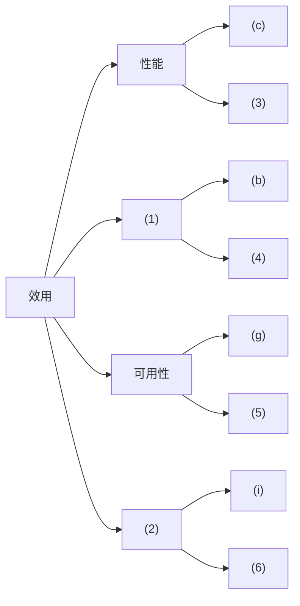
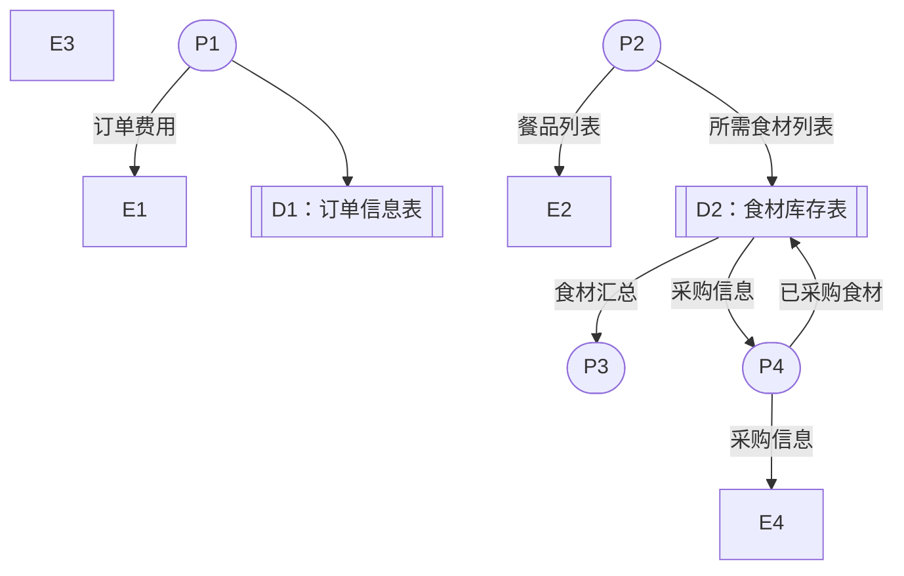
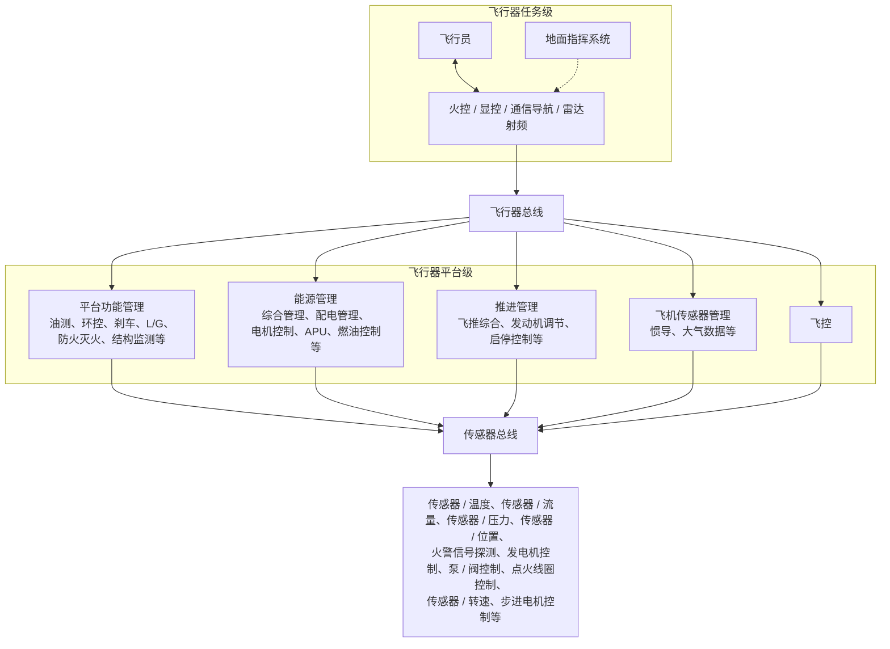
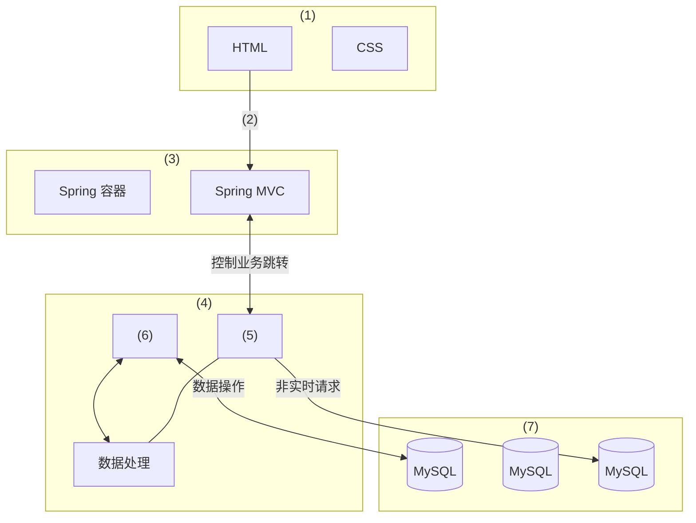

# 2019年下半年系统架构设计师案例分析（清洗版）

> **底稿：** [02.历年真题/2019年下半年-系统架构设计师-案例分析.md](../02.历年真题/2019年下半年-系统架构设计师-案例分析.md)
>
> **答案性质：** 底稿所附答案与解析，非官方标准答案。
>
> **答案可信度：** 低（5 项关键图表已由非官方公开 PDF 作结构化转录，但尚未对照官方原卷）。
>
> **主试题数量：** 5（每题 25 分）。
>
> **作答规则：** 底稿未保留试卷总说明；案例分析科目通常为试题一必答、试题二至五任选二题，具体以当次原卷为准。
>
> **清洗状态：** 已完成结构、页面噪声与显见 OCR/Markdown 清理，并逐页目视核对一份固定提交中的 8 页非官方公开 PDF；尚未对照官方原卷逐字复核。
>
> **图表恢复来源：** [Altria1979/System_Architect 固定提交中的 2019 案例分析 PDF](<https://github.com/Altria1979/System_Architect/blob/472e0e3fc3860aa1dffcac9f1d278a943ea5eb59/%E7%9C%9F%E9%A2%98%20(%E9%87%8D%E7%82%B9)/%E5%8E%86%E5%B9%B4%E7%9C%9F%E9%A2%98%E5%8F%8A%E8%A7%A3%E6%9E%90/2019%E5%B9%B4/2019%E5%B9%B4%E7%B3%BB%E7%BB%9F%E6%9E%B6%E6%9E%84%E5%B8%88%E8%80%83%E8%AF%95%E7%A7%91%E7%9B%AE%E4%BA%8C%EF%BC%9A%E6%A1%88%E4%BE%8B%E5%88%86%E6%9E%90.pdf>)，访问日期：2026-07-11；固定 Git blob 为 `91d91e2681226b9f1aa3bfbb5dbb8c1e6e3c2ed7`，本地核对文件 SHA-256 为 `6e11d42eb349e014066cbe91edd7787dcfd472c25f087a89cade9e5184dd8de5`。该 GitHub 仓库未声明许可证，来源也不是考试主管机构；本稿只转录表格单元格、节点、连线和层次关系，不复制扫描页或原图版式。
>
> **已知限制：** 表1-1、图1-1、图2-1、图3-1和图5-1均已恢复为可作答的结构化转录，但不是官方原图、原表。固定 PDF 的现有答案与本地底稿答案未发现新增冲突；来源仍非官方，因此本卷不能标为官方完整或高可信度。
>
> **底稿异常：** 底稿开头将试题五拆成三个重复残片并误计为 8 题；本文件以后续完整的试题一至五为正文，删除重复题干和夹带的页面标题噪声，并将残片中独有的解析汇入试题五末尾。

## 试题一（25分）

阅读以下关于软件架构设计与评估的叙述，在答题纸上回答问题1和问题2。

### 说明

某电子商务公司为了更好地管理用户，提升企业销售业绩，拟开发一套用户管理系统。该系统的基本功能是根据用户的消费级别、消费历史、信用情况等指标将用户划分为不同的等级，并针对不同等级的用户提供相应的折扣方案。在需求分析与架构设计阶段，电子商务公司提出的需求、质量属性描述和架构特性如下：

(a)用户目前分为普通用户、银卡用户、金卡用户和白金用户四个等级，后续需要能够根据消费情况进行动态调整；

(b)系统应该具备完善的安全防护措施，能够对黑客的攻击行为进行检测与防御；

(c)在正常负载情况下，系统应在0.5秒内对用户的商品查询请求进行响应；

(d)在各种节假日或公司活动中，针对所有级别用户，系统均能够根据用户实时的消费情况动态调整折扣力度；

(e)系统主站点断电后，应在5秒内将请求重定向到备用站点；

(f)系统支持中文昵称，但用户名要求必须以字母开头，长度不少于8个字符；

(g)当系统发生网络失效后，需要在15秒内发现错误并启用备用网络；

(h)系统在展示商品的实时视频时，需要保证视频画面具有1024x768像素的分辨率，40帧/秒的速率；

(i)系统要扩容时，应保证在10人月内完成所有的部署与测试工作；

(j)系统应对用户信息数据库的所有操作都进行完整记录；

(k)更改系统的Web界面接口必须在4人周内完成；

(l)系统必须提供远程调试接口，并支持远程调试。

在对系统需求、质量属性描述和架构特性进行分析的基础上，该系统架构师给出了两种候选的架构设计方案，公司目前正在组织相关专家对系统架构进行评估。

### 问题

#### 问题1（13分）

针对用户级别与折扣规则管理功能的架构设计问题，李工建议采用面向对象的架构风格，而王工则建议采用基于规则的架构风格。请指出该系统更适合采用哪种架构风格，并从用户级别、折扣规则定义的灵活性、可扩展性和性能三个方面对这两种架构风格进行比较与分析，填写表1-1中的（1）~（3）空白处。

> **图表状态：** 原表未入库；下表依据文件头所列非官方 PDF 第 1 页作结构化转录，不是原表，保留原题空号。

| 架构风格名称 | 灵活性 | 可扩展性 | 性能 |
|---|---|---|---|
| 面向对象 | 将用户级别、折扣规则等封装为对象，在系统启动时加载 | (2) | (3) |
| 基于规则 | (1) | 加入新的用户级别和折扣规则时只需要定义新的规则，解释规则即可进行扩展 | 需要对用户级别与折扣规则进行实时解释，性能较差 |

#### 问题2（12分）

在架构评估过程中，质量属性效用树（utility tree)是对系统质量属性进行识别和优先级排序的重要工具。请将合适的质量属性名称填入图1-1中（1）、（2）空白处，并选择题干描述的（a）~（l）填入（3）~（6）空白处，完成该系统的效用树。

> **图表状态：** 原图未入库；下图依据文件头所列非官方 PDF 第 2 页转录效用树的分支与空号位置，是结构化重绘示意，不是原图，保留原题空号。

### 参考答案与解析

> 以下答案与解析来自底稿，非官方标准答案，内容仍需复核。

#### 问题1

用户级别与折扣规则管理功能更适合采用基于规则的架构风格。

(1)将用户级别、折扣规则等描述为可动态改变的规则数据；

(2)加入新的用户级别和折扣规则时需要重新定义新的对象，并需要重启系统；

(3)用户级别和折扣规则已经在系统内编码，可直接运行，性能较好。

本题主要考查考生对于软件架构风格的理解与掌握，以及对软件质量属性的理解、掌握和应用。在解答该问题时，应认真阅读题干中给出的场景与需求描述，分析需求与架构风格的对应关系，并需要理解每个需求描述了何种质量属性，根据质量属性描述对其归类。

在解答本题时，需要仔细考虑用户实际需求和现有的架构风格之间的关系，并从架构的灵活性、可扩展性和性能等方面进行综合考虑。总体来说，该系统最关注各种折扣定义的灵活性，因此需要采用基于规则的系统，将规则定义以数据的方式进行定义，从而避免修改代码。具体来说，采用基于规则的架构风格，需要将用户级别、折扣规则等描述为可动态改变的规则数据，加入新的用户级别和折扣规则时只需要定义新的规则，解释规则即可进行扩展。但其缺点在于需要对用户级别与折扣规则进行实时解释、性能较差。采用面向对象的架构风格，需要将用户级别、折扣规则等封装为对象，在系统启动时加载，用户级别和折扣规则已经在系统内编码，可直接运行，性能较好，但其最大的问题是加入新的用户级别和折扣规则时需要重新定义新的对象，并需要重启系统。

#### 问题2

(1) 安全性

(2) 可修改性

(3) (h)

(4) (j)

(5) (e)

(6) (k)

质量属性效用树是对质量属性进行分类、权衡、分析的架构分析工具，主要关注系统的性能、可用性、可修改性和安全性四个方面。根据对相关质量属性的定义和含义，其中“系统应该具备完善的安全防护措施，能够对黑客的攻击行为进行检测与防御”和“系统应对用户信息数据库的所有操作都进行完整记录”对应安全性；“在正常负载情况下，系统应在0.5秒内对用户的商品查询请求进行响应”和“系统在展示商品的实时视频时，需要保证视频画面具有1024X768像素的分辨率，40帧/秒的速率”对应系统的性能；“系统主站点断电后，应在5秒内将请求重定向到备用站点”和“当系统发生网络失效后，需要在15秒内发现错误并启用备用网络”对应可用性；“系统要扩容时，应保证在10人月内完成所有的部署与测试工作”和“更改系统的Web界面接口必须在4人周内完成”对应可修改性。

## 试题二（25分）

阅读下列说明，回答问题1至问题3，将解答填入答题纸的对应栏内。

### 说明

某软件企业为快餐店开发一套在线订餐管理系统，主要功能包括：

(1)在线订餐：已注册客户通过网络在线选择快餐店所提供的餐品种类和数量后提交订单，系统显示订单费用供客户确认，客户确认后支付订单所列各项费用。

(2)厨房备餐：厨房接收到客户已付款订单后按照订单餐品列表选择各类食材进行餐品加工。

(3)食材采购：当快餐店某类食材低于特定数量时自动向供应商发起采购信息，包括食材类型和数量，供应商接收到采购信息后按照要求将食材送至快餐店并提交已采购的食材信息，系统自动更新食材库存。

(4)生成报表：每个周末和月末，快餐店经理会自动收到系统生成的统计报表，报表中详细列出了本周或本月订单的统计信息以及库存食材的统计信息。

现采用数据流图对上述订餐管理系统进行分析与设计，系统未完成的0层数据流图如图2-1所示。

### 问题

#### 问题1（8分）

根据订餐管理系统功能说明，请在图2-1所示数据流图中给出外部实体E1~E4和加工P1~P4的具体名称。

> **图表状态：** 原图未入库；下图依据文件头所列非官方 PDF 第 3 页转录外部实体、加工、数据存储及题图已有的数据流，是结构化重绘示意，不是原图。原题本身是“未完成”的 0 层数据流图，问题2要求补充的四条数据流未提前画入。

> **位置说明：** E3 在原题图中暂未连接；这正是问题2需要识别并补充数据流的一部分，不是转录遗漏。

#### 问题2（8分）

根据数据流图规范和订餐管理系统功能说明，请说明在图2-1中需要补充哪些数据流可以构造出完整的0层数据流图。

> **图表引用：** 本问题与问题1共用上方图2-1结构化重绘；该图有意保持原题的未完成状态。

#### 问题3（9分）

根据数据流图的含义，请说明数据流图和系统流程图之间有哪些方面的区别。

### 参考答案与解析

> 以下答案与解析来自底稿，非官方标准答案，内容仍需复核。

#### 问题1

E1：客户

E2：厨房

E3：经理

E4：供应商

P1：在线订餐

P2：厨房备餐

P3：生成报表

P4：食材采购

本题考查过程建模中数据流图相关知识。

数据流图（Data Flow Diagram)从数据传递和加工角度，以图形方式来表达系统的逻辑功能、数据在系统内部的逻辑流向和逻辑变换过程，是结构化系统分析方法的主要表达工具及用于表示软件模型的一种图示方法。数据流图中主要包括外部实体、数据存储、加工和数据流四种元素。外部实体主要描述与系统有交互关系的外部元素；数据存储用来描述在系统中需要持久化存储的数据；加工描述系统中的行为和动作序列；数据流描述系统中流动的数据及方向。

此类题目要求考生认真阅读题目对问题的描述，准确理解数据流图中各个元素的含义，结合图中所给出的不完整的数据流图，分析其中各个元素及其关系。

图中给出了四个实体，根据题目说明中“系统显示订单费用供客户确认”可确定E1为客户，P1为在线订餐；“厨房接收到客户已付款订单后按照订单餐品列表选持各类食材进行餐品加工”可确定E2为厨房，P2为厨房备餐；“当快餐店某类食材低于特定数量时自动向供应商发起采购信息”可确定E4为供应商，P4为食材采购；最后可确定P3为生成报表，则E3为经理。

#### 问题2

(1)增加E1到P1数据流“餐品订单”;

(2)增加P1到P2数据流“餐品订单”;

(3)增加D1到P3数据流“订单汇总”;

(4)增加P3到E3数据流“统计报表”。

数据流图中常见错误包括黑洞、灰洞和无输入三种类型的逻辑错误和部分语法错误。P1只有输出没有输入为无输入错误，需要增加E1到P1数据流“餐品订单”；P2同样为无输入错误，需要增加P1到P2数据流“餐品订单”；根据P3生成报表要求输入中有订单信息和食材信息，所以需要增加D1到P3数据流“订单汇总”；P3只有输入没有输出存在黑洞错误，需要增加P3到E3数据流“统计报表”。

#### 问题3

(1)数据流图中的处理过程可并行；系统流程图在某个时间点只能处于一个处理过程。

(2)数据流图展现系统的数据流；系统流程图展现系统的控制流。

(3)数据流图展现全局的处理过程，过程之间遵循不同的计时标准；系统流程图中 处理过程遵循一致的计时标准。

数据流图和流程图是结构化建模中使用的重要工具，能够帮助开发人员更好地分析和设计系统，增强系统开发人员之间交流的准确性和有效性。数据流图作为一种图形化工具用来说明业务处理过程、系统边界内所包含的功能和系统中的数据流，适用于系统分析中的逻辑建模阶段。流程图以图形化的方式展示应用程序从数据输入开始到获得输出为止的逻辑过程，描述处理过程的控制流，往往涉及具体的技术和环境，适用于系统设计中的物理建模阶段。数据流图和流程图是为了达到不同的目的而产生的，其所采用的标准和符号集合也不相同。在实际应用中，区别主要包括是否可以描述处理过程的并发性；描述内容是数据流还是控制流；所描述过程的计时标准不同三个方面。

## 试题三（25分）

阅读以下关于嵌入式系统开放式架构相关技术的描述，在答题纸上回答问题1至问题3。

### 说明

信息物理系统（Cyber Physical Systems, CPS)技术已成为未来宇航装备发展的重点关键技术之一。某公司长期从事嵌入式系统的研制工作，随着公司业务范围不断扩展，公司决定进入宇航装备的研制领域。为了做好前期准备，公司决定让王工程师负责编制公司进军宇航装备领域的战略规划。王工经调研和分析，认为未来宇航装备将向着网络化、智能化和综合化的目标发展，CPS将会是宇航装备的核心技术，公司应构建基于CPS技术的新产品架构，实现超前的技术战略储备。

### 问题

#### 问题1（9分）

通常CPS结构分为感知层、网络层和控制层，请用300字以内文字说明CPS的定义，并简要说明各层的含义。

#### 问题2（10分）

王工在提交的战略规划中指出：飞行器中的电子设备是一个大型分布式系统，其传感器、控制器和采集器分布在飞机各个部位，相互间采用高速总线互连，实现子系统间的数据交换，而飞行员或地面指挥系统根据飞行数据的汇总决策飞行任务的执行。图3-1给出了飞行器系统功能组成图。

请参考图3-1给出的功能图，依据你所掌握的CPS知识，说明以下所列的功能分别属于CPS结构中的哪层，哪项功能不属于CPS任何一层。

1. 飞行传感器管理

2. 步进电机控制

3. 显控

4. 发电机控制

5. 环控

6. 配电管理

7. 转速传感器

8. 传感器总线

9. 飞行员

10. 火警信号探测

> **图表状态：** 原图未入库；下图依据文件头所列非官方 PDF 第 4 页转录任务级、平台级、功能组件、两级总线和传感器层次，是结构化重绘示意，不是原图。原图中的省略号仅表示还有其他同类组件，本图不补写未知名称。

#### 问题3（6分）

王工在提交的战略规划中指出：未来宇航领域装备将呈现网络化、智能化和综合化等特征，形成集群式的协同能力，安全性尤为重要。在宇航领域的CPS系统中，不同层面上都会存在一定的安全威胁。请用100字以内文字说明CPS系统会存在哪三类安全威胁，并对每类安全威胁至少举出两个例子说明。

### 参考答案与解析

> 以下答案与解析来自底稿，非官方标准答案，内容仍需复核。

#### 问题1

信息物理系统（Cyber Physical Systems,CPS)作为计算进程和物理进程的统一体，是集计算、通信与控制于一体的下一代智能系统。信息物理系统通过人机交互接口实现和物理进程的交互，使用网络化空间，以远程的、可靠的、实时的、安全的、协作的方式操控一个物理实体。

感知层：主要由传感器、控制器和采集器等设备组成，它属于信息物理系统中的末端设备。

网络层：主要是连接信息世界和物理世界的桥梁，实现的是数据传输，为系统提供实时的网络服务，保证网络分组传输的实时可靠。

控制层：主要是根据认知结果及物理设备传回来的数据进行相应的分析，将相应的结果返回给客户端。

信息物理系统（Cyber Physical Systems，CPS)技术属于下一代的智能系统，它是将计算、通信与控制等技术集于一体，实现智能化管理、控制和区域性监视等功能。目前CPS技术已被广泛应用于工业、医疗、环境、运输、交通和军事等领域。本题主要考查考生对CPS基本知识和技术的掌握程度。首先要求考生应在理解信息物理系统相关基本概念和主要架构的基础上，针对大型飞行器中实现信息与物理综合控制系统结构的说明、用CPS基本知识解释感知层、网络层和控制层的具体涵盖内容，从中分解出各个组件的具体含义。其次，CPS是一种区域性系统，未来宇航领域装备将呈现网络化、智能化和综合化等特征，形成集群式的协同能力，信息安全尤为重要，考生应根据自己掌握的CPS及信息安全的相关知识，在CPS架构下分析出可能存在的安全隐患，并举例说明，在仔细阅读题干给出的相关信息的基础上，正确回答问题。

信息物理系统（Cyber Physical Systems，CPS)是一个综合计算、网络和物理环境的多维复杂系统，通过3C技术的有机融含与深度协作，实现大型工程系统的实时感知、动态控制和信息服务，可使系统更加可靠、高效、实时协同，具有重要而广泛的应用前景。

严格讲，信息物理系统（CPS)作为计算进程和物理进程的统一体，是集计算、通信与控制于一体的下一代智能系统。信息物理系统通过人机交互接口实现和物理进程的交互，使用网络化空间，以远程的、可靠的、实时的、安全的、协作的方式操控一个物理实体。

CPS是在环境感知的基础上，深度融合计算、通信和控制能力的可控、可信和可扩展的网络化物理设备系统，它注重计算资源与物理资源的紧密结合与协调，主要用于一些智能系统上,如设备互连、物联传感、智能家居、机器人和智能导航等。

通常，CPS架构分为感知层、网络层和控制层。感知层：主要由传感器、控制器和采集器等设备组成。感知层中的传感器作为信息物理系统中的末端设备，主要采集的是环境中的具体信息数据，并定时地发送给服务器，服务器接收数据后进行相应的处理，再返回给物理末端设备，物理末端设备接收到数据后要进行相应的变换。网络层：主要是连接信息世界和物理世界的桥梁，主要实现的是数据传输，为系统提供实时的网络服务，保证网络分组传输的实时可靠。控制层：主要是根据感知层的认知结果，根据物理设备传回来的数据进行相应的分析，将相应的结果返回给客户端以可视化的界面呈现给客户。

#### 问题2

感知层：2、4、7、10

网络层：8

控制层：1、3、5、6

不属于CPS结构中的功能：9

图3-1给出的飞行器系统功能组成图是一个大型分布式CPS系统，其传感器、控制器和采集器分布在飞机各个部位，相互间采用高速总线互连，实现子系统间的数据交换，而飞行员或地面指挥系统根据飞行数据的汇总决策飞行任务的执行。考生可详细分析图3-1给出的层次关系和每个方框中的内容，根据你理解的情况，完成问题2的解答。

从图3-1可以看出，底层是飞行器系统的传感器部分，主要采集和控制飞机飞行中的各类设备，比如飞机姿态数据、流量数据、发动机数据、大气数据等，本层内容应该为CPS的感知层，因此问题2中给出的传感器名称步进电机控制、发电机控制、转速传感器和火警信号探测属于感知层；而从图3-1可以看出，系统总共有两条总线，即传感器总线和飞行器总线，根据CPS层次结构定义，传感器总线应属于网络层；图3-1中间层是对传感器层采集的感知数据进行分类处理，它包含了多种功能性管理工作，比如飞行传感器管理、显控、环控、配电管理等都属于控制层内容。

这里要特别强调的是选项9飞行员，飞行员是控制飞机飞行，并完成指定任务的操作者，不属于CPS任何一层，是CPS的人机交互接口。

#### 问题3

(1)感知层安全威胁：感知数据破坏、信息窃听、节点捕获。

(2)网络层安全威胁：拒绝服务攻击、选择性转发、方向误导攻击。

(3)控制层安全威胁：用户隐私泄露、恶意代码、非授权访问。

信息物理系统中的信息安全是保证该系统可靠运行、不受非法入侵的关键预防技术之一，尤其是宇航系统安全性更值得关注。要研制一个安全可靠的信息物理系统，就必须分析出该系统可能存在的入侵源。本问题3主要考查考生对信息安全技术基础知识的掌握程度。考生可结合CPS架构的特点，分析完成本问题。

从结构看：CPS感知层主要存在感知数据破坏、信息窃听、节点捕获、被旁路等安全威胁；网络层主要存在拒绝服务攻击、选择性转发、方向误导等被攻击的安全威胁；控制层主要存在用户隐私泄露、恶意代码、非授权访问等安全威胁。

## 试题四（25分）

阅读以下关于分布式数据库缓存设计的叙述，在答题纸上回答问题1至问题3。

### 说明

某初创企业的主营业务是为用户提供高度个性化的商品订购业务，其业务系统支持PC端、手机App等多种访问方式。系统上线后受到用户普遍欢迎，在线用户数和订单数量迅速增长，原有的关系数据库服务器不能满足高速并发的业务要求。

为了减轻数据库服务器的压力，该企业采用了分布式缓存系统，将应用系统经常使用的数据放置在内存，降低对数据库服务器的查询请求，提高了系统性能。在使用缓存系统的过程中，企业碰到了一系列技术问题。

### 问题

#### 问题1（11分）

该系统使用过程中，由于同样的数据分别存在于数据库和缓存系统中，必然会造成数据同步或数据不一致性的问题。该企业团队为解决这个问题，提出了如下解决思路：应用程序读数据时，首先读缓存，当该数据不在缓存时,再读取数据库；应用程序写数据时，先写缓存，成功后再写数据库；或者先写数据库，再写缓存。

王工认为该解决思路并未解决数据同步或数据不一致性的问题，请用100字以内的文字解释其原因。

王工给出了一种可以解决该问题的数据读写步骤如下：

读数据操作的基本步骤：

1. 根据key读缓存；

2. 读取成功则直接返回；

3. 若key不在缓存中时，根据key(a)；

4. 读取成功后，(b)；

5. 成功返回。

写数据操作的基本步骤：

1. 根据key值写(c)；

2. 成功后(d)；

3. 成功返回。

请填写完善上述步骤中（a）~（d）处的空白内容。

#### 问题2（8分）

缓存系统一般以key/value形式存储数据，在系统运维中发现,部分针对缓存的查询，未在缓存系统中找到对应的key,从而引发了大量对数据库服务器的查询请求，最严重时甚至导致了数据库服务器的宕机。
经过运维人员的深入分析，发现存在两种情况：

(1)用户请求的key值在系统中不存在时，会查询数据库系统，加大了数据库服务器的压力；
(2)系统运行期间，发生了黑客攻击，以大量系统不存在的随机key发起了查询请求，从而导致了数据库服务器的宕机。

经过研究，研发团队决定，当在数据库中也未查找到该key时，在缓存系统中为key设置空值，防止对数据库服务器发起重复查询。

请用100字以内文字说明该设置空值方案存在的问题，并给出解决思路。

#### 问题3（6分）

缓存系统中的key一般会存在有效期，超过有效期则key失效；有时也会根据LRU算法将某些key移出内存。当应用软件查询key时，如key失效或不在内存，会重新读取数据库，并更新缓存中的key。

运维团队发现在某些情况下，若大量的key设置了相同的失效时间，导致缓存在同一时刻众多key同时失效，或者瞬间产生对缓存系统不存在key的大量访问，或者缓存系统重启等原因，都会造成数据库服务器请求瞬时爆量，引起大量缓存更新操作，导致整个系统性能急剧下降，进而造成整个系统崩溃。

请用100字以内文字，给出解决该问题的两种不同思路。

### 参考答案与解析

> 以下答案与解析来自底稿，非官方标准答案，内容仍需复核。

#### 问题1

存在双写不一致问题，在写数据时，可能存在缓存写成功，数据库写失败，或者反之，从而造成数据不一致。当多个请求发生时，也可能产生读写冲突的并发问题。

(a)从数据库中读取数据或读数据库

(b)更新缓存中key值或更新缓存

(c)数据库

(d)删除缓存key或使缓存key失效或更新缓存（key值）

本题考查分布式数据缓存系统的概念与应用。

在原有方案中，应用程序写数据时，先写缓存，成功后再写数据库；或者先写数据库，再写缓存。这里存在双写不一致问题。不管先写缓存还是数据库，都会存在一方写成功，另一方写失败的问题，从而造成数据不一致。当多个请求发生时，也可能产生读写冲突的并发问题。

王工的解决思路是：读操作的顺序是，先读缓存，如果数据在缓存中，则直接返回，无须数据库操作；如果数据不在缓存，则读数据库，如成功，则更新缓存，如失败，则返回无此数据。

读操作主要解决查询效率问题。写操作的顺序是先写数据库，如失败，则返回失败；如成功，则更新缓存。更新缓存可能的方式有：如缓存中无此key值，则在缓存中不作处理；如缓存中存在此key值，则删除key值或使该key值失效。写操作的顺序主要防止数据库写操作失败，缓存更新为内存操作，失败的概率很小。同时删除key或使key失效，则在下一次查询该key值时，会发起数据库读操作，并同步更新缓存中的key值，从而最大程度上避免双写不一致问题。

#### 问题2

存在问题：不在系统中的key值是无限的，如果均设置key值为空，会造成内存资源的极大浪费，引起性能急剧下降。

解决思路：查询缓存之前，对key值进行过滤，只允许系统中存在的key进行后续操作（例如采用key的bitmap进行过滤)。

该方法主要的思路是为系统中不存在的key,在缓存中增加该key，并设置key对应的值为空值，从而防止下次发起对数据库的查询操作。

该方法存在的问题是，不在系统中的key值是无限的，如果均设置key值为空，会造成内存资源的极大浪费，引起性能急剧下降。

解决思路是对于系统中存在的key值，在查询前进行过滤，只允许系统中存在的key进行后续操作。因为一般情况下，系统中的key是有限的，或者是符合某种规则的。例如可以采用key的bitmap进行过滤，降低过滤的消耗。

#### 问题3

思路1:缓存失效后，通过加排它锁或者队列方式控制数据库写缓存的线程数量，使得缓存更新串行化；

思路2:给不同key设置随机或不同的失效时间，使失效时间的分布尽量均匀；

思路3:设置两级或多级缓存，避免访问数据库服务器。

运维团队发现的大量缓存key值同时失效，从而导致整个系统性能急剧下降，进而造成整个系统崩溃。其主要的原因是key值失效，导致数据库服务器请求瞬时爆量，引起大量缓存更新操作，从而导致了系统性能急剧下降，系统崩溃。

解决该问题的思路就是采取某种做法，使得缓存中同一时间不会出现大量的key值失效。

具体的思路有：

1. 缓存失效后，大量的缓存更新操作进行排队，通过加排它锁、队列等方式控制同时进行缓存更新操作的数量，使得缓存更新串行化，降低更新频率。此方式效果不佳，并没有从根源上解决大量缓存key值同时失效的问题。

2. 在增加或更新缓存时，给不同key设置随机或不同的失效时间，使失效时间的分布尽量均匀，从根源上避免大量缓存key值同时失效。

3. 设置两级或多级缓存，避免访问数据库服务器。此方式也没有从根源上解决大量缓存key值同时失效的问题。

## 试题五（25分）

阅读以下关于Web系统架构设计的叙述，在答题纸上回答问题1至问题3。

### 说明

某公司拟开发一个物流车辆管理系统，该系统可支持各车辆实时位置监控、车辆历史轨迹管理、违规违章记录管理、车辆固定资产管理、随车备品及配件更换记录管理、车辆寿命管理等功能需求。其非功能性需求如下：

(1)系统应支持大于50个终端设备的并发请求；

(2)系统应能够实时识别车牌，识别时间应小于1s;

(3)系统应7X24小时工作；

(4)具有友好的用户界面；

(5)可抵御常见SQL注入攻击；

(6)独立事务操作响应时间应小于3s;

(7)系统在故障情况下，应在1小时内恢复；

(8)新用户学习使用系统的时间少于1小时。

面对系统需求，公司召开项目组讨论会议，制订系统设计方案，最终决定基于分布式架构设计实现该物流车辆管理系统，应用Kafka、Redis数据缓存等技术实现对物流车辆自身数据、业务数据进行快速、高效的处理。

### 问题

#### 问题1（4分）

请将上述非功能性需求（1）~（8）归类到性能、安全性、可用性、易用性这四类非功能性需求。

#### 问题2（14分）

经项目组讨论，完成了该系统的分布式架构设计，如图5-1所示。请从下面给出的（a）~（j）中进行选择，补充完善图5-1中（1）~（7）处空白的内容。

(a)数据存储层

(b)Struts2

(c)负载均衡层

(d)表现层

(e)HTTP协议

(f)Redis数据缓存

(g)Kafka分发消息

(h)分布式通信处理层

(i)逻辑处理层

(j)CDN内容分发

> **图表状态：** 原图未入库；下图依据文件头所列非官方 PDF 第 7 页转录四层边界、固定技术组件、空号位置及数据方向，是结构化重绘示意，不是原图，保留原题空号。

#### 问题3（7分）

该物流车辆管理系统需抵御常见的SQL注入攻击,请用200字以内的文字说明什么是SQL注入攻击，并列举出两种抵御SQL注入攻击的方式。

### 参考答案与解析

> 以下答案与解析来自底稿，非官方标准答案，内容仍需复核。

#### 问题1

性能：(1)、(2)、(6)

安全性：(5)

可用性：(3)、(7)

易用性：(4)、(8)

本题考查Web系统架构设计方面的相关知识和解决实际问题的能力。

此类题目要求考生认真阅读题目对现实问题的描述，需要根据需求描述，给出系统的架构设计方案。

软件质量属性有可用性、可修改性、性能、安全性、可测试性、易用性等六种。可用性关注的是系统产生故障的可能性和从故障中恢复的能力；性能关注的是系统对事件的响应时间；安全性关注的是系统保护合法用户正常使用系统、阻止非法用户攻击系统的能力；可测试性关注的是系统发现错误的能力；易用性关注的是对用户来说完成某个期望任务的容易程度和系统所提供的用户支持的种类。

#### 问题2

(1) (d)

(2) (e)

(3) (i)

(4) (h)

(5) (g)

(6) (f)

(7) (a)

基于题干中Web系统的需求描述，对该系统的架构设计方案进行分析可知，该物流车辆管理系统应基于层次型架构风格进行设计。图5-1从下到上依次为数据存储层、分布式通信处理层、逻辑处理层和表现层。随后，选择相关的技术以支持各层所需完成的任务。

#### 问题3

SQL注入攻击，就是通过把SQL命令插入到Web表单提交或输入域名或页面请求的查询字符串，最终达到欺骗服务器执行恶意的SQL命令。

可以通过以下方式抵御SQL注入攻击：

1. 使用正则表达式；

2. 使用参数化的过滤性语句；

3. 检查用户输入的合法性；

4. 用户相关数据加密处理；

5. 存储过程来执行所有的查询；

6. 使用专业的漏洞扫描工具。

SQL注入攻击是黑客对数据库进行攻击的常用手段之一。随着B/S模式应用开发的发展，使用这种模式编写应用程序的程序员也越来越多。但是由于程序员的水平及经验也参差不齐，相当大的一部分程序员在编写代码的时候，没有对用户输入数据的合法性进行判断，使应用程序存在安全隐患。用户可以提交一段数据库查询代码，根据程序返回的结果，获得某些他想得知的数据，这就是所谓的SQL Injection,即SQL注入。

SQL注入攻击属于数据库安全攻击手段之一,可以通过数据库安全防护技术实现有效防护，数据库安全防护技术包括：数据库漏扫、数据库加密、数据库防火墙、数据脱敏、数据库安全审计系统。

为了抵御SQL注入攻击，可以采用如下方式：使用正则表达式、使用参数化的过滤性语句、检查用户输入的合法性、用户相关数据加密处理、存储过程来执行所有的查询、使用专业的漏洞扫描工具等。

### 底稿重复残片中的补充解析

> 以下内容来自底稿开头三个重复残片，仅保留完整试题五解析中未逐字出现的说明；其答案性质仍为非官方、待复核。

#### 补充解析：问题1

质量属性归类，是需求分析和架构设计阶段的主要工作之一。根据对相关质量属性的定义和含义，题干中：(1)系统应支持大于50个终端设备的并发请求，(2)系统应能够实时识别车牌，识别时间应小于1s，(6)独立事务操作响应时间应小于3s，描述的是系统的性能属性；(5)可抵御常见SQL注入攻击，描述的是系统的安全性属性；(3)系统应7×24小时工作，(7)系统在故障情况下，应在1小时内恢复，描述的是系统的可用性属性；(4)具有友好的用户界面，(8)新用户学习使用系统的时间少于1小时，描述的是系统的易用性属性。

#### 补充解析：问题2

三层架构是为了符合“高内聚、低耦合”的思想，把各个功能模块划分为表示层（UI）、业务逻辑层（BLL）和数据访问层（DAL）。

在高并发环境下，由于无法及时完成同步处理，请求往往会发生阻塞，进而导致大量行锁、表锁，甚至请求堆积过多、连接数超过上限。使用消息队列可以异步处理请求，从而缓解系统压力；该案例采用Kafka分布式消息队列。

缓存是分布式系统中的重要组件，主要解决高并发、大数据场景下热点数据的访问性能问题，提供高性能的数据快速访问；该案例采用Redis键值数据库缓存。

#### 补充解析：问题3

SQL注入是指应用程序没有判断用户输入数据的合法性或过滤不严，攻击者在应用程序预先定义的查询语句末尾添加额外SQL语句，在管理员不知情的情况下实施非法操作，欺骗数据库服务器执行非授权查询，进而获取相应数据信息。

底稿残片列出的主要防范措施包括：

1. 分级管理：对用户进行分级管理，严格控制用户权限；
2. 参数校验：编写SQL时禁止直接将值拼入SQL，必须通过参数传递变量值；
3. 参数过滤：预先过滤参数值中的敏感内容，如`and`、`or`、`select`、分号和双引号等；
4. 安全参数：使用编程语言提供的数据库操作安全参数和强制检查特性；
5. 漏洞扫描：利用SQL漏洞扫描工具及时扫描系统漏洞；
6. 多层验证：数据输入必须经过严格验证才能进入系统，拒绝未通过验证的输入直接访问数据库；
7. 数据库加密：对数据库敏感信息进行加密。
