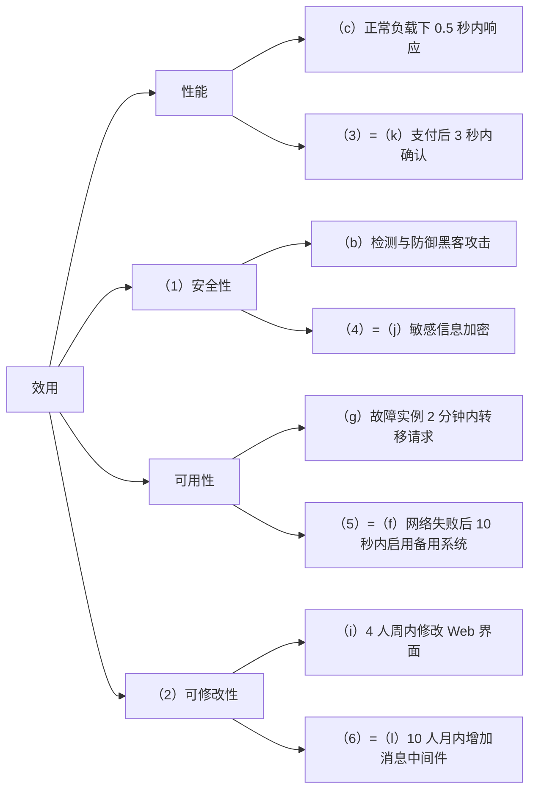
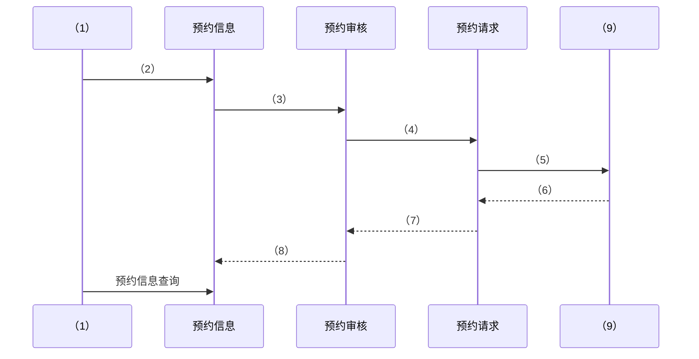
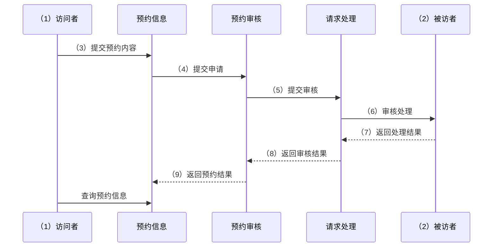
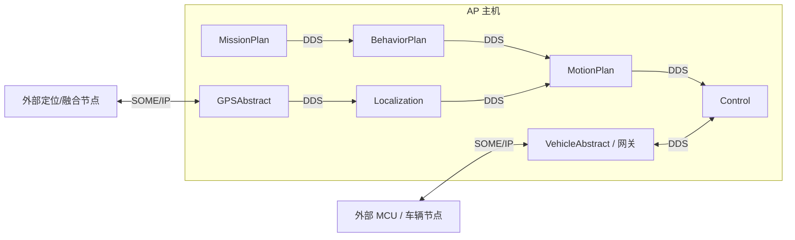
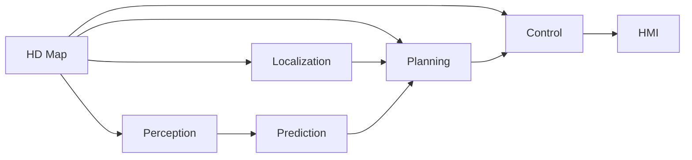
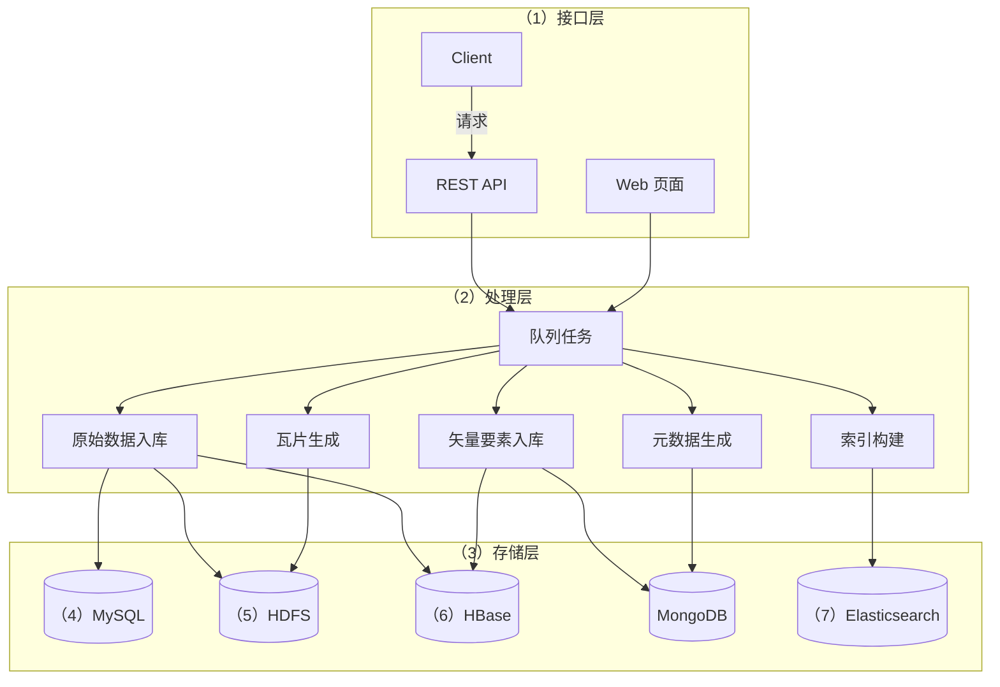

# 2024 年上半年系统架构设计师案例分析（清洗版）

> **主试题数量：** 5 道。
>
> **复核结论：** 可确认本次案例分析包含 5 个主题，但公开材料无法拼成一份来源一致的原卷。2024 年 5 月发布的考后回忆指向“质量属性场景、UML 填图、Redis、SOME/IP/DDS、GIS”；一份后来公开的 29 页 PDF 则收录了完整效用树和 GIS 图，却同时混入 2015 年宇航可靠性旧题，且没有 SOME/IP/DDS 题。两者还在试题一、试题二的题面和分值上冲突。以下按材料版本分别记录，不把冲突内容合并为同一套试卷。
>
> **本地底稿：** [原始整理版](../02.历年真题/2024年上半年-系统架构设计师-案例分析.md)与[补充版](<../02.历年真题(补充)/2024年上半年-系统架构设计师-案例分析.md>)。两份底稿均属回忆整理，且拆题、排序和题面完整度不同。
>
> **重要勘误：** 旧清洗版“试题四：嵌入式系统可靠性设计”以“某宇航公司长期从事宇航装备研制……”开头。该题可在希赛公开的 [2015 年案例题资料](https://www.educity.cn/rk/zhenti/jiagou/jiagou2015anli.pdf?fcode=h58_e1178)中找到，不属于 2024 年上半年。本版继续排除该误归题，并保留 2024 年考后材料一致指向的 SOME/IP、DDS 与自动驾驶 AP 规划控制题。
>
> **非官方性质：** 题面、分值、题序和参考答案均来自第三方整理、考后回忆或技术资料，不是考试主管机构发布的原卷和标准答案。“材料版本”仅表示该来源内部可核对，不表示它就是官方卷面。
>
> **作答规则：** 本地底稿未保留试卷总说明。案例分析科目通常为试题一必答、试题二至五任选二题，具体以当次官方试卷为准。
>
> **图表处理：** 效用树和 GIS 架构图依据公开 PDF 逐项转写为 Mermaid；UML 按“2024-05-27 近时点记忆图”和“后期培训 PDF 候选答案”两套来源分别转录，不互相补空；自动驾驶图只给出二手材料能够支持的教学性结构示意。本文不嵌入或复制第三方图片。
>
> **公开核验来源（访问日期：2026-07-12）：** [环球网校公开 PDF](https://oss-hqwx-video.hqwx.com/2024%E5%B9%B4%E4%B8%8A%E5%8D%8A%E5%B9%B4%E7%B3%BB%E7%BB%9F%E6%9E%B6%E6%9E%84%E8%AE%BE%E8%AE%A1%E5%B8%88%E8%80%83%E8%AF%95%E7%9C%9F%E9%A2%98%E5%8F%8A%E7%AD%94%E6%A1%88%E8%A7%A3%E6%9E%90_a3c8f9f07e1f97980c13dc31438b0d4516b97778.pdf)共 29 页，文件 SHA-256 为 `1C81E2560E890C03AFE3C7251DD28AF28868C436849EECD9B7B344254D450121`，用于核对效用树、物流版 UML 题面和 GIS 图；[多彩编程回忆页](http://www.pswp.cn/web/19630.shtml)、[DataEA 回忆页](https://dataea.cn/2024-ruankao-arch/)、[2024-05-27 UML 回忆页](https://blog.csdn.net/beingod0/article/details/139228143)及[2024-06-05 综合回忆页](https://blog.csdn.net/m0_61635017/article/details/139476803)用于核对考后版本。[GitHub 固定提交中的整理稿](https://github.com/wujiaming88/awesome-ruankao/blob/16093de843f618c7c35af3e83b47644b5fae2c6f/%E7%9C%9F%E9%A2%98/%E7%B3%BB%E7%BB%9F%E6%9E%B6%E6%9E%84%E8%AE%BE%E8%AE%A1%E5%B8%88/2024%E5%B9%B4%E4%B8%8A%E5%8D%8A%E5%B9%B4/%E6%A1%88%E4%BE%8B%E5%88%86%E6%9E%90.md)的文件 blob 为 `a31977f6c36f2a59c17009328639aa60c6d8c104`，仅作为较晚的交叉来源，不作为原卷依据。Redis 命令含义另以官方文档 [ZADD](https://redis.io/docs/latest/commands/zadd/)、[ZRANGE](https://redis.io/docs/latest/commands/zrange/) 和 [ZSCORE](https://redis.io/docs/latest/commands/zscore/)核对；技术文档只能验证知识点，不能证明考试空位位置。

---

## 试题一（25 分）：软件架构设计与评估

### 材料版本冲突

- **公开 PDF 版本：** 网络约车调度服务平台；问题分值为 7、12、6；给出（a）～（l）完整需求和质量属性效用树，问题 3 只要求说明质量属性场景六要素的概念。
- **考后回忆版本：** 问题分值为 7、6、12；问题 3 要求用六要素分析（e）、（h）两个可用性场景，其中（e）涉及连续运行与 10 秒重启，（h）涉及网络故障后 10 秒重连；效用树原图和其余需求没有可靠保留下来。

两套材料不能在不改变题号、分值和需求字母含义的情况下合并。它们可能来自不同机考题组，也可能包含后期编辑错误；在没有官方原卷或准考批次信息时，无法判定哪一套是唯一原题。

### 公开 PDF 版本题面

某公司拟开发一个网络约车调度服务平台，实现基于互联网的出租车预约与管理。需求与质量属性描述如下：

- （a）系统参与者包括乘客、出租车司机和平台管理员三类；
- （b）系统应具备完善的安全防护措施，能够检测与防御黑客攻击；
- （c）正常负载下，系统必须在 0.5 秒内响应用户操作；
- （d）用户名是系统唯一标识，以字母开头，由数字和字母组成，长度不少于 6 个字符；
- （e）更改系统加密级别将对安全性和性能产生影响；
- （f）网络失效后，系统需要在 10 秒内发现错误并启用备用系统；
- （g）某个微服务实例故障时，在 2 分钟内将请求转移到其他健康实例，保证服务不中断；
- （h）“订单提醒”业务逻辑描述不清可能导致部分业务功能模块规则冲突，影响系统可修改性；
- （i）更改系统 Web 界面接口必须在 4 人周内完成；
- （j）对乘客信息等敏感数据进行加密处理；
- （k）正常负载下，用户支付车费后 3 秒内确认订单支付信息；
- （l）系统升级时，必须保证在 10 人月内增加一个新的消息处理中间件。

#### 问题 1（7 分）

简要说明微服务的概念以及优势与挑战。

#### 问题 2（12 分）

选择合适的质量属性填写（1）、（2），并从（a）～（l）中选择需求填写（3）～（6），完成质量属性效用树。

#### 问题 3（6 分）

说明质量属性场景六个要素的概念。

### 考后回忆版本残存题面

- （e）系统可连续运行不少于 240 小时；发生断电或故障后，应在 10 秒内重新启动。
- （h）发生网络故障后，系统应在 10 秒内重新建立连接。

该版本的问题 2 是效用树填空（6 分），但原图及空位关系未取得，不能把公开 PDF 版本的（1）～（6）直接移植过来；问题 3 要求使用六要素描述上述两个场景（12 分）。两条场景来自二手回忆，不保证与原卷逐字一致。

### 参考答案与解析（非官方）

【问题1，两个版本通用】

微服务是一种把应用划分为一组围绕业务能力构建、可独立开发和部署的小型服务的架构风格；服务通常通过轻量级接口协作，并可独立选择实现技术和扩缩容。

主要优点包括：缩小单个服务的复杂度；支持团队自治和独立交付；可按服务独立扩展和故障隔离；便于渐进式演进。主要代价包括：部署、监控和运维对象增多；远程调用带来延迟与局部故障；跨服务数据一致性、事务和测试更复杂；接口治理和可观测性要求更高。

【公开 PDF 版本问题2】

（1）安全性；（2）可修改性；（3）k；（4）j；（5）f；（6）l。

【公开 PDF 版本问题3】

| 六要素 | 概念 |
| --- | --- |
| 刺激源 | 产生刺激的人、系统、设备或其他实体 |
| 刺激 | 到达系统、需要系统处理的事件或条件 |
| 环境 | 刺激发生时系统所处的运行、过载、维护等状态 |
| 制品 | 受到刺激影响的系统、服务、进程、数据或其他部分 |
| 响应 | 系统接收刺激后采取的行为 |
| 响应度量 | 用时间、吞吐量、错误率、工作量等可检验指标约束响应 |

【考后回忆版本问题3】

| 六要素 | 场景（e） | 场景（h） |
| --- | --- | --- |
| 刺激源 | 供电设施、硬件或运行组件 | 外部网络、网络设备或通信对端 |
| 刺激 | 断电或系统故障 | 网络连接中断 |
| 环境 | 系统正常运行期间 | 系统正常通信期间 |
| 制品 | 目标系统及其恢复机制 | 系统的网络通信组件 |
| 响应 | 检测故障并重新启动、恢复服务 | 检测断连并重新建立连接 |
| 响应度量 | 连续运行不少于 240 小时；故障后 10 秒内重启 | 断连后 10 秒内重连 |

“刺激源”等未由回忆题面完整给出，表中是按质量属性场景方法作出的合理展开，不是原卷唯一措辞。

---

## 试题二（25 分）：系统设计与建模

### 材料版本冲突

- **公开 PDF 版本：** 某物流公司升级物流管理系统，实现用户在线下单、快递员在线抢单；张工采用 UML 时序图描述业务过程，但该 PDF 只有文字题面，没有待填时序图。分值为 9、9、7。
- **近时点考后回忆版本：** 2024 年 5 月发布的回忆称背景为人员或访客预约系统，问题 2 需要补全时序图；作者附图明确说明只记得大概，不是原卷截图。
- **后期培训 PDF 版本：** 同样采用访客预约背景，保留了另一套待填图和候选答案，但生命线名称、空号分配及问题数量均与近时点回忆不完全相同。该 PDF 是后期商业培训汇编，不是主管机构发布的原卷。

因此，公开 PDF 可以补全一套自洽的物流文字题面，却不能用来证明预约版 UML 图的空位；两套预约图也不能静默合并。它们可能来自不同机考题组、不同记忆稿，也可能经过后期编辑；当前没有证据能够裁定唯一原图。

### 公开 PDF 版本题面

某物流公司计划对现有物流管理系统全面升级，以实现用户在线下单、快递员在线抢单等功能。高并发时可能有多个快递员同时抢单，系统设计了锁、队列等处理机制以避免资源冲突和死锁。张工采用 UML 时序图描述用户在线下单与快递员在线抢单的业务过程。

### 问题 1（9 分）

说明 UML 时序图的三种消息及其概念。

### 问题 2（9 分）

说明系统分析与设计过程中选取时序图和协作图的原则。

### 问题 3（7 分）

UML 时序图中表示条件或控制逻辑的组合片段有哪些？

### 预约版 UML 结构 A：2024-05-27 近时点记忆图

[近时点回忆页](https://blog.csdn.net/beingod0/article/details/139228143)发布于 2024-05-27 09:41:46；其[记忆图原文件](https://i-blog.csdnimg.cn/blog_migrate/93ecbf1f00bd8d6c2272ca56206ec168.png)为 737×560 像素，SHA-256 为 `902f6bc6ff2fe6df16db48ad45e41ef4edea7b1fecdc9b705e009f679e8b10ea`（访问日期：2026-07-12）。作者明确说明只记得大概，因此下图只逐项转录该图可见的生命线、空号、方向和“预约信息查询”，不补写答案：

此版本的两个参与者空位是（1）、（9），中间第四条生命线写作“预约请求”，消息空位为（2）～（8）。来源没有给出这些空位的答案。

### 预约版 UML 结构 B：后期培训 PDF 候选答案

[后期培训 PDF 固定文件](https://oss.cheko.cc/e15bcf09a875e46990908331ac0a6352a966412c4686a0fe04067a4ed887f375.pdf)共 30 个物理页，文件 SHA-256 为 `e15bcf09a875e46990908331ac0a6352a966412c4686a0fe04067a4ed887f375`；问题图位于物理页 23，候选答案位于物理页 24。另有同一结构来源家族的[固定 GitHub 提交预览图](https://github.com/xxlllq/system_architect/blob/9e64d3d3ced55fafc2b4feac59d326538694d4f1/%E9%A1%B9%E7%9B%AE%E5%9B%BE%E7%89%87/2024%E5%B9%B4%E7%B3%BB%E7%BB%9F%E6%9E%B6%E6%9E%84%E5%B8%88%E8%80%83%E8%AF%95%E7%A7%91%E7%9B%AE%E4%BA%8C%E6%A1%88%E4%BE%8B%E5%88%86%E6%9E%90%E7%9C%9F%E9%A2%98%E5%8F%8A%E8%A7%A3%E6%9E%90.jpg)（提交 `9e64d3d3ced55fafc2b4feac59d326538694d4f1`，图像 SHA-256 `a890783d4fcd074aa8bdb930c8ebf55b1394655a34c80ba89cc22b76c274f202`）可交叉核对图的几何；两者访问日期均为 2026-07-12，但均不是官方原卷，也不构成彼此独立的双重证明。

按该 PDF 的图与答案页，可得到下面这套**来源内候选结构**：

候选答案为：（1）访问者；（2）被访者；（3）提交预约内容；（4）提交申请；（5）提交审核；（6）审核处理；（7）返回处理结果；（8）返回审核结果；（9）返回预约结果。

> **源内误印：** PDF 答案列表最后两项都印成“8”，但题图的对应末项空号清楚标为（9）。上面的“（9）返回预约结果”是按该来源自身题图校正编号，并非把该候选答案提升为官方答案。

> **版本隔离结论：** 结构 A 的空号是参与者（1）、（9）及消息（2）～（8），第四条生命线为“预约请求”；结构 B 的空号是参与者（1）、（2）及消息（3）～（9），第四条生命线为“请求处理”。两套编号和命名冲突，均不能与物流题面拼接，也不能据结构 B 的候选答案回填结构 A。

### 参考答案与解析（非官方）

【问题1】

1. **同步消息：** 发送者把控制传给接收者后等待，直至接收者完成处理并返回控制。
2. **异步消息：** 发送者发出消息后继续执行，不等待接收者返回；双方可以并发工作。
3. **返回消息：** 表示被调用过程完成后向调用方返回结果或控制。

【问题2】

时序图突出消息沿时间轴的先后顺序，适合说明复杂场景中“何时发生什么”；协作图突出对象之间的链接和通信路径，适合说明“哪些对象如何协作”。两者表达相同的交互语义并通常可相互转换，应按需要突出的维度选用。

【问题3】

- `opt`：可选片段，表示单条件分支。
- `alt`：选择片段，表示互斥的多条件分支。
- `par`：并行片段，表示多个子片段可并行执行。
- `loop`：循环片段。
- `break`：满足监护条件时中断外围交互的片段。

> **题面限制：** 没有原图和完整上下文，无法确认题目是否还要求其他组合片段。

---

## 试题三（25 分）：分布式锁与 Redis

### 说明

某公司计划建设包含商品展示、在线下单、支付结算和物流配送的综合电商平台。多个服务实例可能同时处理同一订单；为防止订单状态更新冲突，架构设计中引入分布式锁。

### 问题 1（9 分）

比较基于数据库的分布式锁和基于 Redis 的分布式锁的优点与缺点。

### 问题 2（10 分）

举例说明分布式锁可能出现的死锁场景，并列举其他分布式锁实现类型。

### 问题 3（6 分）

填写 Redis 有序集合操作对应的命令：保存成员及分数、获取指定范围的成员、查询指定成员的分数。

### 参考答案与解析（非官方）

【问题1】

- **数据库锁：** 可复用已有数据库和事务能力，实现直观且数据可持久化；但锁竞争会增加数据库负载，吞吐量通常低于内存系统。若没有唯一约束、超时、续租和清理机制，可能出现重复加锁或遗留锁。数据库是否构成单点取决于其高可用部署，不能一概而论。
- **Redis 锁：** 内存操作延迟低、吞吐量高，易结合过期时间；但必须正确处理原子加锁、唯一持有者标识、原子释放、租约到期、主从切换和客户端停顿等问题，否则可能误删他人锁或让多个客户端同时进入临界区。

【问题2】

例如，实例 A 持有 R1 并等待 R2，实例 B 持有 R2 并等待 R1，双方形成循环等待。避免方法包括统一加锁顺序、设置有界租约和超时、一次性申请资源或检测并打破等待环。其他常见实现有基于 ZooKeeper、etcd 等一致性协调服务的锁。

【问题3】

（1）`ZADD`；（2）`ZRANGE`；（3）`ZSCORE`。

> 公开回忆页明确给出以上三个空。需注意：当前 Redis 中 `ZRANGE key start stop` 默认按排名范围取成员；若题意是按“分数值区间”查询，应使用 `ZRANGE ... BYSCORE`（旧版本常用 `ZRANGEBYSCORE`）。原题空位上下文缺失，因此本版保留回忆答案并附此技术边界。

---

## 试题四（25 分）：嵌入式车载通信与自动驾驶 AP

### 说明（残缺）

公开回忆材料一致表明，本题讨论车载或自动驾驶系统中的 SOME/IP、DDS，以及自动驾驶 AP（Autonomous Driving Platform）规划控制流程。完整项目背景和两张**考试原图**均未取得。[2024-06-05 综合回忆页](https://blog.csdn.net/m0_61635017/article/details/139476803)所附[通信参考图](https://i-blog.csdnimg.cn/blog_migrate/33295abe1775c7aaa0cf2ebefea73e67.jpeg)（SHA-256 `f4bd0f6c539c2d954f1e2ffdd4860a9d45c77c082f33ed1bb074df411d1aa6d2`）和[自动驾驶 AP 参考图](https://i-blog.csdnimg.cn/blog_migrate/a43086100042affddbbad1d87026509f.jpeg)（SHA-256 `f82bc5a482d692a29d74d8ff795da1b62e23b8258386c8703d0c6dd424aaf6e3`）均被该页明确标为网络来源（访问日期：2026-07-12），不能证明就是考场原图。因此下列图只转写这两个二手参考图可辨认的技术关系，来源受限状态不变。

### 问题 1（9 分）

简要说明 SOME/IP 协议及其特点。

### 问题 2（6 分）

在题给框图中选择 DDS 或 SOME/IP，完成模块间通信协议填空。

> **图表状态：** 原考试通信框图未取得；下方只给出二手参考图可支持的分配原则，不还原考试空位数量和位置。

### 问题 3（10 分）

根据题图分析自动驾驶 AP 的规划与控制流程。

> **图表状态：** 原考试流程图未取得；本版只对二手参考图作结构化转录，不代表考试原图版式。

### 参考答案与解析（非官方）

【问题1】

SOME/IP（Scalable service-Oriented MiddlewarE over IP）是面向服务的车载中间件通信协议族，可在 IP 网络上实现服务调用、事件通知和数据传输。其常见特点包括面向服务、支持远程过程调用和发布/订阅式事件、支持序列化，并可按通信需要使用 TCP 或 UDP；服务发现通常由 SOME/IP-SD 配合完成。它适合连接车内不同 ECU 或进程，但实时性、可靠性和安全性仍取决于具体传输、配置与系统设计。

【问题2】

公开回忆图可归纳为：

- 同一主机或 AP 内部软件模块之间的通信填 **DDS**；
- AP 与外部 MCU、车辆抽象设备或其他车载节点之间的通信填 **SOME/IP**。

下面是据此绘制的教学性示意，用于解释协议选择，不是原卷空位图：

该结构只能支持“主机内 DDS、跨节点 SOME/IP”的判断；具体模块名、连线方向、空号数量和每个空位的答案仍需原卷确认。

【问题3】

公开图像中可辨认的主链路为：感知（Perception）→ 预测（Prediction）→ 规划（Planning）→ 控制（Control）→ 人机界面（HMI）。定位（Localization）向规划提供车辆位置与姿态；高精地图（HD Map）为感知、定位、规划和控制提供道路及环境先验信息。

- 感知融合传感器数据，识别车道、障碍物和交通参与者。
- 预测估计其他交通参与者的未来轨迹或行为。
- 规划结合任务、地图、定位、感知和预测生成可行轨迹。
- 控制把规划轨迹转换为转向、制动和驱动等执行命令。

> **结构化转录限制：** 上述关系只恢复二手参考图中可辨认的连接，不代表原卷版式，也不补画无法确认的箭头、端口和空号。

---

## 试题五（25 分）：GIS 大数据架构与数据存储

### 说明

某公司计划构建综合性地理信息系统 GIS 平台，支持某市城市空间数据的采集、存储、处理、分析和展示。项目整合卫星遥感影像、无人机航拍数据、地面测量数据等多源信息，建立高精度城市三维模型，为城市规划、交通管理、环境保护等领域提供决策支持。平台还提供地理编码、缓冲区分析、网络分析等空间分析能力，并强调数据的实时更新与共享。

公开 PDF 的问题分值为 7、10、8；2024 年 6 月考后回忆写作 11、10、4，但题目内容和七个选项相同。下文分值采用能够逐页核对的公开 PDF 版本，不据此推断考场唯一分值。

### 问题 1（7 分）

从下列选项中选择，填写架构图（1）～（7）：

- A. 处理层
- B. 接口层
- C. 存储层
- D. HBase
- E. HDFS
- F. ES（Elasticsearch）
- G. MySQL

依据公开 PDF 转写的架构图如下；MongoDB 是图中已给定项，不属于七个待选项：

### 问题 2（10 分）

1. 说明 MongoDB 如何存储空间矢量数据。
2. 说明 MongoDB 存储非关系型数据的优势。

### 问题 3（8 分）

说明为什么要针对热数据、温数据和冷数据采用不同的 HDFS 异构存储介质。

### 参考答案与解析（非官方）

【问题1】

公开 PDF 答案页给出的空位映射为：

（1）接口层；（2）处理层；（3）存储层；（4）MySQL；（5）HDFS；（6）HBase；（7）Elasticsearch。

> **可信度说明：** 该映射与公开 PDF 的题图和答案页一致；它仍是培训机构资料中的答案，不是考试主管机构发布的标准答案。

【问题2】

MongoDB 以 BSON 文档保存数据。空间对象可按 GeoJSON 表达，在文档中记录几何类型和 `coordinates`，并按查询类型建立 `2dsphere` 或 `2d` 等地理空间索引。

其优势主要是模式灵活，文档可包含数组和嵌套结构，便于表达异构、演化中的地理属性；可对字段和空间数据建立索引；支持复制、分片与聚合，便于扩展容量并进行查询分析。是否优于关系数据库仍取决于事务、一致性、查询和运维要求。

【问题3】

不同活跃度的数据对时延、吞吐量、容量和成本的要求不同。热数据访问频繁，可放在性能较高的介质；温数据使用频率下降，可迁移到性能和成本居中的介质；冷数据很少访问，适合容量大、单位成本低的介质。通过 HDFS 异构存储策略按生命周期迁移数据，可在满足访问需求的同时控制总体成本。公开回忆给出的示例对应为 SSD、SAS、SATA，但实际选择应以集群支持的存储类型为准。
