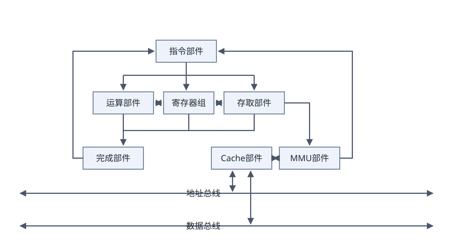

# 2.2 计算机硬件

## 2.2.1 计算机硬件组成

计算机组成结构 (Computer Architecture) 源于冯·诺依曼计算机结构，该结构成为现代计算机系统发展的基础。冯·诺依曼计算机结构将计算机硬件划分为5部分，但在现实的硬件构成中，控制单元和运算单元被集成为一体，封装为通常意义上的处理器(但处理器并不是只有上述两部分);输入设备和输出设备则经常被设计者集成为一体，按照传输过程被划分为总线、接口和外部设备。下面按照处理器、存储器、总线、接口和外部设备进行阐述。

## 2.2.2 处理器

处理器 (Central Processing Unit,CPU) 作为计算机系统运算和控制的核心部件，经历了长期演化过程。在位宽上由4位处理器发展到64位处理器；在能力构成上从仅具有运算和控制功能发展到集成多级缓存、多种通信总线和接口；在内核上从单核处理器发展为多核、异构多核和众核处理器等。

处理器的指令集按照其复杂程度可分为复杂指令集(Complex Instruction Set Computers,CISC) 与精简指令集 (Reduced Instruction Set Computers,RISC) 两类。CISC以Intel、AMD的x86CPU为代表，RISC以ARM和Power为代表。随着研究的深入，除了由于历史原因而仍然存在的CISC结构外，RISC已经成为计算机指令集发展的趋势，几乎所有后期出现的指令集均为RISC架构。

典型的处理器系统结构如图 2-3所示。

> 图 2-3 典型的处理器体系结构示意图

在图 2-3中，指令部件通过MMU-Cache的存储结构，从内存等存储设备中取得相应的软件代码指令并完成译码和控制操作，控制存取部件从存储设备中取得新的数据，控制寄存器组为运算器准备有关寄存器数据，并准备好结果寄存器，控制整型、浮点、向量等运算部件开展运算。运算部件、寄存器单元、存取部件将执行结果通知完成部件，并在完成部件中完成结果的排队，由完成部件向指令部件反馈执行结果，控制指令的顺序执行、跳转等时序。

随着微电子技术发展，用于专用目的处理器芯片不断涌现，常见的有图形处理器 (Graphics Processing Unit,GPU) 处理器、信号处理器 (Digital Signal Processor,DSP) 以及现场可编程逻辑门阵列 (Field Programmable Gate Array,FPGA) 等。GPU是一种特殊类型的处理器，具有数百或数千个内核，经过优化可并行运行大量计算，因此近些年在深度学习和机器学习领域得到了广泛应用。DSP专用于实时的数字信号处理，通过采用饱和算法处理溢出问题，通过乘积累加运算提高矩阵运算的效率，以及为傅里叶变换设计专用指令等方法，在各类高速信号采集的设备中得到广泛应用。

随着我国国家政策的日益完善，国产处理器也呈现百花齐放的局面。在市场上占有率和知名度较高的包括龙芯、飞腾、申威、兆芯、国微、国芯、华睿、翔腾微和景嘉微等产品，各自在不同的行业领域中得到应用。

## 2.2.3 存储器

存储器是利用半导体、磁、光等介质制成用于存储数据的电子设备。根据存储器的硬件结构可分为SRAM、DRAM、NVRAM、Flash、EPROM、Disk等。计算机系统中的存储器通常采用分层的体系 (Memory Hierarchy) 结构，按照与处理器的物理距离可分为4个层次。

1. 片上缓存：在处理器核心中直接集成的缓存，一般为SRAM结构，实现数据的快速读取。它容量较小，一般为16kB~512kB, 按照不同的设计可能划分为一级或二级。
2. 片外缓存：在处理器核心外的缓存，需要经过交换互联开关访问，一般也是由SRAM构成，容量较片上缓存略大，可以为256kB~4MB。按照层级被称为L2Cache或L3Cache, 或者称为平台Cache(PlatformCache)。
3. 主存(内存):通常采用DRAM结构，以独立的部件/芯片存在，通过总线与处理器连接。DRAM依赖不断充电维持其中的数据，容量在数百MB至数十GB之间。
4. 外存：可以是磁带、磁盘、光盘和各类Flash等介质器件，这类设备访问速度慢，但容量大，且在掉电后能够保持其数据。不同的介质类型容量有所不同，如Nor Flash容量一般在MB级别，磁盘容量则在GB和TB级别。外存能够在掉电后保持数据，但并非所有介质都能够永久性保存数据，每种介质都有一定的年限，如Flash外存的维持数据的年限在10年左右，光盘年限在数年至数十年，磁盘年限在10年以上，磁带年限为30年以上。

## 2.2.4 总线

总线 (Bus) 是指计算机部件间遵循某一特定协议实现数据交换的形式，即以一种特定格式按照规定的控制逻辑实现部件间的数据传输。

按照总线在计算机中所处的位置划分为内总线、系统总线和外部总线。其中内总线用于各类芯片内部互连，也可称为片上总线 (On-Chip Bus) 或片内总线。系统总线是指计算机中CPU、主存、I/O接口的总线，计算机发展为多总线结构后，系统总线的含义有所变化，狭义的系统总线仍为CPU与主存、通信桥连接的总线；广义上，还应包含计算机系统内，经由系统总线再次级联的总线，常被称为局部总线 (Local Bus)。外部总线是计算机板和外部设备之间，或者计算机系统之间互联的总线，又称为通信总线。总线之间通过桥 (Bridge) 实现连接，它是一种特殊的外设，主要实现总线协议间的转换。总线的性能指标常见的有总线带宽、总线服务质量QoS、总线时延和总线抖动等。

目前，计算机总线存在许多种类，常见的有并行总线和串行总线。并行总线主要包括PCI、PCIe和ATA(IDE) 等，串行总线主要包括USB、SATA、CAN、RS-232、RS-485、RapidIO和以太网等。在一些专业领域中还定义了多种类型的总线，比如航空领域的ARINC429、ARINC659、ARINC664和 MIL-STD-1553B等；工业控制领域的CAN、IEEE1394、PCI、PCIe和VME等。

## 2.2.5 接口

接口是指同一计算机不同功能层之间的通信规则。计算机接口有多种，常见的包括显示类接口 (HDMI、DVI和DVI等),音频输入输出类接口 (TRS、RCA、XLR等),网络类接口(RJ45、FC等),PS/2接口，USB接口，SATA接口，LPT打印接口和RS-232接口等。此外，像离散量接口与A/D转换接口等这类接口一般属于非标准接口，而是随需求而设计。

对于总线而言，一种总线可能存在多种接口，比如，以太网总线可以通过RJ-45或同轴电缆与之连接，PCIe总线则具有多种形态的接口实现连接。

## 2.2.6 外部设备

外部设备也称为外围设备，是计算机的非必要设备(但各类计算机必然会有一些)。现代计算机的外部设备种类日益丰富，包括所有的输入输出设备以及部分存储设备(即外存)。

常见的外部设备包括键盘、鼠标、显示器、扫描仪、摄像头、麦克风、打印机、光驱、各型网卡和各型存储卡/盘等。在移动和穿戴设备中，常见的包括加速计、GPS、陀螺仪、感光设备和指纹识别设备等。在工业控制、航空航天和医疗等领域，还存在更多种类的外部设备，例如测温仪、测速仪、轨迹球、各型操作面板、红外/NFC等感应设备、各种场强测量设备、功率驱动装置、各型机械臂、各型液压装置、油门杆和驾驶杆，等等。

随着人们日益增长的物质需求，还会有更多形态各异、功能多样的外部设备产生。各型外部设备虽然种类多样，但都是通过接口实现与计算机主体的连接，并通过指令、数据实现预期的功能。
