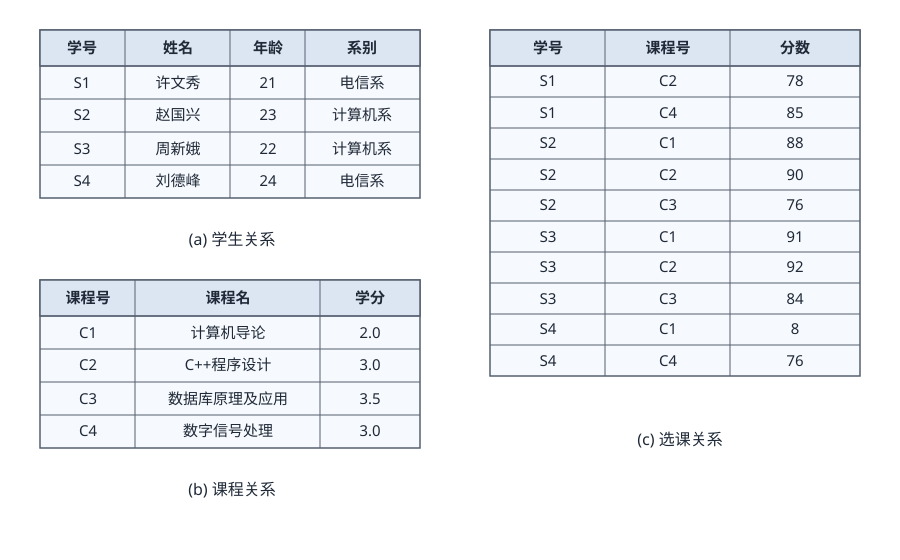

# 2.3 计算机软件

早期的计算机软件和计算机程序 (Computer Program) 的概念几乎不加区别，后来计算机软件的概念在计算机程序的基础上得到了延伸。计算机软件是指计算机系统中的程序及其文档，是计算任务的处理对象和处理规则的描述。任何以计算机为处理工具的任务都是计算任务。处理对象是数据(如数字、文字、图形、图像和声音等，他们只是表示，而无含义)或信息(数据及有关的含义)。处理规则一般指处理的动作和步骤，文档是为了便于了解程序所需的阐述性资料。

## 2.3.1 计算机软件概述

软件系统是指在计算机硬件系统上运行的程序、相关的文档资料和数据的集合。计算机软件用来扩充计算机系统的功能，提高计算机系统的效率。按照软件所起的作用和需要的运行环境的不同，通常将计算机软件分为系统软件和应用软件两大类。

系统软件是为整个计算机系统配置的不依赖特定应用领域的通用软件。这些软件对计算机系统的硬件和软件资源进行控制和管理，并为用户使用和其他应用软件的运行提供服务。也就是说，只有在系统软件的作用下，计算机硬件才能协调工作，应用软件才能运行。根据系统软件功能的不同，可将其划分为：操作系统、程序设计语言翻译系统、数据库管理系统和网络软件等。

应用软件是指为某类应用需要或解决某个特定问题而设计的软件，如图形图像处理软件、财务软件、游戏软件和各种软件包等。在企事业单位或机构中，应用软件发挥着巨大的作用，承担了许多计算任务，如人事管理、财务管理和图书管理等。按照应用软件使用面的不同，可进一步把应用软件分为专用的应用软件和通用的应用软件两类。

## 2.3.2 操作系统

操作系统是计算机系统的资源管理者，它包含对系统软、硬件资源实施管理的一组程序，其首要作用就是通过CPU管理、存储管理、设备管理和文件管理对各种资源进行合理地分配，改善资源的共享和利用程度，最大限度地发挥计算机系统的工作效率，提高计算机系统在单位时间内处理工作的能力。操作系统是配置在计算机硬件上的第1层软件，它向下管理裸机及其中的文件，向上为其他的系统软件(汇编程序、编译程序、数据库管理系统等)和大量应用软件提供支持，以及为用户提供方便使用系统的接口。

### 1. 操作系统的组成

操作系统是一种大型、复杂的软件产品，它们通常由操作系统内核 (Kernel) 和其他许多附加的配套软件所组成，包括图形用户界面程序、常用的应用程序(如日历、计算器、资源管理器和网络浏览器等)、实用程序(任务管理器、磁盘清理程序、杀毒软件和防火墙等)以及为支持应用软件开发和运行的各种软件构件(如应用框架、编译器和程序库等)。

操作系统内核指的是能提供进程管理(任务管理)、存储管理、文件管理和设备管理等功能的那些软件模块，它们是操作系统中最基本的部分，用于为众多应用程序访问计算机硬件提供服务。由于应用程序直接对硬件操作非常复杂，所以操作系统内核对硬件设备进行了抽象，为应用软件提供了一套简洁、统一的接口(称为系统调用接口或应用程序接口API)。内核通常都驻留在内存中，它以CPU的最高优先级运行，能执行指令系统中的特权指令，具有直接访问各种外设和全部主存空间的特权，负责对系统资源进行管理和分配。

### 2. 操作系统的作用

操作系统主要有以下3个方面的重要作用。

1. 管理计算机中运行的程序和分配各种软硬件资源。计算机中一般总有多个程序在运行，这些程序在运行时都可能要求使用系统中的资源(如访问硬盘，在屏幕上显示信息等),此时操作系统就承担着资源的调度和分配任务，以避免冲突，保证程序正常有序地运行。操作系统的资源管理功能主要包括处理器管理、存储管理、文件管理、I/O设备管理等几个方面。
2. 为用户提供友善的人机界面。人机界面的任务是实现用户与计算机之间的通信(对话)。几乎所有操作系统都向用户提供图形用户界面 (GUI), 它通过多个窗口分别显示正在运行的各个程序的状态，采用图标 (Icon) 来形象地表示系统中的文件、程序和设备等对象，用户借助单击“菜单”的方法来选择要求系统执行的命令或输入某个参数，利用鼠标器或触摸屏控制屏幕光标的移动，并通过单击操作以启动某个操作命令的执行，甚至还可以采用拖放方式执行所需要的操作。这些措施使用户能够比较直观、灵活、有效地使用计算机。
3. 为应用程序的开发和运行提供一个高效率的平台。安装了操作系统之后，实际上呈现在应用程序和用户面前的是一台“虚拟计算机”。操作系统屏蔽了几乎所有物理设备的技术细节，它以规范、高效的方式(例如系统调用、库函数等)向应用程序提供了有力的支持，从而为开发和运行其他系统软件及各种应用软件提供了一个平台。

除了上述3个方面的作用之外，操作系统还具有辅导用户操作(帮助功能)、处理软硬件错误、监控系统性能、保护系统安全等许多作用。总之，有了操作系统，计算机才能成为一个高效、可靠、通用的数据处理系统。

### 3. 操作系统的特征

#### 1. 并发性

在多道程序环境下，并发性是指在一段时间内，宏观上有多个程序同时运行，但实际上在单CPU的运行环境，每一个时刻只有一个程序在执行。因此，从微观上来说，各个程序是交替、轮流执行的，如果计算机系统中有多个CPU, 则可将多个程序分配到不同CPU上实现并行运行。

#### 2. 共享性

共享是指操作系统中的资源(包括硬件资源和信息资源)可以被多个并发执行的进程(线程)共同使用，而不是被一个进程所独占。出于经济上的考虑，一次性向每个用户程序分别提供它所需的全部资源不但是浪费的，有时也是不可能的。现实的方法是让操作系统和多个用户程序共用一套计算机系统的所有资源，因此必然会产生共享资源的需要。共享资源的方式可以分为同时共享和互斥共享。

#### 3. 虚拟性

虚拟性是指操作系统中的一种管理技术，它是把物理上的一个实体变成逻辑上的多个对应物，或把物理上的多个实体变成逻辑上的一个对应物的技术。前者是实际存在的，而后者是虚构假想的，是用户感觉上的东西。采用虚拟技术的目的是为用户提供易于使用且方便高效的操作环境。

#### 4. 不确定性

在多道程序环境中，允许多个进程并发执行，但由于资源有限，在多数情况下进程的执行不是一贯到底的，而是“走走停停”。例如一个进程，在CPU上运行一段时间后，由于等待资源或某事件发生，它被暂停执行，将CPU转让给另一个进程执行。系统中的进程何时执行，何时暂停，以什么样的速度向前推进，进程总共要花多少时间执行才能完成，这些都是不可预知的。或者说该进程是以不确定的方式运行的，其导致的直接后果是程序执行结果可能不唯一。

### 4. 操作系统的分类

通常，操作系统可分为批处理操作系统、分时操作系统、实时操作系统、网络操作系统、分布式操作系统、微型计算机操作系统和嵌入式操作系统等类型。

#### 1. 批处理操作系统

批处理操作系统分为单道批处理和多道批处理。

单道批处理操作系统是一种早期的操作系统，用户可以向系统提交多个作业，“单道”的含义是指一次只有一个作业装入内存执行。作业由用户程序、数据和作业说明书(作业控制语言)3个部分组成。当一个作业运行结束后，随即自动调入同批的下一个作业，从而节省了作业之间的人工干预时间，提高了资源的利用率。

多道批处理操作系统允许多个作业装入内存执行，在任意一个时刻，作业都处于开始点和终止点之间。每当运行中的一个作业由于输入/输出操作需要调用外部设备时，就把CPU交给另一个等待运行的作业，从而将主机与外部设备的工作由串行改变为并行，进一步避免了因主机等待外设完成任务而浪费宝贵的CPU时间。多道批处理系统主要有3个特点：多道、宏观上并行运行和微观上串行运行。

#### 2. 分时操作系统

在分时操作系统中，一个计算机系统与多个终端设备连接。分时操作系统是将CPU的工作时间划分为许多很短的时间片，轮流为各个终端的用户服务。例如，一个带20个终端的分时系统，若每个用户每次分配一个50ms的时间片，则每隔 1s即可为所有的用户服务一遍。因此，尽管各个终端上的作业是断续运行的，但由于操作系统每次对用户程序都能做出及时响应，因此用户感觉整个系统均归其一人占用。

分时系统主要有4个特点：多路性、独立性、交互性和及时性。

#### 3. 实时操作系统

实时是指计算机对于外来信息能够以足够快的速度进行处理，并在被控对象允许的时间范围内做出快速反应。实时系统对交互能力要求不高，但要求可靠性有保障。

实时系统分为实时控制系统和实时信息处理系统。实时控制系统主要用于生产过程的自动控制，例如数据自动采集、武器控制、火炮自动控制、飞机自动驾驶和导弹的制导系统等。实时信息处理系统主要用于实时信息处理，例如飞机订票系统、情报检索系统等。

#### 4. 网络操作系统

网络操作系统是使联网计算机能方便而有效地共享网络资源，为网络用户提供各种服务的软件和有关协议的集合。因此，网络操作系统的功能主要包括高效、可靠的网络通信；对网络中共享资源(在LAN中有硬盘、打印机等)的有效管理；提供电子邮件、文件传输、共享硬盘和打印机等服务；网络安全管理；提供互操作能力。

一个典型的网络操作系统的特征包括硬件独立性和多用户支持等。其中，硬件独立性是指网络操作系统可以运行在不同的网络硬件上，可以通过网桥或路由器与其他网络连接；多用户支持，应能同时支持多个用户对网络的访问，应对信息资源提供完全的安全和保护功能；支持网络实用程序及其管理功能，如系统备份、安全管理、容错和性能控制；多种客户端支持；提供目录服务，以单一逻辑的方式让用户访问位于世界范围内的所有网络服务和资源的技术；支持多种增值服务，如文件服务、打印服务、通信服务和数据库服务等。

#### 5. 分布式操作系统

分布式计算机系统是由多个分散的计算机经连接而成的计算机系统，系统中的计算机无主、次之分，任意两台计算机可以通过通信交换信息。通常，为分布式计算机系统配置的操作系统称为分布式操作系统。

分布式操作系统能直接对系统中的各类资源进行动态分配和调度、任务划分、信息传输协调工作，并为用户提供一个统一的界面与标准的接口，用户通过这一界面实现所需要的操作和使用系统资源，使系统中若干台计算机相互协作完成共同的任务，有效地控制和协调诸任务的并行执行。

分布式操作系统是网络操作系统的更高级形式，它保持网络系统所拥有的全部功能，同时又有透明性、可靠性和高性能等特性。

#### 6. 微型计算机操作系统

微型计算机操作系统简称微机操作系统，常用的有Windows、Mac OS、Linux。

#### 7. 嵌入式操作系统

嵌入式操作系统运行在嵌入式智能设备环境中，对整个智能硬件以及它所操作、控制的各种部件装置等资源进行统一协调、处理、指挥和控制，其主要特点如下。

- 微型化：从性能和成本角度考虑，希望占用的资源和系统代码量少，如内存少、字长短、运行速度有限、能源少(用微小型电池)。
- 可定制：从减少成本和缩短研发周期考虑，要求嵌入式操作系统能运行在不同的微处理器平台上，能针对硬件变化进行结构与功能上的配置，以满足不同应用需要。
- 实时性：嵌入式操作系统主要应用于过程控制、数据采集、传输通信、多媒体信息及关键要害领域需要迅速响应的场合，所以对实时性要求较高。
- 可靠性：系统构件、模块和体系结构必须达到应有的可靠性，对关键要害应用还要提供容错和防故障措施。
- 易移植性：为了提高系统的易移植性，通常采用硬件抽象层 (Hardware Abstraction Level,HAL) 和板级支撑包 (Board Support Package,BSP) 的底层设计技术。

常见的嵌入式实时操作系统有VxWorks、μClinux、PalmOS、WindowsCE、μC/OS-II和eCos等。

## 2.3.3 数据库

在信息处理领域，由于数据量庞大，如何有效组织、存储数据对实现高效率的信息处理至关重要。数据库技术是目前最有效的数据管理技术。数据库 (DataBase,DB) 是指长期存储在计算机内、有组织的、统一管理的相关数据的集合。它不仅描述事物的数据本身，而且还包括相关事物之间的联系。数据库可以直观地理解为存放数据的仓库，只不过这个仓库是在计算机的存储设备上，而且数据是按一定格式存放的，具有较小的冗余度、较高的数据独立性和易扩展性，可为多个用户共享。

早期数据库种类有3种，分别是层次式数据库、网络式数据库和关系型数据库。目前最常见的数据库种类是关系型数据库和非关系型数据库。根据数据库存储体系分类，还可分为关系型数据库、键值 (Key-Value) 数据库、列存储数据库、文档数据库和搜索引擎数据库等类型。

1. 关系型数据库。这种类型的数据库是最传统的数据库类型，关系型数据库模型是把复杂的数据结构归结为简单的二元关系，在数据库中，对数据的操作几乎全部建立在一个或多个关系表格上。在大型系统中通常有多个表，且表之间有各种关系。实际使用就是通过对这些关联的表格进行分类、合并、连接或选取等运算来实现数据库的管理。
2. 键值数据库。键值数据库是一种非关系型数据库，它使用简单的键值方法来存储数据。
键值数据库将数据存储为键值对集合，其中键作为唯一标识符。

3. 列存储数据库。列式存储 (Column-Based) 是相对于传统关系型数据库的行式存储(Row-Basedstorage) 来说的。简单来说两者的区别就是对表中数据的存储形式的差异。
4. 文档数据库。此类数据库可存放并获取文档，可以是XML、JSON、BSON等格式，这些文档具备可述性 (Self-Describing), 呈现分层的树状结构 (Hicrarchical Tree Data Structure),可以包含映射表、集合和纯量值。数据库中的文档彼此相似，但不必完全相同。文档数据库所存放的文档，就相当于键值数据库所存放的“值”。文档数据库可视为其值可查的键值数据库。

5. 搜索引擎数据库。搜索引擎数据库是应用在搜索引擎领域的数据存储形式，由于搜索引擎会爬取大量的数据，并以特定的格式进行存储，这样在检索的时候才能保证性能最优。

下面简要介绍常用的关系数据库和分布式数据库。

### 1. 关系数据库

数据模型是数据特征的抽象，它是对数据库组织方式的一种模型化表示，是数据库系统的核心与基础。它具有数据结构、数据操作和完整性约束条件三要素。

关系可以理解为二维表。一个关系模型就是指用若干关系表示实体及其联系，用二维表的形式存储数据。例如，对某高校学生的选课(不同年级甚至同一年级学生所选课程可以不同)进行管理，可以用二维表表示，如图 2-4所示。

> 图 2-4 二维表表示

用关系表示如下，其中带下画线的属性为主码，主码能唯一确定某个实体，如学号能唯一确定某个学生。

- 学生(**学号**，姓名，年龄，系别)
- 课程(**课程号**，课程名，学分)
- 选课(**学号**，**课程号**，分数)

### 1. 关系数据库设计的特点及方法

数据库设计是指对于一个给定的应用环境构造最优的数据库，建立数据库及其应用系统，使之能有效地存储数据，满足各种用户的需求。数据库设计包括结构特性和行为特性的设计两方面的内容。

数据库设计的很多阶段都可以和软件工程的各阶段对应起来，数据库设计的特点有：从数据结构即数据模型开始，并以数据模型为核心展开，这是数据库设计的一个主要特点；静态结构设计与动态行为设计分离；试探性；反复性和多步性。

目前已有的数据库设计方法可分为4类，即直观设计法、规范设计法、计算机辅助设计法和自动化设计法。常用的有基于3N F的设计方法、基于实体联系 (E-R) 模型的数据库设计方法、基于视图概念的数据库设计方法、面向对象的关系数据库设计方法、计算机辅助数据库设计方法、敏捷数据库设计方法等。

### 2. 关系数据库设计的基本步骤

数据库设计分为需求分析、概念结构设计、逻辑结构设计、物理结构设计、应用程序设计和运行维护6个阶段，如图 2-5所示。

> 图 2-5 数据库的设计步骤

需求分析阶段的任务是对现实世界要处理的对象(组织、部门和企业等)进行详细调查，在了解现行系统的概况和确定新系统功能的过程中，收集支持系统目标的基础数据及其处理方法。需求分析是在用户调查的基础上，通过分析逐步明确用户对系统的需求，包括数据需求和围绕这些数据的业务处理需求。

数据库概念结构设计是在需求分析的基础上，依照需求分析中的信息需求，对用户信息加以分类、聚集和概括，建立信息模型，并依照选定的数据库管理系统软件，把它们转换为数据的逻辑结构，再依照软硬件环境，最终实现数据的合理存储。这一过程也称为数据建模。

设计数据库概念模型的最著名、最常用的方法是E-R方法。采用E-R方法的数据库概念结构设计可分为三步：设计局部E-R模型、设计全局E-R模型以及全局E-R模型的优化。

逻辑结构设计是在概念结构设计基础上进行的数据模型设计，可以是层次、网状模型和关系模型。逻辑结构设计阶段的主要任务是确定数据模型，将E-R图转换为指定的数据模型，确定完整性约束，确定用户视图。

数据库在物理设备上的存储结构与存取方法称为数据库的物理结构。数据库的物理结构设计是对已确定的数据库逻辑结构，利用DBMS所提供的方法、技术，以较优的存储结构和数据存取路径、合理的数据存放位置以及存储分配，设计出一个高效的、可实现的数据库物理结构。

数据库应用系统开发是DBMS的二次开发，一方面是对用户信息的存储；另一方面就是对用户处理要求的实现。

数据库应用程序设计要做的工作有选择设计方法、制订开发计划、选择系统架构和设计安全性策略。在应用程序设计阶段，设计方法有结构化设计方法和面向对象设计方法两种。安全性策略主要是指硬件平台、操作系统、数据库系统、网络及应用系统的安全。

数据库的正常运行和优化也是数据库设计的内容之一。在数据库运行维护阶段要做的工作主要有数据库的转储和恢复，数据库的安全性和完整性控制，数据库性能的监督、分析和改造，数据库的重组和重构等。

### 2. 分布式数据库

分布式数据库系统 (Distributed DataBase System,DDBS) 是针对地理上分散，而管理上又需要不同程度集中管理的需求而提出的一种数据管理信息系统。满足分布性、逻辑相关性、场地透明性和场地自治性的数据库系统被称为完全分布式数据库系统。

分布式数据库系统的特点是数据的集中控制性、数据独立性、数据冗余可控性、场地自治性和存取的有效性。

### 1. 分布式数据库体系结构

我国在多年研究与开发分布式数据库及制定《分布式数据库系统标准》中，提出了把分布式数据库抽象为4层的结构模式，如图 2-6所示。这种结构模式得到了国内外一定程度的支持和认同。

> 图 2-6 分布式数据库结构模式

4层模式划分为全局外层、全局概念层、局部概念层和局部内层，在各层间还有相应的层间映射。这种4层模式适用于同构型分布式数据库系统，也适用于异构型分布式数据库系统。

### 2. 分布式数据库的应用

分布式数据库的应用领域有分布式计算、Internet应用、数据仓库、数据复制以及全球联网查询等，Sybase公司的Replication Server即是一种典型的分布式数据库系统。

### 3. 常用数据库管理系统

计算机科学技术不断发展，数据库管理系统也不断发展进化，MySQLAB公司(2009年被Oracle公司收购)的MySQL、Microsoft公司的Access等是小型关系数据库管理系统的代表，Oracle公司的Oracle、Microsoft公司的 SQL Server、IBM公司的DB2等是功能强大的大型关系数据库管理系统的代表。

### 1. Oracle

Oracle是一种适用于大型、中型和微型计算机的关系数据库管理系统。Oracle的结构包括数据库的内部结构、外存储结构、内存储结构和进程结构。在Oracle中，数据库不仅指物理上的数据，还包括处理这些数据的程序，即DBMS本身。Oracle使用PL/SQL(Procedural Language/SQL) 语言执行各种操作。Oracle除了以关系格式存储数据外，Oracle 8以上的版本还支持面向对象的结构(如抽象数据类型)。

Oracle产品主要包括数据库服务器、开发工具和连接产品三类。Oracle还提供了一系列的工具产品，如逻辑备份工具Export、Import等。

### 2. IBM DB2

DB2是IBM的一种分布式数据库解决方案。简单地说，DB2就是IBM开发的一种大型关系型数据库平台，它支持多用户或应用程序在同一条SQL语句中查询不同Database甚至不同DBMS 中的数据。

DB2核心数据库的特色有支持面向对象编程，支持多媒体应用程序，支持备份和恢复功能，支持存储过程和触发器，支持SQL查询，支持异构分布式数据库访问，支持数据复制。

DB2采用多进程多线索体系结构，可运行于多种操作系统之上。IBM还提供了Visualizer、Visualage、Visualgen等开发工具。

### 3. Sybase

Sybase是美国SYBASE公司在20世纪80年代中期推出的客户机/服务器 (Client/Server,C/S) 结构的关系数据库系统，也是世界上第一个真正的基于客户机/服务器结构的RDBMS产品。

Sybase数据库主要由三部分组成：进行数据库管理和维护的联机关系数据库管理系统Sybase SQLServer, 支持数据库应用系统建立与开发的一组前端工具Sybase SQLToolset, 可把异构环境下其他厂商的应用软件和任何类型的数据连接在一起的接口Sybase OpenClient/OpenServer。Sybase提供了Sybase Adaptive Server Enterprise高性能企业智能型关系数据库管理系统、EAServer电子商务解决方案应用服务器、系统分析设计工具PowerDesigner和应用开发工具PowerBuilder。

### 4. Microsoft SQL Server

Microsoft SQL Server是一种典型的关系型数据库管理系统，可运行于多个操作系统上，它使用Transact-SQL语言完成数据操作。

SQL Server的基本服务器组件包括Open Data Services、MS SQL Server、SQL Server Agent和MSDTC(Microsoft Distributed Transaction Coordinator)。

SQL Server数据平台包括以下工具：关系型数据库、复制服务、通知服务、集成服务、分析服务、报表服务、管理工具和开发工具。

### 4. 大型数据库管理系统的特点

大型数据库管理系统主要有如下7个特点。

1. 基于网络环境的数据库管理系统。可以用于C/S结构的数据库应用系统，也可以用于B/S结构的数据库应用系统。
2. 支持大规模的应用。可支持数千个并发用户、多达上百万的事务处理和超过数百GB的数据容量。
3. 提供的自动锁功能使得并发用户可以安全而高效地访问数据。
4. 可以保证系统的高度安全性。
5. 提供方便而灵活的数据备份和恢复方法及设备镜像功能，还可以利用操作系统提供容错功能，确保设计良好的应用中的数据在发生意外的情况下可以最大限度地被恢复。
6. 提供多种维护数据完整性的手段。
7. 提供了方便易用的分布式处理功能。

## 2.3.4 文件系统

### 1. 文件与文件系统

文件 (File) 是具有符号名的、在逻辑上具有完整意义的一组相关信息项的集合，例如，一个源程序、一个目标程序、编译程序、一批待加工的数据和各种文档等都可以各自组成一个文件。文件是一种抽象机制，它隐藏了硬件和实现细节，提供了将信息保存在外存上而且便于以后读取的手段，使用户不必了解信息存储的方法、位置以及存储设备实际操作方式便可存取信息。一个文件包括文件体和文件说明。文件体是文件真实的内容；文件说明是操作系统为了管理文件所用到的信息，包括文件名、文件内部标识、文件类型、文件存储地址、文件长度、访问权限、建立时间和访问时间等。

文件系统是操作系统中实现文件统一管理的一组软件和相关数据的集合，是专门负责管理和存取文件信息的软件机构。文件系统的功能包括按名存取，即用户可以“按名存取”,而不是“按地址存取”;统一的用户接口，在不同设备上提供同样的接口，方便用户操作和编程；并发访问和控制，在多道程序系统中支持对文件的并发访问和控制；安全性控制，在多用户系统中的不同用户对同一文件可有不同的访问权限；优化性能，采用相关技术提高系统对文件的存储效率、检索和读/写性能；差错恢复，能够验证文件的正确性，并具有一定的差错恢复能力。

### 2. 文件的类型

1. 按文件的性质和用途分类可将文件分为系统文件、库文件和用户文件。
2. 按信息保存期限分类可将文件分为临时文件、档案文件和永久文件。

3. 按文件的保护方式分类可将文件分为只读文件、读/写文件、可执行文件和不保护文件。
4. UNIX系统将文件分为普通文件、目录文件和设备文件(特殊文件)。
目前常用的文件系统类型有FAT、VFAT、NTFS、Ext2和HPFS等。

文件分类的目的是对不同文件进行管理，提高系统效率，提高用户界面友好性。当然，根据文件的存取方法和物理结构的不同，还可以将文件分为不同的类型。

### 3. 文件的结构和组织

文件的结构是指文件的组织形式。从用户角度看到的文件组织形式称为文件的逻辑结构，文件系统的用户只要知道所需文件的文件名就可以存取文件中的信息，而无须知道这些文件究竟存放在什么地方。从实现的角度看，文件在文件存储器上的存放方式称为文件的物理结构。

### 1. 文件的逻辑结构

文件的逻辑结构可分为两大类：一是有结构的记录式文件，它是由一个以上的记录构成的文件；二是无结构的流式文件，它是由一串顺序字符流构成的文件。

在记录式文件中，所有的记录通常都是描述一个实体集的，有着相同或不同数目的数据项，记录的长度可分为定长(指文件中所有记录的长度相同)和不定长(指文件中各记录的长度不相同)两类。

无结构的流式文件的文件体为字节流，不划分记录。无结构的流式文件通常采用顺序访问方式，并且每次读/写访问可以指定任意数据长度，其长度以字节为单位。对于流式文件的访问，是利用读/写指针指出下一个要访问的字符。可以把流式文件看作是记录式文件的一个特例。

### 2. 文件的物理结构

文件的物理结构是指文件的内部组织形式，即文件在物理存储设备上的存放方法。由于文件的物理结构决定了文件在存储设备上的存放位置，所以文件的逻辑块号到物理块号的转换也是由文件的物理结构决定的。根据用户和系统管理上的需要，可采用多种方法来组织文件，下面介绍几种常见的文件物理结构。

1. 连续结构。
连续结构也称顺序结构，它将逻辑上连续的文件信息(如记录)依次存放在连续编号的物理块上。只要知道文件的起始物理块号和文件的长度，就可以很方便地进行文件的存取。

2. 链接结构。
链接结构也称串联结构，它是将逻辑上连续的文件信息(如记录)存放在不连续的物理块上，每个物理块设有一个指针指向下一个物理块。因此，只要知道文件的第1个物理块号，就可以按链指针查找整个文件。

3. 索引结构。
在采用索引结构时，将逻辑上连续的文件信息(如记录)存放在不连续的物理块中，系统为每个文件建立一张索引表。索引表记录了文件信息所在的逻辑块号对应的物理块号，并将索引表的起始地址放在与文件对应的文件目录项中。

4. 多个物理块的索引表。
索引表是在文件创建时由系统自动建立的，并与文件一起存放在同一文件卷上。根据一个文件大小的不同，其索引表占用物理块的个数不等，一般占一个或几个物理块。多个物理块的索引表可以有两种组织方式：链接文件和多重索引方式。

### 4. 文件存取的方法和存储空间的管理

#### 1. 文件的存取方法

文件的存取方法是指读/写文件存储器上的一个物理块的方法。通常有顺序存取和随机存取两种方法。顺序存取方法是指对文件中的信息按顺序依次进行读/写；随机存取方法是指对文件中的信息可以按任意的次序随机地读/写。

#### 2. 文件存储空间的管理

要将文件保存到外部存储器(简称外存或辅存)上，首先必须知道存储空间的使用情况，即哪些物理块是被“占用”的，哪些是“空闲”的。特别是对大容量的磁盘存储空间被多用户共享时，用户执行程序经常要在磁盘上存储文件和删除文件，因此，文件系统必须对磁盘空间进行管理。外存空闲空间管理的数据结构通常称为磁盘分配表 (Disk Allocation Table)。常用的空闲空间管理方法有空闲区表、位示图和空闲块链3种。

1. 空闲区表。将外存空间上的一个连续的未分配区域称为“空闲区”。操作系统为磁盘外存上的所有空闲区建立一张空闲表，每个表项对应一个空闲区，空闲表中包含序号、空闲区的第1块号、空闲块的块数和状态等信息，如表 2-1所示。它适用于连续文件结构。

> 表 2-1 空闲区表

| 序号 | 第1个空闲块号 | 空闲块数 | 状态 |
|---|---|---|---|
| 1 | 18 | 5 | 可用 |
| 2 | 29 | 8 | 可用 |
| 3 | 105 | 19 | 可用 |
| 4 | — | — | 未用 |

2. 位示图。这种方法是在外存上建立一张位示图 (Bitmap)，记录文件存储器的使用情况。每一位对应文件存储器上的一个物理块，取值 0 和 1 分别表示空闲和占用。例如，某文件存储器上位示图的大小为 n，物理块依次编号为 0,1,2,…。假如计算机系统中字长为32位，那么在位示图中的第0个字(逻辑编号)对应文件存储器上的0, 1, 2, …, 31号物理块；第1个字对应文件存储器上的32, 33, 34, …, 63号物理块，依此类推，如图2-7所示。

> 图 2-7 位示图例

这种方法的主要特点是位示图的大小由磁盘空间的大小(物理块总数)决定，位示图的描述能力强，适合各种物理结构。

3. 空闲块链。每个空闲物理块中有指向下一个空闲物理块的指针，所有空闲物理块构成一个链表，链表的头指针放在文件存储器的特定位置上(如管理块中),不需要磁盘分配表，节省空间。每次申请空闲物理块只需根据链表的头指针取出第1个空闲物理块，根据第一个空闲物理块的指针可找到第2个空闲物理块，依此类推。
4. 成组链接法。UNIX系统采用该方法。例如，在实现时系统将空闲块分成若干组，每100个空闲块为一组，每组的第1个空闲块登记了下一组空闲块的物理盘块号和空闲块总数。
假如某个组的第1个空闲块号等于0,意味着该组是最后一组，无下一组空闲块。

### 5. 文件共享和保护

#### 1. 文件的共享

文件共享是指不同用户进程使用同一文件，它不仅是不同用户完成同一任务所必须的功能，还可以节省大量的主存空间，减少由于文件复制而增加的访问外存次数。文件共享有多种形式，采用文件名和文件说明分离的目录结构有利于实现文件共享。常见的文件链接有硬链接和符号链接两种。

1. 硬链接。文件的硬链接是指两个文件目录表目指向同一个索引结点的链接，该链接也称基于索引结点的链接。换句话说，硬链接是指不同文件名与同一个文件实体的链接。文件硬链接不利于文件主删除它拥有的文件，因为文件主要删除它拥有的共享文件，必须首先删除(关闭)所有的硬链接，否则就会造成共享该文件的用户的目录表目指针悬空。
2. 符号链接。符号链接建立新的文件或目录，并与原来文件或目录的路径名进行映射，当访问一个符号链接时，系统通过该映射找到原文件的路径，并对其进行访问。采用符号链接可以跨越文件系统，甚至可以通过计算机网络连接到世界上任何地方的机器中的文件，此时只须提供该文件所在的地址以及在该机器中的文件路径。

#### 2. 文件的保护

文件系统对文件的保护常采用存取控制的方式进行。所谓存取控制，就是规定不同的用户对文件的访问有不同的权限，以防止文件被未经文件主同意的用户访问。

1. 存取控制矩阵。理论上，存取控制的方法可用存取控制矩阵实现，它是一个二维矩阵，一维列出计算机的全部用户，另一维列出系统中的全部文件，矩阵中的每个元素A,表示第i个用户对第j个文件的存取权限。通常，存取权限有可读R、可写W、可执行X 以及它们的组合，如表 2-2所示。

> 表 2-2 存取控制矩阵

| 用户 \ 文件 | ALPHA | BETA | REPORT | SQRT | … |
|---|---|---|---|---|---|
| 张军 | RWX | — | R-X | — | … |
| 王伟 | — | RWX | R-X | R-X | … |
| 赵凌 | — | — | — | RWX | … |
| 李晓钢 | R-X | — | RWX | R-X | … |
| … | … | … | … | … | … |

2. 存取控制表。存取控制矩阵由于太大往往无法实现。一个改进的办法是按用户对文件的访问权力的差别对用户进行分类，由于某一文件往往只与少数几个用户有关，所以这种分类方法可使存取控制表简化。UNIX系统就是使用了这种存取控制表方法，它把用户分成三类：
文件主、同组用户和其他用户，每类用户的存取权限为可读、可写、可执行以及它们的组合。

3. 用户权限表。改进存取控制矩阵的另一种方法是以用户或用户组为单位将用户可存取的文件集中起来存入表中，这称为用户权限表。表中的每个表目表示该用户对应文件的存取权限，这相当于存取控制矩阵一行的简化。
4. 密码。在创建文件时，由用户提供一个密码，在文件存入磁盘时用该密码对文件的内容加密。在进行读取操作时，要对文件进行解密，只有知道密码的用户才能读取文件。

## 2.3.5 网络协议

在计算机网络中要实现资源共享以及信息交换，必须实现不同系统中实体的通信。两个实体要想成功通信，它们必须具有相同的语言，在计算机网络中称为协议(或规程)。所谓协议，指的是网络中的计算机与计算机进行通信时，为了能够实现数据的正常发送与接收必须要遵循的一些事先约定好的规则(标准或约定),在这些规程中明确规定了通信时的数据格式、数据传送时序以及相应的控制信息和应答信号等内容。

常用的网络协议包括局域网协议 (LAN)、广域网协议 (WAN)、无线网协议和移动网协议。互联网使用的是TCP/IP协议簇。

## 2.3.6 中间件

由于应用软件是在系统软件基础上开发和运行的，而系统软件又有多种，如果每种应用软件都要提供能在不同系统上运行的版本，开发成本将大大增加。因而出现了一类称为“中间件”(Middleware) 的软件，它们作为应用软件与各种操作系统之间使用的标准化编程接口和协议，可以起承上启下的作用，使应用软件的开发相对独立于计算机硬件和操作系统，并能在不同的系统上运行，实现相同的应用功能。中间件是基础软件的一大类，属于可复用软件的范畴。顾名思义，中间件处在操作系统、网络和数据库之上，应用软件的下层，如图 2-8所示。也有人认为中间件应该属于操作系统中的一部分。

> 图 2-8 中间件图示

### 1. 中间件分类

按照中间件在分布式系统中承担的职责不同，可以划分以下几类中间件产品。

### 1. 通信处理(消息)中间件

正如，人们通过安装红绿灯，设立交通管理机构，制定出交通规则，才能保证道路交通畅通一样，在分布式系统中，人们要建网和制定出通信协议，以保证系统能在不同平台之间通信，实现分布式系统中可靠的、高效的、实时的跨平台数据传输，这类中间件称为消息中间件，也是市面上销售额最大的中间件产品，目前主要产品有BEA的eLink、IBM的MQSeries、TongLINK等。实际上，一般的网络操作系统如Windows已包含了其部分功能。

### 2. 事务处理(交易)中间件

正如城市交通中要运行各种运载汽车，以此来完成日常的运载工作，同时随时监视汽车的运行，在出现故障时及时排堵保畅。在分布式事务处理系统中，经常要处理大量事务，特别是OLTP中，每项事务常常要多台服务器上的程序按顺序协调完成，一旦中间发生某种故障，不但要完成恢复工作，而且要自动切换系统保证系统永不停机，实现高可靠性运行。要使大量事务在多台应用服务器上能实时并发运行，并进行负载平衡的调度，实现与昂贵的可靠性机和大型计算机系统的同等功能，为了实现这个目标，要求中间件系统具有监视和调度整个系统的功能。

BEA的Tuxedo由此而闻名，它成为增长率最高的厂商。

### 3. 数据存取管理中间件

在分布式系统中，重要的数据都集中存放在数据服务器中，它们可以是关系型的、复合文档型、具有各种存放格式的多媒体型，或者是经过加密或压缩存放的，该中间件将为在网络上虚拟缓冲存取、格式转换、解压等带来方便。

### 4. Web服务器中间件

浏览器图形用户界面已成为公认规范，然而它的会话能力差，不擅长做数据的写入任务，受HTTP协议的限制多等，就必须对其进行修改和扩充，因此出现了Web服务器中间件，如SilverStream公司的产品。

### 5. 安全中间件

一些军事、政府和商务部门上网的最大障碍是安全保密问题，而且不能使用国外提供的安全措施(如防火墙、加密和认证等),必须用国产产品。产生不安全因素是由操作系统引起的，但必须要用中间件去解决，以适应灵活多变的要求。

### 6. 跨平台和架构的中间件

当前开发大型应用软件通常采用基于架构和构件技术，在分布式系统中，还需要集成各结点上的不同系统平台上的构件或新老版本的构件，由此产生了架构中间件。功能最强的是CORBA, 可以跨任意平台，但是其过于庞大；JavaBeans较灵活简单，很适合用于浏览器，但运行效率有待改善；COM +模型主要适合Windows平台，已在桌面系统广泛使用。由于国内新建系统多基于UNIX(包括Linux) 和Windows, 因此，针对这两个平台建立相应的中间件市场相对要大得多。

### 7. 专用平台中间件

专用平台中间件为特定应用领域设计领域参考模式，建立相应架构，配置相应的构件库和中间件，为应用服务器开发和运行特定领域的关键任务(如电子商务、网站等)。

### 8. 网络中间件

它包括网管、接入、网络测试、虚拟社区和虚拟缓冲等，也是当前最热门的研发项目。

### 2. 中间件产品介绍

主流的中间件产品有IBM MQSeries和BEA Tuxedo。

### 1. IBM MQSeries

IBM公司的MQSeries是IBM的消息处理中间件。MQSeries提供一个具有工业标准、安全、可靠的消息传输系统，它用于控制和管理一个集成的系统，使得组成这个系统的多个分支应用(模块)之间通过传递消息完成整个工作流程。MQSeries基本由一个信息传输系统和一个应用程序接口组成，其资源是消息和队列。

MQSeries的关键功能之一是确保信息的可靠传输，即使在网络通信不可靠或出现异常时也能保证信息的传输。MQSeries的异步消息处理技术能够保证当网络或者通信应用程序本身处于“忙”状态或发生故障时，系统之间的信息不会丢失，也不会阻塞。这样的可靠性是非常关键的，否则大量的金钱和客户信誉就会面临极大的损害。

同时，MQSeries是灵活的应用程序通信方案。MQSeries支持所有的主要计算平台和通信模式，也能够支持先进的技术(如Internet和Java), 拥有连接至主要产品(如LotusNotes和SAP/R3等)的接口。

### 2. BEA Tuxedo

BEA公司的Tuxedo作为电子商务交易平台，属于交易中间件。它允许客户机和服务器参与一个涉及多个数据库协调更新的交易，并能够确保数据的完整性。BEA Tuxedo一个特色功能是能够保证对电子商务应用系统的不间断访问。它可以对系统构件进行持续的监视，查看是否有应用系统、交易、网络及硬件的故障。一旦出现故障，BEA Tuxedo会从逻辑上把故障构件排除，然后进行必要的恢复性步骤。

BEA Tuxedo根据系统的负载指示，自动开启和关闭应用服务，可以均衡所有可用系统的负载，以满足对应用系统的高强度使用需求。借助DDR (数据依赖路由), BEA Tuxedo可按照消息的上下文来选择消息路由。其交易队列功能，可使分布式应用系统以异步“少连接”方式协同工作。

BEA Tuxedo的LLE安全机制可确保用户数据的保密性，应用/交易管理接口为50多种硬件平台和操作系统提供了一致的应用编程接口。BEA Tuxedo基于网络的图形界面管理可以简化对电子商务的管理，为建立和部署电子商务应用系统提供了端到端的电子商务交易平台。

## 2.3.7 软件构件

构件又称为组件，是一个自包容、可复用的程序集。构件是一个程序集，或者说是一组程序的集合。这个集合可能会以各种方式体现出来，如源程序或二进制的代码。这个集合整体向外提供统一的访问接口，构件外部只能通过接口来访问构件，而不能直接操作构件的内部。构件的两个最重要的特性是自包容与可重用。

### 1. 软件构件的组装模型

随着软件构件技术的发展，人们开始尝试利用软件构件进行搭积木式的开发，即构件组装模型。在构件组装模型中，当经过需求分析定义出软件功能后，将对构件的组装结构进行设计，将系统划分成一组构件的集合，明确构件之间的关系。在确定了系统构件后，则将独立完成每一个构件，这时既可以开发软件构件，也可以重用已有的构件，当然也可以购买或选用第三方的构件。构件是独立的、自包容的，因此架构的开发也是独立的，构件之间通过接口相互协作。

构件组装模型的一般开发过程如图 2-9所示。

> 图 2-9 构件组装模型的开发过程

构件组装模型的优点如下：构件的自包容性让系统的扩展变得更加容易；设计良好的构件更容易被重用，降低软件开发成本；构件的粒度较整个系统更小，因此安排开发任务更加灵活，可以将开发团队分成若干组，并行地独立开发构件。

构件组装模型也有明显的缺点：对构件的设计需要经验丰富的架构设计师，设计不良的构件难以实现构件的优点，降低构件组装模型的重用度；在考虑软件的重用度时，往往会对其他方面做出让步，如性能等；使用构件组装应用程序时，要求程序员能熟练地掌握构件，增加了研发人员的学习成本；第三方构件库的质量会最终影响到软件的质量，而第三方构件库的质量往往是开发团队难以控制的。

### 2. 商用构件的标准规范

当前，主流的商用构件标准规范包括对象管理组织 (Object Management Group,OMG) 的CORBA、Sun的J2EE和Microsoft的DNA。

### 1. CORBA

公共对象请求代理架构 (Common Object Request Broker Architecture,CORBA) 主要分为3个层次：对象请求代理、公共对象服务和公共设施。最底层的对象请求代理 (Object Request Broker,ORB) 规定了分布对象的定义(接口)和语言映射，实现对象间的通信和互操作，是分布对象系统中的“软总线”;在ORB之上定义了很多公共服务，可以提供诸如并发服务、名字服务、事务(交易)服务、安全服务等各种各样的服务；最上层的公共设施则定义了构件框架，提供可直接为业务对象使用的服务，规定业务对象有效协作所需的协定规则。

CORBA CCM(CORBA Component Model) 构件模型是OMG组织制定的一个用于开发和配置分布式应用的服务器端构件模型规范，它主要包括如下3项内容。

1. 抽象构件模型：用以描述服务器端构件结构及构件间互操作的结构。
2. 构件容器结构：用以提供通用的构件运行和管理环境，并支持对安全、事务、持久状态等系统服务的集成。

3. 构件的配置和打包规范：CCM使用打包技术来管理构件的二进制、多语言版本的可执行代码和配置信息，并制定了构件包的具体内容和文档内容标准。

### 2. J2EE

在J2EE中，SUN给出了完整的基于Java语言开发面向企业分布的应用规范。其中，在分布式互操作协议上，J2EE同时支持远程方法调用 (Remote Method Invocation,RMI) 和互联网内部对象请求代理协议 (Internet Inter-ORB Protocol,IIOP), 而在服务器端分布式应用的构造形式，则包括了Java Servlet、JSP、EJB等多种形式，以支持不同的业务需求。而且Java应用程序具有跨平台的特性，使得J2EE技术在发布计算领域得到了快速发展。其中，EJB给出了系统的服务器端分布构件规范，这包括了构件、构件容器的接口规范以及构件打包、构件配置等的标准规范内容。EJB技术的推出，使得用Java基于构件方法开发服务器端分布式应用成为可能。从企业应用多层结构的角度，EJB是业务逻辑层的中间件技术。与JavaBeans不同，它提供了事务处理的能力，自从三层结构提出以后，中间层(也就是业务逻辑层)是处理事务的核心，从数据存储层分离，取代了存储层的大部分地位。从Internet技术应用的角度，EJB、Servlet和JSP一起成为新一代应用服务器的技术标准。EJB中的Bean可以分为会话Bean和实体Bean,前者维护会话，后者处理事务，通常由Servlet负责与客户端通信，访问EJB, 并把结果通过JSP产生页面传回客户端。

### 3. DNA 2000

Microsoft DNA 2000是Microsoft在推出Windows 2000系列操作系统平台的基础上，在扩展了分布计算模型以及改造BackOffice系列服务器端分布计算产品后发布的新的分布计算架构和规范。在服务器端，DNA 2000提供了ASP、COM、Cluster等的应用支持。DNA 2000融合了当今最先进的分布计算理论和思想，如事务处理、可伸缩性、异步消息队列和集群等内容。

DNA可以开发基于Microsoft平台的服务器构件应用，其中，如数据库事务服务、异步通信服务和安全服务等，都由底层的分布对象系统提供。

Microsoft的DCOM/COM/COM+技术在DNA2000分布计算结构基础上，展现了一个全新的分布构件应用模型。首先，DCOM/COM/COM+的构件仍然采用普通的构件对象模型(Component Object Model,COM)。COM最初作为Microsoft桌面系统的构件技术，主要为本地的对象连接与嵌入 (Object Linking and Embedding,OLE) 应用服务，但是随着Microsoft服务器操作系统Windows NT和分布式构件对象模型(Distributed Component Object Model,DCOM) 的发布，COM通过底层的远程支持使得构件技术延伸到了分布应用领域。DCOM/COM/COM+更将其扩充为面向服务器端分布应用的业务逻辑中间件。通过COM +的相关服务设施，如负载均衡、内存数据库、对象池、构件管理与配置等，DCOM/COM/COM+将COM、DCOM、MTS(Microsoft Transaction Server, 微软事物处理服务器)的功能有机地统一在一起，形成了一个功能强大的构件应用架构。

通过购买商用构件(平台)并遵循其开发标准来进行应用开发，是提高应用软件开发效率的常见选择。

## 2.3.8 应用软件

应用软件是为了利用计算机解决某类问题而设计的程序的集合，是为满足用户不同领域、不同问题的应用需求而提供的软件。有些软件是为个人用户设计的，有些软件则是为企业应用设计的。应用软件种类繁多，包括办公软件、图形图像、系统管理、文件管理、邮件处理、学习娱乐、即时通信、音频视频工具和浏览器等。

按照应用软件的开发方式和适用范围，应用软件可再分成通用应用软件和定制应用软件两大类。

### 1. 通用软件

常见的通用软件分文字处理软件、电子表格软件、媒体播放软件、网络通信软件、个人信息管理软件、演示软件、绘图软件、信息检索软件和游戏软件等(见表 2-3)。这些软件设计得很精巧，易学易用，在用户几乎不经培训就能普及到计算机应用的进程中，它们起到了很大的作用。

> 表 2-3 通用应用软件的主要类别和功能

| 类别 | 功能 | 流行软件举例 |
| --- | --- | --- |
| 文字处理软件 | 文本编辑、文字处理、桌面排版等 | WPS、Word、Adobe、FrontPage 等 |
| 电子表格软件 | 表格设计、数值计算、制表、绘图 | Excel 等 |
| 图形图像软件 | 图像处理、几何图形绘制、动画制作等 | AutoCAD、Photoshop、3DMAX、Flash 等 |
| 媒体播放软件 | 播放各种数字音频和视频文件 | Microsoft Media Player、RealPlayer 等 |
| 网络通信软件 | 电子邮件、聊天、IP 电话、微博、微信等 | Outlook、Express、MSN、QQ、ICQ 等 |
| 演示软件 | 投影片制作与播放 | PowerPoint 等 |
| 信息检索软件 | 在因特网中查找需要的信息 | 百度、Google、天网等 |
| 个人信息管理软件 | 记事本、日程安排、通信录 | Notepad、Lotus Notes 等 |
| 游戏软件 | 游戏和娱乐 | 下棋、扑克、休闲游戏、角色游戏等 |

### 2. 专用软件

专用软件是按照不同领域用户的特定应用要求而专门设计开发的，如超市的销售管理和市场预测系统、汽车制造厂的集成制造系统、大学教务管理系统、医院信息管理系统、酒店客房管理系统等。这类软件专用性强，设计和开发成本相对较高，主要是机构用户购买，因此价格比通用应用软件贵得多。

所有得到广泛使用的应用软件，一般都具有以下的共同特点：它们能替代现实世界已有的工具，而且使用起来比已有工具更方便、有效；它们能完成已有工具很难完成甚至完全不可能完成的任务，扩展了人们的能力。
