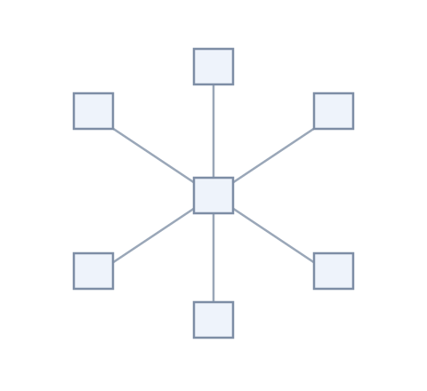
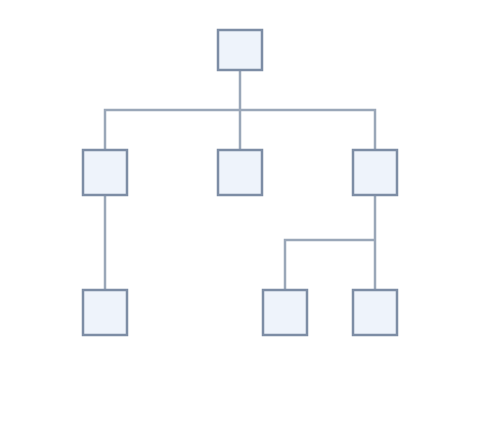
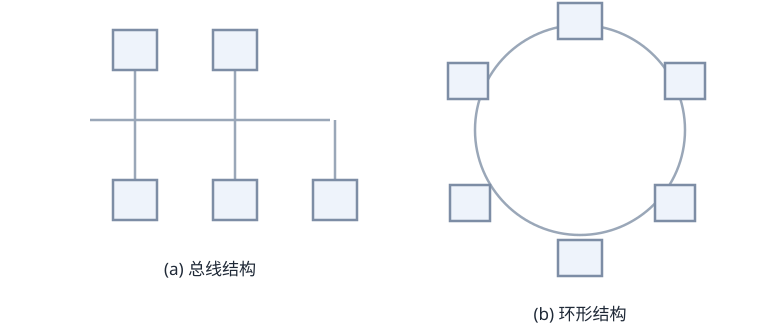
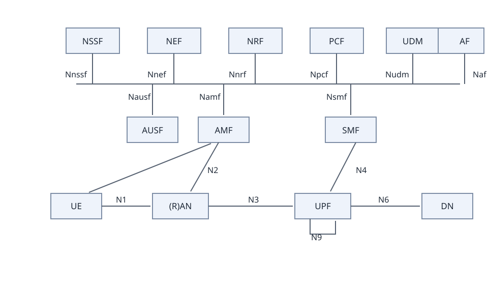
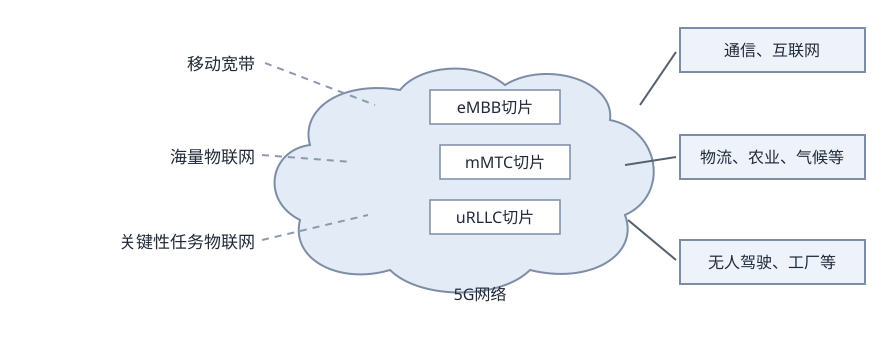
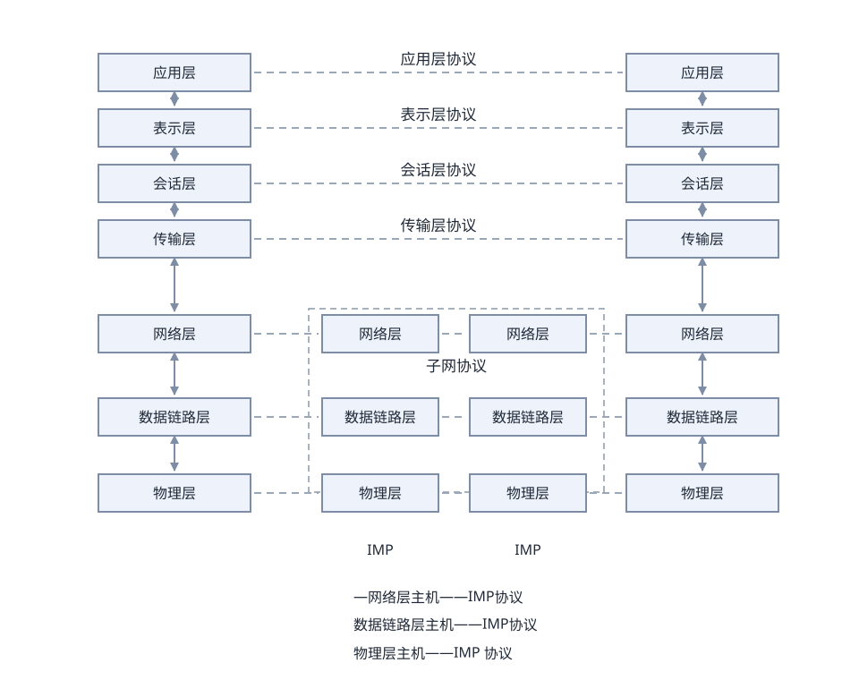

# 2.5 计算机网络

计算机网络是利用通信线路将地理上分散的、具有独立功能的计算机系统和通信设备按不同的形式连接起来，并依靠网络软件及通信协议实现资源共享和信息传递的系统。

计算机网络技术主要涵盖通信技术、网络技术、组网技术和网络工程等四个方面。

## 2.5.1 网络的基本概念

### 1. 计算机网络的发展

纵观计算机网络发展，其大致经历了诞生、形成、互联互通和高速发展等4个阶段。

### 1. 诞生阶段

20世纪60年代中期之前的第一代计算机网络是以单个计算机为中心的远程联机系统，典型应用是由一台计算机和全美范围内2000多个终端组成的飞机订票系统，终端是一台计算机的外围设备，包括显示器和键盘，无CPU和内存。随着远程终端的增多，在主机之前增加了前端机 (FEP)。当时，人们把计算机网络定义为“以传输信息为目的而连接起来，实现远程信息处理或资源共享的系统”,这样的通信系统已具备网络的雏形。

### 2. 形成阶段

20世纪60年代中期至70年代的第二代计算机网络，是以多个主机通过通信线路互联起来为用户提供服务。它兴起于20世纪60年代后期，典型代表是美国国防部高级研究计划局协助开发的ARPANET。主机之间不是直接用线路相连，而是由接口报文处理机 (IMP) 转接后互联的。IMP和它们之间互联的通信线路一起负责主机间的通信任务，构成了通信子网。通信子网互联的主机负责运行程序，提供资源共享，组成资源子网。这个时期，网络概念为“以能够相互共享资源为目的互联起来的具有独立功能的计算机之集合体”,形成了计算机网络的基本概念。

### 3. 互联互通阶段

20世纪70年代末至90年代的第三代计算机网络是具有统一的网络体系结构并遵守国际标准的开放式和标准化网络。ARPANET兴起后，计算机网络发展迅猛，各大计算机公司相继推出自己的网络体系结构及实现这些结构的软硬件产品。由于没有统一的标准，不同厂商的产品之间互联很困难，人们迫切需要一种开放性的标准化实用网络环境，因此产生了两种国际通用的最重要的体系结构，即TCP/IP体系结构和国际标准化组织的OSI体系结构。

### 4. 高速发展阶段

20世纪90年代至今的第四代计算机网络，由于局域网技术发展成熟，出现光纤及高速网络技术，整个网络就像一个对用户透明的庞大的计算机系统，发展为以因特网 (Internet) 为代表的互联网。

### 2. 计算机网络的功能

#### 1. 数据通信

数据通信是计算机网络最主要的功能之一。数据通信是依照一定的通信协议，利用数据传输技术在两个通信结点之间传递信息的一种通信方式。它可实现计算机和计算机、计算机和终端以及终端与终端之间的数据信息传递，是继电报、电话业务之后的第3种最大的通信业务。

数据通信中传递的信息均以二进制数据形式表示。数据通信的另一个特点是，它通常与远程信息处理相联系，是包括科学计算、过程控制、信息检索等内容的广义的信息处理。

#### 2. 资源共享

资源共享是人们建立计算机网络的主要目的之一。计算机资源包括硬件资源、软件资源和数据资源。硬件资源的共享可以提高设备的利用率，避免设备的重复投资，如利用计算机网络建立网络打印机、计算资源池等，供网络上的用户或应用来共享；软件资源和数据资源的共享可以充分利用已有的信息资源，比如可减少软件开发过程中的重复劳动，也可避免大型数据库的重复建设等。

#### 3. 管理集中化

计算机网络技术的发展和应用，已使得现代的办公手段、经营管理等发生了深刻变化。迄今已经有了许多管理信息系统、办公自动化系统等，通过这些系统可以实现日常工作的集中管理，提高工作效率，增加经济效益。

#### 4. 实现分布式处理

网络技术的发展，使得分布式计算成为可能。对于大型的课题，可以分为许许多多小题目，由不同的计算机分别完成，然后再集中来解决问题。

#### 5. 负荷均衡

负荷均衡是指工作负荷 (Workload) 被均匀地分配给网络上各台计算机系统。网络控制中心负责分配和检测，当某台计算机负荷过重时，系统会自动转移负荷到较轻的计算机系统来处理。

综上所述，计算机网络可以极大扩展计算机系统的功能及其应用范围，提高可靠性，在为用户提供方便的同时，减少了整体系统费用，提高了系统性价比。

### 3. 网络有关指标

计算机网络性能是衡量网络服务质量的重要体现，除了性能指标外，还有一些非性能特征，它们对计算机网络的性能也有很大影响。

#### 1. 性能指标

可以从速率、带宽、吞吐量和时延等不同方面来度量计算机网络的性能。

1. 速率。网络速率指的是连接在计算机网络上的主机或通信设备在数字信道上传送数据的速率，它也称为数据率 (Data Rate) 或比特率 (Bit Rate)。速率是计算机网络中最重要的性能指标之一。速率的单位是b/s (比特每秒)。
2. 带宽。“带宽”有以下两种不同的意义。
其一，带宽是指一个信号具有的频带宽度。信号的带宽表示一个信号所包含的各种不同频率成分所占据的频率范围。例如，在传统的通信线路上传送的电话信号的标准带宽是3.1kHz(300Hz~3.4kHz为话音的主要成分的频率范围)。带宽的单位是赫兹(或千赫、兆赫、吉赫等)。

其二，在计算机网络中，带宽用来表示网络的通信线路传送数据的能力。网络带宽表示在单位时间内从网络中一个结点到另一个结点所能通过的“最高数据率”。此处带宽单位是“比特每秒”,记为b/s。

3. 吞吐量。吞吐量表示在单位时间内通过某个网络(或信道、接口)的数据量。吞吐量受网络的带宽或网络额定速率所限制。例如，对于一个带宽为100Mb/s的以太网，其额定速率是100Mb/s, 那么这个数值也是该以太网的吞吐量的绝对上限值。因此，对100Mb/s的以太网，其典型的吞吐量可能也只有70Mb/s。有时吞吐量还可用每秒传送的字节数或帧数来表示。
4. 时延。时延是指数据(一个报文、分组甚至比特)从网络(或链路)的一端传送到另一端所需的时间。时延是个很重要的性能指标，它有时也称为延迟或迟延。网络中的时延由以下几个不同部分组成，如发送时延、传播时延、处理时延、排队时延等组成。
5. 往返时间。往返时间 (RTT) 也是一个重要的网络性能指标，它表示从发送方发送数据开始，到发送方收到来自接收方的确认(接受方收到数据后便立即发送确认)总共经历的时间。
6. 利用率。利用率有信道利用率和网络利用率两种。信道利用率指信道被利用的概率(即有数据通过),通常以百分数表示。完全空闲的信道利用率是零。网络利用率是全网络的信道利用率的加权平均值。

#### 2. 非性能指标

费用、质量、标准化、可靠性、可扩展性、可升级性、易管理性和可维护性等非性能指标与前面介绍的性能指标有很大相关性。

1. 费用。构建网络的费用(网络价格)包括设计和实现的费用。网络的性能与其价格密切相关。一般说来，网络的速率越高，其价格也越高。
2. 质量。网络的质量取决于网络中所有构件的质量以及由它们构建网络的方式。网络的质量体现在诸多方面，如网络可靠性、网络管理简易性以及网络性能等。高质量的网络往往价格不菲。
3. 标准化。网络硬件和软件的设计既可以按照通用的国际标准，也可以遵循特定的专用网络标准。采用国际标准设计的网络，具有更好的互操作性，更易于升级换代和维护，也更容易得到技术上的支持。
4. 可靠性。可靠性与网络的质量和性能都有密切关系。速率更高的网络，其可靠性不一定会更差。但速率更高的网络要可靠地运行，则往往更加困难，同时所需费用也会更高。
5. 可扩展性和可升级性。网络在构造时就应当考虑到日后可能需要的扩展(即规模扩大)和升级(即性能和版本的提高)。网络性能越好，其扩展和升级的难度与费用往往也越高。
6. 易管理和维护性。如果对网络不进行良好的管理和维护，就很难达到和保持所设计的性能。

### 4. 网络应用前景

21世纪人类将全面进入信息时代。信息时代的重要特征就是数字化、网络化和信息化。网络可以非常迅速地传递信息，要实现信息化就需要完善的网络。网络现在已经成为信息社会的命脉和发展知识经济的重要基础。网络对社会生活、社会经济的发展已经产生了不可估量的影响。

从20世纪90年代以后，以因特网 (Internet) 为代表的计算机网络得到了飞速的发展，已从最初的教育科研网络逐步发展成为商业网络，并已成为仅次于全球电话网的世界第二大网络。

因特网正在改变着人们工作和生活的方方面面，它已经给人类社会带来了巨大益处，并加速了全球信息革命的进程。因特网是人类自印刷术发明以来在通信方面最大的变革。现在，人们的生活、工作、学习和交往都已离不开因特网了。

## 2.5.2 通信技术

计算机网络是利用通信技术将数据从一个结点传送到另一结点的过程。通信技术是计算机网络的基础。这里所说的数据，指的是模拟信号和数字信号，它们通过信道来传输。

信道可分为物理信道和逻辑信道。物理信道由传输介质和设备组成，根据传输介质的不同，分为无线信道和有线信道。逻辑信道是指在数据发送端和接收端之间存在的一条虚拟线路，可以是有连接的或无连接的。逻辑信道以物理信道为载体。

### 1. 信道

信息传输就是信源和信宿通过信道收发信息的过程。信源发出信息，发信机负责将信息转换成适合在信道上传输的信号，收信机将信号转化成信息发送给信宿。

1. 信道是信息的传输通道。
2. 发信机接收信源发送的信息，进行编码和调制，将信息转化成适合在信道上传输的信号，发送到信道上。
3. 收信机负责从信道上接收信号，进行解调和译码，将信息恢复出来发送给信宿。不是所有频率的信号都可以通过信道传输，频率响应决定了哪些可以通过，可以通过的频率范围大小是信道的带宽。
4. 香农公式。信道容量就是信道的最大传输速率，可通过香农公式计算得到。

$$C=B\times\log\left(1+\frac{S}{N}\right)\qquad(2\text{-}1)$$

其中，$C$ 代表信道容量，单位是 b/s；$B$ 代表信号带宽，单位是 Hz；$S$ 代表信号平均功率，单位是 W；$N$ 代表噪声平均功率，单位是 W；$S/N$ 代表信噪比，单位是 dB(分贝)。提升信道容量可以使用比较大的带宽，降低信噪比；也可以使用比较小的带宽，升高信噪比。

### 2. 信号变换

发信机进行的信号处理包括信源编码、信道编码、交织、脉冲成形和调制。相反地，收信机进行的信号处理包括解调、采样判决、去交织、信道译码和信源译码：

### 1. 信源编码

将模拟信号进行模数转换，再进行压缩编码(去除冗余信息),最后形成数字信号。例如GSM (全球移动通信系统)先通过PCM (脉冲编码调制)编码将模拟语音信号转化成二进制数字码流，再利用RPE-LPT(规则脉冲激励-长期预测编码)算法对其进行压缩。

### 2. 信道编码

信道编码通过增加冗余信息以便在接收端进行检错和纠错，解决信道、噪声和干扰导致的误码问题，一般只能纠正零星的错误，对于连续的误码无能为力。

### 3. 交织

为了解决连续误码导致的信道译码出错问题，通过交织将信道编码之后的数据顺序按照一定规律打乱，到了接收端在信道译码之前再通过交织将数据顺序复原，这样连续的误码到了接收端就变成了零星误码，信道译码就可以正确纠错了。

### 4. 脉冲成形

为了减小带宽需求，需要将发送数据转换成合适的波形，这就是脉冲成形。

矩形脉冲要求的信道会很宽，主要原因是矩形脉冲的竖边是垂直的，想要达到这一点要很高的频率，脉冲成形并不要求是垂直的，所以频率要求降低了。

### 5. 调制

调制是将信息承载到满足信号要求的高频载波信号的过程。

### 3. 复用技术和多址技术

在一条信道上只传输一路数据的情况下，只需要经过信源编码、信道编码、交织、脉冲成形、调制之后就可以发送到信道上进行传输了；但如果同时传递多路数据就需要复用技术和多址技术。

### 1. 复用技术

复用技术是指在一条信道上同时传输多路数据的技术，如TDM时分复用、FDM频分复用和CDM码分复用等。ADSL使用了FDM的技术，语音的上行和下行占用了不同的带宽。

### 2. 多址技术

多址技术是指在一条线上同时传输多个用户数据的技术，在接收端把多个用户的数据分离(TDMA时分多址、FDMA频分多址和CDMA码分多址)。

多路复用技术是多址技术的基础，多址技术还涉及信道资源分配算法，Walsh码分配算法等。

### 4. 5G通信网络

作为新一代的移动通信技术，5G 的网络结构、网络能力和应用场景等都与过去有很大不同，其特征体现在以下方面。

### 1. 基于OFDM优化的波形和多址接入

5G采用基于OFDM优化的波形和多址接入技术，因为OFDM技术被当今的4G LTE和WiFi系统广泛采用，因其可扩展至大带宽应用，具有高频谱效率和较低的数据复杂性，能够很好地满足5G 要求。OFDM技术可实现多种增强功能，例如，通过加窗或滤波增强频率本地化，在不同用户与服务间提高多路传输效率，以及创建单载波OFDM波形，实现高能效上行链路传输。

### 2. 实现可扩展的OFDM间隔参数配置

通过OFDM子载波之间的15kHz间隔(固定的OFDM参数配置), LTE最高可支持20 MHz的载波带宽。为了支持更丰富的频谱类型/带(为了连接尽可能丰富的设备，5G 将利用所有可利用的频谱，如毫米微波、非授权频段)和部署方式。5G NR(New Radio) 将引入可扩展的OFDM间隔参数配置。这一点至关重要，因为当快速傅里叶变换 (Fast Fourier Transform,FFT) 为更大带宽扩展尺寸时，必须保证不会增加处理的复杂性。而为了支持多种部署模式的不同信道宽度，5G NR必须适应同一部署下不同的参数配置，在统一的框架下提高多路传输效率。另外，5G NR也能跨波形实现载波聚合，比如聚合毫米波和6GHz以下频段的载波。

### 3. OFDM加窗提高多路传输效率

5G将被应用于大规模物联网，这意味着会有数十亿设备相互连接，5G 势必要提高多路传输的效率，以应对大规模物联网的挑战。为了相邻频带不相互干扰，频带内和频带外信号辐射必须尽可能小。OFDM能实现波形后处理 (Post-Processing), 如时域加窗或频域滤波，来提升频率局域化。

### 4. 灵活框架设计

5G NR采用灵活的5G 网络架构，进一步提高5G 服务多路传输的效率。这种灵活性既体现在频域，更体现在时域上，5G NR的框架能充分满足5G 的不同服务和应用场景。这包括可扩展的传输时间间隔 (Scalable Transmission Time Interval,STTI) 和自包含集成子帧 (Self-Contained Integrated Subframe)。

### 5. 大规模MIMO(Multiple-Input Multiple-Output)

5G将2×2 MIMO提高到了4×4 MIMO。更多的天线也意味着占用更多的空间，要在空间有限的设备中容纳更多天线显然不现实，只能在基站端叠加更多MIMO。从目前的理论来看，5G NR可以在基站端使用最多256根天线，而通过天线的二维排布，可以实现3D 波束成型，从而提高信道容量和覆盖。

### 6. 毫米波

全新5G 技术首次将频率大于24GHz以上的频段(通常称为毫米波)应用于移动宽带通信。

大量可用的高频段频谱可提供极致的数据传输速度和容量，这将重塑移动体验。但毫米波的利用并非易事，使用毫米波频段传输更容易造成路径受阻与损耗(信号衍射能力有限)。通常情况下，毫米波频段传输的信号甚至无法穿透墙体，此外，它还面临着波形和能量消耗等问题。

### 7. 频谱共享

用共享频谱和非授权频谱，可将5G 扩展到多个维度，实现更大容量，使用更多频谱，支持新的部署场景。这不仅将使拥有授权频谱的移动运营商受益，而且会为没有授权频谱的厂商创造机会，如有线运营商、企业和物联网垂直行业，使他们能够充分利用5G NR技术。5G NR原生地支持所有频谱类型，并通过前向兼容灵活地利用全新的频谱共享模式。

### 8. 先进的信道编码设计

现有移动通信网络编码(如LTE Turbo码)不足以应对未来无线数据传输需求。在5G 通信信道编码中拟采用更符合5G 网络应用场景的编码方式，如LDPC码和Polar码等。

低密度奇偶校验 (Low-Density Parity-Check,LDPC) 码是一种具有稀疏校验矩阵的分组纠错码，性能逼近香农容量极限，实现简单，译码简单且可实行并行操作，适合硬件实现。LDPC码传输效率远超LTE Turbo, 且易于平行化的解码设计，能以低复杂度和低时延途径进行扩展，获得更高传输速率。

Polar码是一种前向错误更正编码方式。在编码侧采用此方式使各个子信道呈现出不同的可靠性，当码长持续增加时，部分信道将趋向于容量近于1的完美信道(无误码),另一部分信道趋向于容量接近于0的纯噪声信道，选择在容量接近于1的信道上直接传输信息以逼近信道容量；在解码侧，极化后的信道可用简单的逐次干扰抵消解码的方法，以较低的复杂度获得与最大自然解码相近的性能。由于没有误码率，极化编码可以支持99.999%的可靠性，这正迎合了5G应用的超高可靠性诉求。Polar码是用作5G 控制信道的主要编码方式。

## 2.5.3 网络技术

网络通常按照网络的覆盖区域和通信介质等特征来分类，可分为局域网 (LAN)、无线局域网 (WLAN)、城域网 (MAN)、广域网 (WAN) 和移动通信网等。

### 1. 局域网 (LAN)

局域网 (Local Area Network,LAN) 是指在有限地理范围内将若干计算机通过传输介质互联成的计算机组(即通信网络),通过网络软件实现计算机之间的文件管理、应用软件共享、打印机共享、工作组内的日程安排、电子邮件和传真通信服务等功能。局域网是封闭型的，比如可以由办公室内的两台及以上计算机组成，也可以由一个公司内的若干台计算机组成。

### 1. 网络拓扑

局域网专用性非常强，具有比较稳定和规范的拓扑结构。常见的局域网拓扑结构有星状结构、树状结构、总线结构和环形结构。

1. 星状结构。网络中的每个结点设备都以中心结点为中心，通过连接线与中心结点相连，如果一个结点设备需要传输数据，它首先必须通过中心结点，如图 2-17所示。
这种结构的网络系统中，中心结点是控制中心，任意两个结点间的通信最多只需两步，所以；传输速度快、网络构简单、建网容易、便于控制和管理。这种结构的缺点是可靠性低，网络共享能力差，并且一旦中心结点出现故障则导致全网瘫痪。

2. 树状结构。树状结构网络也被称为分级的集中式网络，如图 2-18所示，其特点是网络成本低，结构简单。在网络中，任意两个结点之间不产生回路，每个链路都支持双向传输，结点扩充方便、灵活，方便寻查链路路径。但在这种结构的网络系统中，除叶结点及其相连的链路外，任何一个工作站或链路产生故障都会影响整个网络系统的正常运行。

> 图 2-17 星状结构网络

> 图 2-18 树状结构网络

3. 总线结构。总线结构网络是将各个结点设备和一根总线相连，如图 2-19 (a) 所示。网络中所有的结点设备都是通过总线进行信息传输的。在总线结构中，作为数据通信必经的总线的负载能力是有限度的，这是由通信媒体本身的物理性能决定的。

总线作为连接各结点设备通信的枢纽，它的故障将影响总线上每个结点的通信。

4. 环形结构。将网络中各结点通过一条首尾相连的通信链路连接起来，形成一个闭合环形结构网，如图 2-19 (b) 所示。环形结构的网络中各结点设备的地位相同，信息按照固定方向单向流动，两个节点之间仅有一条通路，系统中无信道选择问题，任一结点的故障将导致物理瘫痪。由于环路是封闭的，所以环形结构的网络不便于扩充，系统响应延时长，且信息传输效率相对较低。

> 图 2-19 总线结构和环形结构网络

5. 网状结构。网状网络中的任何结点彼此之间均存在一条通信链路，任何结点故障不会影响其他结点之间的通信。但这种拓扑结构的网络布线较为烦琐，且建设成本高，控制方法复杂。

### 2. 以太网技术

以太网 (Ethernet) 是一种计算机局域网组网技术。IEEE制定的IEEE 802.3标准给出了以太网的技术标准。它规定了包括物理层的连线、电信号和介质访问层协议的内容。以太网是当前应用最普遍的局域网技术。

1. 以太网帧结构。在以太网链路上的数据包被称作以太帧，其结构如图 2-20所示。

> 图 2-20 以太帧结构

DMAC代表目的终端的MAC地址，SMAC代表源MAC地址，而Length/Type字段长度是2字节，若该字段的值大于1500,则代表该数据帧的类型(比如该帧是属于哪个上层协议的数据单元);若该字段的值小于1500,则代表该数据帧的长度。DATA/PAD代表具体数据，以太网数据帧的最小长度必须不小于64字节(根据半双工模式下最大距离计算获得的),如果数据长度加上帧头不足64字节，需要在数据部分增加填充内容。当Length/Type取值大于1500的时候，MAC子层可以根据Length/Type的值直接把数据帧提交给上层协议，由上层协议进行分帧处理。这种结构为当前较为流行的ETHERNET_II 协议，大部分计算机都支持这种结构。FCS则是帧校验字段，用于判断该数据帧是否出错。

2. 最小帧长。由于CSMA/CD算法限制，以太网帧的最小长度为64字节。高层协议要保证此长度。如果实际数据不足64个字节，则高层协议必须进行填充。数据域的长度上限可以灵活设置，但通常被设置为1500字节。
规定最小帧长的原因是为了避免发生某结点已经将一个数据包的最后一个BIT发送完毕，但这个报文的第一个BIT还未传送到距离较远的结点。这可能使得这些结点认为线路空闲而发送数据，导致链路上数据发送冲突。

3. 最大传输距离。以太网的最大传输距离没有严格限制，由线路质量、信号衰减程度等因素决定。
4. 流量控制。当通过交换机端口流量过大，超过了它的处理能力时，就会发生端口阻塞。
网络拥塞一般是由于线速不匹配(如100M 向10M 端口发送数据)和突发的集中传输而产生的，它可能导致延时增加、丢包和重传增加这几种情况，使网络资源不能有效利用。流量控制的作用是防止在设备出现阻塞情况下丢帧。

在半双工方式下，流量控制通过反压 (Back-Pressure) 技术实现，模拟产生碰撞，使得信息源降低发送速度。

在全双工方式下，流量控制一般遵循IEEE 802.3标准。IEEE 802.3x规定了一种64字节的“PAUSE”MAC控制帧格式。当端口发生阻塞时，交换机向信息源发送“PAUSE” 帧，告诉信息源暂停一段时间再发送信息。

在实际网络中，尤其是一般局域网产生网络拥塞情况极少，所以有的厂家交换机并不支持流量控制。高性能的交换机通常都支持半双工方式下的反向压力和全双工的IEEE 802.3x流控。

有的交换机的流量控制将阻塞整个LAN的输入，降低整个LAN的性能；高性能的交换机采用的策略是仅仅阻塞向交换机拥塞端口输入帧的端口，保证其他端口用户的正常工作。

### 2. 无线局域网 (WLAN)

无线局域网WLAN(Wireless Local Area Networks) 利用无线技术在空中传输数据、话音和视频信号。无线局域网所使用的关键技术，除了红外传输技术、扩频技术、窄带微波技术外还有一些其他技术，如调制技术、加解扰技术、无线分集接收技术、功率控制技术和节能技术。

无线局域网在室外主要有以下几种结构：点对点型、点对多点型、多点对点型和混合型。与有线网络相比，无线局域网具有安装便捷、使用灵活、经济节约、易于扩展等优点。

### 1. WLAN标准

IEEE 802.11是最早的无线局域网技术标准，当时传输速率只有1～2Mb/s, 采用无连接的协议。

IEEE 802.11b标准的速率可达11Mb/s, IEEE 802.11a标准的传输速率可达到54Mb/s。同时还出现了IEEE 802.11g标准，该标准具有与IEEE 802.11a标准一样的接入速率，同时兼容IEEE 802.11b标准，工作于免费的2.4GHz频段，价格比IEEE 802.11a更便宜。之后出现了IEEE 802.11n新标准，其传输速率可达200Mb/s以上。

### 2. WLAN拓扑结构

在WLAN中，通常使用的拓扑结构主要有3种形式：点对点型、HUB型和全分布型。这3种结构解决问题的方法各有优缺点，目的都是让用户在无线信道中，获得与有线LAN兼容或相近的传输速率。

1. 点对点型。典型的点对点结构是通过单频或扩频微波电台、红外发光二极管、红外激光等方法，连接两个固定的有线LAN网段，实际上是作为一种网络互联方案。无线链路与有线LAN是通过桥路器或中继器完成连接的。点对点拓扑结构简单，采用这种方案可获得中远距离的高速率链路。由于不存在移动性问题，收发信机的波束宽度可以很窄，虽然这会增加设备调试难度，但可减小由波束发散引起的功率衰耗。
2. HUB型。由一个中心结点 (HUB) 和若干外围节点组成，外围结点既可以是独立的结点，也可与多个用户相连。中心HUB作为网络管理设备，为访问有线LAN或服务器提供逻辑接入点，并监控所有节点对网路的访问，管理外围设备对广播带宽的竞争，其管理功能由软件具体实现。在此拓扑中，任何两外围结点间的数据通信都须经过HUB, 是典型的集中控制式通信。
采用这种结构的网络具有用户设备简单，维护费用低，网络管理单一等优点，并可与微蜂窝技术结合，实现空间和频率复用。但是，用户之间的通信延迟增加，网络抗毁性能较差，中心结点的故障容易导致整个网络的瘫痪。

3. 完全分布型。完全分布结构目前还无具体应用，仅处于理论探讨阶段，它要求相关结点在数据传输过程中发挥作用，类似于分组无线网的概念。对每一结点而言，一般仅只有网络的部分拓扑信息，但它可与邻近结点以某种方式分享各自拓扑结构信息，基于此完成一种分布路由算法，使得传输路径上的每一结点都要协助源结点数据传送至目的结点。
分布式结构抗毁性能好，移动能力强，可形成多跳网，适合较低速率的中小型网络，但对于用户结点而言，复杂性和成本较其他结构大幅度提高，网络管理困难，并存在多径干扰问题，同时随着网络规模的扩大，其性能指标快速下降。但在军事领域中，分布式WLAN具有很好的应用前景。

### 3. 广域网 (WAN)

广域网是一种将分布于更广区域(比如一个城市、一个国家甚至国家之间)的计算机设备联接起来的网络。它通常是电信部门负责组建、经营和管理，并向社会公众提供通信服务。

广域网由通信子网与资源子网组成。通信子网主要是由一些通信结点设备和连接这些设备的链路组成。通信结点设备负责网络中数据的转发，其链路用于承载用户的数据，一般分为传输主干链路和末端用户线路。广域网的通信子网可以利用公用分组交换网、卫星通信网和无线分组交换网来构建，将分布在不同地区的局域网或计算机系统互连起来，达到资源共享的目的。

资源子网是指网络中实现资源共享功能的设备及其软件的集合。资源子网主要指网络资源设备，如信息服务或业务服务器、用户计算机、网络存储系统、独立运行的网络数据设备、网络上运行的各种软件资源、数据资源等。

### 1. 广域网相关技术

1. 同步光网络。同步光网络 (Synchronous Optical Networking,SONET) 是使用光纤进行数字化信息通信的一个标准。同步数字体系 (Synchronous Digital Hierarchy,SDH) 标准从SONET发展而来。SONET是由美国标准化组织颁布的标准，SDH是国际电信联盟颁布的标准，两者均为传输网络物理层技术。SONET和SDH两种技术都被广泛应用，SONET应用在美国和加拿大，SDH应用于其他国家。SONET和SDH体制都能够用来封装较早的数字传输标准，比如PDH(Plesiochronous Digital Hierarchy) 标准，或者直接用来支持ATM以及SONET上的分组业务 (Packet Over SONET)。
2. 数字数据网。数字数据网DDN(Digital Data Network) 利用数字信道提供半永久性连接电路以传输数据。它可以满足各类租用数据专线业务的需要。它具有传输速率高、传输质量高、协议简单、连接方式灵活、电路可靠性高和网络运行管理简便等优点。
3. 帧中继。帧中继FR(Frame Relay) 是一种高性能广域网技术，运行于OSI/RM的物理层和数据链路层，是一种数据包交换技术，是X.25网络的简化版本，但具有更高性能和传输效率。
帧中继采用虚电路技术，充分利用网络资源，具有吞吐量高，时延低，适合突发性业务等特点。

4. 异步传输技术。异步传输模式 (Asynchronous Transfer Mode,ATM) 是以信元为基础的面向连接的一种分组交换和复用技术。它具有高速数据传输率，可满足多种业务(如语音、数据、传真、实时视频等)传输的需要。在ATM中信元不仅是传输的基本单位，也是交换的信息单位。由于信元长度固定(53个字节),可高速地进行处理和交换，去除不必要的数据校验，交换速率大大高于其他传统数据网，其典型速率为150Mb/s。

### 2. 广域网的特点

广域网具有下述特点：(1)主要提供面向数据通信的服务，支持用户使用计算机进行远距离的信息交换。(2)覆盖范围广，通信的距离远，广域网没有固定拓扑结构。(3)由电信部门或公司负责组建、管理和维护，并向全社会提供面向通信的有偿服务等。

### 3. 广域网的分类

广域网可以分为公共传输网络、专用传输网络和无线传输网络。

1. 公共传输网络一般是由政府电信部门组建、管理和控制，网络内的传输和交换装置可以提供(或租用)给任何部门和单位使用。公共传输网络大体可以分为电路交换网络和分组交换网络两类。
2. 专用传输网络是由单个组织或团体自己建立、使用、控制和维护的私有通信网络。一个专用网络起码要拥有自己的通信和交换设备，它可以建立自己的线路服务，也可以向公用网络或其他专用网络进行租用。专用传输网络主要是数字数据网 (DDN)。DDN可以在两个端点之间建立一条永久的、专用的数字通道。它的特点是在租用该专用线路期间，用户独占该线路的带宽。
3. 无线传输网络主要是移动无线网，典型的有GSM、TD-SCDMA/WCDMA/CDMA2000、LTE和5G等。

### 4. 城域网(MAN)

城域网是在单个城市范围内所建立的计算机通信网，简称MAN(Metropolitan Area Network)。由于采用有源交换元件的局域网技术，网络中传输时延较小，它的传输媒介主要采用光缆，传输速率在100 Mb/s以上。MAN基于一种大型的LAN, 通常使用与LAN相似的技术，但MAN的标准称为分布式队列双总线DQDB(Distributed Queue Dual Bus), 即IEEE 802.6。DQDB是由双总线构成，将加入MAN的所有计算机都连接起来。

如果说局域网或广域网通常是为了一个单位或系统服务的，那么城域网则是为整个城市而非某个特定部门服务。它向上与骨干网相连，向下将本地所有的联网用户与城市骨干网相连。城域网络通常分为3个层次：核心层、汇聚层和接入层。核心层主要提供高带宽的业务承载和传输，完成和已有网络(如ATM、FR、DDN、IP网络)的互联互通，其特征为宽带传输和高速调度。汇聚层的主要功能是给业务接入结点提供用户业务数据的汇聚和分发处理，同时要实现业务的服务等级分类。接入层利用多种接入技术，进行带宽和业务分配，实现用户的接入。

### 5. 移动通信网

#### 1. 移动通信网发展

移动通信网络自从20世纪80年代出现以来，经历近40年的发展历程。最初采用模拟信号传输，即将电磁波进行频率调制后，将语音信号转换到载波电磁波上，载有信息的电磁波发布到空间后由接收设备接收，并从载波电磁波上还原语音信息，完成人与人之间的通话，即1G通信时代。由于1G 采用模拟信号传输，所以其容量非常有限，一般只能传输语音信号，且存在语音品质低、信号不稳定、涵盖范围不够全面、安全性差和易受干扰等问题。之后出现的2G移动通信采用数字调制技术。移动通信系统的容量有了增加，此时手机可以上网了，虽然数据传输速度很慢，速率为9.6~14.4kb/s, 但可传输文字信息。这也是移动互联网发展的起点。随后，移动通信网络发展到3G 时代。3G 延续2G 数字数据传输技术，但通过开辟新电磁波频谱及研发新标准，使得3G 传输速率可达384kb/s, 在室内稳定环境下甚至可达2 Mb/s的速率，比2G提升了百倍之多。由于采用更宽频带，传输稳定性大大提高。正是由于速度大幅提升和通信稳定性的提高，使大数据的传送成为可能，催生了移动通信多样化的应用。随着移动通信自身演进以及移动互联网发展的需要，诞生了4G 移动通信技术。4G 采用更先进的通信协议和技术，理论上网速度为3G 的几十倍，实际用户上网体验与固网20Mb/s家庭宽带相当。4G 可满足人们使用手机流畅观看高清电影，进行大数据传输等需要。4G 已经像“水电”一样成为人们生活中不可或缺的基本资源，像微信、微博、视频、移动支付等手机应用成为生活中的必需，人们无法想象离开手机的生活。因此，4G 将人类带进了移动互联网快速发展的时代。随着社会信息化发展步伐的加快，以及社会各个领域对移动通信需求的日益多样化的驱动，诞生了5G 通信网络，5G 不再由某项业务能力或者某个典型技术特征加以定义。它不仅是更高速率、更大带宽、更强能力的技术，而且是一个多业务、多技术融合的网络，更是面向业务应用和用户体验的智能网络，最终打造以用户为中心的信息生态系统。5G 网络的基本特征是高速率(峰值速率可大于20Gb/s, 相当于4G 的20倍)、低时延(网络时延从4G 的50ms缩减到1ms)、海量设备连接(满足1000亿量级的连接)、低功耗(基站更节能，终端更省电)。

#### 2. 5G 网络的主要特征

1. 服务化架构。为满足5G 时代行业应用的差异化需求，网络需要具备软件快速迭代和升级的能力，以加快业务创新，低成本试错，实现商业敏捷，3GPP(3rd Generation Partnership Project) 在5G 核心网中引入了SBA(Service-based Architecture) 服务化架构，实现网络功能的灵活定制和按需组合。图 2-21给出了5G 网络的系统架构。

> 图 2-21 5G 网络的系统架构

在5G 通信系统中涉及的主要网元NF(Network Function) 如图 2-21所示，其中控制面NF包括：认证服务功能 (Authentication Server Function,AUSF)、接入和移动性管理功能 (Access and Mobility Management Function,AMF)、网络能力开放功能 (Network Exposure Function,NEF)、网络存储功能 (Network Repository Function,NRF)、网络切片选择功能 (Network Slice Selection Function,NSSF)、策略控制功能 (Policy Control Function,PCF)、会话管理功能 (Session Management Function,SMF)、统一数据管理功能 (Unified Data Management,UDM)、应用功能 (Application Function,AF) 等。用户面NF包括用户面功能 (User Plane Function,UPF)，另外包括用户设备 (User Equipment,UE)、接入网或无线接入网 ((Radio) Access Network,(R)AN) 等。数据网 (Data Network,DN) 泛指运营商服务网络、Internet 互联网或者是第三方服务网络等。它是5G 通信系统要接入的业务网络。

5G系统控制面网元（如 AMF、SMF、NRF、NSSF 等）之间采用服务化接口 (Service Based Interface,SBI) 互通，使 HTTP 协议作为承载协议。其中 AMF 和接入网 (AN) 采用点到点方式通信，使用 SCTP 协议作为承载协议；SMF 和用户面网元 (UPF) 之间采用点到点通信，使用 UDP 协议作为承载协议；UPF 和 (R)AN 之间采用点到点方式通信，使用 UDP 作为承载协议；UPF 和 DN 之间基于 IP 协议通信。

2. 网络切片。5G 时代网络服务的对象不再是单纯的移动手机，而是各种类型的设备，如移动手机、平板、固定传感器和车辆等；应用场景也更加多样化，如移动宽带、大规模物联网、任务关键型互联网等；要满足的要求也愈加多样化，如移动性、安全性、时延性和可靠性等。
这便催生了网络切片的诞生。通过网络切片技术在单个独立的物理网络上切分出多个逻辑网络，从而避免了为每一个服务建设一个专用的物理网络，极大地降低了建网和运维成本。图 2-22描述了根据不同群体与不同需求(应用场景)划分的不同网络切片。

在图 2-22中，移动宽带 (eMBB) 的应用场景如面向4K/8K超高清视频、全息技术、增强现实/虚拟现实等应用，对网络带宽和速率要求较高；海量大规模物联网 (mMTC) 的应用场景如海量的物联网传感器部署于测量、建筑、农业、物流、智慧城市、家庭等领域，这些传感器设备是非常密集的，规模庞大，且大部分是静止的，对时延和移动性要求不高；关键任务物联网 (uRLLC) 的应用场景如无人驾驶、车联网、自动工厂、远程医疗等领域，要求超低时延和超高可靠性：

> 图 2-22 5G 网络切片组成

为了满足5G 网络切片组网的需要，引入了SPN(Slicing Packet Network) 技术，其中包括基于灵活以太网 (Flexible Ethernet,FlexE) 的硬切片技术。FlexE基于PHY层的切片转发，提供刚性管道隔离，实现带宽灵活分配。基于FlexE Cross-connection的FlexE Channel则将业务隔离从端口级扩展到网络级，可对不同业务实现端到端子信道隔离，为5G 承载网络切片提供最佳转发面支撑。同时，基于FlexE Channel技术的保护倒换能做到1ms以内，把电信级保护提升到了工业控制级。

## 2.5.4 组网技术

### 1. 网络设备及其工作层级

网络设备是连接到网络中的物理实体。网络设备的种类繁多，且与日俱增。基本的网络设备有集线器、中继器、网桥、交换机、路由器和防火墙等。

### 1. 集线器

集线器是最简单的网络设备。在集线器中，从一个端口收到的数据被转送到所有其他端口，无论与端口相连的系统是否准备好。集线器还有一个端口被指定为上联端口，用来将该集线器连接到其他集线器或路由设备等以便形成更大的网络。

### 2. 中继器

中继器是局域网互连设备，工作于OSI体系结构的物理层，它接收并识别网络信号，然后再生信号，将其发送到网络的其他分支上。为了保证中继器正常工作，需要保证每一个分支中的数据包和逻辑链路协议相同。此外，中继器可以用来连接不同物理介质，并在各种物理介质中传输数据包。

### 3. 网桥

网桥工作于OSI体系的数据链路层。OSI模型数据链路层以上各层的信息对网桥来说是透明的。网桥包含了中继器的功能和特性，不仅可以连接多种介质，还能连接不同的物理分支，如以太网、令牌网，能将数据包在更大的范围内进行传送。

### 4. 交换机

交换机是一种工作在OSI七层协议中的数据链路层，为接入交换机的任意两个网络结点提供独享的转发通路，将从一个端口接收的数据通过内部处理转发到指定端口。交换机具备自动寻址和交换的功能，同时具有避免端口冲突、提高网络吞吐 (Throughput) 的能力。

### 5. 路由器

路由器工作在OSI体系结构中的网络层，它可以在多个网络上交换和路由数据包。路由器可通过在相互独立网络中交换路由信息以生成路由表来达到数据包的路径选择。路由表包含网络地址、连接信息、路径信息和发送代价等属性。路由器通常用于广域网或广域网与局域网的互连。

### 6. 防火墙 (Firewall)

防火墙是网络中一种重要设备，它通常作为网络的门户，为网络的安全运行提供保障。通过在防火墙设置若干安全规则实现对进出网络的数据进行监视和过滤。在网络中通常采用硬件防火墙。硬件防火墙是指把防火墙程序做到芯片里面，由硬件执行这些功能，能减少CPU的负担，使路由更稳定。它的安全和稳定，直接关系到整个网络的安全。

### 2. 网络协议

#### 1. 开放系统互连模型

开放系统是指遵从国际标准的、能够通过互连而相互作用的系统。系统之间的相互作用只涉及系统的外部行为，而与系统内部的结构和功能无关。国际标准化组织 (International Standard Organization,ISO) 公布了开放系统互连参考模型 (OSI/RM)。OSI/RM为开放系统互连提供了一种功能结构的框架。OSI/RM是一种分层的体系结构，参考模型共有7层，分层的基本想法是每一层都在它的下层提供的服务基础上提供更高级的增值服务，而最高层提供能运行分布式应用程序的服务。这样，通过分层的方法将复杂的问题分解，并保持层次之间的独立性。

OSI/RM 的网络体系结构如图 2-23所示，由低层至高层分别为物理层 (Physical Layer)、数据链路层 (Datalink Layer)、网络层 (Network Layer)、传输层 (Transport Layer)、会话层 (Session Layer)、表示层 (Presentation Layer) 和应用层 (Application Layer)。

> 图 2-23 OSI网络体系结构

#### 2. OSI协议集

国际标准化组织除了定义开放系统互连 (Open System Interconnection,OSI) 参考模型，还开发了实现7个功能层次的各种协议和服务标准，通称为OSI协议。与其他协议一样，OSI协议是实现某些功能的过程描述和说明。每一个OSI协议都详细地规定了特定层次的功能特性。

OSI协议集如表 2-5所示。

> 表 2-5 OSI协议集

| 网络分层 | 协议集 |
|---|---|
| 应用层 | `VT`、`DS`、`FTAM`、`CMIP/CMIS`、`MHS`、`ASN.1`、`ACSE`、`RTSE`、`ROSE`、`CCR` |
| 表示层 | OSI表示层协议 |
| 会话层 | OSI会话层协议 |
| 传输层 | `TP0`、`TP1`、`TP2`、`TP3`、`TP4` |
| 网络层 | `ES-IS`、`IS-IS`、`X.25 PLP`、`CLNP` |
| 数据链路层 | `IEEE 802.2`、`HDLC`、`LAP-B` |
| 物理层 | `802.3`、`802.4`、`802.5`、`FDDI`、`RS-232`、`RS-449`、`X.21`、`V.35`、`ISDN` |

#### 3. TCP/IP协议集

TCP/IP(Transmission Control Protocol /Internet Protocol) 作为Internet的核心协议，已被广泛应用于局域网和广域网中，TCP/IP的主要特性为逻辑编址、路由选择、域名解析、错误检测和流量控制以及对应用程序的支持等。TCP/IP是个协议族，主要包括因特网协议 (IP)、传输控制协议 (TCP)、用户数据报协议 (UDP)、虚拟终端协议 (TELNET)、文件传输协议 (FTP)、电子邮件传输协议(SMTP)、网上新闻传输协议 (NNTP) 和超文本传送协议(HTTP) 等8个。

TCP/IP网络协议模型共分为网络接口层、网际层、传输层和应用层4层。对于网络访问层，在TCP/IP参考模型中并没有详细描述，只是指出主机必须使用某种协议与网络相连。网际层是整个TCP/IP体系结构的关键部分，其功能是使主机可以把分组发往任何网络，并使分组独立地传向目标。传输层使源端和目的端机器上的对等实体可以进行会话。这一层定义了两个端到端的协议：传输控制协议 (TCP) 和用户数据报协议 (UDP)。

#### 4. ISO/OSI模型与TCP/IP模型的对比

ISO/OSI模型与TCP/IP模型的对比如表 2-6所示。

> 表 2-6 ISO/OSI模型与TCP/IP模型的对比

| ISO/OSI 模型 | TCP/IP 相关协议或技术 | TCP/IP 模型 |
|---|---|---|
| 应用层、表示层、会话层 | 文件传输协议 FTP；远程登录协议 Telnet；电子邮件协议 SMTP；网络文件服务协议 NFS；网络管理协议 SNMP | 应用层 |
| 传输层 | TCP；UDP | 传输层 |
| 网络层 | IP；ICMP；ARP；RARP | 网际层 |
| 数据链路层 | Ethernet / IEEE 802.3；FDDI；Token-Ring / IEEE 802.3；ARCnet；PPP / SLIP | 网络接口层 |
| 物理层 | 原表将部分局域网技术与“硬件层”跨行表示 | 硬件层 |

如表 2-6所示，TCP/IP分层模型由4个层次构成，即应用层、传输层、网际层和网络接口层。网际层定义的协议除了IP外，还有ICMP(Internet Control Message Protocol)、ARP(Address Resolution Protocol) 和RARP(Reverse Address Resolution Protocol) 等几个重要协议。应用层的协议有NFS(Network File Serve)、Telnet、SMTP(Simple Mail Transport Protocol)、SNMP(Simple Network Management Protocol) 和FTP(File Transfer Protocol) 等。

Internet的地址主要有两种表示形式：域名格式和IP地址格式。域名和IP地址是一一对应的。IP协议版本号为4,也称之为IPv4;IP协议版本号为6时，称之为IPv6。

WWW(World Wide Web) 也称万维网，是指在因特网上以超文本为基础形成的信息网。

它采用统一的资源定位器 (Uniform Resource Locator,URL) 和图文声并茂的用户界面，可以方便地浏览Internet上的信息和利用各种网络服务。互联网常用的服务包括域名服务 (Domain Name Server,DNS)、WWW服务、E-mail电子邮件服务、FTP文件传输服务、Telnet远程登录服务、Gopher,等等。

### 3. 交换技术

数据在网络中转发通常离不开交换机。人们日常使用的计算机通常就是通过交换机接入网络的。交换机功能包括：

1. 集线功能。提供大量可供线缆连接的端口达到部署星状拓扑网络的目的。
2. 中继功能。在转发帧时重新产生不失真的电信号。
3. 桥接功能。在内置的端口上使用相同的转发和过滤逻辑。
4. 隔离冲突域功能。将部署好的局域网分为多个冲突域，而每个冲突域都有自己独立的带宽，以提高交换机整体宽带利用效率。

### 1. 基本交换原理

交换机是一种基于MAC地址识别，能完成封装转发数据包功能的网络设备。交换机可以“学习”MAC地址，并把其存放在内部地址表中，通过在数据帧的始发者和目标接收者之间建立临时的交换路径，使数据帧直接由源地址到达目的地址，交换机需要实现的功能如下所述。

1. 转发路径学习。根据收到数据帧中的源MAC地址建立该地址同交换机端口的映射，写入MAC地址表中。
2. 数据转发。如果交换机根据数据帧中的目的MAC地址在建立好的MAC地址表中查询到了，就向对应端口进行转发。

3. 数据泛洪。如果数据帧中的目的MAC地址不在MAC地址表中，则向所有端口转发，也就是泛洪。广播帧和组播帧向所有端口(不包括源端口)进行转发。
4. 链路地址更新。MAC地址表会每隔一定时间(如300s) 更新一次。

### 2. 交换机协议

在交换机组网中，为保证链路的可靠性通常会采用一条以上的物理链路来连接设备，因此，如果在一个交换网络中两台设备之间连接多条链路时就会产生环路。而环路的出现会导致数据转发异常，影响交换机的正常工作。而生成树协议 (STP) 就可以很好解决链路环路问题。

另外，为提高链路可靠性，或提升与邻接交换设备之间端口带宽，可采用链路聚合协议，如802.3ad。

### 4. 路由技术

应用或业务数据在网络中的传输，是依照网络路由机制来进行的。路由功能由路由器(Router) 来提供，具体包括：(1)异种网络互连，比如具有异种子网协议的网络互连；(2)子网协议转换，不同子网间包括局域网和广域网之间的协议转换；(3)数据路由，即将数据从一个网络依据路由规则转发到另一个网络；(4)速率适配，利用缓存和流控协议进行适配；(5)隔离网络，防止广播风暴，实现防火墙；(6)报文分片和重组，超过接口的MTU报文被分片，到达目的地之后的报文被重组；(7)备份、流量控制，如主备线路的切换和复杂流量控制等。

### 1. 路由原理

路由器工作在OSI七层协议中的第3层，即网络层。其主要任务是接收来源于一个网络接口的数据包，通常根据此数据包的目地址决定待转发的下一个地址(即下一跳地址)。路由器中维持着数据转发所需的路由表，所有数据包的发送或转发都通过查找路由表来实现。这个路由表可以静态配置，也可以通过动态路由协议自动生成。

### 2. 路由器协议

路由器是通过路由表来转发接收到的数据。转发策略可以是人工指定的，即通过静态配置路由的方法来指定。在较小规模网络中，人工指定转发策略没有任何问题，但是在较大规模网络中(如跨国企业网络、ISP网络等),如果通过人工指定路由或转发策略的话，将会给网络管理员带来巨大工作量，并且管理、维护路由表也变得十分困难。为了解决这个问题，路由协议应运而生。

路由协议 (Routing Protocol) 是一种指定数据包转送方式的协议。路由协议是运行在路由器上的协议，可以让路由器自动学习到其他路由器的网络，并且在网络拓扑发生改变后自动更新其维护的路由表。网络管理员只需要简单配置路由协议即可，相比人工配置转发策略、路由，工作量大大减少，同时避免了人为配置可能带来的差错。

路由协议通过在路由器之间共享路由信息来支持可路由协议。路由信息在相邻路由器之间传递，使得所有路由器获悉其他路由器的路径，以此路由协议创建路由表，描述网络拓扑结构；

路由协议与路由器协同工作，执行路由选择和数据包转发功能。

一般来说，路由协议可分为内部网关协议 (IGP) 和外部网关协议 (EGP) 两类。

1. 内部网关协议。在一个自治系统AS(Autonomous System) 内运行的路由协议称为内部网关协议 (Interior Gateway Protocol)。内部网关协议可以划分为两类：距离矢量路由协议和链路状态路由协议。
距离矢量路由协议采用的是距离向量算法；IS-IS和OSPF采用的是链路状态算法。对于小型网络，采用基于距离向量算法的路由协议易于配置和管理，且应用广泛，但在面对大型网络时，不但其固有的环路问题变得更难解决，所占用的带宽也迅速增长，以至于网络无法承受。

因此对于大型网络，采用链路状态算法的IS-IS和OSPF更为有效，并得到广泛应用。

2. 外部网关协议。在AS之间的路由协议称为外部网关协议 (Exterior Gateway Protocol,EGP)。外部网关协议最初采用的是EGP。EGP是为简单的树形拓扑结构设计的，随着越来越多的用户和网络加入Internet, 给EGP带来了很多局限性。为了摆脱EGP局限性，IETF边界网关协议工作组制定了标准的边界网关协议 (BGP)。

## 2.5.5 网络工程

网络建设是一个复杂的系统工程，是对计算机网络、信息系统建设和项目管理等领域知识进行综合利用的过程。作为系统架构设计师，应充分分析和调研市场，确定网络建设方案。网络建设工程可分为网络规划、网络设计和网络实施三个环节。

### 1. 网络规划

网络规划是网络建设的首要环节，也是至关重要的步骤，同时也是系统性过程。网络规划需要以需求为导向，兼顾技术和工程可行性。网络规划包括网络需求分析、可行性分析以及对现有网络的分析(需对现有网络进行优化升级时)。

### 2. 网络设计

网络设计是在网络规划基础上设计一个能解决用户问题的方案。网络设计包括网络总体目标确定、总体设计原则确定以及通信子网设计，设备选型，网络安全设计等。

### 3. 网络实施

网络实施是依据网络设计结果进行设备采购、安装、调试和系统切换(需对原有系统改造升级时)等。网络实施具体包括工程实施计划、网络设备验收、设备安装和调试、系统试运行和切换、用户培训等。
